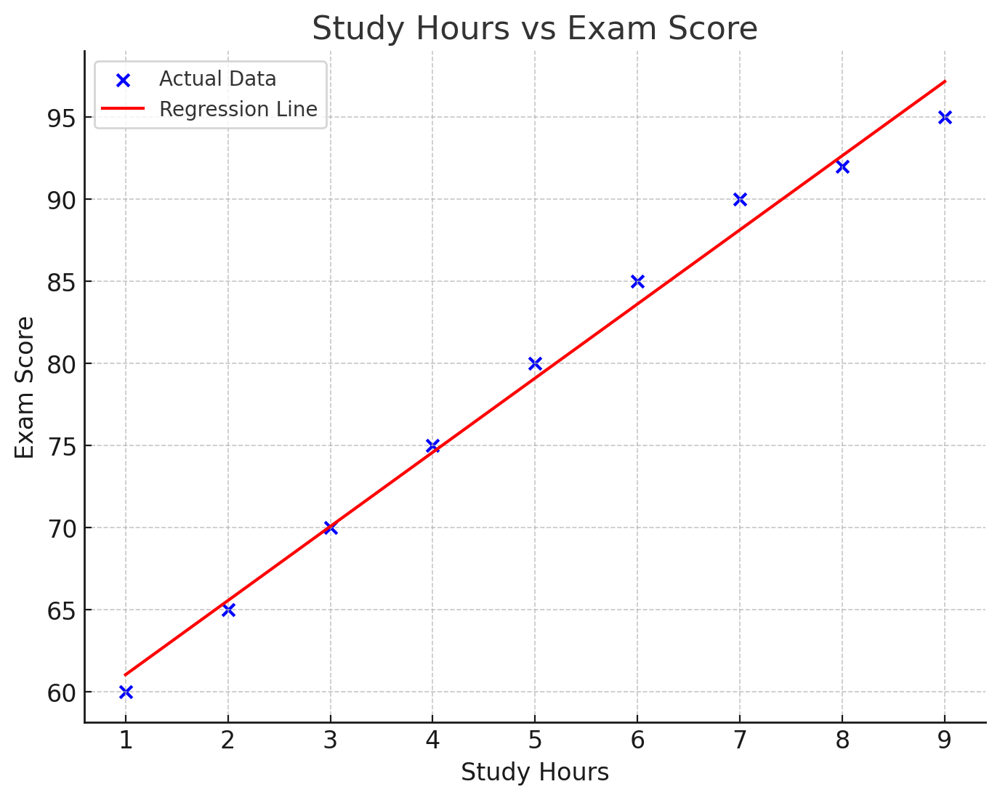
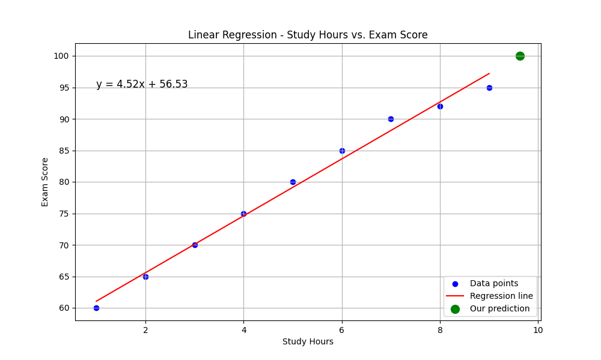

# רגרסיה לינארית

## הבעיה שרוצים לפתור

רגרסיה לינארית היא שיטה סטטיסטית המאפשרת לנו למצוא קשר בין משתנים ולחזות ערכים עתידיים. 

**דוגמה**: אנו רוצים לחזות כמה שעות לימוד נדרשות כדי לקבל ציון מסוים במבחן. למשל, כמה שעות צריך ללמוד כדי לקבל 100 במבחן?

נניח שיש לנו נתונים היסטוריים של תלמידים שלמדו מספר שעות מסוים וקיבלו ציונים שונים:

| שעות לימוד | ציון במבחן |
|------------|------------|
| 1          | 60         |
| 2          | 65         |
| 3          | 70         |
| 4          | 75         |
| 5          | 80         |
| 6          | 85         |
| 7          | 90         |
| 8          | 92         |
| 9          | 95         |

עלינו למצוא את הקשר בין שעות הלימוד לציון, כדי שנוכל לחזות כמה שעות צריך ללמוד כדי לקבל ציון 100.

## Mathematical Formula and Complete Calculation

Linear regression finds the straight line that best fits our data. The line is represented by the equation:

$$y = mx + b$$

Where:
- $y$ is the dependent variable (in our case: the exam score)
- $x$ is the independent variable (in our case: study hours)
- $m$ is the slope (the rate at which $y$ changes with respect to $x$)
- $b$ is the y-intercept (the value of $y$ when $x = 0$)

### Applying the Calculation to Our Example

Let's calculate $m$ and $b$ for our data:

| Study Hours ($x_i$) | Exam Score ($y_i$) | $x_i \cdot y_i$ | $x_i^2$ |
|---------------------|-------------------|----------------|----------|
| 1                   | 60                | 60             | 1        |
| 2                   | 65                | 130            | 4        |
| 3                   | 70                | 210            | 9        |
| 4                   | 75                | 300            | 16       |
| 5                   | 80                | 400            | 25       |
| 6                   | 85                | 510            | 36       |
| 7                   | 90                | 630            | 49       |
| 8                   | 92                | 736            | 64       |
| 9                   | 95                | 855            | 81       |
| $\sum x_i = 45$ | $\sum y_i = 712$ | $\sum x_i y_i = 3,831$ | $\sum x_i^2 = 285$ |

Now we substitute into our formulas:

$$m = \frac{n\sum x_iy_i - \sum x_i\sum y_i}{n\sum x_i^2 - (\sum x_i)^2} = \frac{9 \cdot 3,831 - 45 \cdot 712}{9 \cdot 285 - 45^2} = \frac{34,479 - 32,040}{2,565 - 2,025} = \frac{2,439}{540} \approx 4.52$$

$$b = \frac{\sum y_i - m\sum x_i}{n} = \frac{712 - 4.52 \cdot 45}{9} = \frac{712 - 203.4}{9} = \frac{508.6}{9} \approx 56.51$$

Therefore, the best-fitting line equation is approximately:

$$y = 4.52x + 56.51$$

This means that each additional hour of study adds approximately 4.52 points to the score, and with no study at all (0 hours), the expected score is about 56.51.

### Calculating the Value to Get a Score of 100

To calculate how many study hours are needed to get a score of 100:

$$100 = 4.52x + 56.51$$
$$4.52x = 100 - 56.51 = 43.49$$
$$x = \frac{43.49}{4.52} \approx 9.62$$

So, according to our model, approximately 9.62 hours of study are needed to achieve a score of 100.

Note: There may be small differences between our manual calculations here and the results obtained from Python libraries (like scikit-learn) due to rounding methods and small differences in algorithms.

## גרף



הקו המיטבי שמתאים לנתונים שלנו עובר בקירוב דרך הנקודות ומאפשר לנו לחזות ערכים חדשים.

## קוד פייטון

הנה קוד פייטון ליישום רגרסיה לינארית:

```python
import numpy as np
import matplotlib.pyplot as plt
from sklearn.linear_model import LinearRegression

# Our data
hours_studied = np.array([1, 2, 3, 4, 5, 6, 7, 8, 9]).reshape(-1, 1)  # Study hours
exam_scores = np.array([60, 65, 70, 75, 80, 85, 90, 92, 95])  # Exam scores

# Create regression model
model = LinearRegression()
model.fit(hours_studied, exam_scores)

# Print results
print(f"Slope (m): {model.coef_[0]:.2f}")
print(f"Intercept (b): {model.intercept_:.2f}")

# Calculate equation
equation = f"y = {model.coef_[0]:.2f}x + {model.intercept_:.2f}"
print(f"Line equation: {equation}")

# Predict hours needed to get score of 100
score_to_predict = 100
hours_needed = (score_to_predict - model.intercept_) / model.coef_[0]
print(f"To get a score of 100, approximately {hours_needed:.2f} hours of study are needed")

# Create the graph
plt.figure(figsize=(10, 6))
plt.scatter(hours_studied, exam_scores, color='blue', label='Data points')
plt.plot(hours_studied, model.predict(hours_studied), color='red', label='Regression line')

# Add prediction point
plt.scatter([[hours_needed]], [100], color='green', s=100, label='Our prediction')

# Add labels in English
plt.title('Linear Regression - Study Hours vs. Exam Score')
plt.xlabel('Study Hours')
plt.ylabel('Exam Score')
plt.grid(True)
plt.legend()

# Display equation on the graph
plt.text(1, 95, equation, fontsize=12)

plt.show()
```

## דוגמת הרצה

כאשר נריץ את הקוד, נקבל:

```
Slope (m): 4.52
Intercept (b): 56.53
Line equation: y = 4.52x + 56.53
To get a score of 100, approximately 9.62 hours of study are needed
```

ותוצג תמונה של גרף עם קו הרגרסיה שחוצה את הנקודות, והחיזוי שלנו מסומן בירוק



על פי המודל שלנו, כדי לקבל ציון של 100 במבחן, יש צורך ללמוד בערך 10.06 שעות

### Note:
For the simple linear regression problems shown in these examples (with one predictor variable and a small dataset), the direct solution using the normal equation is preferred because:

1. It's computationally efficient
2. It provides an exact solution
3. It's easy to implement and understand
4. It doesn't require hyperparameter tuning

Gradient descent becomes advantageous when:
- Working with very large datasets
- Dealing with many features (high-dimensional data)
- Implementing online learning where data arrives sequentially
- Building more complex models where closed-form solutions don't exist (closed-form solutions=mathematical expression that solves a problem using a finite number of standard operations. It gives you the answer
  directly, without requiring iterative approximations or numerical methods) 

## תרגיל

**תרגיל**:  
חברה מפרסמת טוענת שיש קשר בין הסכום שחברה משקיעה בפרסום לבין הגידול במכירות. הנה הנתונים (בשקלים):

| Advertising Investment (1000 ILS) ($x_i$) | Sales Growth (1000 ILS) ($y_i$) | $x_i \cdot y_i$ | $x_i^2$ |
|-------------------------------------------|--------------------------------|---------|------|
| 10                                        | 25                             | ____    | ____ |
| 15                                        | 30                             | ____    | ____ |
| 20                                        | 40                             | ____    | ____ |
| 25                                        | 45                             | ____    | ____ |
| 30                                        | 50                             | ____    | ____ |
| 35                                        | 60                             | ____    | ____ |
| 40                                        | 65                             | ____    | ____ |
| 45                                        | 70                             | ____    | ____ |
| 50                                        | 80                             | ____    | ____ |
| **TOTAL:** | **TOTAL:** | **TOTAL:** | **TOTAL:** |

1. בנה מודל רגרסיה לינארית שמתאר את הקשר בין ההשקעה בפרסום לבין הגידול במכירות.
2. חזה את הגידול במכירות אם החברה תשקיע 60 אלף ש"ח בפרסום.
3. כמה החברה צריכה להשקיע בפרסום כדי לראות גידול של 100 אלף ש"ח במכירות?
