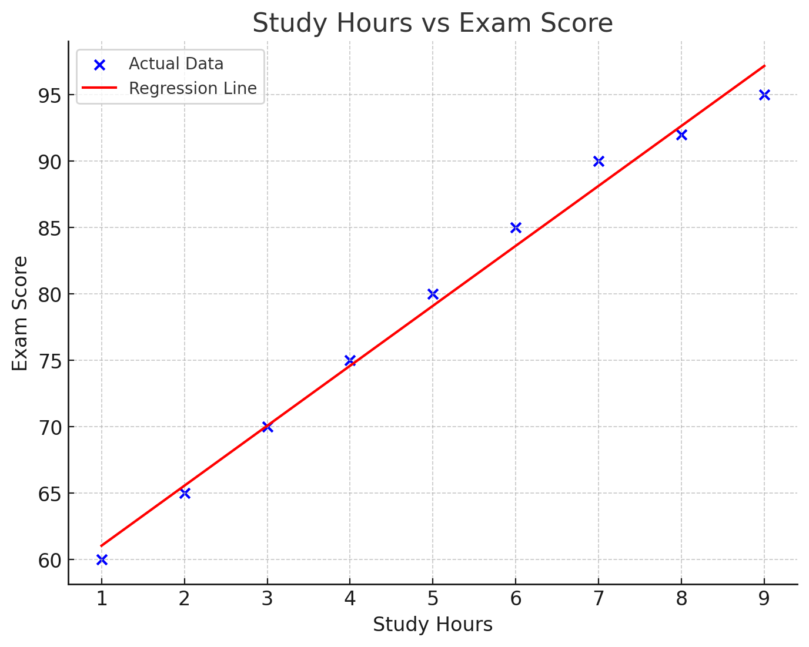

# רגרסיה לינארית

## הבעיה שרוצים לפתור

רגרסיה לינארית היא שיטה סטטיסטית המאפשרת לנו למצוא קשר בין משתנים ולחזות ערכים עתידיים. 

**דוגמה**: אנו רוצים לחזות כמה שעות לימוד נדרשות כדי לקבל ציון מסוים במבחן. למשל, כמה שעות צריך ללמוד כדי לקבל 100 במבחן?

נניח שיש לנו נתונים היסטוריים של תלמידים שלמדו מספר שעות מסוים וקיבלו ציונים שונים:

| שעות לימוד | ציון במבחן |
|------------|------------|
| 1          | 60         |
| 2          | 65         |
| 3          | 70         |
| 4          | 75         |
| 5          | 80         |
| 6          | 85         |
| 7          | 90         |
| 8          | 92         |
| 9          | 95         |

עלינו למצוא את הקשר בין שעות הלימוד לציון, כדי שנוכל לחזות כמה שעות צריך ללמוד כדי לקבל ציון 100.

```python
import numpy as np
import matplotlib.pyplot as plt
from sklearn.linear_model import LinearRegression

# Define the input data: hours of study reshaped as a column vector
hours_studied = np.array([1, 2, 3, 4, 5, 6, 7, 8, 9]).reshape(-1, 1)

# Define the target data: corresponding exam scores
exam_scores = np.array([60, 65, 70, 75, 80, 85, 90, 92, 95])

# Create a LinearRegression model object
model = LinearRegression()

# Fit the model to the data (learn the best-fit line)
model.fit(hours_studied, exam_scores)

# Print the slope (coefficient of x)
print(f"Slope (m): {model.coef_[0]:.2f}")

# Print the intercept (where the line crosses the y-axis)
print(f"Intercept (b): {model.intercept_:.2f}")

# Format the equation of the regression line as a string
equation = f"y = {model.coef_[0]:.2f}x + {model.intercept_:.2f}"
print(f"Line equation: {equation}")

# Predict how many hours are needed to get a score of 100
score_to_predict = 100
# Rearranged line equation: x = (y - b) / m
hours_needed = (score_to_predict - model.intercept_) / model.coef_[0]
print(f"To get a score of 100, approximately {hours_needed:.2f} hours of study are needed")

# Plotting section
plt.figure(figsize=(10, 6))  # Set the figure size

# Plot the original data points as blue dots
plt.scatter(hours_studied, exam_scores, color='blue', label='Data points')

# Plot the regression line (predicted scores)
plt.plot(hours_studied, model.predict(hours_studied), color='red', label='Regression line')

# Mark the prediction point (for score = 100) in green
plt.scatter([[hours_needed]], [100], color='green', s=100, label='Our prediction')

# Add chart title and axis labels
plt.title('Linear Regression - Study Hours vs. Exam Score')
plt.xlabel('Study Hours')
plt.ylabel('Exam Score')
plt.grid(True)  # Add grid to the background
plt.legend()    # Show legend

# Display the equation of the line on the plot
plt.text(1, 95, equation, fontsize=12)

# Show the final plot
plt.show()
```

Output:
```
Slope (m): 4.52
Intercept (b): 56.53
Line equation: y = 4.52x + 56.53
To get a score of 100, approximately 9.62 hours of study are needed
```



## תרגיל

**תרגיל**:  
חברה מפרסמת טוענת שיש קשר בין הסכום שחברה משקיעה בפרסום לבין הגידול במכירות. הנה הנתונים (בשקלים):

| Advertising Investment (1000 ILS) ($x_i$) | Sales Growth (1000 ILS) ($y_i$) | $x_i \cdot y_i$ | $x_i^2$ |
|-------------------------------------------|--------------------------------|---------|------|
| 10                                        | 25                             | ____    | ____ |
| 15                                        | 30                             | ____    | ____ |
| 20                                        | 40                             | ____    | ____ |
| 25                                        | 45                             | ____    | ____ |
| 30                                        | 50                             | ____    | ____ |
| 35                                        | 60                             | ____    | ____ |
| 40                                        | 65                             | ____    | ____ |
| 45                                        | 70                             | ____    | ____ |
| 50                                        | 80                             | ____    | ____ |
| **TOTAL:** | **TOTAL:** | **TOTAL:** | **TOTAL:** |

1. בנה מודל רגרסיה לינארית שמתאר את הקשר בין ההשקעה בפרסום לבין הגידול במכירות.
2. חזה את הגידול במכירות אם החברה תשקיע 60 אלף ש"ח בפרסום.
3. כמה החברה צריכה להשקיע בפרסום כדי לראות גידול של 100 אלף ש"ח במכירות?

## 📤 הגשה

יש לשלוח את הפתרון למייל:
📧 [pythonai250824+linreghw@gmail.com](mailto:pythonai250824+linreghw@gmail.com)
