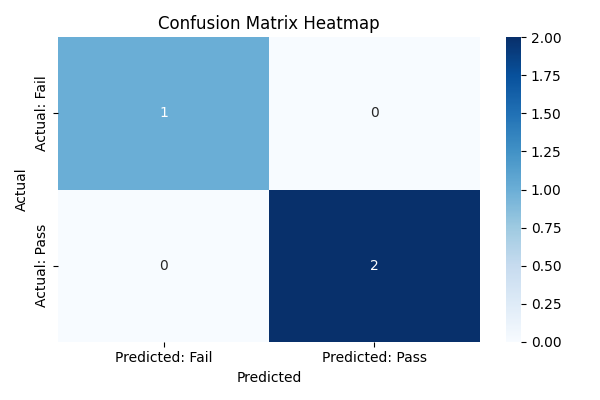

# 🎯 הערכת תוצאות של רגרסיה לוגיסטית

ברגרסיה לוגיסטית (כמו בכל בעיית סיווג בינארי), המודל חוזה האם התוצאה היא:
- 0 או 1
- עבר או נכשל
- חולה או לא חולה

כדי להעריך את הביצועים של המודל, אנחנו משתמשים במדדים של סיווג, ואחד הכלים המרכזיים הוא:

## 🟦 מטריצת הבלבול (Confusion Matrix)

מטריצה שמראה כמה פעמים המודל צדק או טעה, ומפרקת את זה ל־4 קטגוריות:

|                         | התחזית: שלילי (0)       | התחזית: חיובי (1)       |
|-------------------------|--------------------------|--------------------------|
| **תוצאה אמיתית: שלילי** | **TN** (True Negative)    | **FP** (False Positive)  |
| **תוצאה אמיתית: חיובי** | **FN** (False Negative)   | **TP** (True Positive)   |

### 🧠 הסברים:
- **TP** – חיזוי נכון של חיובי  
- **TN** – חיזוי נכון של שלילי  
- **FP** – חיזוי חיובי כשבפועל זה שלילי (False Alarm)  
- **FN** – חיזוי שלילי כשבפועל זה חיובי (פספוס)

## 📘 דוגמה:

נניח שמודל חוזה אם אדם נדבק בווירוס.

- יש לנו 100 אנשים
- 50 מהם באמת **לא חולים**
- 50 מהם באמת **חולים**

### המודל חזה:
- 45 מתוך הלא חולים → **שלילי** (נכון) → TN
- 5 מתוך הלא חולים → **חיובי** (טעות) → FP
- 40 מתוך החולים → **חיובי** (נכון) → TP
- 10 מתוך החולים → **שלילי** (טעות) → FN

### 💡 מטריצת הבלבול:

|                         | התחזית: לא חולה (0) | התחזית: חולה (1) |
|-------------------------|----------------------|-------------------|
| **לא חולה (0)**         | 45 (TN)              | 5 (FP)            |
| **חולה (1)**            | 10 (FN)              | 40 (TP)           |

## ✅ מדד הדיוק (Accuracy)

נחשב:

$$
\text{Accuracy} = \frac{TP + TN}{TP + TN + FP + FN}
$$

$$
\frac{40 + 45}{100} = 0.85 = 85\%
$$

 ✨ מסקנה:

- המודל חזה נכון ב־85% מהמקרים
- אבל… זה **לא תמיד מספיק** כדי לדעת אם המודל באמת טוב
- לפעמים מדד הדיוק **עלול להטעות** — על כך נדבר בפרק הבא: **"פרדוקס הדיוק"**
- 
### 💡 מטריצת הבלבול עם **מפת חום (Heatmap)**:

מטריצת בלבול (Confusion Matrix) היא טבלה –  
אבל ניתן להמחיש אותה בצורה ברורה יותר עם מפת חום (Heatmap)



```python
import numpy as np
import matplotlib.pyplot as plt
import seaborn as sns
from sklearn.linear_model import LogisticRegression
from sklearn.model_selection import train_test_split
from sklearn.metrics import confusion_matrix, classification_report

# Sample data: study hours vs exam result
X = np.array([[1], [2], [3], [4], [5], [6], [7], [8], [9]])
y = np.array([0, 0, 0, 0, 1, 1, 1, 1, 1])  # 0 = fail, 1 = pass

# Split data into train and test sets
X_train, X_test, y_train, y_test = train_test_split(X, y, test_size=0.3, random_state=42)

# Train logistic regression model
model = LogisticRegression(solver='liblinear')
model.fit(X_train, y_train)

# Predict test results
y_pred = model.predict(X_test)

# Create confusion matrix
cm = confusion_matrix(y_test, y_pred)
print("Confusion Matrix:")
print(cm)

# Optional: classification report
print("\nClassification Report:")
print(classification_report(y_test, y_pred))

# Plot heatmap
plt.figure(figsize=(6, 4))
sns.heatmap(cm, annot=True, fmt="d", cmap="Blues", \
            xticklabels=["Predicted: Fail", "Predicted: Pass"], yticklabels=["Actual: Fail", "Actual: Pass"])
plt.xlabel("Predicted")
plt.ylabel("Actual")
plt.title("Confusion Matrix Heatmap")
plt.tight_layout()
plt.show()

```