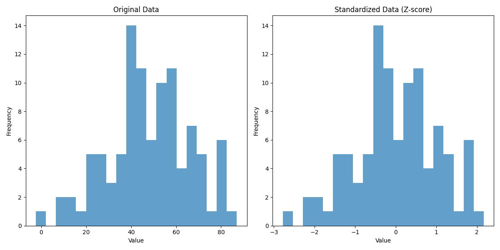

# Feature Scaling and Regularization

## Feature Scaling

Feature scaling is a preprocessing step that transforms numerical features to a comparable scale. This is essential when features have different ranges or units.

### Pros and Cons

**Pros:**
* Accelerates convergence of gradient-based algorithms
* Essential for distance-based algorithms (KNN, K-means)
* Required for regularization techniques (Ridge, Lasso)
* Improves numerical stability
* Makes feature importance comparisons more meaningful

**Cons:**
* Reduces direct interpretability of features (You can no longer easily understand what each feature means or how it affects the outcome)
* Introduces additional preprocessing complexity
* Some methods are sensitive to outliers
* Must be applied consistently to training and test data

### Normalization (Min-Max Scaling)

Normalization rescales features to a specific range, typically [0,1].

**Mathematical formula:**

$$X_{normalized} = \frac{X - X_{min}}{X_{max} - X_{min}}$$

**Visualization:**

```python
import numpy as np
import matplotlib.pyplot as plt
from sklearn.preprocessing import MinMaxScaler

# Generate sample data
np.random.seed(42)
original_data = np.random.normal(loc=50, scale=20, size=100)

# Apply normalization
scaler = MinMaxScaler()
normalized_data = scaler.fit_transform(original_data.reshape(-1, 1)).flatten()

# Visualization
plt.figure(figsize=(12, 6))
plt.subplot(1, 2, 1)
plt.hist(original_data, bins=20, alpha=0.7)
plt.title('Original Data')
plt.xlabel('Value')
plt.ylabel('Frequency')

plt.subplot(1, 2, 2)
plt.hist(normalized_data, bins=20, alpha=0.7)
plt.title('Normalized Data (Min-Max)')
plt.xlabel('Value')
plt.ylabel('Frequency')

plt.tight_layout()
plt.show()
```


### 🔥 Real-Life Example: Credit Scoring in Banks

Imagine a bank is building a model to decide whether to approve a loan. The dataset includes features like:

- **Salary** (e.g., ranges from $20,000 to $200,000)  
- **Age** (e.g., 18 to 100)  
- **Credit Card Debt** (e.g., $0 to $50,000)  
- **Number of Late Payments** (e.g., 0 to 10)

💡 Without normalization, the **salary** feature would dominate the others due to its large numerical range. This can bias the model and make training unstable or ineffective.

✅ To prevent this, the bank **normalizes all features** to a common range (like `[0, 1]` or `[-1, 1]`). This ensures that:

- All features contribute more equally to the learning process  
- The model trains faster and more reliably  
- Gradient descent behaves more consistently across features

> 📌 **Normalization helps the model focus on patterns, not raw scale differences.**

### Standardization (Z-score Normalization)

Standardization transforms data to have zero mean and unit variance.

**Mathematical formula:**

$$X_{standardized} = \frac{X - \mu}{\sigma}$$

Where:
- $\mu$ is the mean of the feature
- $\sigma$ is the standard deviation
  
The standard deviation (σ) is calculated as: $$\sigma = \sqrt{\frac{1}{N} \sum_{i=1}^{N} (x_i - \mu)^2}$$

Where:
- N is the number of samples
- x_i is each individual value
- μ is the mean of the values


**Visualization:**

```python
import numpy as np
import matplotlib.pyplot as plt
from sklearn.preprocessing import StandardScaler

# Generate sample data
np.random.seed(42)
original_data = np.random.normal(loc=50, scale=20, size=100)

# Apply standardization
scaler = StandardScaler()
standardized_data = scaler.fit_transform(original_data.reshape(-1, 1)).flatten()

# Visualization
plt.figure(figsize=(12, 6))
plt.subplot(1, 2, 1)
plt.hist(original_data, bins=20, alpha=0.7)
plt.title('Original Data')
plt.xlabel('Value')
plt.ylabel('Frequency')

plt.subplot(1, 2, 2)
plt.hist(standardized_data, bins=20, alpha=0.7)
plt.title('Standardized Data (Z-score)')
plt.xlabel('Value')
plt.ylabel('Frequency')

plt.tight_layout()
plt.show()
```



**Real-Life Example:**
Blood test results often have different normal ranges. Standardization allows clinicians to compare multiple biomarkers with different units (like cholesterol in mg/dL and hemoglobin in g/dL) on a unified scale to identify abnormal patterns.
