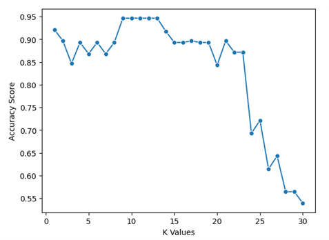

# אופטימיזציה של מודלים

## שיטות לבחירת K אופטימליב- KNN

### 1. Elbow Method

שיטת ה-Elbow מבוססת על בדיקת שיעור השגיאה של המודל עם ערכי K שונים, וחיפוש נקודת "מרפק" שבה תוספת ערכי K נוספים אינה משפרת משמעותית את הביצועים:

```python
from sklearn.neighbors import KNeighborsClassifier
from sklearn.model_selection import train_test_split
from sklearn.metrics import accuracy_score
import matplotlib.pyplot as plt
import numpy as np

# הכנת הנתונים
X_train, X_test, y_train, y_test = train_test_split(X, y, test_size=0.3, random_state=42)

# בדיקת דיוק עבור ערכי K שונים
k_range = range(1, 31)
scores = []

for k in k_range:
    model = KNeighborsClassifier(n_neighbors=k)
    model.fit(X_train, y_train)
    y_pred = model.predict(X_test)
    scores.append(accuracy_score(y_test, y_pred))  # accuracy = (TP + TN) / (TP + TN + FP + FN)

# הצגת התוצאות בגרף
plt.figure(figsize=(10, 6))
plt.plot(k_range, scores, marker='o')
plt.title('KNN: Accuracy for different K values')
plt.xlabel('K Value')
plt.ylabel('Accuracy')
plt.xticks(k_range[::2])  # הצגת ערכי K זוגיים בלבד לנוחות
plt.grid(True)
plt.show()

# מציאת ערך K האופטימלי
optimal_k = k_range[np.argmax(scores)]
print(f"ערך K האופטימלי הוא: {optimal_k} עם דיוק של: {max(scores):.4f}")
```


בשיטת ה-Elbow, אנו מחפשים את הנקודה שבה השיפור בדיוק מתחיל להתמתן משמעותית, כמו "מרפק" בגרף.

### 2. Cross-Validation (אימות צולב)

אימות צולב מחלק את הנתונים למספר "קיפולים" (folds), ומבצע אימון וניבוי על כל קיפול, ממצע את התוצאות כדי לקבל הערכה מדויקת יותר של ביצועי המודל:

```python
from sklearn.model_selection import cross_val_score

# בדיקת ביצועים עם אימות צולב עבור ערכי K שונים
k_range = range(1, 31)
cv_scores = []

for k in k_range:
    model = KNeighborsClassifier(n_neighbors=k)
    scores = cross_val_score(model, X, y, cv=10, scoring='accuracy')  # 10-fold CV
    # accuracy = (TP + TN) / (TP + TN + FP + FN)
    cv_scores.append(scores.mean())

# הצגת התוצאות בגרף
plt.figure(figsize=(10, 6))
plt.plot(k_range, cv_scores, marker='o')
plt.title('KNN: CV Accuracy for different K values')
plt.xlabel('K Value')
plt.ylabel('CV Accuracy')
plt.xticks(k_range[::2])
plt.grid(True)
plt.show()

# מציאת ערך K האופטימלי
optimal_k_cv = k_range[np.argmax(cv_scores)]
print(f"ערך K האופטימלי (CV) הוא: {optimal_k_cv} עם דיוק ממוצע של: {max(cv_scores):.4f}")
```



# שיטות לבחירת פרמטרים אופטימליים

### GridSearchCV with KNN – Explanation & Example

`GridSearchCV` from Scikit-learn helps you **find the best parameters** for your model  
by searching through all possible combinations (a "grid") of parameters.

#### 📦 In the context of KNN:

You might want to try different values for:

- `n_neighbors`: Number of neighbors (K)
- `weights`: 
  - `'uniform'` — all neighbors have equal weight  
  - `'distance'` — closer neighbors get more weight
- `metric`: 
  - `'euclidean'` — standard distance  
  - `'manhattan'` — city block distance. It measures the distance between two points by only moving horizontally and vertically, like you would in a city with square blocks
    abs(x1-x2) + abs(y1-y2)

#### ⚙️ How it works:

1. You define a **grid of parameters** to test
2. `GridSearchCV` trains the model using **cross-validation** for each combination
3. It evaluates each setup using a scoring metric (e.g., accuracy)
4. It returns the **best parameter combination** based on results

#### 🧠 Python Example:

```python
from sklearn.model_selection import GridSearchCV
from sklearn.neighbors import KNeighborsClassifier

# Example data (X, y)
# Assume X and y are already defined

# Base model
knn = KNeighborsClassifier()

# Grid of parameters to try
param_grid = {
    'n_neighbors': list(range(1, 31)),
    'weights': ['uniform', 'distance'],
    'metric': ['euclidean', 'manhattan']
}

# Grid Search with 5-fold cross-validation
grid = GridSearchCV(knn, param_grid, cv=5, scoring='accuracy')
grid.fit(X, y)

# Show best results
print("Best parameters:", grid.best_params_)
print("Best accuracy:", grid.best_score_)
```

Demo output:
```
GridSearchCV completed in 3.64 seconds
Best parameters: {'knn__n_neighbors': np.int64(11), 'knn__p': 2, 'knn__weights': 'distance'}
  p stands for the Minkowski distance formula:
  if p = 1 → Manhattan (city block) distance
  if p = 2 → Euclidean distance
Best accuracy: 0.8239
```


### כיצד לבחור את K המתאים?

1. **גודל המדגם**: ככל שמדגם האימון גדול יותר, ניתן להשתמש ב-K גדול יותר.
   
2. **רמת הרעש בנתונים**: 
   - לנתונים עם מעט רעש: K קטן יותר (1-5)
   - לנתונים עם הרבה רעש: K גדול יותר (להפחית את השפעת הרעש)

3. **מורכבות הגבולות בין המחלקות**:
   - גבולות פשוטים: K גדול יותר
   - גבולות מורכבים: K קטן יותר

4. **כלל אצבע**: לעתים קרובות מומלץ להתחיל עם $K = \sqrt{n}$ כאשר n הוא מספר הדוגמאות במדגם האימון.

5. **ערכים אי-זוגיים**: עבור בעיות סיווג בינארי, כדאי לבחור ערכי K אי-זוגיים כדי למנוע תיקו.

6. ## סיכום

בחירת ערך K האופטימלי היא מפתח להצלחת אלגוריתם KNN:

1. **שיטות מומלצות לבחירת K**:
   - עבור מדגמים קטנים: אימות צולב (cross-validation)
   - עבור מדגמים גדולים: שיטת Elbow או GridSearchCV
   - שימוש ב-K אי-זוגי למניעת תיקו בבעיות בינאריות

2. **טיפול במקרי תיקו**:
   - שימוש במשקולות מרחק (`weights='distance'`)
   - בחירת K אי-זוגי
   - הפחתת K או הגדלתו במקרה הצורך