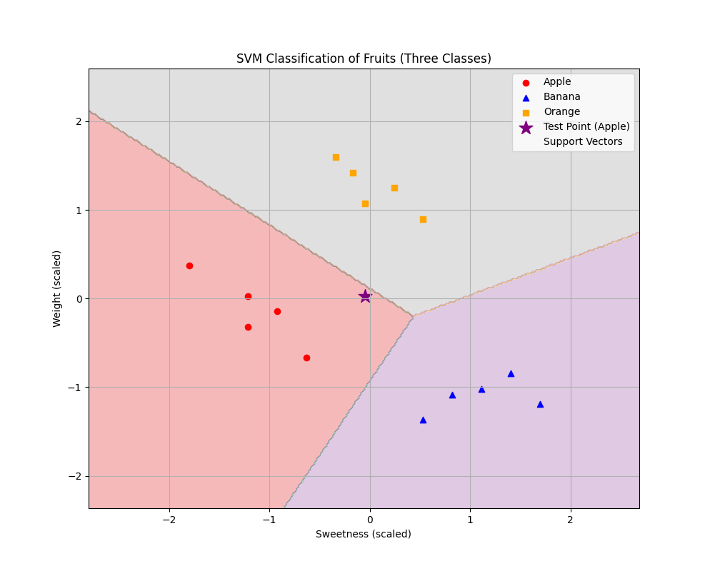

# 🧠 איך SVM מתמודד עם יותר משתי קבוצות?

### 🎯 הבעיה:
המודל ה- "קלאסי" נועד לבעיה של **שני סוגים בלבד**:
- מחלקה חיובית: \( +1 \)
- מחלקה שלילית: \( -1 \)

אבל מה עושים כשיש **שלוש קבוצות או יותר**? (למשל A, B, C)

**✅ פתרונות נפוצים:**

**1. One-vs-Rest (OvR) – "אחד מול כל השאר"**

- אם יש 3 קבוצות (A, B, C) → נבנה 3 מודלים:
  - מודל 1: A מול (B ו־C)
  - מודל 2: B מול (A ו־C)
  - מודל 3: C מול (A ו־B)

- כל מודל מאמן SVM בינארי
- כשבודקים דוגמה חדשה:
  - מריצים את שלושת המודלים
  - בוחרים את הקבוצה עם הציון הגבוה ביותר

**2. One-vs-One (OvO) – "כל זוג מול זוג"**

- נבנה SVM עבור כל **זוג קבוצות**
- לדוגמה, עבור קבוצות A, B, C → נבנה:
  - A מול B
  - A מול C
  - B מול C
- עבור \( k \) קבוצות יש:


$$
\frac{k(k - 1)}{2}
$$

  מודלים שונים

- כשבודקים דוגמה חדשה:
  - כל מודל נותן "הצבעה"
  - הקבוצה שזוכה בהכי הרבה הצבעות היא הזוכה

**🤖 בפועל – עם Scikit-learn:**

- אם תשתמש ב־`SVC` (ספריית `sklearn.svm`) — אין צורך לטפל בזה ידנית!
- כברירת מחדל, האלגוריתם מפעיל **One-vs-One** באופן אוטומטי

**💡 סיכום:**

| מס' קבוצות | פתרון SVM               |
|------------|-------------------------|
| 2          | SVM רגיל                |
| >2         | One-vs-Rest או One-vs-One |


## דוגמא בפייתון עבור 3 קבוצות

```python
import numpy as np
import matplotlib.pyplot as plt
from sklearn import svm
from sklearn.preprocessing import StandardScaler
from itertools import combinations

# Create a dataset for apples, bananas, and oranges
# Features: sweetness (x-axis) and weight (y-axis)
apples = np.array([[3, 150], [4, 130], [2, 160], [3, 140], [3.5, 145]])
bananas = np.array([[7, 120], [6, 110], [8, 115], [7.5, 125], [6.5, 118]])
oranges = np.array([[5, 180], [4.5, 195], [5.5, 185], [6, 175], [4.8, 190]])

# Combine features and create labels (0 for apples, 1 for bananas, 2 for oranges)
X = np.vstack([apples, bananas, oranges])
y = np.array([0, 0, 0, 0, 0, 1, 1, 1, 1, 1, 2, 2, 2, 2, 2])

# Scale the features (important for SVM)
scaler = StandardScaler()
X_scaled = scaler.fit_transform(X)

# Create and train the SVM model
# For multiclass problems, SVM creates multiple binary classifiers (one-vs-one by default)
clf = svm.SVC(kernel='linear', C=1000, decision_function_shape='ovr')
clf.fit(X_scaled, y)

# Create a test point
test_point = np.array([[5, 150]])  # A point with sweetness=5, weight=150
test_point_scaled = scaler.transform(test_point)
prediction = clf.predict(test_point_scaled)[0]
class_names = ["Apple", "Banana", "Orange"]
predicted_class = class_names[prediction]

print(f"Test point: Sweetness={test_point[0][0]}, Weight={test_point[0][1]}")
print(f"Predicted class: {predicted_class}")
```



Output:
```
Test point: Sweetness=5, Weight=150
Predicted class: Apple

Decision function values for test point:
Apple: 2.15989923461655
Banana: -0.18143598271709815
Orange: 1.071382786408734

the negative value for Banana simply indicates that the binary classifier for 
  "Banana vs. not-Banana" believes your test point is in the "not-Banana" category (rest)
  because we are using One-vs-Rest (OvR)
```