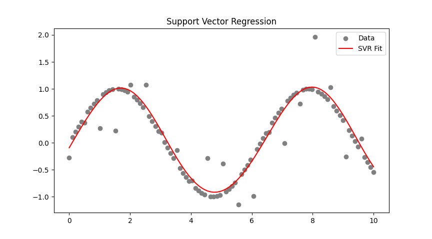

# 📈 Support Vector Regression (SVR)
  
## What is SVR?
  
SVR (Support Vector Regression) 
  
גרסה של אלגוריתם מכונת וקטורים תומכים, 
אבל במקום סיווג (קלסיפיקציה) – הוא מבצע **רגרסיה** (חיזוי של ערכים רציפים, כמו מחירים או טמפרטורות)
  
הוא מנסה למצוא **פונקציה פשוטה ככל האפשר** שמתאימה לנתונים — אך תוך התעלמות משגיאות קטנות
  

  
## 🎯 Core Idea
  
Instead of requiring the model to fit every point exactly, SVR allows a **tolerance margin (ε)** around the function. As long as the error is within this ε — we don't care. Only points **above or below this margin** matter
  
> ✨ Goal: Find a function where **as many points as possible fall within ±ε**
  
 
## 📐 The SVR Tube – "ε-Tube"
  
- This is a region of ±ε around the predicted function
- Points **inside the tube** → do not affect the function
- Points **outside the tube** → affect it (Support Vectors)
  
### 🎛️ Important SVR Parameters
  
| Parameter | Role |
|----------|------|
| `ε` (epsilon) | Defines the width of the tube – errors smaller than ε are ignored |
| `C` | Penalizes points outside the tube – controls model complexity |
| `kernel` | Determines function shape (linear, rbf, poly, sigmoid) |
| `gamma` | Used in nonlinear kernels – sets how far each point's influence reaches |
   
### 🧪 Basic Example in Code

```python
from sklearn.svm import SVR
import numpy as np
import matplotlib.pyplot as plt
  
# Generate data
X = np.linspace(0, 10, 100).reshape(-1, 1)
y = np.sin(X).ravel()
y[::5] += 0.5 * np.random.randn(20)  # add some noise
  
# SVR model with RBF kernel
model = SVR(kernel='rbf', C=100, epsilon=0.1)
model.fit(X, y)
y_pred = model.predict(X)
  
# Plot
plt.scatter(X, y, color='gray', label='Data')
plt.plot(X, y_pred, color='red', label='SVR Prediction')
plt.title('SVR with ε-Tube')
plt.legend()
plt.show()
```
   
## 💬 Quick Summary
  
| Feature              | SVM (Classification)       | SVR (Regression)                      |
|----------------------|-----------------------------|----------------------------------------|
| Goal                 | Separate between classes    | Fit function with ε tolerance         |
| Margin               | Distance between classes    | No margin – there's a tolerance tube  |
| Support Vectors      | Touch the margin boundaries | Outside the tube – influence function |
| Penalized Points     | Misclassified samples        | Points with error > ε                 |
| Prediction Formula   |        |  |
  
---
  
  