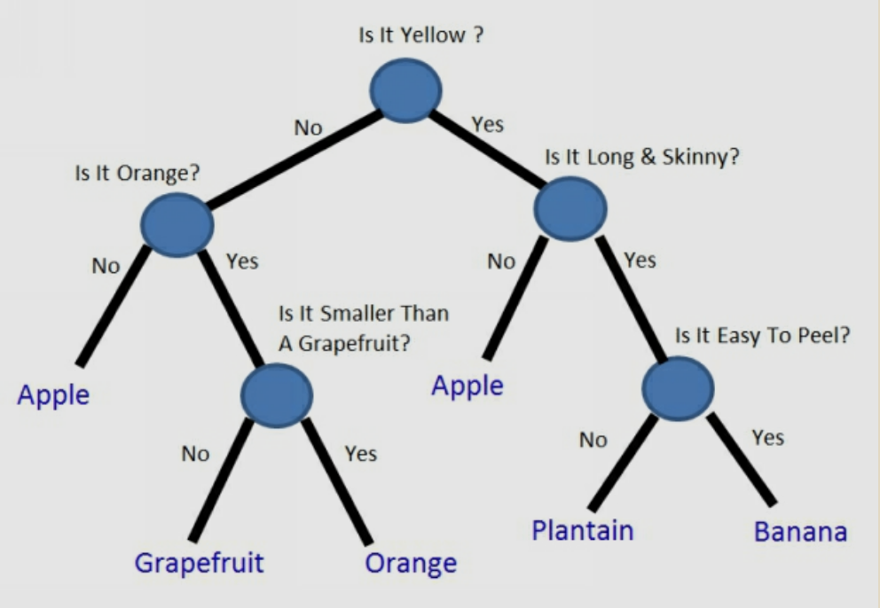

# חישוב Gini Impurity עבור בעיות עם מספר קלאסים
  
## הנוסחה למספר קלאסים
  
כאשר עובדים עם יותר משני קלאסים (מספר קטגוריות), הנוסחה של Gini Impurity מתרחבת באופן טבעי ל:
  

  
  
  
כאשר:
- **Q** הוא הצומת שאנו בוחנים
- **k** הוא מספר הקלאסים
- **** הוא ההסתברות (או החלק היחסי) של קלאס i בצומת Q
  
## דוגמה עם 3 קלאסים
  

  
נניח שיש לנו מערכת נתונים עם 30 דגימות:
- 15 דגימות מקלאס A (כחול)
- 10 דגימות מקלאס B (אדום)
- 5 דגימות מקלאס C (ירוק)
  
נחשב את Gini Impurity של הצומת:
  

  
  

  
  

  
  
  

  
  

  
  

  
  

  
  
  
שימו לב שככל שיש יותר קלאסים, הערך המקסימלי של Gini Impurity גדל. עבור k קלאסים, הערך המקסימלי יהיה .
  
## תהליך החלטה על פיצול עם מספר קלאסים
  
כעת, נדגים כיצד משתמשים ב-Gini Impurity כדי להחליט על פיצול אופטימלי בבעיה עם מספר קלאסים.
  
נניח שיש לנו מערכת נתונים עם שני מאפיינים (X1, X2) וקטגוריית יעד (Y) עם 3 קלאסים (A, B, C):
  
| X1 | X2 | Y |
|----|----|----|
| 1  | 3  | A  |
| 2  | 1  | A  |
| 3  | 2  | B  |
| 4  | 1  | B  |
| 5  | 3  | C  |
| 6  | 2  | C  |
| 7  | 1  | A  |
| 8  | 3  | B  |
| 9  | 2  | C  |
  
### חישוב Gini Impurity של השורש
  
- 3 דגימות מקלאס A (p_A = 3/9 = 0.33)
- 3 דגימות מקלאס B (p_B = 3/9 = 0.33)
- 3 דגימות מקלאס C (p_C = 3/9 = 0.33)
  

  
  

  
  

  
  

  
  
  
שימו לב שזהו הערך המקסימלי של Gini Impurity עבור 3 קלאסים כאשר הם מחולקים באופן שווה.
  
### פיצול לפי X1 ≤ 4
  
נבדוק את הפיצול לפי האם X1 ≤ 4:
  
**צומת שמאל (X1 ≤ 4)**:
- 2 דגימות מקלאס A (p_A = 2/4 = 0.5)
- 2 דגימות מקלאס B (p_B = 2/4 = 0.5)
- 0 דגימות מקלאס C (p_C = 0/4 = 0)
  

  
  

  
  

  
  

  
  
  
**צומת ימין (X1 > 4)**:
- 1 דגימה מקלאס A (p_A = 1/5 = 0.2)
- 1 דגימה מקלאס B (p_B = 1/5 = 0.2)
- 3 דגימות מקלאס C (p_C = 3/5 = 0.6)
  

  
  

  
  

  
  

  
  
  
**הממוצע המשוקלל**:

  
  
  
**הרווח מהפיצול**:

  
  
  
### פיצול לפי X2 ≤ 2
  
כעת נבדוק פיצול אחר - לפי X2 ≤ 2:
  
**צומת שמאל (X2 ≤ 2)**:
- 1 דגימה מקלאס A (p_A = 1/5 = 0.2)
- 1 דגימה מקלאס B (p_B = 1/5 = 0.2)
- 3 דגימות מקלאס C (p_C = 3/5 = 0.6)
  

  
  

  
  

  
  

  
  
  
**צומת ימין (X2 > 2)**:
- 2 דגימות מקלאס A (p_A = 2/4 = 0.5)
- 2 דגימות מקלאס B (p_B = 2/4 = 0.5)
- 0 דגימות מקלאס C (p_C = 0/4 = 0)
  

  
  

  
  

  
  

  
  
  
**הממוצע המשוקלל**:

  
  
  
**הרווח מהפיצול**:

  
  
  
בדוגמה זו, שני הפיצולים נותנים את אותו הרווח (0.14). במקרה כזה, האלגוריתם יכול לבחור באחד מהם לפי קריטריונים נוספים, כמו פשטות המודל או עדיפות למאפיין מסוים.
  
## השפעת מספר הקלאסים על Gini Impurity
  
ככל שמספר הקלאסים (k) גדל, הטווח של ערכי Gini Impurity משתנה:
  
1. **ערך מינימלי**: תמיד 0 (כאשר כל הדגימות בצומת שייכות לאותו קלאס)
2. **ערך מקסימלי**: , כאשר כל הקלאסים מיוצגים באופן שווה בצומת
  
לדוגמה:
- עבור 2 קלאסים: הערך המקסימלי הוא 
- עבור 3 קלאסים: הערך המקסימלי הוא 
- עבור 4 קלאסים: הערך המקסימלי הוא 
  
## שיקולים מעשיים עבור בעיות עם מספר קלאסים
  
1. **מורכבות חישובית**: ככל שיש יותר קלאסים, החישוב של Gini Impurity עלול להיות מעט יותר יקר חישובית, אך בדרך כלל ההבדל זניח.
  
2. **פיצול מאוזן**: עבור בעיות עם מספר קלאסים, Gini Impurity נוטה לבחור פיצולים שמפרידים את הקלאסים באופן הומוגני יותר.
  
3. **התמודדות עם אי-איזון**: אם יש קלאס אחד שהוא דומיננטי מאוד (unbalanced dataset), עדיין ניתן להשתמש ב-Gini Impurity, אך יתכן שיהיה צורך בטכניקות נוספות כמו משקולות לקלאסים או דגימה מחדש של הנתונים.
  
4. **גבול החלטה**: בבעיות עם מספר קלאסים, השוואה בין אנטרופיה ל-Gini Impurity עשויה להראות הבדלים גדולים יותר בגבולות ההחלטה המתקבלים.
  
## סיכום
  
הנוסחה של Gini Impurity מתרחבת באופן טבעי למקרה של מספר קלאסים, והעיקרון הבסיסי נשאר זהה - אנו מחפשים את הפיצול שממזער את הממוצע המשוקלל של Gini Impurity בצמתי הבנים. ככל שיש יותר קלאסים, הערך המקסימלי של Gini Impurity גדל, אך התהליך של בחירת הפיצול האופטימלי נשאר זהה.
  