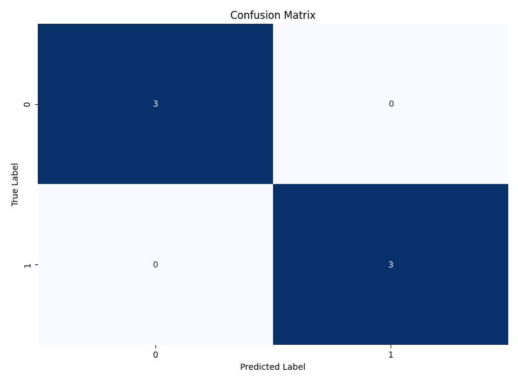

# יער רנדומלי (Random Forest)


## הבעיה שרוצים לפתור

עצי החלטה בודדים סובלים מבעיות כמו:
- **Overfitting** — העץ לומד טוב מדי את הדאטה ולא מסוגל לחזות על דאטה חדש
- **התעלמות מתכונות** — העץ מתמקד רק בחלק מהתכונות בפיצולים (כי עץ החלטה רגיל בנוי כך שהוא בכל שלב בוחר את הפיצול הכי טוב — כלומר את התכונה שמביאה להפרדה הכי ברורה בין המחלקות)

**דוגמה**:

נניח שאנו רוצים לחזות אם לקוח יקבל אשראי, בהתבסס על גיל ומשכורת. עץ החלטה יחיד עשוי לבנות חוקים מדויקים מאוד לדאטה הקיים, אך ייכשל לחזות נכונה לקוחות חדשים

## איך Random Forest פותר את הבעיה?

במקום לבנות **עץ אחד**, יער רנדומלי בונה **הרבה עצים שונים** על **חלקים שונים מהמידע** ו**חלקים שונים מהתכונות**:

- בבעיית סיווג (Classification) → לוקחים **רוב קולות** (Voting)
- בבעיית רגרסיה (Regression) → לוקחים **ממוצע** של התחזיות

## תהליך פעולה של Random Forest

1. בחירה **מדגם אקראי עם החזרה** מהדאטה (Bootstrapping)
2. בכל פיצול: **בחירה אקראית** של קבוצת תכונות
3. בערך 63% מהדאטה נכנס לכל עץ (לפי הסתברות), כלומר כ־37% מהשורות לא מופיעות בכלל באותו עץ
4. בניית עץ עד הסוף (ללא גיזום)
5. חזרה על השלבים כדי לבנות הרבה עצים
6. תחזית סופית על ידי רוב קולות או ממוצע

## מה זה Bootstrapping במודל?

 תהליך שבו אנו יוצרים מדגם חדש מהנתונים הקיימים **על ידי בחירה אקראית של דגימות עם החזרה**. כלומר:
- ייתכן שדוגמה תיבחר יותר מפעם אחת
- ייתכן שדוגמה מסוימת לא תיבחר בכלל

המטרה: כל עץ רואה גרסה מעט שונה של הדאטה. זה מייצר **גיוון** בין העצים ועוזר למודל להיות יותר יציב ולפחות מוטה.

**דוגמה פשוטה**:

אם יש לנו 5 דוגמאות: A, B, C, D, E

אחד העצים יכול להיבנות על בסיס מדגם כמו: A, B, B, D, E

## בקטנה: מה זה Out-Of-Bag Error?

כאשר עושים Bootstrapping, לא כל הדוגמאות נבחרות למדגם
- את הדוגמאות **שלא נבחרו** אפשר לשמור לבדיקה
- כך ניתן לבדוק **כמה טוב כל עץ מנבא** על הדוגמאות שלא שימשו לאימון שלו
- משם מחשבים **OOB Error** שהוא מדד לביצועי המודל בלי להפריד סט בדיקה (Train/Test)

**דוגמה סופר פשוטה:**

| גיל | משכורת | קיבל אשראי |
|-----|---------|--------------|
| 25  | 3000    | לא           |
| 30  | 5000    | כן           |
| 45  | 7000    | כן           |
| 22  | 2500    | לא           |
| 35  | 6000    | כן           |

ביער רנדומלי:
- כל עץ רואה מדגם שונה מהדאטה (עם החזרה)
- בכל פיצול ייבחרו תכונות שונות
- כל עץ ילמד על דאטה אחר
- התחזית הסופית תהיה ממוצעת מכל העצים ✨

## מתמטיקה בסיסית

אם:
$$
T_1(x), T_2(x), \ldots, T_K(x)
$$
הם העצים,

אז התחזית הסופית היא:

- **סיווג**:
$$
\text{Prediction}(x) = \text{Majority Vote}(T_1(x), T_2(x), \ldots, T_K(x))
$$

- **רגרסיה**:
$$
\text{Prediction}(x) = \frac{1}{K} \sum_{i=1}^{K} T_i(x)
$$

## השוואה: עץ החלטה יחיד מול Random Forest

| נושא | עץ החלטה בודד | יער רנדומלי |
|:-----|:--------------|:------------|
| דיוק | גבוה על אימון, נמוך על חדש | יציב וגבוה |
| שימוש בתכונות | חלק מהתכונות מוזנחות | רוב התכונות משולבות |
| שונות | גבוהה | נמוכה |

## פרמטרים חשובים ב-Random Forest

- `n_estimators` → כמה עצים לבנות. ככל שיש יותר עצים, המודל לומד טוב יותר (עד גבול מסוים)
- `max_features` → כמה תכונות ייבחרו באקראי בכל פיצול. משפיע על גיוון העצים
- `bootstrap` → האם לבצע דגימה עם החזרה (בוטסטראפ). ברירת מחדל: אמת
- `oob_score` → אם אמת, המודל ישתמש בדוגמאות שלא נבחרו במדגם כדי להעריך את הדיוק (שגיאת-מחוץ-לתיק) בלי צורך בסט בדיקה נפרד

### למה Bootstrapping חשוב?

- יוצר גיוון בין העצים
- מפחית קורלציה בין עצים
- משפר יציבות והכללה (generalization)
- מאפשר לחשב Out-Of-Bag Error מבלי להפריד דאטה

---

## דוגמת קוד פשוטה בפייתון

```python
import numpy as np
import seaborn as sns
from matplotlib import pyplot as plt
from sklearn.ensemble import RandomForestClassifier
from sklearn.model_selection import train_test_split
from sklearn.metrics import accuracy_score, confusion_matrix, classification_report

# Creating a sample dataset directly in the code
# Data represents students with study hours, sleep hours, and breakfast (yes/no)
# Target is whether they passed an exam (1) or failed (0)

# Features data
study_hours = [2, 8, 5, 1, 7, 3, 6, 4, 9, 2, 7, 4, 8, 3, 6, 9, 5, 3, 7, 2]
sleep_hours = [5, 8, 9, 4, 7, 8, 6, 7, 9, 6, 8, 5, 7, 6, 9, 8, 7, 5, 8, 4]
had_breakfast = [1, 1, 0, 0, 1, 0, 1, 0, 1, 0, 1, 0, 1, 1, 0, 1, 0, 0, 1, 0]  # 1=yes, 0=no

# Create features array
X = np.column_stack((study_hours, sleep_hours, had_breakfast))

# Target data (pass/fail)
y = np.array([0, 1, 1, 0, 1, 0, 1, 0, 1, 0, 1, 0, 1, 0, 1, 1, 0, 0, 1, 0])

# Feature names for better visualization
feature_names = ["Study Hours", "Sleep Hours", "Had Breakfast"]

# Split the data into training and testing sets
X_train, X_test, y_train, y_test = train_test_split(
    X, y, test_size=0.3, random_state=42
)

# Create a Random Forest model
rf_model = RandomForestClassifier(
    n_estimators=100,
    bootstrap=True,
    oob_score=True,
    random_state=42
)

# Train the model
rf_model.fit(X_train, y_train)

# Predict on test set
y_pred = rf_model.predict(X_test)

# Calculate accuracy scores
accuracy = accuracy_score(y_test, y_pred)
print(f"Model Accuracy: {accuracy:.2f}")
print(f"Out-of-Bag Accuracy: {rf_model.oob_score_:.2f}")

# Print detailed classification report
print("\nClassification Report:")
print(classification_report(y_test, y_pred))
```

Output
```
Model Accuracy: 1.00
Out-of-Bag Accuracy: 0.93

Classification Report:
              precision    recall  f1-score   support

           0       1.00      1.00      1.00         3
           1       1.00      1.00      1.00         3

    accuracy                           1.00         6
   macro avg       1.00      1.00      1.00         6
weighted avg       1.00      1.00      1.00         6
```

**הסבר:**
- הדאטה מפוצל על עצים שונים (עם תכונות שונות)
- בסוף אוספים את כל התחזיות ומקבלים החלטה סופית

### דיוק המודל (Model Accuracy) מול Out-of-Bag Accuracy

בואו נבין בצורה ברורה מה ההבדל בין שני מדדי הדיוק החשובים האלו: `Model Accuracy` ו־`OOB Accuracy`

#### ✅ מה זה `accuracy_score` ואיך מחשבים אותו?

```python
accuracy = accuracy_score(y_true, y_pred)
```

זו פשוט הנוסחה:

\[
\text{Accuracy} = \frac{CorrectPredictions}{TotalPredictions}
\]

#### דוגמה:
אם היו לך 10 דוגמאות, והמודל ניחש נכון ב־9 מהן:

\[
\text{Accuracy} = \frac{9}{10} = 0.90
\]

#### מה זה Out-of-Bag Accuracy (OOB Accuracy)?

כשאנחנו משתמשים ב־**Bootstrapping** (מדגם עם החזרה), כל עץ ביער רנדומלי מקבל רק חלק מהשורות מהדאטה

- חלק מהשורות **לא נכנסות בכלל** לאימון של אותו עץ — אלו נקראות **Out-of-Bag samples**
- אנחנו יכולים להשתמש בשורות האלו כדי לבדוק **כמה טוב העץ מנבא דוגמאות שהוא לא ראה**

**התהליך:**
- עבור כל דוגמה — אוספים תחזיות רק מהעצים **שלא ראו אותה באימון**
- לוקחים ממוצע/רוב קולות → זו התחזית הסופית
- משווים לתוצאה האמיתית
- כך מחשבים את הדיוק הכולל על דוגמאות ה־OOB

#### 🔢 דוגמה תוצאה:
```python
Model Accuracy: 1.00
Out-of-Bag Accuracy: 0.93
```

#### הסבר:
- `Model Accuracy = 1.00` → המודל ניחש את **כל הדוגמאות בסט הבדיקה** נכונה (יופי!)
- `OOB Accuracy = 0.93` → המודל הצליח ב־93% מהמקרים **על הדאטה שלא שימש לאימון** בכל עץ

**✨ יתרונות OOB Accuracy**

- מאפשר **הערכה פנימית** של המודל בלי להשתמש ב־`train_test_split`
- חוסך זמן ומאמץ
- מזכיר מאוד **Cross Validation** אבל אוטומטי

**לסיכום:**

| מדד | איך נבנה | מה הוא מודד |
|-----|----------|--------------|
| `Model Accuracy` | תחזית על סט בדיקה | דיוק חיצוני קלאסי |
| `OOB Accuracy` | תחזיות על דוגמאות שלא נבחרו במדגם | הערכה פנימית לאימון |


## גרף המחשה




## ✨ סיכום ראשוני

- יער רנדומלי = הרבה עצי החלטה שונים
- מתאים לסיווג ולרגרסיה
- מפחית Overfitting ומשפר דיוק
- דורש יותר זמן חישוב, אבל מאוד אמין וביציב


