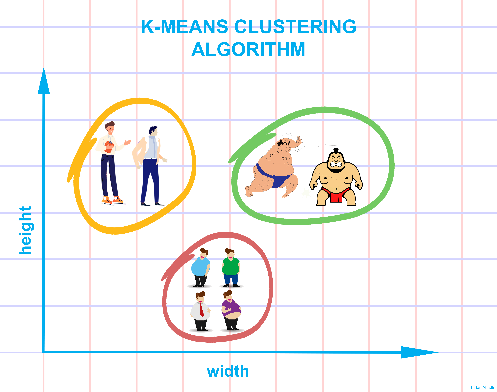
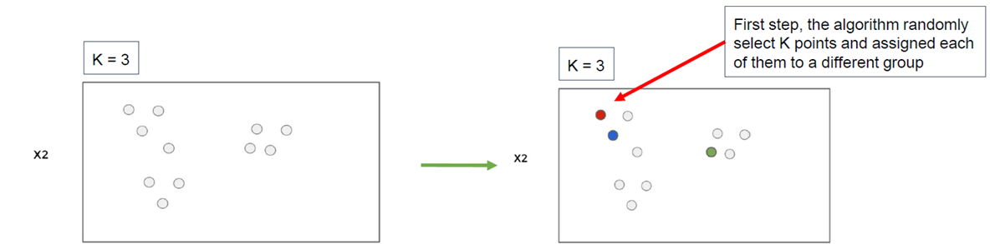
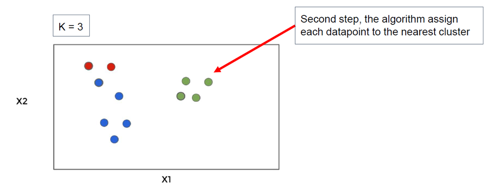
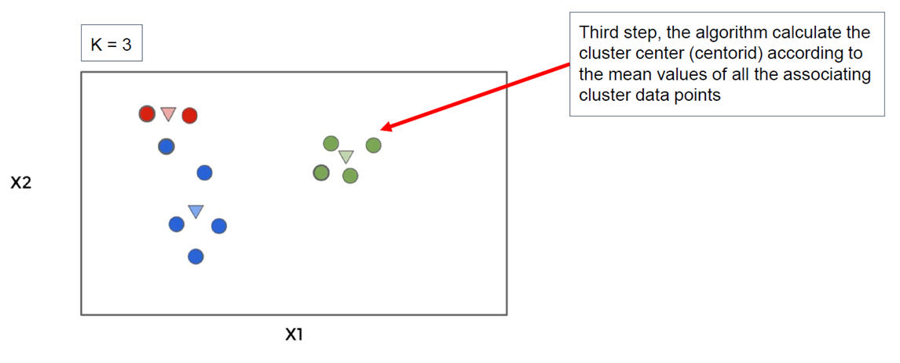
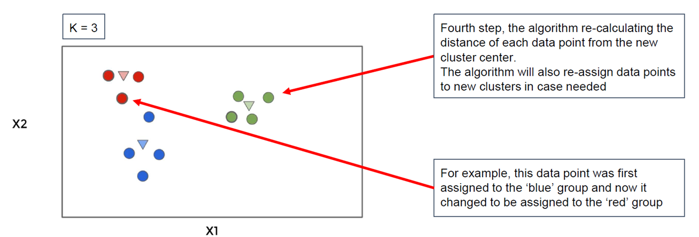
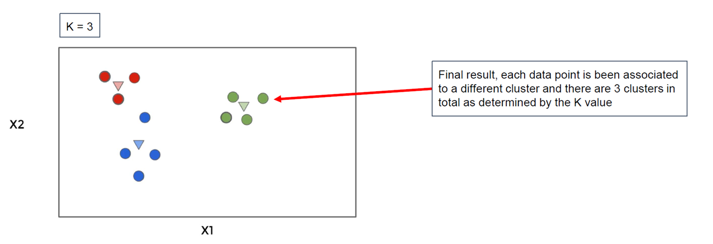

# K-MEAN CLUSTERING - INTRODUCTION

**קיי מינס** הוא אלגוריתם של **למידה לא מונחית** שמטרתו לחלק את הנתונים לקבוצות (קלאסטרים) לפי הדמיון בין נקודות  
הוא לא יודע מראש כמה קבוצות יש או מה משמעותן – רק מחלק את הנקודות כך שכל קבוצה תהיה פנימית הומוגנית וחיצונית שונה  

🧠 **האלגוריתם לא יודע להסביר מהי כל קבוצה**, זה התפקיד של מנתח הדאטה  
לכן הוא קורא לקבוצות פשוט בשם **group_1**, **group_2** וכו’  

---

# K-MEAN CLUSTERING - ALGORITHM STEPS

## 1. Initialization  
**אתחול** – בוחרים את מספר הקבוצות **K** וממקמים נקודות התחלתיות (מרכזים) בצורה אקראית במרחב

## 2. Assignment  
**שיוך** – כל נקודה בדאטה משויכת למרכז הקרוב ביותר לפי **מרחק אוקלידי**

## 3. Update  
**עדכון מרכזים** – מחשבים מחדש את מיקום כל מרכז בתור **ממוצע** של כל הנקודות שנמצאות בקבוצה הזו

## 4. Reassignment  
**שיוך מחדש** – מבצעים בדיקה נוספת: אם יש נקודות שהתקרבו יותר למרכז אחר, מעבירים אותן לקבוצה החדשה

## 5. Repeat  
**חזרה** – חוזרים על השלבים הקודמים עד שאין שינוי בין האיטרציות או שהגענו למספר מקסימלי של חזרות

---

# K-MEAN CLUSTERING - EXAMPLE

בוא נראה דוגמה:

- יש לנו דאטה עם שני מאפיינים: **X1** ו־**X2**
- נבחר K=3 כלומר נרצה שלוש קבוצות

🖼️ שיוך אקראי: האלגוריתם בוחר 3 נקודות התחלתיות באופן אקראי  
להלן תמונה הממחישה את המצב הזה:

**שיוך ראשון** – כל נקודה בדאטה משויכת למרכז הקרוב ביותר מבין שלושת המרכזים  
החלוקה מתבצעת לפי **מרחק אוקלידי** – כלומר הקרבה הפיזית במרחב  

**עדכון מרכזים** – עכשיו מחשבים מחדש את המיקום של כל מרכז לפי ממוצע המאפיינים של הנקודות בקבוצה שלו  
כלומר, המרכז "זז" לנקודה הממוצעת של קבוצתו החדשה  

**שיוך מחודש** – בודקים שוב את המרחק של כל נקודה למרכזים החדשים  
אם נמצאה נקודה שיותר קרובה למרכז אחר, משייכים אותה מחדש  

**התכנסות** – ממשיכים את תהליך העדכון והשיוך מחדש עד שהקבוצות לא משתנות  
בנקודה הזו האלגוריתם עוצר – ונוצרה חלוקה סופית ל־3 קבוצות  

**התוצאה הסופית** – כעת כל נקודה משויכת לקבוצה שלה, והמרכזים מייצגים את האמצע של כל קלאסטר  
בדרך כלל נרצה לנתח כל קבוצה בנפרד כדי להבין את המשמעות שלה בעולם האמיתי  
