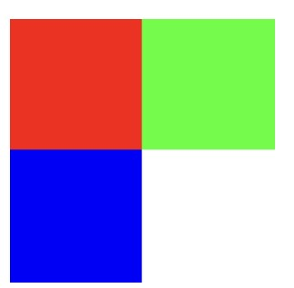
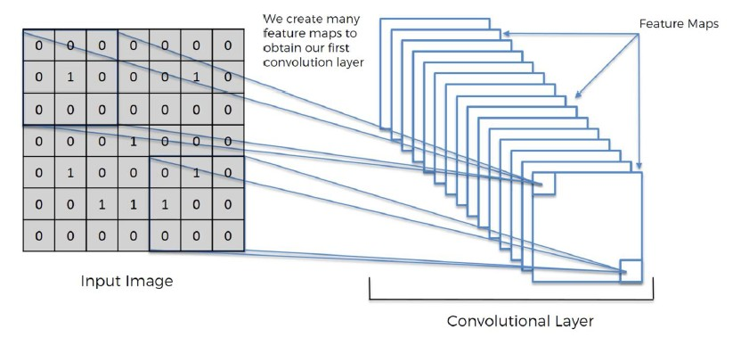
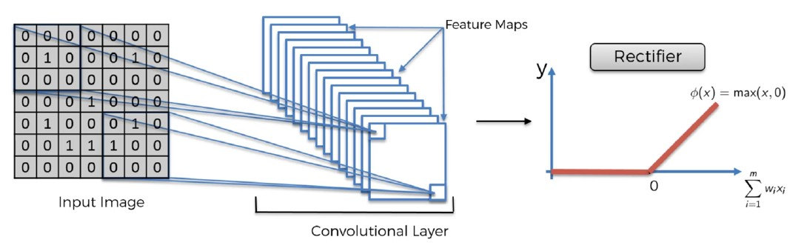
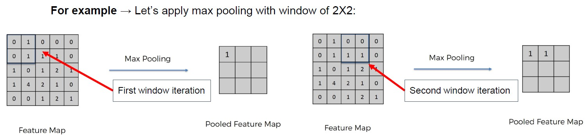
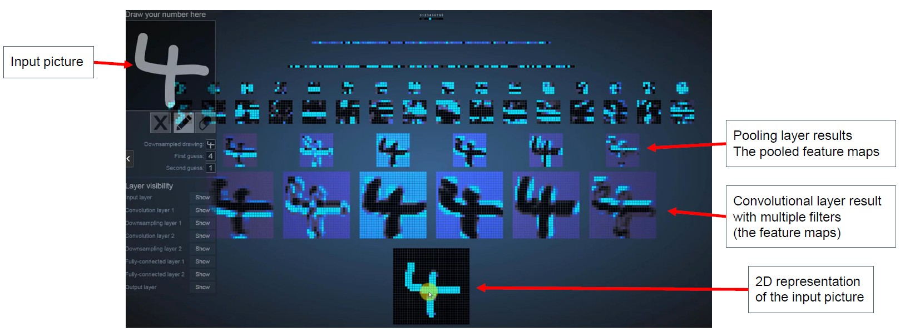
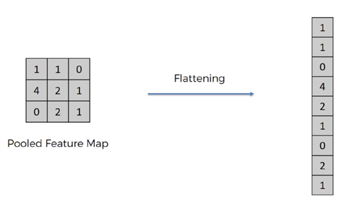
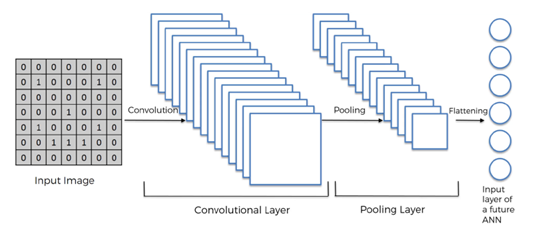
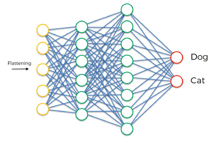
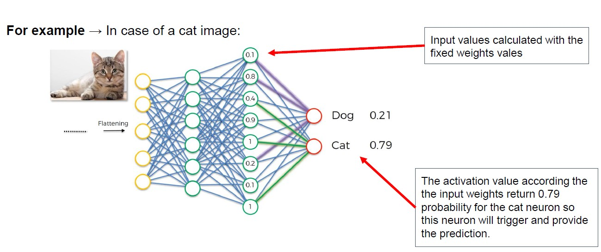

## רשת עצבית קונבולוציונית (CNN - Convolutional Neural Network)

 רשת עצבית עמוקה שמתמחה בעיבוד תמונות ווידאו
במקום לסרוק את כל התמונה כמו רשת רגילה, CNN מתמקדת בחלקים חשובים מתוך התמונה דרך מסננים (filters) שמחפשים תבניות כמו קווים, צורות, או טקסטורות

### איך זה עובד?

1. **שכבת קלט** → מקבלת את פיקסלי התמונה כערכים מספריים (שחור-לבן או צבעוני)
2. **שכבה קונבולוציונית** → מפעילה מסננים שמזהים מאפיינים שונים בתמונה
3. **פונקציית הפעלה (למשל ReLU Rectified Linear Unit)** → מוסיפה אי־לינאריות לרשת ומסייעת לסנן ערכים לא חשובים
4. **שכבת Pooling** → מקטינה את גודל התמונה מבלי לאבד מידע חשוב
5. **Flattening** → ממירה את כל הפלטים לשורה אחת ארוכה
6. **שכבה צפופה (Fully Connected)** → שכבה רגילה של ANN שמבצעת את הסיווג הסופי


```python
from tensorflow.keras.models import Sequential
from tensorflow.keras.layers import Conv2D, MaxPooling2D, Activation, Flatten, Dense

model = Sequential()

# בלוק קונבולוציוני ראשון
model.add(Conv2D(32, (3, 3), input_shape=(64, 64, 3)))  # שכבה קונבולוציונית
'''
32:
This means the layer uses 32 filters (also called kernels)
Each filter detects a different pattern in the image (e.g., edges, curves, colors)
Each filter produces a feature map, so the output will have 32 “layers of features” learned from the image
The 32 filters are not pre-made (like “edge detector”, “circle detector” etc.)
These filters are initialized with random weights (random numbers)

(3, 3)
This is the size of each filter: 3 pixels by 3 pixels
The filter slides over the image and analyzes 3×3 pixel patches at a time
It's a very common choice, but you can also use (5, 5), (7, 7), etc.
Use 3×3 when: 
  You want deep networks with many layers (better feature extraction)
  You want to keep computation efficient
  You can stack several 3×3 filters to simulate larger ones (e.g., two 3×3 filters ≈ 5×5)
Use 5×5 or 7×7 when:
  You're working with larger images and need to detect larger features earlier
  You want a shallower network (fewer layers)
  You’re trying to reduce the number of layers but still want global context              

input_shape=(64, 64, 3)
This defines the shape of the input image:
64 = height of the image (in pixels)
64 = width of the image
3 = number of channels → RGB image (Red, Green, Blue)
So, this input is a 64×64 color image

Each of the 32 filters has a size of 3×3×3 (3×3 for pixels, 3 for RGB channels)
Each filter scans the entire image and produces one feature map
In total, you'll get 32 feature maps (one per filter) as the output of this layer
'''


model.add(Activation('relu'))                           # פונקציית הפעלה
model.add(MaxPooling2D(pool_size=(2, 2)))               # שכבת Pooling

# בלוק קונבולוציוני שני
model.add(Conv2D(64, (3, 3)))                           # עוד מסננים
model.add(Activation('relu'))                           
model.add(MaxPooling2D(pool_size=(2, 2)))              

# בלוק קונבולוציוני שלישי (אופציונלי)
model.add(Conv2D(128, (3, 3)))  
model.add(Activation('relu'))
model.add(MaxPooling2D(pool_size=(2, 2)))

# שטוח (Flatten) – מעביר את הפלט משכבות קונבולוציה לשכבות צפופות
model.add(Flatten())

# שכבה צפופה רגילה
model.add(Dense(128))                # 128 נוירונים סטנדרט
model.add(Activation('relu'))

# שכבת פלט לסיווג בינארי
model.add(Dense(1))                  # נוירון אחד כי זו בעיה בינארית
model.add(Activation('sigmoid'))     # פונקציית סיגמואיד לסיווג 0/1

# קומפילציה של המודל
model.compile(optimizer='adam', loss='binary_crossentropy', metrics=['accuracy'])

```


## ReLU – פונקציית הפעלה

לאחר פעולת הקונבולוציה אנחנו מפעילים ReLU

### מה זה ReLU? (Rectified Linear Unit) 

היא אחת מפונקציות ההפעלה הנפוצות ביותר ברשתות נוירונים עמוקות

היא מוגדרת כך:

$$
\text{ReLU}(x) = \max(0, x)
$$

כלומר:

* אם x חיובי → הפלט יהיה x
* אם x שלילי → הפלט יהיה 0

### למה משתמשים ב־ReLU?

* **מהירה מאוד לחישוב** – אין פעולות כבדות כמו אקספוננט או לוגריתם
* **מוסיפה אי־לינאריות לרשת** – כלומר משנה את הדרך שבה הרשת מגיבה לקלטים, כך שלא כל תגובה תהיה פרופורציונלית או קווית לערך הקלט. גם פעולה פשוטה כמו ReLU שמבטלת ערכים שליליים יוצרת נקודת שבירה (discontinuity) בגרף – וזה שובר את הקו הישר ומאפשר למודל ללמוד דפוסים לא לינאריים כמו עיקולים, שינויים חדים וקשרים מורכבים בין מאפיינים
* **מסננת ערכים לא רלוונטיים** – מוחקת ערכים שליליים שנחשבים כרעש או תוצאה של מאפיינים לא חשובים
* הפיקסלים הם ערכים חיוביים אבל הפילטרים מניבים גם מספרים שליליים

## ייצוג תמונה במחשב

תמונה היא מטריצה דו-ממדית של פיקסלים
בתמונות צבעוניות כל פיקסל מיוצג ב־3 ערוצים: אדום, ירוק, כחול (RGB)

### דוגמה:



תמונה בגודל 2x2 תיוצג כך:

```python
image = [
  [[255, 0, 0], [0, 255, 0]],
  [[0, 0, 255], [255, 255, 255]]
]
```

## מהי פעולת קונבולוציה?

קונבולוציה היא פעולה מתמטית שבה מחליקים פילטר קטן על כל אזור בתמונה ומבצעים חישוב מקומי
למשל, פילטר בגודל 3x3 מוכפל באיזור תואם בתמונה וכל הערכים מסוכמים לנקודה אחת חדשה


### למה זה חשוב?

הקונבולוציה עוזרת למצוא תבניות בתמונה כמו קווים או מעברים בין צבעים

## יצירת Feature Map

התוצאה של קונבולוציה היא "מפת מאפיינים" (Feature Map) – תמונה מוקטנת עם מידע חשוב בלבד

1. המסנן מחליק על התמונה
2. כל פעם הוא מחשב תוצאה נקודתית
3. נוצרת תמונה חדשה (Feature Map)


### 🔁 איך מתבצעת פעולת הקונבולוציה?

לוקחים לדוגמא חתיכה בגודל 3×3 מתוך התמונה (מתחילים מהפינה השמאלית העליונה)

כופלים איבר־איבר בין הפילטר לחתיכה הזו (כל תא מול התא המתאים)

מסכמים את כל התוצאות → מקבלים מספר אחד

שמים את המספר הזה במקום המתאים במפת המאפיינים (Feature Map)

מזיזים את הפילטר **משבצת אחת ימינה** וחוזרים על התהליך

ממשיכים עד שסורקים את כל השורה

כשהפילטר מגיע לסוף השורה, הוא יורד **שורה אחת למטה** ומתחיל שוב משמאל

החלון לא "חורג" מהתמונה – הוא תמיד נמצא בתוך הגבולות שלה
לכן הפלט קטן **יותר מהקלט**

**מה עושים אם רוצים לשמור על הגודל המקורי?**
משתמשים בטכניקה שנקראת padding – כלומר מוסיפים שוליים של אפסים סביב התמונה לפני שמתחילים את הקונבולוציה


### מה הרווחנו?

* הפחתת גודל התמונה
* שמירה על תבניות חשובות

## כמה מסננים?

אפשר להשתמש במספר מסננים – כל מסנן מזהה תבנית אחרת
יותר מסננים → יותר מאפיינים → רשת חזקה יותר

המסננים נוצרים אקראית בהתחלה ומתעדכנים תוך כדי האימון (backpropagation)



## ReLU – פונקציית הפעלה

לאחר פעולת הקונבולוציה אנחנו מפעילים ReLU



### למה?

כדי להוסיף לא-לינאריות למודל ולסנן ערכים שליליים

* ערכים חיוביים נשארים
* ערכים שליליים הופכים ל־0

## Pooling – חיבור מידע והקטנה

פעולה שמטרתה להקטין את גודל התמונה ולהפוך את הרשת לפחות רגישה לשינויים קטנים

### סוגי Pooling:

* **Max Pooling** → שומר את הערך הכי גבוה בכל חלון
* **Average Pooling** → מחשב ממוצע של הערכים בחלון
* **Min Pooling** → שומר את הערך הכי נמוך בחלון

### איך Pooling עובד?

1. בוחרים **סוג Pooling** (Max, Average, Min)
2. קובעים **גודל חלון** – למשל 2×2
3. מחליקים את החלון על מפת המאפיינים (בצעדים קבועים, לרוב stride=2)
4. בכל מיקום של החלון, מבצעים חישוב לפי השיטה שבחרנו
   לדוגמה עבור:

   ```
   3 5
   2 9
   ```

   * Max Pooling יתן 9
   * Average Pooling יתן 4.75
   * Min Pooling יתן 2
5. שומרים את התוצאה במפה החדשה
6. מזיזים את החלון וממשיכים
7. בקצוות המטריצה יבוצע Pooling על התאים שנותרו




### הערה חשובה:

בדרך כלל אין חפיפה בין חלונות – כל ערך משתתף פעם אחת בלבד
אם המפה לא מתחלקת בדיוק, מטפלים בהם בנפרד או מתעלמים מהשוליים

### למה זה טוב?

* **חיסכון בחישוב** → אנחנו מקטינים את מפת המאפיינים, ולכן גם מקטינים את כמות הפעולות שהרשת צריכה לבצע בהמשך
* **הקטנת סיכוי ל־Overfitting** → כשיש יותר מדי פרטים, המודל עלול ללמוד את הרעש במקום את העיקר. Pooling עוזר לשמור רק את החלקים הכי משמעותיים בתמונה
* **הכללה טובה יותר (Generalization)** → pooling הופך את הרשת לפחות רגישה לשינויים קטנים (כמו הטיה, תזוזה או רעש), ולכן היא לומדת תבניות ולא מיקומים מדויקים

## דוגמא להמחשה



## Flattening – הכנת הנתונים לסיווג

לאחר שיצרנו מפות מאפיינים מוקטנות, ממירים את כולן לשורה אחת ארוכה (וקטור)
וקטור זה יועבר לשכבה הצפופה (Fully Connected)



## סיכום ביניים



## שכבה צפופה (Fully Connected Layer)

השכבה הצפופה היא כמו רשת רגילה (ANN) ומבצעת את הסיווג הסופי

* כל נוירון מחובר לכל הקלטים
* משתמשים בפונקציות הפעלה כמו:

  * ReLU לשכבות מוסתרות
  * Sigmoid לסיווג בינארי
  * Softmax לסיווג רב־קטגורי

  

  

## סיכום זרימת הנתונים ב־CNN

1. קלט תמונה
2. פעולת קונבולוציה + ReLU → יצירת מפת מאפיינים
3. Pooling → הקטנה ושמירה על מידע חשוב
4. Flattening → הפיכת הנתונים לווקטור
5. Fully Connected → סיווג סופי לפי הקטגוריה המתאימה

## איך CNN לומדת?

1. האימון כולל עדכון של המסננים, המשקלים ופונקציות ההפעלה
2. תהליך זה נקרא Backpropagation – חוזרים אחורה ומתקנים את הרשת לפי השגיאה
3. הרשת לומדת לזהות אילו מאפיינים חשובים לתוצאה

**מה קורה בפועל?**

הפילטרים ברשת CNN הם כמו "מסכות" עם ערכים מספריים — הם מתחילים עם ערכים אקראיים

בזמן האימון, כאשר המודל טועה (לפי פונקציית עלות), מתבצע Backpropagation

האלגוריתם מחשב את הגרדיאנט (השיפוע של השגיאה) עבור כל אחד מהפרמטרים

זה כולל:

המשקולות ב־Fully Connected

המשקולות של הפילטרים בשכבות הקונבולוציה

כל הפילטר מתעדכן כך שהוא ילמד לזהות טוב יותר את הדפוסים שמובילים לתוצאה הנכונה

**מה באמת מתעדכן בזמן האימון?**

✅ **כן מתעדכן:**

* הערכים בתוך הפילטרים (המשקולות של הקונבולוציה)
* המשקולות וה-bias של השכבות הצפופות (Fully Connected)

❌ **לא מתעדכן:**

* סוגי פונקציות האקטיבציה (ReLU, Sigmoid, Softmax וכו') – נבחרות מראש ונשארות קבועות
* גודל וסוג הפילטרים – מספר הפילטרים וגודלם נקבעים מראש ולא משתנים באימון

**למה זה חשוב?**

המשקולות מתעדכנות כדי לשפר את היכולת של הרשת לזהות מאפיינים רלוונטיים בתמונה
לעומת זאת, פונקציית האקטיבציה קובעת את צורת התגובה של כל נוירון – והיא חלק מהארכיטקטורה, לא מהפרמטרים הנלמדים


