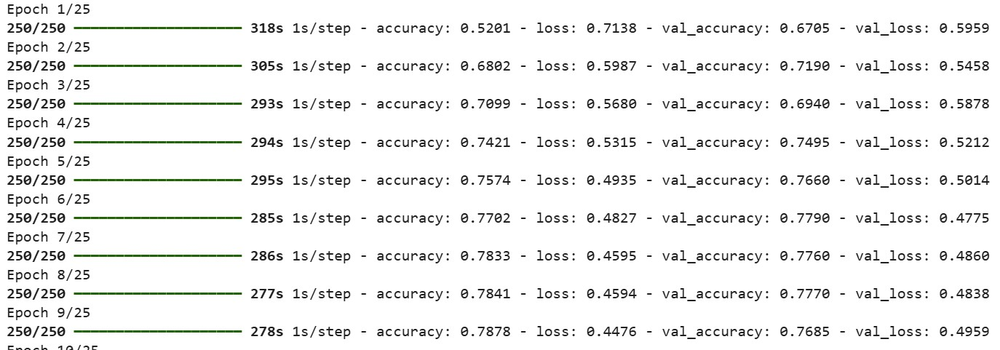
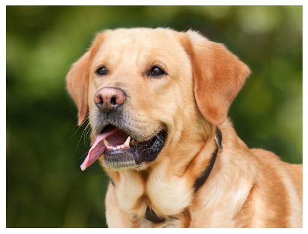
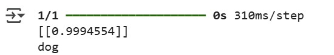
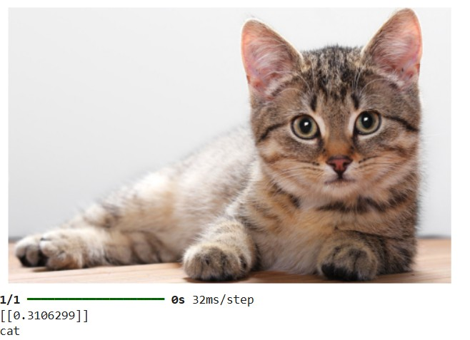

## 🐶🐱 אימון רשת CNN לסיווג כלב או חתול (Colab)

## 🚀 Getting Started in Google Colab

To run this notebook in the cloud, open:
[https://colab.research.google.com/](https://colab.research.google.com/)

Create a new notebook by clicking **File → New notebook** and copy the code blocks below step-by-step

## CNN_dog_cat_dataset.zip

🗂️ Before running the training code, **upload the file** `CNN_dog_cat_dataset.zip` to your **Google Drive** inside a folder named `content`  
(Or modify the code to reflect a different folder structure if needed)

This dataset is required for training the CNN to classify dog and cat images

## CNN code

### 🔧 Importing Required Libraries and Configuring GPU (if available)

```python
# Importing standard libraries
import numpy as np
import pandas as pd
import matplotlib.pyplot as plt
import seaborn as sns
import tensorflow as tf

# Optional: prevent TensorFlow from using GPU (for debugging or testing)
tf.config.set_visible_devices([], 'GPU')

# Check how many GPUs are available
print("Num GPUs Available: ", len(tf.config.experimental.list_physical_devices('GPU')))
```
Output:
```python
Num GPUs Available:  1
```

Explanation:

* `numpy`, `pandas` are used for data handling
* `matplotlib`, `seaborn` are used for plotting and visualization
* `tensorflow` is the deep learning framework used to build and train the CNN
* `tf.config.set_visible_devices([], 'GPU')` disables GPU usage intentionally (can be removed to use GPU)
* `list_physical_devices('GPU')` checks how many GPUs are detected by TensorFlow\` – מציג כמה כרטיסי GPU זמינים

### 📁 התחברות ל־Google Drive

כדי להשתמש בקבצים מהדרייב, מחברים את Colab אל חשבון Google Drive שלך

```python
import pandas as pd
import zipfile
from google.colab import drive

drive.mount('/content/drive')  # מחבר את הדרייב, יווצר קישור לנתיב /content/drive
```

### 📌 בדיקת מיקום נוכחי

```bash
pwd
```

פקודה שמציגה את הנתיב הנוכחי של סביבת העבודה
לרוב התוצאה תהיה:

```
/content
```

### 📦 חילוץ קובץ ZIP עם התמונות

```python
import zipfile

zip_file = '/content/drive/MyDrive/content/CNN_dog_cat_dataset.zip'  # הנתיב לקובץ הדחוס בדרייב

with zipfile.ZipFile(zip_file, 'r') as zip_ref:
  zip_ref.extractall('/content/dataset')  # חילוץ הקבצים לתיקייה חדשה
```

### 📂 מעבר לתיקייה עם הדאטה

```bash
cd dataset/
```

```bash
cd CNN_dog_cat_dataset/
```

בתוך התיקייה הזו יופיעו ככל הנראה תיקיות בשם `train` ו־`test` המכילות את התמונות של כלבים וחתולים

### 🧪 בדיקת התיקייה לאחר חילוץ

```bash
ls
```

Output:
```
single_prediction/  test_set/  training_set/
```

מציג את תוכן התיקייה הנוכחית ומוודא שהקבצים והמבנה תקינים

### 🖼️ הגדרת קונפיגורציה לטעינת תמונות

```python
from tensorflow.keras.preprocessing.image import ImageDataGenerator

# Training data generator with augmentation
train_datagen = ImageDataGenerator(
    rescale=1./255,         # Normalize pixel values to [0,1] — helps speed up training and stabilize gradients
    shear_range=0.2,        # Apply a slight diagonal transformation (shear) — simulates natural changes in camera angle
    zoom_range=0.2,         # Apply random zoom-in effect — helps the model recognize objects at different scales
    horizontal_flip=True    # Flip images horizontally — helps the model handle symmetry (e.g., cat facing left or right)
)

# Testing data generator — only normalization, no augmentation
test_datagen = ImageDataGenerator(rescale=1./255)
```

### 📥 טעינת התמונות מהתיקיות

```python
training_set = train_datagen.flow_from_directory(
    '/content/dataset/CNN_dog_cat_dataset/dataset/training_set',
    target_size=(64, 64),
    batch_size=32,
    class_mode='binary'
)

test_set = test_datagen.flow_from_directory(
    '/content/dataset/CNN_dog_cat_dataset/dataset/test_set',
    target_size=(64, 64),
    batch_size=32,
    class_mode='binary'
)
```

* `target_size=(64, 64)` → שינוי גודל התמונות לגודל אחיד
* `batch_size=32` → כמה תמונות נטענות בכל פעם
* `class_mode='binary'` → סיווג בינארי (חתול או כלב)

### 🧠 בניית רשת CNN

```python
from keras.models import Sequential
from keras.layers import Conv2D, MaxPooling2D, Flatten, Dense

cnn = Sequential()

# שכבת קונבולוציה ראשונה
cnn.add(Conv2D(filters=32, kernel_size=3, activation='relu', input_shape=[64, 64, 3]))
cnn.add(MaxPooling2D(pool_size=2, strides=2))

# שכבת קונבולוציה שנייה
cnn.add(Conv2D(filters=32, kernel_size=3, activation='relu'))
cnn.add(MaxPooling2D(pool_size=2, strides=2))

# Flatten
cnn.add(Flatten())

# Fully Connected
cnn.add(Dense(units=128, activation='relu'))
cnn.add(Dense(units=1, activation='sigmoid'))  # בגלל שזה סיווג בינארי
```

### הסבר לקוד

**🧠 מה זה Conv2D ו־MaxPooling2D ולמה משתמשים בהם?**

בבניית רשת עצבית קונבולוציונית (CNN), יש שתי שכבות חשובות במיוחד:

#### 🔷 Conv2D – שכבת קונבולוציה

קונבולוציה2ד היא שכבה שמחפשת **מאפיינים חשובים** בתמונה כמו קווים, צבעים, גבולות, תבניות, מרקם ועוד  
היא עושה את זה בעזרת **פילטרים קטנים** (למשל בגודל 3x3) שזזים על פני התמונה ובודקים כל אזור בנפרד

בכל פעם שהפילטר עובר על אזור בתמונה, הוא מחשב **עד כמה המאפיין הזה קיים שם**  
התוצאה היא **מפת מאפיינים** שמדגישה איפה נמצאים הדברים החשובים

#### 🔷 MaxPooling2D – שכבת מיצוע

 מקספול2ד שכבה שאחרי הקונבולוציה, ומטרתה **להקטין את גודל הנתונים**  
במקום לשמור את כל הערכים ממפת המאפיינים, היא לוקחת **את הערך הכי גבוה מכל אזור קטן** (למשל חלון 2 על 2)

למה זה טוב?
- חיסכון בחישובים
- הפחתת סיכון לאובר־פיטינג
- שמירה רק על המאפיינים החזקים ביותר

#### 🤔 אז למה משתמשים בזה כאן?

המטרה שלנו היא לזהות האם תמונה היא של **כלב או חתול**  
- Conv2D עוזרת לזהות תבניות חשובות כמו עיניים, פרווה, אוזניים...
- MaxPooling2D שומרת רק את מה שחשוב ומפשטת את התמונה

ביחד, הן עוזרות למודל ללמוד **ייצוג חכם של התמונה**, לפני שהוא מקבל החלטה סופית

#### 🔁 Why `Sequential`?

`Sequential` is the simplest way to build a model in Keras  
It means the model is built **layer by layer in order**, where each layer has one input and one output  
Perfect for models with a straight flow like this CNN (no branching or merging layers)

#### 🧠 Why `filters=32` in `Conv2D`?

- `filters=32` means the layer will learn **32 different patterns (features)** from the image
- These filters might learn to detect:
  - edges
  - textures
  - curves
  - small details in the image
- More filters = more ability to extract different features
- 32 is a common default starting point — later layers could use more

These filters are **not predefined** — the model learns them from the data  
They are essentially **small weight matrices** (e.g. 3x3) that slide over the image and detect patterns

**🔍 Are They Different Types of Filters?**

Yes — each filter becomes specialized to detect different visual patterns, such as:

- **Edges** (horizontal, vertical, diagonal)
- **Textures**
- **Curved lines**
- **Color transitions**
- **Animal features** (fur, eyes, ears)
- **Background structures**

These filters start with **random weights**, but during training, backpropagation updates them so they become useful for the task (e.g. classifying cats vs dogs)

**🧠 Why 32 Filters?**

Using 32 different filters gives the network **a broad set of feature detectors**  
- Each one captures a different aspect of the image  
- More filters = more expressive power (but also more computation)

#### 🔲 Why `kernel_size=3`?

- The kernel (filter) is the **window size** the layer uses to scan the image
- A size of `3x3` means each filter looks at a **3×3 patch** of the image at a time
- It’s a standard choice: small enough to be efficient, large enough to capture patterns

#### ⚡ Why `activation='relu'`?

- `ReLU` stands for Rectified Linear Unit
- It replaces negative values with 0 and keeps positive ones
- This adds **non-linearity**, allowing the model to learn more complex patterns
- It’s fast and works very well in most CNNs

#### 📏 Why `units=128` in `Dense`?

- After flattening, the dense (fully connected) layer learns **combinations of features**
- `128` is a typical choice — enough neurons to learn patterns, but not too large to overfit
- You can adjust this number for model performance and training speed

#### 🎯 Why `units=1` with `activation='sigmoid'`?

- We're doing **binary classification**: cat (0) or dog (1)
- `units=1` means the output is a **single number between 0 and 1**
- `sigmoid` squashes the output into a **probability**
  - Closer to 1 → more likely a dog
  - Closer to 0 → more likely a cat

### ⚙️ קומפילציה ואימון המודל

```python
cnn.compile(optimizer='adam', loss='binary_crossentropy', metrics=['accuracy'])

cnn.fit(x=training_set, validation_data=test_set, epochs=25)
```

* `adam` → אלגוריתם אימון מתקדם
* `binary_crossentropy` → פונקציית עלות עבור סיווג בינארי
* `epochs=25` → הרשת תלמד במשך 25 מחזורים על כל הדאטה

התהליך עשוי לקחת כמה זמן ...



### 🐾 חיזוי על תמונה חדשה

```python
import numpy as np
from keras.preprocessing import image

# טוענים את התמונה
img_path = '/content/dataset/CNN_dog_cat_dataset/dataset/single_prediction/cat_or_dog_1.jpg'
test_image = image.load_img(img_path, target_size=(64, 64))

img = image.load_img(img_path)
plt.imshow(img)
plt.axis('off')
plt.show()

# Convert image to array
test_image = image.img_to_array(test_image)

# Normalize pixel values (rescale to [0,1])
test_image = test_image / 255.0

# Expand dimensions to match the CNN model input shape
test_image = np.expand_dims(test_image, axis=0)

# Predict using the trained CNN model
result = cnn.predict(test_image)
print(result)

# Interpret the result
if result[0][0] > 0.5:
    prediction = 'dog'
else:
    prediction = 'cat'

print(prediction)
```





```python
import numpy as np
from keras.preprocessing import image

# טוענים את התמונה
img_path = '/content/dataset/CNN_dog_cat_dataset/dataset/single_prediction/cat_or_dog_2.jpg'
test_image = image.load_img(img_path, target_size=(64, 64))

...

# Interpret the result
if result[0][0] > 0.5:
    prediction = 'dog'
else:
    prediction = 'cat'

print(prediction)
```



הסבר:

* `image.load_img` טוען את התמונה ומכווץ אותה לגודל המתאים
* `img_to_array` ממיר את התמונה למערך מספרי
* חילוק ב־255 מנרמל את ערכי הפיקסלים לטווח \[0,1]
* `expand_dims` מוסיף מימד כדי להתאים את הצורה שמצפה לה המודל (batch size)
* `cnn.predict` מחזיר הסתברות שהאובייקט הוא כלב
* ההשוואה מול 0.5 קובעת את הקטגוריה הסופית

**🧩 Why Do We Use `np.expand_dims` Before Prediction?**

CNN models expect all inputs to be in 4D: `(batch_size, height, width, channels)`  
If you forget to expand the dimensions, you’ll get an error like:

> ValueError: Input 0 is incompatible with layer... expected ndim=4, found ndim=3

So `expand_dims` is essential for reshaping the image correctly before passing it to `model.predict()`

Before predicting, we typically load and preprocess a single image — this image will usually have a shape like:

(1, 64, 64, 3)

The extra dimension at the beginning (the `1`) represents the **batch size**

**Channels** הם שכבות הצבע שמרכיבות כל פיקסל בתמונה
כל פיקסל בעצם מחזיק כמה ערכים – אחד לכל ערוץ צבע

[255, 120, 0]  → Orange Pixel

**✅ What does `np.expand_dims(test_image, axis=0)` do?**

It adds a new dimension **at position 0**, turning the shape from:

(64, 64, 3)

into:

(1, 64, 64, 3)

This allows the model to process the image as a batch of size 1


If `result[0][0] > 0.5` → the model predicts **dog**, otherwise it predicts **cat**

This is because the output layer uses a **sigmoid activation function**, which returns a probability between 0 and 1:
- Values **closer to 1** indicate a higher confidence that the image is a dog
- Values **closer to 0** indicate a higher confidence that the image is a cat

