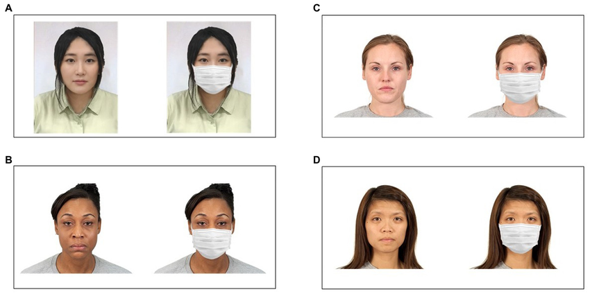

# Exercise: Face Mask Detection with CNN



In this exercise, you will build a Convolutional Neural Network (CNN) to classify whether a person is wearing a face mask or not. You will use the [Face Mask Dataset](https://www.kaggle.com/datasets/omkargurav/face-mask-dataset?utm_source).

## Objective

Train a CNN model that can identify if a person in an image **wears a mask** or **does not wear a mask**

## Steps

### 1. Import Libraries

```python
import tensorflow as tf
from tensorflow.keras.preprocessing.image import ImageDataGenerator
import matplotlib.pyplot as plt
```

### 2. Load Dataset

The dataset from Kaggle has two main folders: `with_mask` and `without_mask`

### 3. Build CNN Model

### 4. Train the Model

5## 6. Test with New Images

```python
import numpy as np
from tensorflow.keras.preprocessing import image

img_path = "path_to_test_image.jpg"
img = image.load_img(img_path, target_size=(128, 128))
img_array = image.img_to_array(img) / 255.0
img_array = np.expand_dims(img_array, axis=0)

prediction = model.predict(img_array)

if prediction[0][0] > 0.5:
    print("No Mask Detected")
else:
    print("Mask Detected")
```

## Task

1. Download the dataset from Kaggle
2. Follow the steps above to train the CNN model
3. Test the model with your own face images (with and without mask)
4. Report the accuracy and show 2–3 predictions with images

**Submission email**: [pythonai250824+cnnhw@gmail.com](mailto:pythonai250824+cnnhw@gmail.com)