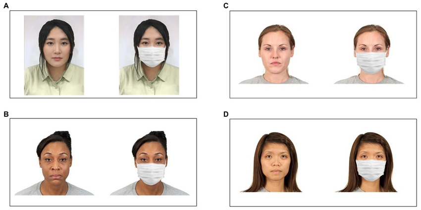

# Exercise: Face Mask Detection with CNN



In this exercise, you will build a Convolutional Neural Network (CNN) to classify whether a person is wearing a face mask or not. You will use the [Face Mask Dataset](https://www.kaggle.com/datasets/omkargurav/face-mask-dataset?utm_source)

## Objective

Train a CNN model that can identify if a person in an image **wears a mask** or **does not wear a mask**

follow the steps we did in class <a href="Jf-CNN-ex.md">See here</a>

colab file: <a href="https://colab.research.google.com/drive/1tqiJxNiY7m2fgAYr6BzDdkM6PUOCkKlY?usp=sharing">colab link</a>

## Steps

### 1. Import Libraries

### 2. Load Dataset

The dataset from Kaggle has two main folders: `with_mask` and `without_mask`

### 3. Build CNN Model

### 4. Train the Model

## 5. Test with New Images

```python
...

prediction = model.predict(test_image)

if prediction[0][0] > 0.5:
    print("No Mask Detected")
else:
    print("Mask Detected")
```

## Task

1. Download the dataset from Kaggle
2. Follow the steps above to train the CNN model
3. Test the model with your own face images (with and without mask)
4. Report the accuracy and show 2–3 predictions with images

**Submission email**: [pythonai250824+cnnhw@gmail.com](mailto:pythonai250824+cnnhw@gmail.com)