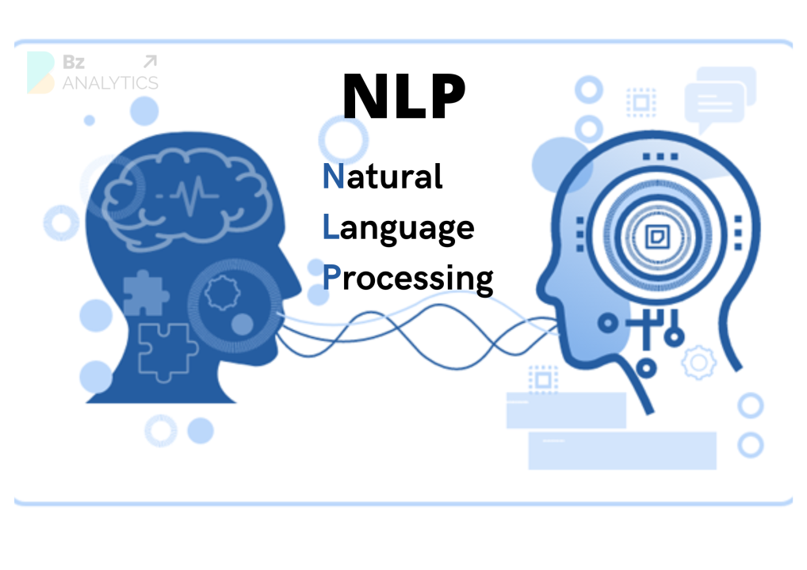

## עיבוד שפה טבעית (NLP - Natural Language Processing)

עיבוד שפה טבעית הוא תחום בתוך אינטיליגנציה מלאכותית שמטרתו לגרום למחשב להבין שפה אנושית.  
המחשב לא רק קורא מילים אלא לומד את המשמעות וההקשר שלהן.  
עיבוד שפה טבעית מאפשר למחשב לזהות מבנה תחבירי, להבין משמעויות כפולות ולהגיב בהתאם להקשר.  
המטרה היא לגרום למחשב לנהל שיחה, לנתח טקסט או לתרגם שפה בצורה שדומה ליכולת אנושית.  
במקום שנכתוב קוד עם חוקים נוקשים, המחשב לומד מתוך טקסטים אמיתיים איך אנשים מדברים וכותבים.  
המערכת מסוגלת להבין האם משפט מסוים מביע רגש, כוונה או בקשה.  
היא גם יודעת להבחין בין שמות, פעלים, מקומות, מספרים ותאריכים.  
עיבוד שפה טבעית משמש כמעט בכל מערכת חכמה שצריכה להבין טקסט או דיבור

### רכיבי עיבוד שפה

**מורפולוגיה** – מבנה פנימי של מילים  

דוגמה: המילה "הולכים" בנויה מהשורש ה.ל.ך, עם תחילית "ה" וסיומת רבים "ים"

**תחביר (סינטקס)** – איך מילים מתחברות למשפט תקני  

דוגמה: במשפט "החתול רדף אחרי הכלב", התחביר מציין שהחתול הוא הנושא והכלב הוא המושא

**סמנטיקה** – משמעות המילים במשפט  

דוגמה: המילה "טיסה" יכולה להתכוון לפעולה של לטוס או למספר הטיסה – תלוי בהקשר

**פרגמטיקה** – משמעות לפי הקשר  

דוגמה: אם מישהו שואל "יש לך אש?" ברחוב – הוא כנראה מתכוון למצית ולא לאש פיזית

## שימושים נפוצים ב־NLP

* 🗣️ עוזרות קוליות כמו Siri ו־Alexa משתמשות ב־NLP להבנת פקודות  
* 💬 צ'אטבוטים עונים אוטומטית לשאלות  
* 🚫 סינון תוכן פוגעני ברשתות  
* 🏥 ניתוח רשומות רפואיות  
* 💰 תחום הפיננסים – ניתוח רגשות בטקסטים כמו חדשות או פוסטים ברשת לזיהוי מגמות שוק

## משימות עיקריות

✂️ טוקניזציה (Tokenization)  
פירוק משפטים למילים  
דוגמה: "אני אוהב NLP" → ["אני", "אוהב", "NLP"]

🏷️ תיוג תחבירי (POS Tagging)  
מציין מה סוג כל מילה – פועל, שם עצם, תואר וכו’  
דוגמה: במשפט "הילדה שרה שיר יפה"  
תקבל: הילדה = NOUN, שרה = VERB, שיר = NOUN, יפה = ADJ

🧠 זיהוי ישויות (NER)  
זיהוי שמות של אנשים, מקומות, ארגונים וסכומים  
דוגמה: "מיקרוסופט רכשה סטארטאפ בתל אביב ב־100 מיליון דולר"  
תקבל: מיקרוסופט = ORG, תל אביב = GPE, 100 מיליון דולר = MONEY

😊 ניתוח סנטימנט  
בדיקת הרגש בטקסט – שלילי, חיובי או נייטרלי  
דוגמה: "השירות היה מהיר ומעולה" → סנטימנט חיובי  
"דפקו אותי ממש היום" → סנטימנט שלילי

📝 סיכום טקסט  
יצירת תקציר ממסמך ארוך  
דוגמה: מתוך מאמר של 3 פסקאות על איכות סביבה, התקציר יהיה  
"המאמר מדגיש את החשיבות בצמצום פליטת גזי חממה ושמירה על משאבי טבע"

## אתגרים בעיבוד שפה

* 🌀 דו־משמעות – מילים עם פירושים שונים לפי הקשר  
* 😵 מורכבות השפה – שגיאות, סלנג, אירוניה  
* 🌍 חוסר דאטה לשפות נדירות
