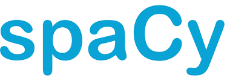

## ספריית spaCy

ספריית קוד פתוח לעיבוד שפה טבעית שפותחה על ידי חברת Explosion   
הגרסה הראשונה שוחררה בשנת 2015 והיא הפכה מהר מאוד לאחת מהספריות הפופולריות ביותר בתחום ה־NLP
מה שמייחד את spaCy זה השילוב בין דיוק גבוה, מהירות ביצוע ותמיכה עמוקה בשפות רבות  
היא נבנתה מראש לשימושים תעשייתיים ולא רק לניסויים אקדמיים – וזה מורגש בכל שורה של קוד

### 🚀 מה יש בה

**טוקניזציה חכמה שמתחשבת בסימני פיסוק, קיצורים ושפות שונות**

  דוגמה: המשפט 
  "I can't believe it's already 5 p.m.!" 

  יתפצל לטוקנים כמו:  
  ["I", "ca", "n't", "believe", "it", "'s", "already", "5", "p.m.", "!"]

**תיוג תחבירי (POS Tagging) מדויק לפי מודלים מוכנים מראש**

  דוגמה: במילה run  
  במשפט I run daily → run = VERB  
  במשפט I went for a run → run = NOUN

**ניתוח תלות תחבירית (Dependency Parsing) – להבין את מבנה המשפט**

  דוגמה: במשפט "The cat sat on the mat"  
  spaCy מזהה ש־"cat" הוא נושא ו־"sat" הוא הפועל הראשי

**זיהוי ישויות (NER) כמו שמות, מקומות, סכומים, תאריכים ועוד**

  דוגמה: "Google bought Waze in 2013 for $1 billion"  
  Google = ORG, Waze = ORG, 2013 = DATE, $1 billion = MONEY

**למיטיזציה – המרת מילים לצורתן הבסיסית (goes → go)**

  דוגמה: "running", "ran", "runs" → כולם יוחזרו כ־"run"

**🔍 ההבדל בין Stemming ל־Lemmatization**

ה- Stemming

* מקצר מילה לשורש **באופן גס**  
* פשוט ומהיר – רק חותך סיומות או התחלה  
* לא מתחשב בהקשר או במשמעות  
* עלול להחזיר תוצאה לא נכונה מבחינה דקדוקית

דוגמה:

* "running", "ran", "runner" → `run` או אפילו `ru`

💡 מתאים כשצריך עיבוד מהיר מאוד, גם במחיר של חוסר דיוק

ה- Lemmatization

* מחזיר את **צורת היסוד התקנית** של מילה (lemma)  
* מתחשב **בהקשר התחבירי והמשמעותי** של המילה  
* מדויק יותר אך דורש יותר זמן חישוב

דוגמה:

* "better" → `good`  
* "running", "ran" → `run`  
* "was" → `be`

💡 מתאים כשחשוב לשמור על משמעות נכונה ומדויקת

**סיכום ההבדל**

| תכונה              | סטמינג            | למיטיזציה         |
|--------------------|---------------------|------------------------|
| מהירות             | מהיר מאוד           | איטי יותר             |
| דיוק               | נמוך                | גבוה                  |
| מבוסס הקשר         | ❌ לא                | ✅ כן                  |
| תוצאה דקדוקית תקינה | לא תמיד             | כן                     |
| דוגמה: "was"       | `wa` או `was`       | `be`                  |

**תמיכה ב־מודלים מוכנים מראש בשפות שונות**

  דוגמה: אפשר לטעון מודל כמו `fr_core_news_sm` לצרפתית ולעשות ניתוח של טקסט בצרפתית

**נושא Phrase Matching**

יכולות התאמה חכמות כמו  דוגמה: לזהות את הביטוי "solar power" גם אם הוא מופיע כ־"solar-power" או "SolarPower"

**כלים לוויזואליזציה דרך displaCy להצגת מבנה תחבירי וישויות**

דוגמה: הצגה גרפית של הקשרים תחביריים בין מילים במשפט בתוך

"Jennifer drove to Seattle to see the Mariners."

  

  **המשפט המלא:**  
Jennifer drove to Seattle to see the Mariners.

**Jennifer** → `PROPN` – Proper Noun  
  שם עצם פרטי. מייצג שם של אדם מסוים ולא סתם תיאור כללי

**drove** → `VERB` – Verb  
  פועל. מתאר פעולה – במקרה הזה: נהיגה

**to** → `ADP` – Adposition  
  מילות יחס. מקשרות בין הפועל לבין יעד או מקום

**Seattle** → `PROPN` – Proper Noun  
  שם עצם פרטי. שם של עיר מסוימת

**to** → `PART` – Particle  
  חלקיק שמציין תחילית של פועל – כמו "to see"

**see** → `VERB` – Verb  
  פועל שמתאר את מטרת הפעולה – לראות משהו

**the** → `DET` – Determiner  
  מילה שמקדימה שם עצם ומגדירה אותו (כמו "the" באנגלית)

**Mariners** → `PROPN` – Proper Noun  
  שם של קבוצת בייסבול אמריקאית – שם עצם פרטי

**עבודה חלקה עם TensorFlow, PyTorch ו־Keras**

  דוגמה: שימוש בפלט של spaCy להזנת נתוני טקסט למודל למידה עמוקה מותאם אישית

### 🤓 מה אין בה

* אין Stemming מובנה – בשביל זה צריך להשתמש ב־NLTK  
* פחות מתאימה ללמידת שפה מאפס – מיועדת בעיקר לשימוש מודלים קיימים

**מה זה Stemming**

שיטה בעיבוד שפה טבעית שמטרתה לקצר מילים לשורש הבסיסי שלהן  
המטרה היא להתעלם מהטיות שונות של אותה מילה ולזהות את המשמעות הבסיסית שלה

דוגמה:

* running  
* runner  
* ran  
* runs  

אחרי Stemming → כולן יהפכו ל־`run`  ל־

למה זה שימושי

* מאפשר לחפש טקסטים לפי משמעות ולא רק לפי מילה מדויקת  
* מפשט את הווקטור של המילים – חשוב כשעובדים עם דאטה גדול  
* עוזר להשוות בין מילים עם אותה משמעות אך בצורה שונה

**מה זה NLTK  Natural Language Toolkit**

 ספריית פייתון עוצמתית לעיבוד שפה טבעית  
היא קיימת משנת 2001 ומשמשת בעיקר באקדמיה, מחקר ולימוד

מה יש בה?

* טוקניזציה (Tokenization)  
* תיוג תחבירי (POS Tagging) 
* Stemming  
* למיטיזציה  
* ניתוח תחבירי: ניתוח תחבירי בודק את **המבנה הדקדוקי של משפט** – כלומר, איך המילים מתחברות זו לזו  
המחשב מזהה מי הנושא, מי הפועל, מה המושא, אילו תיאורים יש ועוד
* קורפוסים מוכנים מראש

**קורפוס (Corpus)** הוא אוסף גדול של טקסטים – כמו ספרים, כתבות, ציוצים, דיאלוגים ועוד  
קורפוסים כאלה משמשים לאימון מודלים, בדיקות, תרגול או ניתוח

כוללת קורפוסים מוכנים מראש – לדוגמה:

* `gutenberg` – ספרים קלאסיים באנגלית  
* `movie_reviews` – ביקורות קולנוע  
* `inaugural` – נאומי השבעה של נשיאי ארה״ב

💡 אפשר להשתמש בקורפוסים כדי לאמן מודלים, לבדוק רעיונות, או ללמוד איך טקסטים בנויים

למה להשתמש בה?

בעוד ש־**spaCy** מתאימה למערכות תעשייתיות עם ביצועים גבוהים  
**NLTK** מתאימה לניסויים, חקירה ולימוד של טקסטים באופן גמיש ומעמיק

💡 ב־spaCy אין Stemming מובנה – בשביל זה צריך להשתמש ב־NLTK או בספריות אחרות כמו Snowball או Porter

### 🧠 למה לבחור דווקא spaCy

* מאוד מהירה – גם על טקסטים ארוכים  
* נוחה לשימוש – כתיבה פשוטה ואינטואיטיבית  
* מדויקת – המודלים שלה נחשבים לאיכותיים מאוד  
* פתוחה לקסטומיזציה – אפשר להוסיף ישויות, כללים, מודלים משלך

💡 בקיצור – אם אתה רוצה לעבוד עם טקסט אמיתי בפייתון, מהר ובלי כאב ראש – spaCy זו הבחירה שלך

### יתרונות

* תומכת במודלים מוכנים מראש  
* פועלת עם PyTorch, TensorFlow ו־Keras  
* כוללת ויזואליזציה דרך displaCy

