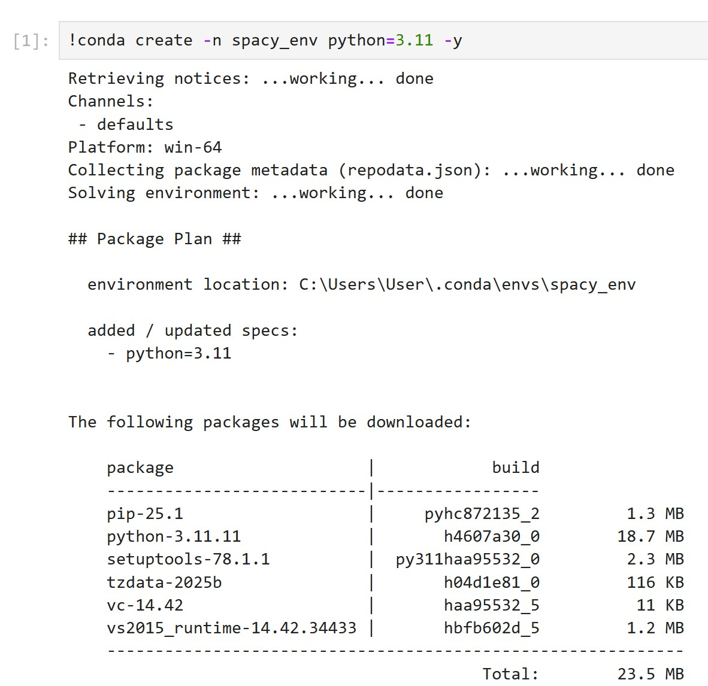
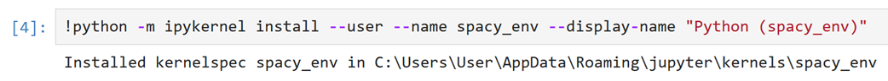
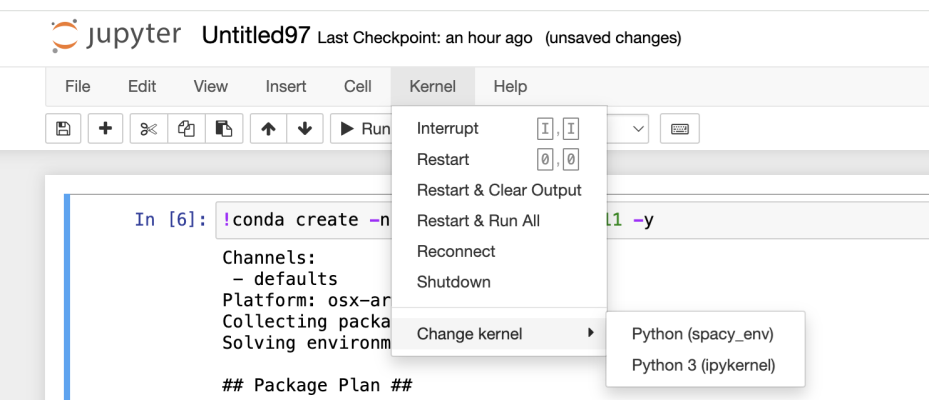
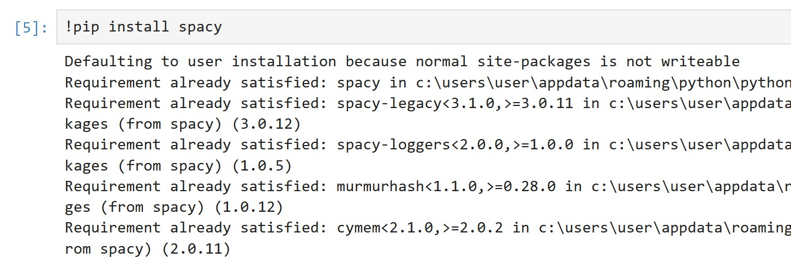
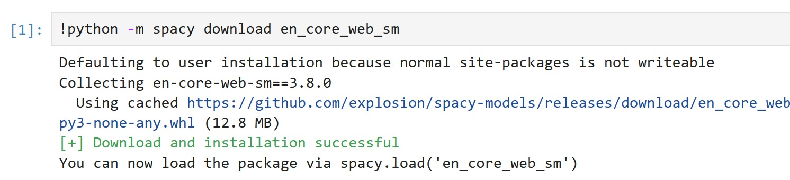
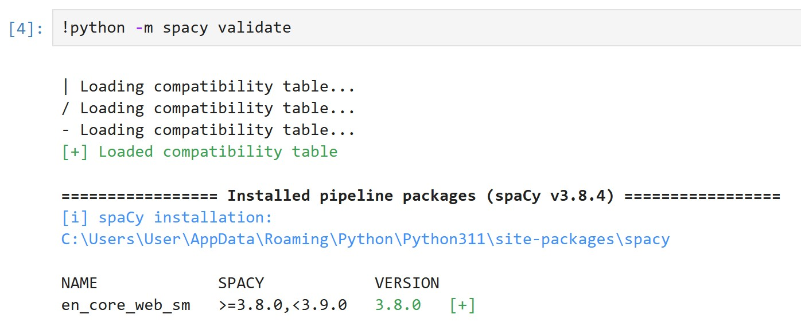
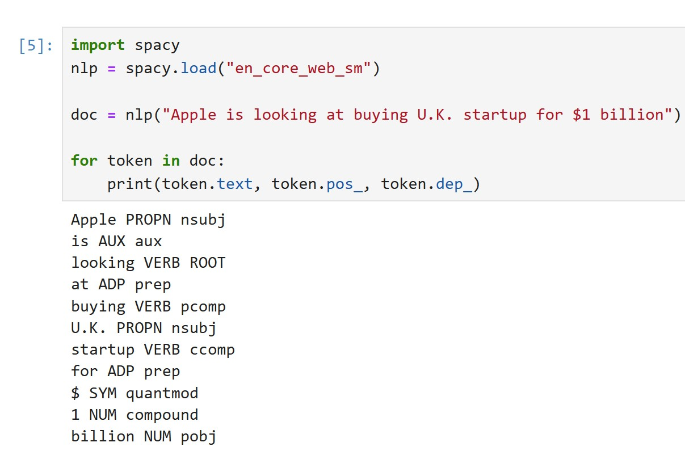

## התקנת spaCy

### שלבים

### פתח את ה- Jupyter


### יצירת סביבה חדשה של פייתון

```python
!conda create -n spacy_env python=3.11 -y
```

Output:


 
### התקנת חבילת ipykernel חדש
```python
!conda install -n spacy_env ipykernel -y
```

Output:


```python
!python -m ipykernel install --user --name spacy_env --display-name "Python (spacy_env)"
```

Output:



🔹 זה יוצר סביבת עבודה חדשה בשם spacy_env – אבל עדיין לא פועלת

🔹 זה אומר ליופיטר: "היי, יש לי סביבת קוד חדשה, תוכל להוסיף אותה לרשימת הקרנלים שלך"

🔹 עדיין לא צריך לעבור אליה – אנחנו רק רושמים אותה כמוכנה


### מעבר לקרנל החדש



#### Install spaCy  

```python
!pip install spacy
```

Output:



###  הורדת מודל שפה באנגלית

🔹 עכשיו אתה מוריד את מודל השפה לתוך הסביבה שבה תעבוד

```python
!python -m spacy download en_core_web_sm
```

Output:



```python
!python -m spacy validate
```

Output:



💡 לעבור לסביבה החדשה דרך Kernel → Change kernel

## מודל שפה `en_core_web_sm`

* `en` – אנגלית  
* `core` – שימוש כללי  
* `web` – דאטה מהאינטרנט  
* `sm` – גרסה קלה ומהירה

## דוגמת קוד ראשונית

```python
import spacy
nlp = spacy.load("en_core_web_sm")

# The model response is a SpaCy Doc object
doc = nlp("Apple is looking at buying U.K. startup for $1 billion")

for token in doc:
    print(token.text, token.pos_, token.dep_)
```

Output:



הסבר בעמוד הבא...