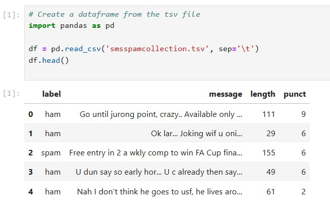

# NLP SPAM DETECTION

## דוגמא בפייתון לגילוי ספאם

בדוגמה הזו נשתמש בקובץ `smsspamcollection.tsv`

הקובץ מכיל נתונים על הודעות אימייל, כולל תוכן ההודעה, האורך שלה וסימני הפיסוק שבה

בנוסף, הקובץ כולל תווית עבור כל הודעה – `ham` (אימייל לגיטימי) או `spam` (אימייל זבל)

המטרה שלנו היא להשתמש במודל למידה מונחית כדי לחזות האם אימיילים עתידיים יסווגו כ־`spam` או לא



```python
      df.count() = 5,572 rows
```


בשלב זה אנו מפרידים את הנתונים לשני חלקים:
- קבוצת **אימון** – משמשת לאימון המודל (במקרה הזה 70% מהנתונים)
- קבוצת **בדיקה** – משמשת לבדוק את ביצועי המודל על טקסטים שהוא לא ראה (30%)

ההפרדה הזו חשובה כדי לוודא שהמודל לא רק "שינן" את הנתונים, אלא באמת למד לזהות דפוסים כלליים


## Python code

```python
# Create a dataframe from the tsv file
import pandas as pd

df = pd.read_csv('smsspamcollection.tsv', sep='\t')
df.head()

# Count how many 'ham' and 'spam' emails we have in the dataset
df['label'].value_counts()

# Perform regular train/test split on our data
from sklearn.model_selection import train_test_split

X = df['message']
y = df['label']

X_train, X_test, y_train, y_test = train_test_split(X, y, test_size=0.3, random_state=101)

from sklearn.pipeline import Pipeline

svc_pipeline = Pipeline([('tfidf', TfidfVectorizer()),
                       ('svc', LinearSVC())
                      ])

svc_pipeline.fit(X_train, y_train)

predictions = svc_pipeline.predict(X_test)
predictions

from sklearn import metrics

print(metrics.confusion_matrix(y_test, predictions))
print()
print(metrics.classification_report(y_test, predictions))
print()
print(metrics.accuracy_score(y_test, predictions))

svc_pipeline.predict([
   "TEXT WON to 12345 to get your prize, you have been selected as WINNER!!"
])

svc_pipeline.predict(["Hey Tom, how are you today?"])
```