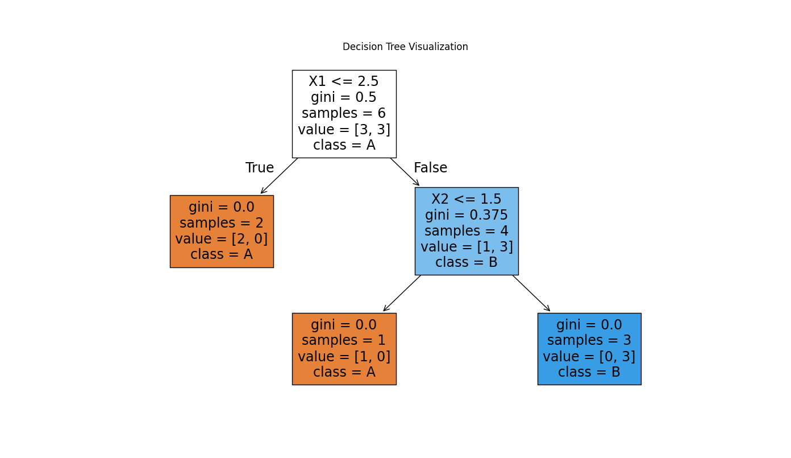

# Gini Impurity בעצי החלטה
  
## מהו Gini Impurity?
  
Gini Impurity (אי-טוהר ג'יני)
  
  מדד המשמש באלגוריתמים של עצי החלטה כדי לקבוע כיצד לפצל את הנתונים בצורה אופטימלית. המדד מודד את ההסתברות שפריט שנבחר באקראי מקבוצה יתויג בצורה שגויה אם התיוג נעשה לפי התפלגות התוויות באותה קבוצה.
  
במילים פשוטות, Gini Impurity מודד כמה "טהור" או "הומוגני" הוא צומת בעץ - האם הוא מכיל בעיקר דגימות מקטגוריה אחת או תערובת של כמה קטגוריות
  
## למה צריך את Gini Impurity?
  
בעצי החלטה, אנחנו צריכים קריטריון לקבוע:
1. **באיזה משתנה (feature) להשתמש** לפיצול הנתונים
2. **באיזה ערך סף (threshold)** לבצע את הפיצול
  
אי-טוהר ג'יני עוזר לנו לענות על שאלות אלו מהסיבות הבאות:
  
1. **קריטריון לפיצול אופטימלי**: הוא מאפשר לאלגוריתם להעריך איזה פיצול יוביל לקבוצות טהורות יותר של נתונים
2. **מדידת שיפור**: באמצעות השוואת ה-Gini Impurity לפני ואחרי פיצול אפשרי, האלגוריתם יכול לחשב את ה"רווח המידע" ולבחור את הפיצול שמייצר את הירידה הגדולה ביותר באי-טוהר
3. **מניעת התאמת יתר (overfitting)**: שימוש במדד זה מוביל לפיצולים בעלי משמעות במקום פיצולים שרירותיים
4. **יעילות חישובית**: חישוב Gini Impurity מהיר יחסית לעומת מדדים אחרים
  
## הנוסחה של Gini Impurity
  
הנוסחה המתמטית של Gini Impurity היא:
  
<p align="center"></p>  
  
  
כאשר:
- **Q** מסמל צומת מסוים בעץ ההחלטה
- **G(Q)** הוא ערך ה-אי-טוהר ג'יני של אותו צומת Q
- **C** הוא קבוצת הקטגוריות (מחלקות) בצומת
- **** הוא ההסתברות שאובייקט בצומת משתייך לקטגוריה c
- **** הוא ההסתברות שאובייקט בצומת לא משתייך לקטגוריה c
- **** מסמל סכימה על כל הקטגוריות בצומת Q
  
נוסחה שקולה נוספת שמשתמשים בה לעתים קרובות:
  
<p align="center"></p>  
  
  
לסיווג בינארי (שתי קטגוריות בלבד), הנוסחה מתפשטת ל:
  
<p align="center"></p>  
  
  
## חישוב Gini Impurity - דוגמה
  
נניח שיש לנו קבוצת נתונים עם 10 דגימות:
- 7 דגימות שייכות לקטגוריה A
- 3 דגימות שייכות לקטגוריה B
  
נחשב את Gini Impurity של הצומת:
  
<p align="center"></p>  
  
<p align="center"></p>  
  
<p align="center"></p>  
  
<p align="center"></p>  
  
  
ערך זה (0.42) מעיד על כך שהצומת אינו טהור לחלוטין. 
- כאשר G(Q) = 0, הצומת טהור לחלוטין (כל הדגימות שייכות לאותה קטגוריה)
- כאשר G(Q) = 0.5 (בסיווג בינארי), הצומת בעל אי-טוהר מקסימלי (חלוקה שווה בין הקטגוריות)
  
## חישוב Gini Impurity בעץ החלטה
  
נניח שיש לנו מערכת נתונים פשוטה עם שני מאפיינים (X1, X2) וקטגוריה יעד (Y) כפי שמוצג בטבלה:
  
| X1 | X2 | Y |
|----|----|----|
| 1  | 3  | A  |
| 2  | 1  | A  |
| 3  | 2  | B  |
| 4  | 3  | B  |
| 5  | 1  | A  |
| 6  | 2  | B  |
  
נחשב את Gini Impurity של הצומת השורש:
- 3 דגימות מקטגוריה A (p_A = 3/6 = 0.5)
- 3 דגימות מקטגוריה B (p_B = 3/6 = 0.5)
  
<p align="center"></p>  
  
  
  
 #### חישוב Gini של השורש (Root)
  
סופרים כמה מכל קטגוריה:
  
- A: 3 דגימות → <p align="center"></p>  
  
- B: 3 דגימות → <p align="center"></p>  
  
  
נחשב Gini impurity בשורש:
  
<p align="center"></p>  
  
  
**✂️ נבחן פיצול לפי X1 <= 3**
  
####  קבוצה שמאלית (X1 <= 3):
  
- דגימות: (1,A), (2,A), (3,B)  
- A: 2 מתוך 3 → <p align="center"></p>  
  
  
<p align="center"></p>  
  
  
####  קבוצה ימנית (X1 > 3):
  
- דגימות: (4,B), (5,A), (6,B)  
- A: 1 מתוך 3 → <p align="center"></p>  
  
  
<p align="center"></p>  
  
  
#### חישוב Gini הכולל לאחר הפיצול:
  
<p align="center"></p>  
  
  
#### רווח (Gain) מהפיצול:
  
<p align="center"></p>  
  
  
####  ✂️ נבחן פיצול לפי X2 <= 2
  
**קבוצה שמאלית (X2 <= 2):**
  
- דגימות: (2,A), (3,B), (5,A), (6,B)  
- A: 2, B: 2 → <p align="center"></p>  
  
  
<p align="center"></p>  
  
  
**קבוצה ימנית (X2 > 2):**
  
- דגימות: (1,A), (4,B)  
- A: 1, B: 1 → <p align="center"></p>  
  
  
<p align="center"></p>  
  
  
### Gini משוקלל:
  
<p align="center"></p>  
  
  
### רווח:
  
<p align="center"></p>  
  
  
#### ✅ מסקנה:
  
- הפיצול לפי **X1** מפחית את Gini ל-0.44 → רווח (Gain) של **0.06**
- הפיצול לפי **X2** לא משפר את Gini כלל
  
🔮 לכן עדיף לפצל לפי **X1 ≤ 3**
  
---
  
## כיצד Gini Impurity עוזר בבניית עץ החלטה
  
תהליך בניית עץ החלטה באמצעות Gini Impurity כולל את השלבים הבאים:
  
1. **חישוב Gini Impurity של הצומת הנוכחי**
2. **עבור כל מאפיין אפשרי**:
   - עבור כל נקודת פיצול אפשרית במאפיין:
     - פיצול הנתונים
     - חישוב Gini Impurity המשוקלל של צמתי הבנים הנוצרים
     - חישוב הרווח (Gini Gain)
3. **בחירת המאפיין ונקודת הפיצול** שמספקים את הרווח המקסימלי
4. **יצירת צמתי בנים** באמצעות הפיצול הזה
5. **חזרה על התהליך באופן רקורסיבי** על כל צומת בן עד שמתקיים קריטריון עצירה
  
היתרונות של שימוש ב-Gini Impurity:
  
1. **בחירת פיצולים אופטימליים**: עוזר לבחור פיצולים שמפרידים את הקטגוריות בצורה טובה
2. **שיפור הדיוק**: מוביל לפיצולים שמשפרים את יכולת החיזוי של העץ
3. **בניית עץ מאוזן**: עוזר בבניית עץ שאינו נוטה יותר מדי לכיוון קטגוריה מסוימת
4. **שליטה בגודל העץ**: ניתן להגדיר סף מינימלי לרווח (Gini Gain) כדי למנוע פיצולים מיותרים
  
## סיכום
  
אי-טוהר ג'יני הוא כלי חשוב באלגוריתמים של עצי החלטה שעוזר לקבוע כיצד לפצל את הנתונים באופן אופטימלי. הוא מודד את מידת האי-טוהר של צומת ומאפשר השוואה בין פיצולים שונים כדי לבחור את הטוב ביותר.
  
המדד משתלב בתהליך הבנייה של עץ ההחלטה ומוביל ליצירת עץ שמפריד את הקטגוריות ביעילות ומשפר את הדיוק של המודל. ככל שערך ה-Gini Impurity קטן יותר, כך הצומת טהור יותר וההבדלה בין הקטגוריות טובה יותר.
  
<a id="example" >--</a>
# דוגמא בפייטון

נניח שיש לנו מערכת נתונים פשוטה עם שני מאפיינים (X1, X2) וקטגוריה יעד (Y) כפי שמוצג בטבלה:
  
| X1 | X2 | Y |
|----|----|----|
| 1  | 3  | A  |
| 2  | 1  | A  |
| 3  | 2  | B  |
| 4  | 3  | B  |
| 5  | 1  | A  |
| 6  | 2  | B  |



```python
from sklearn.tree import DecisionTreeClassifier
from sklearn.metrics import accuracy_score, precision_score, recall_score, f1_score, confusion_matrix, classification_report
import numpy as np

# Data
X = np.array([
    [1, 3],
    [2, 1],
    [3, 2],
    [4, 3],
    [5, 1],
    [6, 2]
])

y = np.array(['A', 'A', 'B', 'B', 'A', 'B'])

# Model
clf = DecisionTreeClassifier(criterion='gini', random_state=42)
clf.fit(X, y)

# Predictions
y_pred = clf.predict(X)

# Metrics
accuracy = accuracy_score(y, y_pred)
precision = precision_score(y, y_pred, average='macro')
recall = recall_score(y, y_pred, average='macro')
f1 = f1_score(y, y_pred, average='macro')
cm = confusion_matrix(y, y_pred)
report = classification_report(y, y_pred)

print("Accuracy:", accuracy)
print("Precision (macro):", precision)
print("Recall (macro):", recall)
print("F1 Score (macro):", f1)
print("Confusion Matrix:\n", cm)
print("Classification Report:\n", report)
```

Output:
```
Accuracy: 1.0
Precision (macro): 1.0
Recall (macro): 1.0
F1 Score (macro): 1.0
Confusion Matrix:
 [[3 0]
  [0 3]]
Classification Report:
               precision    recall  f1-score   support

           A       1.00      1.00      1.00         3
           B       1.00      1.00      1.00         3

    accuracy                           1.00         6
   macro avg       1.00      1.00      1.00         6
weighted avg       1.00      1.00      1.00         6
```

1. **Accuracy (דיוק)**  
   - אחוז התחזיות הנכונות מתוך כלל התחזיות  
   - מתאים כשיש **איזון** בין הקטגוריות

2. **Precision (דיוק חיובי)**  
   - כמה מתוך התחזיות שהיו **חיוביות** היו נכונות  
   - חשוב כשעלות של **False Positives** גבוהה

3. **Recall (רגישות)**  
   - כמה מתוך כל המקרים **החיוביים האמיתיים** זוהו נכון  
   - חשוב כשעלות של **False Negatives** גבוהה

4. **F1 Score**  
   - ממוצע הרמוני של **Precision** ו-**Recall**  
   - טוב כשיש **אי-איזון** בין הקטגוריות

   ממוצע הרמוני שווה למספר המספרים חלקי סכום ההופכיים שלהם

5. **Confusion Matrix**  
   - טבלה שמציגה את מספר התחזיות בכל קטגוריה: True Positives, False Positives, True Negatives, False Negatives

