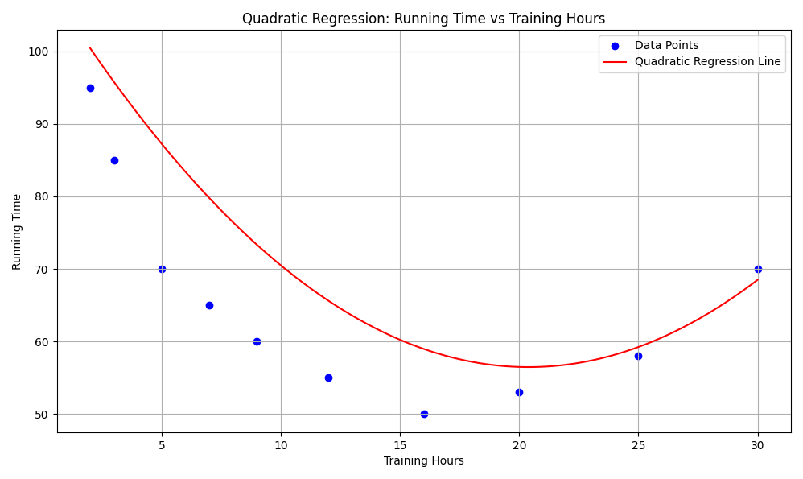

# רגרסיה פולינומיאלית

## הבעיה שרוצים לפתור

רגרסיה פולינומיאלית היא הרחבה של רגרסיה לינארית המאפשרת לנו למצוא קשרים לא-לינאריים בין משתנים. בעוד שרגרסיה לינארית מניחה שהקשר בין המשתנים הוא קו ישר, רגרסיה פולינומיאלית מאפשרת לנו למדל יחסים מורכבים יותר באמצעות פולינומים.

**דוגמה**: נניח שאנו חוקרים את הקשר בין שעות אימון של ספורטאים לבין הביצועים שלהם במירוץ. בניגוד לרגרסיה לינארית, רגרסיה פולינומיאלית לוקחת בחשבון שהשיפור בביצועים אינו בהכרח ליניארי - לאחר מספר שעות אימון מסוים, ייתכן שהתועלת השולית פוחתת או שיש אפילו ירידה בביצועים בגלל עייפות יתר.

נניח שיש לנו נתונים היסטוריים של ספורטאים שהתאמנו מספר שעות שבועי מסוים והשיגו זמני ריצה שונים (בשניות, כאשר זמן נמוך יותר = ביצוע טוב יותר):

| שעות אימון שבועיות | זמן ריצה (שניות) |
|---------------------|-------------------|
| 2                   | 95                |
| 3                   | 85                |
| 5                   | 70                |
| 7                   | 65                |
| 9                   | 60                |
| 12                  | 55                |
| 16                  | 50                |
| 20                  | 53                |
| 25                  | 58                |
| 30                  | 70                |

אנו יכולים לראות שזמני הריצה משתפרים (יורדים) עם הגידול בשעות האימון עד לנקודה מסוימת, אך לאחר מכן מתחילים לעלות שוב. רגרסיה פולינומיאלית יכולה לעזור לנו למצוא את נקודת האופטימום ולחזות ביצועים על סמך שעות אימון.

## Mathematical Formula and Complete Calculation

Polynomial regression extends the linear model by including polynomial terms. The polynomial regression equation of degree n is:

$$y = \beta_0 + \beta_1 x + \beta_2 x^2 + \beta_3 x^3 + ... + \beta_n x^n + \epsilon$$

Where:
- $y$ is the dependent variable (in our case: running time)
- $x$ is the independent variable (in our case: training hours)
- $\beta_0, \beta_1, \beta_2, ..., \beta_n$ are the coefficients
- $\epsilon$ is the error term

For simplicity, let's focus on a quadratic model (polynomial of degree 2):

$$y = \beta_0 + \beta_1 x + \beta_2 x^2 + \epsilon$$

### Matrix Formulation

While we can solve this using the normal equations as we did for linear regression, for polynomial regression it's more common to use a matrix approach. We transform our original data by creating additional features for the polynomial terms, and then use the standard linear regression solution:

$$\beta = (X^T X)^{-1} X^T y$$

Where:
- $X$ is the design matrix with columns for each polynomial term
- $y$ is the vector of target values
- $\beta$ is the vector of coefficients

For our quadratic model, the design matrix $X$ looks like:

$$X = \begin{bmatrix} 
1 & x_1 & x_1^2 \\
1 & x_2 & x_2^2 \\
\vdots & \vdots & \vdots \\
1 & x_n & x_n^2
\end{bmatrix}$$

### Calculation for Our Example

Let's calculate a quadratic polynomial regression for our training-performance data:

| Training Hours ($x_i$) | Running Time ($y_i$) | $x_i^2$ | $x_i \cdot y_i$ | $x_i^2 \cdot y_i$ |
|------------------------|----------------------|---------|----------------|--------------------|
| 2                      | 95                   | 4       | 190            | 380                |
| 3                      | 85                   | 9       | 255            | 765                |
| 5                      | 70                   | 25      | 350            | 1750               |
| 7                      | 65                   | 49      | 455            | 3185               |
| 9                      | 60                   | 81      | 540            | 4860               |
| 12                     | 55                   | 144     | 660            | 7920               |
| 16                     | 50                   | 256     | 800            | 12800              |
| 20                     | 53                   | 400     | 1060           | 21200              |
| 25                     | 58                   | 625     | 1450           | 36250              |
| 30                     | 70                   | 900     | 2100           | 63000              |
| $\sum x_i = 129$ | $\sum y_i = 661$ | $\sum x_i^2 = 2493$ | $\sum x_i y_i = 7860$ | $\sum x_i^2 y_i = 152110$ |

For a quadratic model, we need to solve the following system of equations:

1. $\sum y_i = \beta_0 n + \beta_1 \sum x_i + \beta_2 \sum x_i^2$
2. $\sum x_i y_i = \beta_0 \sum x_i + \beta_1 \sum x_i^2 + \beta_2 \sum x_i^3$
3. $\sum x_i^2 y_i = \beta_0 \sum x_i^2 + \beta_1 \sum x_i^3 + \beta_2 \sum x_i^4$

This system is more complex than for linear regression and is best solved using matrix operations in practice. Using statistical software or libraries, we would get approximately:

$\beta_0 \approx 110.5$
$\beta_1 \approx -5.3$
$\beta_2 \approx 0.13$

<a href="polynomial-regression-math.md">see detailed explanation</a>

Therefore, our polynomial regression equation would be:

$$y = 110.5 - 5.3x + 0.13x^2$$

This equation describes a U-shaped parabola, which matches our intuition about the relationship between training hours and performance.

### Finding the Optimal Training Hours

To find the optimal number of training hours (the minimum of the parabola), we differentiate the equation with respect to x and set it equal to zero:

$$\frac{dy}{dx} = -5.3 + 0.26x = 0$$

Solving for x:

$$0.26x = 5.3$$
$$x = \frac{5.3}{0.26} \approx 20.4$$

According to our model, the optimal number of training hours is about 20.4 hours per week, which would yield the best performance (minimum running time).

## גרף



הגרף מראה את התאמת הרגרסיה הפולינומיאלית (הקו האדום) לנתונים שלנו (הנקודות הכחולות). אפשר לראות שהמודל הפולינומיאלי מצליח לתפוס את המגמה הלא-לינארית בנתונים - שיפור בביצועים עם עלייה בשעות האימון עד לנקודה מסוימת, ולאחר מכן ירידה בביצועים.

## קוד פייטון

הנה קוד פייטון ליישום רגרסיה פולינומיאלית:

```python
import numpy as np
import matplotlib.pyplot as plt
from sklearn.preprocessing import PolynomialFeatures
from sklearn.linear_model import LinearRegression
from sklearn.pipeline import Pipeline

# Our data
training_hours = np.array([2, 3, 5, 7, 9, 12, 16, 20, 25, 30]).reshape(-1, 1)
running_times = np.array([95, 85, 70, 65, 60, 55, 50, 53, 58, 70])

# Create polynomial regression model (degree 2) -- see explanation below
polynomial_model = Pipeline([
    ('poly', PolynomialFeatures(degree=2)),
    ('linear', LinearRegression())
])

# Fit the model
polynomial_model.fit(training_hours, running_times)

# Get the coefficients
coefficients = polynomial_model.named_steps['linear'].coef_
intercept = polynomial_model.named_steps['linear'].intercept_

print(f"Intercept (β₀): {intercept:.2f}")
print(f"Coefficient for x (β₁): {coefficients[1]:.2f}")
print(f"Coefficient for x² (β₂): {coefficients[2]:.2f}")

# Equation
equation = f"y = {intercept:.2f} + ({coefficients[1]:.2f})x + ({coefficients[2]:.2f})x²"
print(f"Polynomial equation: {equation}")

# Find optimal training hours
optimal_hours = -coefficients[1] / (2 * coefficients[2])
print(f"Optimal training hours: {optimal_hours:.2f}")
print(f"Predicted minimum running time: {polynomial_model.predict([[optimal_hours]])[0]:.2f} seconds")

# Create smooth curve for plotting
x_curve = np.linspace(0, 35, 100).reshape(-1, 1)
y_curve = polynomial_model.predict(x_curve)

# Plot the results
plt.figure(figsize=(10, 6))
plt.scatter(training_hours, running_times, color='blue', label='Data points')
plt.plot(x_curve, y_curve, color='red', label='Polynomial regression')
plt.scatter([[optimal_hours]], [polynomial_model.predict([[optimal_hours]])], 
            color='green', s=100, label='Optimal point')

# Add labels
plt.title('Polynomial Regression - Training Hours vs. Running Time')
plt.xlabel('Training Hours per Week')
plt.ylabel('Running Time (seconds)')
plt.grid(True)
plt.legend()

# Display equation on the graph
plt.text(5, 90, equation, fontsize=12)

plt.show()
```

## דוגמת הרצה

כאשר נריץ את הקוד, נקבל תוצאות דומות לאלה:

```
Intercept (β₀): 110.56
Coefficient for x (β₁): -5.32
Coefficient for x² (β₂): 0.13
Polynomial equation: y = 110.56 + (-5.32)x + (0.13)x²
Optimal training hours: 20.46
Predicted minimum running time: 49.93 seconds
```


הגרף שיוצג יראה את הפרבולה (קו אדום) שמתאימה לנתונים, כאשר הנקודה האופטימלית (ירוקה) מסמנת את מספר שעות האימון האופטימלי

## Understanding scikit-learn Pipeline for Polynomial Regression

## The Code

```python
import numpy as np
import matplotlib.pyplot as plt
from sklearn.preprocessing import PolynomialFeatures
from sklearn.linear_model import LinearRegression
from sklearn.pipeline import Pipeline

# Our data
training_hours = np.array([2, 3, 5, 7, 9, 12, 16, 20, 25, 30]).reshape(-1, 1)
running_times = np.array([95, 85, 70, 65, 60, 55, 50, 53, 58, 70])

# Create polynomial regression model (degree 2)
polynomial_model = Pipeline([
    ('poly', PolynomialFeatures(degree=2)),
    ('linear', LinearRegression())
])
```

## What is a Pipeline?

A `Pipeline` in scikit-learn is a utility that allows you to chain multiple processing steps together in a sequence. This creates a single estimator that applies all transformations in order before applying the final estimator. Pipelines provide several advantages:

- Clean code that is easier to read and maintain
- Protection against data leakage during cross-validation
- Simplified parameter tuning across all steps
- One single interface for fitting and prediction

## How This Pipeline Works

In this example, the pipeline consists of two steps:

### Step 1: Polynomial Feature Generation
```python
('poly', PolynomialFeatures(degree=2))
```

This step:
- Takes the input feature `training_hours`
- Generates polynomial features up to degree 2
- For a single feature x, it creates: [1, x, x²]
- The 1 represents the constant term (bias or intercept)
- Transforms your 1-dimensional data into 3-dimensional data

For example, if the input is `[5]`, it becomes `[1, 5, 25]`.

### Step 2: Linear Regression
```python
('linear', LinearRegression())
```

This step:
- Takes the polynomial features from Step 1
- Fits a linear model to these features
- Effectively fits a polynomial function to the original data

## How It's Applied to the Data

In this example:
- `training_hours` is the input feature (number of hours trained)
- `running_times` is the target variable (race times in minutes)

When you call `polynomial_model.fit(training_hours, running_times)`, the pipeline:
1. Transforms `training_hours` into polynomial features
2. Fits a linear regression model on those polynomial features against `running_times`

The result is a quadratic model of the form:


## Under the Hood

When you call methods on this pipeline, the following happens:

1. **During `fit`**:
   - `PolynomialFeatures` transforms `training_hours` → polynomial features
   - `LinearRegression` fits a model to these transformed features

2. **During `predict`**:
   - New data passes through `PolynomialFeatures` transformation
   - Transformed data is fed to the trained linear regression model
   - Final predictions are returned

The coefficients of the linear model (accessible via `polynomial_model.named_steps['linear'].coef_`) correspond to the weights for each polynomial term.

## דוגמת הרצה עם np.polyfit

```python
import numpy as np
import matplotlib.pyplot as plt

# Our data
training_hours = np.array([2, 3, 5, 7, 9, 12, 16, 20, 25, 30])
running_times = np.array([95, 85, 70, 65, 60, 55, 50, 53, 58, 70])

# Fit a polynomial of degree 2 using np.polyfit
# Note: np.polyfit returns coefficients in descending order (highest power first)
coefficients = np.polyfit(training_hours, running_times, 2)

# Extract the coefficients
a = coefficients[0]  # coefficient for x²
b = coefficients[1]  # coefficient for x
c = coefficients[2]  # intercept

print(f"Coefficient for x² (a): {a:.2f}")
print(f"Coefficient for x (b): {b:.2f}")
print(f"Intercept (c): {c:.2f}")

# Equation
equation = f"y = {c:.2f} + ({b:.2f})x + ({a:.2f})x²"
print(f"Polynomial equation: {equation}")

# Find optimal training hours (vertex of the parabola)
optimal_hours = -b / (2 * a)
print(f"Optimal training hours: {optimal_hours:.2f}")

# Create a polynomial function using the coefficients
poly_function = np.poly1d(coefficients)

# Calculate the minimum running time
min_running_time = poly_function(optimal_hours)
print(f"Predicted minimum running time: {min_running_time:.2f} seconds")

# Create smooth curve for plotting
x_curve = np.linspace(0, 35, 100)
y_curve = poly_function(x_curve)

# Plot the results
plt.figure(figsize=(10, 6))
plt.scatter(training_hours, running_times, color='blue', label='Data points')
plt.plot(x_curve, y_curve, color='red', label='Polynomial regression')
plt.scatter([optimal_hours], [min_running_time], color='green', s=100, label='Optimal point')

# Add labels
plt.title('Polynomial Regression - Training Hours vs. Running Time')
plt.xlabel('Training Hours per Week')
plt.ylabel('Running Time (seconds)')
plt.grid(True)
plt.legend()

# Display equation on the graph
plt.text(5, 90, equation, fontsize=12)
plt.show()
```

כאשר נריץ את הקוד, נקבל תוצאות דומות לאלה:

```
Coefficient for x² (a): 0.16
Coefficient for x (b): -5.71
Intercept (c): 100.05
Polynomial equation: y = 100.05 + (-5.71)x + (0.16)x²
Optimal training hours: 17.92
Predicted minimum running time: 48.87 seconds
```

# Difference Between Linear Regression and Polyfit

Linear regression (specifically sklearn.linear_model.LinearRegression) and NumPy's polyfit are both methods for fitting models to data, but they differ in several important ways:

## Implementation and Approach

**Linear Regression (sklearn)**:
- Is a general-purpose implementation of Ordinary Least Squares
- Works with multiple predictors/features simultaneously
- Requires explicit feature engineering (like adding polynomial terms via PolynomialFeatures) 
- Is part of a broader machine learning ecosystem

**Polyfit (NumPy)**:
- Is specifically designed for polynomial curve fitting
- Works with a single predictor variable
- Automatically generates the polynomial terms internally
- Is more of a pure numerical method than a machine learning approach

## Flexibility and Extensibility

**Linear Regression**:
- Can incorporate regularization (via Ridge, Lasso variants)
- Integrates with scikit-learn's pipeline, cross-validation, and hyperparameter tuning
- Includes various statistical metrics and diagnostics
- Can handle sparse matrices and large datasets efficiently

**Polyfit**:
- Is more specialized and limited to polynomial fitting
- Is simpler and more direct for single-variable polynomial relationships
- Returns coefficients that can be used with NumPy's poly1d to create a function
- Is primarily focused on the mathematical curve fitting problem

## Mathematical Differences

When used for polynomial regression:

1. **Coefficient Ordering**:
   - Linear Regression with PolynomialFeatures: Coefficients are in ascending power order (constant, x, x², ...)
   - Polyfit: Coefficients are in descending power order (x², x, constant)

2. **Feature Generation**:
   - Linear Regression requires explicit polynomial feature generation
   - Polyfit handles this internally using Vandermonde matrices

3. **Under the Hood**:
   - Linear Regression generally uses SVD or QR decomposition for solving
   - Polyfit uses a least-squares approach with Vandermonde matrices

## Practical Differences

Using the same running times data, the methods produced different results:

### NumPy's polyfit:
```
Intercept (β₀): 100.05
Coefficient for x (β₁): -5.71
Coefficient for x² (β₂): 0.16
Polynomial equation: y = 100.05 + (-5.71)x + (0.16)x²
Optimal training hours: 17.92
Predicted minimum running time: 48.87 seconds
```

### scikit-learn's Pipeline:
```
Intercept (β₀): 110.56
Coefficient for x (β₁): -5.32
Coefficient for x² (β₂): 0.13
Polynomial equation: y = 110.56 + (-5.32)x + (0.13)x²
Optimal training hours: 20.46
Predicted minimum running time: 49.93 seconds
```

These differences arise from the different implementations and numerical methods used by each approach.

## Usage Context

Choose **Linear Regression** when:
- You need to build a more complex model with multiple features
- You want to leverage scikit-learn's comprehensive ML tools
- You need to incorporate the model into a larger ML pipeline
- You plan to add regularization or other advanced techniques

Choose **Polyfit** when:
- You have a simple, single-variable polynomial curve fitting problem
- You want a quick, direct solution with minimal dependencies
- You're working primarily within the NumPy ecosystem
- You need a callable polynomial function as a result


## יתרונות הרגרסיה הפולינומיאלית לעומת הרגרסיה הלינארית

| היבט | רגרסיה לינארית | רגרסיה פולינומיאלית |
|------|-----------------|----------------------|
| **מורכבות המודל** | פשוטה - שני פרמטרים בלבד (שיפוע וחיתוך) | מורכבת יותר - מספר פרמטרים גדל עם דרגת הפולינום |
| **גמישות** | נמוכה - יכולה לתאר רק מגמות לינאריות | גבוהה - יכולה לתאר יחסים מורכבים ולא-לינאריים |
| **סיכון לאובר-פיטינג** | נמוך | גבוה - במיוחד כאשר דרגת הפולינום גבוהה |
| **פירוש הפרמטרים** | פשוט וישיר | מורכב יותר להבנה |
| **חישוב נקודות קיצון** | אין נקודות קיצון | אפשרי למצוא מינימום/מקסימום |
| **מתאים למגמות** | מגמה חד-כיוונית קבועה | מגמות שמשתנות כיוון |

## תרגיל נוסף

**תרגיל**: 
חוקר חקלאי בודק את הקשר בין כמות הדשן (בקילוגרם) לבין יבול תפוחי אדמה (בטונות לדונם). הוא מגלה שיש יחס לא-לינארי - יותר מדי דשן עלול לפגוע ביבול. הנה הנתונים:

| fertilizer Kg ($x_i$) | Potatoes t($y_i$) | $x_i^2$ | $x_i \cdot y_i$ | $x_i^2 \cdot y_i$ |
|-----------------------------|-----------------------------------|------|---------|----------|
| 50                          | 7.5                               | ____ | ____    | ____     |
| 100                         | 10.2                              | ____ | ____    | ____     |
| 150                         | 12.8                              | ____ | ____    | ____     |
| 200                         | 14.5                              | ____ | ____    | ____     |
| 250                         | 15.6                              | ____ | ____    | ____     |
| 300                         | 16.0                              | ____ | ____    | ____     |
| 350                         | 15.8                              | ____ | ____    | ____     |
| 400                         | 15.0                              | ____ | ____    | ____     |
| 450                         | 13.5                              | ____ | ____    | ____     |
| 500                         | 11.2                              | ____ | ____    | ____     |
| **TOTAL:** | **TOTAL:** | **TOTAL:** | **TOTAL:** | **TOTAL:** |

1. בנה מודל רגרסיה פולינומיאלית (מדרגה 2) שמתאר את הקשר בין כמות הדשן לבין היבול.
2. מהי כמות הדשן האופטימלית שתביא ליבול מקסימלי?
3. מה היבול המקסימלי הצפוי לפי המודל?
