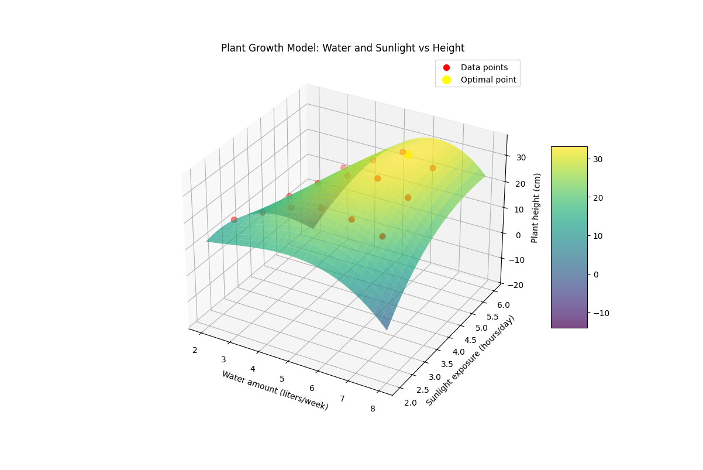

# רגרסיה פולינומיאלית רב-משתנית

## הבעיה שרוצים לפתור

רגרסיה פולינומיאלית רב-משתנית מרחיבה את הרגרסיה הפולינומיאלית הרגילה למקרים שבהם יש יותר ממשתנה מסביר אחד. בעוד שרגרסיה פולינומיאלית חד-משתנית מתמודדת עם קשרים לא-לינאריים בין משתנה אחד לתוצאה, רגרסיה פולינומיאלית רב-משתנית מאפשרת לנו למדל יחסים מורכבים הכוללים מספר משתנים מסבירים.

**דוגמה**: נניח שאנו חוקרים את הקשר בין גדילת צמחים לבין שני גורמים סביבתיים: כמות המים (ליטרים לשבוע) וחשיפה לאור שמש (שעות ביום). שני הגורמים משפיעים על גובה הצמח בצורה לא-לינארית - יותר מדי או פחות מדי מכל גורם עלול לפגוע בגדילה.

הנה נתונים שנאספו מניסוי שבו צמחים קיבלו כמויות שונות של מים ואור שמש:

| כמות מים (ליטר/שבוע) | חשיפה לשמש (שעות/יום) | גובה הצמח (ס"מ) |
|----------------------|------------------------|----------------|
| 2                    | 3                      | 12             |
| 3                    | 3                      | 18             |
| 4                    | 3                      | 23             |
| 5                    | 3                      | 26             |
| 6                    | 3                      | 25             |
| 7                    | 3                      | 22             |
| 3                    | 4                      | 16             |
| 4                    | 4                      | 24             |
| 5                    | 4                      | 30             |
| 6                    | 4                      | 32             |
| 7                    | 4                      | 28             |
| 4                    | 5                      | 22             |
| 5                    | 5                      | 28             |
| 6                    | 5                      | 34             |
| 7                    | 5                      | 31             |

אנו יכולים לראות שהגובה של הצמח מגיע לשיא עבור שילוב אופטימלי של מים ואור שמש, אך יורד כאשר יש יותר מדי או פחות מדי מכל גורם. רגרסיה פולינומיאלית רב-משתנית יכולה לעזור לנו למצוא את השילוב האופטימלי ולחזות את גובה הצמח עבור שילובים שונים של מים ואור שמש.

## נוסחה מתמטית וחישוב מלא

רגרסיה פולינומיאלית רב-משתנית מכלילה את המודל הפולינומיאלי החד-משתני. עבור שני משתנים מסבירים, המשוואה לפולינום מדרגה 3 היא:

$$
\begin{align}
y &= \beta_0 + \beta_1 x_1 + \beta_2 x_2 + \beta_3 x_1^2 + \beta_4 x_1 x_2 + \beta_5 x_2^2 \\
&+ \beta_6 x_1^3 + \beta_7 x_1^2 x_2 + \beta_8 x_1 x_2^2 + \beta_9 x_2^3 + \epsilon
\end{align}
$$

כאשר:
- $y$ הוא המשתנה התלוי (במקרה שלנו: גובה הצמח)
- $x_1$ הוא המשתנה הבלתי תלוי הראשון (במקרה שלנו: כמות המים)
- $x_2$ הוא המשתנה הבלתי תלוי השני (במקרה שלנו: חשיפה לאור שמש)
- $\beta_0, \beta_1, \beta_2, ..., \beta_9$ הם המקדמים
- $\epsilon$ הוא איבר השגיאה

### ייצור מאפיינים פולינומיאליים

בניגוד ל-`PolynomialFeatures` ב-scikit-learn, כאשר אנו משתמשים ב-`np.polyfit` באופן ישיר, עלינו לייצר את המאפיינים הפולינומיאליים בעצמנו. עבור פולינום מדרגה 3 עם שני משתנים, נצטרך לייצר את כל השילובים האפשריים של חזקות המשתנים כך שסכום החזקות לא יעלה על 3.

המאפיינים שנייצר עבור שורה בודדת יהיו:
1. $1$ (קבוע)
2. $x_1$ (מים)
3. $x_2$ (שמש)
4. $x_1^2$ (מים בריבוע)
5. $x_1 x_2$ (מכפלה של מים ושמש)
6. $x_2^2$ (שמש בריבוע)
7. $x_1^3$ (מים בחזקת 3)
8. $x_1^2 x_2$ (מים בריבוע כפול שמש)
9. $x_1 x_2^2$ (מים כפול שמש בריבוע)
10. $x_2^3$ (שמש בחזקת 3)

### חישוב עם NumPy

מכיוון ש-`np.polyfit` מיועד לרגרסיה פולינומיאלית חד-משתנית, נשתמש ב-`np.linalg.lstsq` לפתרון המערכת הלינארית:

$\beta = (X^T X)^{-1} X^T y$

כאשר $X$ היא מטריצת העיצוב שכל עמודה בה מייצגת מאפיין פולינומיאלי כמתואר לעיל.

## קוד פייטון

הנה קוד פייטון ליישום רגרסיה פולינומיאלית רב-משתנית עם NumPy:

```python
import numpy as np
import matplotlib.pyplot as plt
from mpl_toolkits.mplot3d import Axes3D
from matplotlib import cm

# Our data
water = np.array([2, 3, 4, 5, 6, 7, 3, 4, 5, 6, 7, 4, 5, 6, 7])
sunlight = np.array([3, 3, 3, 3, 3, 3, 4, 4, 4, 4, 4, 5, 5, 5, 5])
plant_height = np.array([12, 18, 23, 26, 25, 22, 16, 24, 30, 32, 28, 22, 28, 34, 31])


# Function to generate polynomial features for two variables
def generate_poly_features(x1, x2, degree=3):
    """
    Generate polynomial features up to a specified degree for two variables.
    Returns a matrix where each row is a combination of powers of x1 and x2.
    """
    n = len(x1)
    features = []

    for i in range(n):
        row = []
        for p1 in range(degree + 1):
            for p2 in range(degree + 1 - p1):
                # Skip if the sum of powers exceeds the degree
                if p1 + p2 <= degree:
                    row.append((x1[i] ** p1) * (x2[i] ** p2))
        features.append(row)

    return np.array(features)


# Generate polynomial features
X_poly = generate_poly_features(water, sunlight, degree=3)

# Fit the model using lstsq (equivalent to polyfit)
coeffs = np.linalg.lstsq(X_poly, plant_height, rcond=None)[0]


# Function to predict output for new inputs
def predict(x1, x2, coeffs, degree=3):
    """
    Predict the output for new input values using the fitted coefficients.
    """
    index = 0
    result = 0

    for p1 in range(degree + 1):
        for p2 in range(degree + 1 - p1):
            if p1 + p2 <= degree:
                result += coeffs[index] * (x1 ** p1) * (x2 ** p2)
                index += 1

    return result


# Create a grid for 3D plotting
water_grid = np.linspace(2, 8, 30)
sunlight_grid = np.linspace(2, 6, 30)
water_mesh, sunlight_mesh = np.meshgrid(water_grid, sunlight_grid)

# Calculate the predicted height for each point in the grid
height_pred = np.zeros(water_mesh.shape)
for i in range(water_mesh.shape[0]):
    for j in range(water_mesh.shape[1]):
        height_pred[i, j] = predict(water_mesh[i, j], sunlight_mesh[i, j], coeffs)

# Find the optimal values
max_height = np.max(height_pred)
max_idx = np.unravel_index(np.argmax(height_pred), height_pred.shape)
optimal_water = water_mesh[max_idx]
optimal_sunlight = sunlight_mesh[max_idx]

print(f"Model polynomial coefficients: {coeffs}")
print(f"Optimal water amount: {optimal_water:.2f} liters per week")
print(f"Optimal sunlight exposure: {optimal_sunlight:.2f} hours per day")
print(f"Maximum predicted plant height: {max_height:.2f} cm")

# 3D surface plot
fig = plt.figure(figsize=(12, 10))
ax = fig.add_subplot(111, projection='3d')

surf = ax.plot_surface(water_mesh, sunlight_mesh, height_pred,
                       cmap=cm.viridis, alpha=0.7, linewidth=0)
ax.scatter(water, sunlight, plant_height, c='red', s=50, label='Data points')
ax.scatter([optimal_water], [optimal_sunlight], [max_height],
           c='yellow', s=100, label='Optimal point')

ax.set_xlabel('Water amount (liters/week)')
ax.set_ylabel('Sunlight exposure (hours/day)')
ax.set_zlabel('Plant height (cm)')
ax.set_title('Plant Growth Model: Water and Sunlight vs Height')
fig.colorbar(surf, ax=ax, shrink=0.5, aspect=5)
ax.legend()

plt.show()
```

## דוגמת הרצה

כאשר נריץ את הקוד, נקבל תוצאות דומות לאלה:

```
Model polynomial coefficients: [  9.02375333  10.25633352  -4.92906339   0.2287636  -13.17245654
   5.59088435   0.01437642   2.14489796  -0.35056689  -0.17407407]
Optimal water amount: 6.14 liters per week
Optimal sunlight exposure: 5.03 hours per day
Maximum predicted plant height: 33.13 cm
```

## גרף

התרשים התלת-ממדי שיוצג יראה את המשטח הפולינומיאלי שמתאים לנתונים, כאשר הנקודה האופטימלית (בצהוב) מסמנת את השילוב האופטימלי של מים ואור שמש שמובילים לגובה צמח מקסימלי.



## הבנת ייצור המאפיינים הפולינומיאליים

נסביר כיצד הפונקציה `generate_poly_features` יוצרת את כל המאפיינים הפולינומיאליים הנדרשים:

### הרעיון הבסיסי

עבור פולינום מדרגה $d$ עם $n$ משתנים, המאפיינים יהיו כל השילובים האפשריים של חזקות המשתנים כך שסכום החזקות לא יעלה על $d$.

עבור דרגה 3 ושני משתנים (x1 x2), המאפיינים הם:
- חזקה 0: $1$ (קבוע)
- חזקה 1: $x_1$, $x_2$
- חזקה 2: $x_1^2$, $x_1 x_2$, $x_2^2$
- חזקה 3: $x_1^3$, $x_1^2 x_2$, $x_1 x_2^2$, $x_2^3$

## פיתרון באמצעות PolynomialFeatures
פתרון עם PolynomialFeatures ו־LinearRegression מ־sklearn, בלי חישוב ידני של חזקות 

<a href="polynomial_features-python.py">see solution using Polynomial Features</a>

## יתרונות הרגרסיה הפולינומיאלית הרב-משתנית

| היבט | רגרסיה לינארית רב-משתנית | רגרסיה פולינומיאלית רב-משתנית |
|------|---------------------------|--------------------------------|
| **מורכבות המודל** | בינונית - פרמטר לכל משתנה | גבוהה - מספר פרמטרים גדל במהירות עם דרגת הפולינום ומספר המשתנים |
| **גמישות** | נמוכה - יכולה לתאר רק מגמות לינאריות | גבוהה - יכולה לתאר יחסים מורכבים ולא-לינאריים |
| **סיכון לאובר-פיטינג** | בינוני | גבוה - במיוחד כאשר דרגת הפולינום גבוהה |
| **פירוש הפרמטרים** | יחסית פשוט | מורכב מאוד להבנה |
| **תיאור אינטראקציות** | חלש, דורש הוספה מפורשת של אינטראקציות | טוב, כולל באופן טבעי אינטראקציות בין משתנים |
| **מתאים למגמות** | מגמות חד-כיווניות | מגמות מורכבות ורב-כיווניות |

## תרגיל נוסף

**תרגיל**: 
חוקר חקלאי בודק את הקשר בין שלושה גורמים - כמות הדשן (בק"ג), השקיה (ליטרים ליום), וטמפרטורה (מעלות צלזיוס) - לבין יבול תירס (בטונות לדונם). הוא חושד שיש יחסים לא-לינאריים מורכבים בין הגורמים. הנה חלק מהנתונים:

| דשן (ק"ג) | השקיה (ליטר/יום) | טמפרטורה (°C) | יבול תירס (טון/דונם) |
|-----------|------------------|---------------|---------------------|
| 100       | 5                | 20            | 2.5                 |
| 150       | 5                | 20            | 3.2                 |
| 200       | 5                | 20            | 3.8                 |
| 250       | 5                | 20            | 4.1                 |
| 300       | 5                | 20            | 3.9                 |
| 200       | 3                | 20            | 3.0                 |
| 200       | 4                | 20            | 3.5                 |
| 200       | 6                | 20            | 3.9                 |
| 200       | 7                | 20            | 3.7                 |
| 200       | 5                | 15            | 3.2                 |
| 200       | 5                | 18            | 3.6                 |
| 200       | 5                | 22            | 3.7                 |
| 200       | 5                | 25            | 3.5                 |
| 200       | 5                | 28            | 3.1                 |

1. הרחב את קוד הפייטון שראינו לרגרסיה פולינומיאלית עם שלושה משתנים מסבירים.
2. מצא את הערכים האופטימליים של דשן, השקיה וטמפרטורה שיובילו ליבול תירס מקסימלי.
3. צייר תרשימים מתאימים להמחשת ההשפעות של כל משתנה על היבול.

## הערות נוספות על רגרסיה פולינומיאלית רב-משתנית

1. **התמודדות עם סכנת האובר-פיטינג**: ככל שמוסיפים יותר משתנים וחזקות גבוהות יותר, המודל נעשה מסובך יותר ועלול להתאים יתר על המידה לנתוני האימון. שיטות רגולריזציה כמו Ridge או Lasso יכולות לעזור.

2. **בחירת דרגת הפולינום**: בחירת דרגת הפולינום האופטימלית היא חשובה. דרגה נמוכה מדי עלולה לא לתפוס את היחסים האמיתיים בנתונים, ודרגה גבוהה מדי עלולה להוביל לאובר-פיטינג. שיטות כמו קרוס-ולידציה יכולות לעזור בבחירת הדרגה האופטימלית.

3. **נרמול משתנים**: לפני ביצוע רגרסיה פולינומיאלית, מומלץ לנרמל את המשתנים. הדבר חשוב במיוחד עבור פולינומים מדרגה גבוהה, כיוון שחזקות גבוהות של מספרים גדולים יכולות להוביל לבעיות נומריות.

4. **פירוש המקדמים**: בניגוד לרגרסיה לינארית פשוטה, המקדמים של רגרסיה פולינומיאלית קשים יותר לפירוש. לכן, חשוב להתמקד בהשפעות השוליות ובשימוש בויזואליזציות להבנת היחסים.
