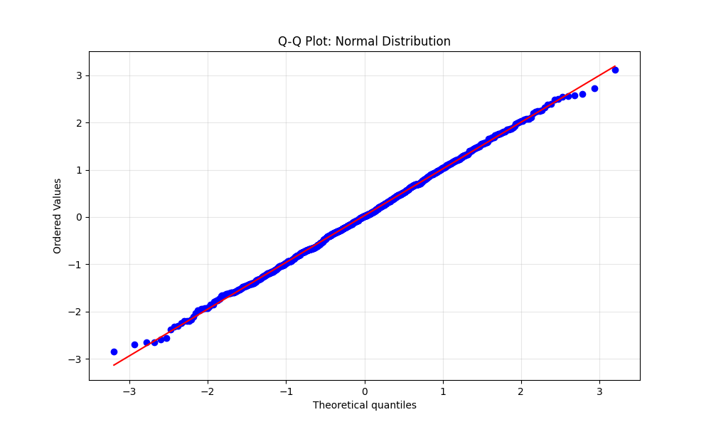
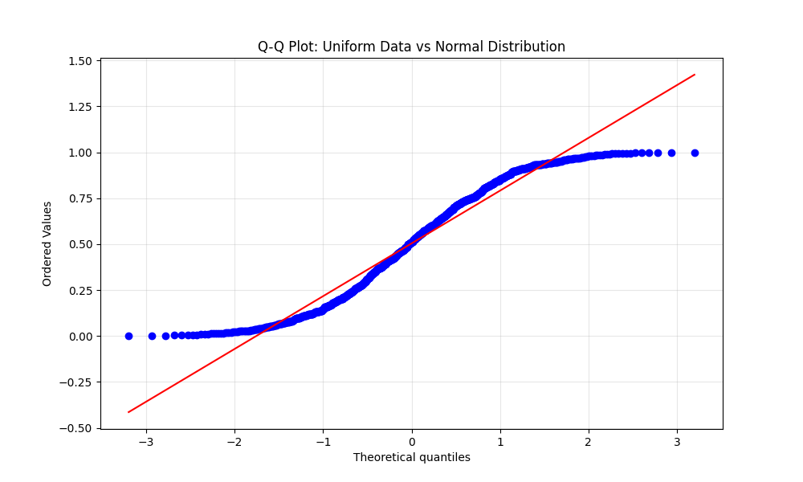
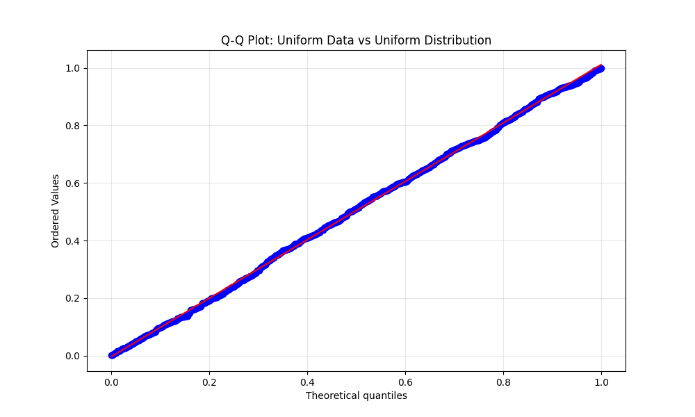
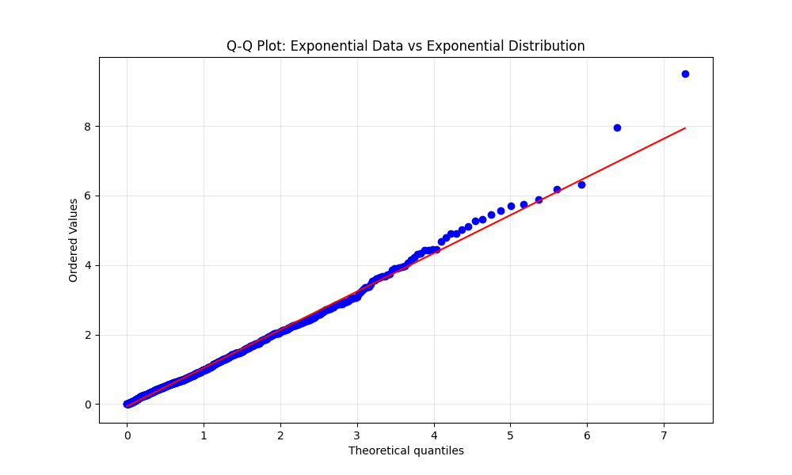
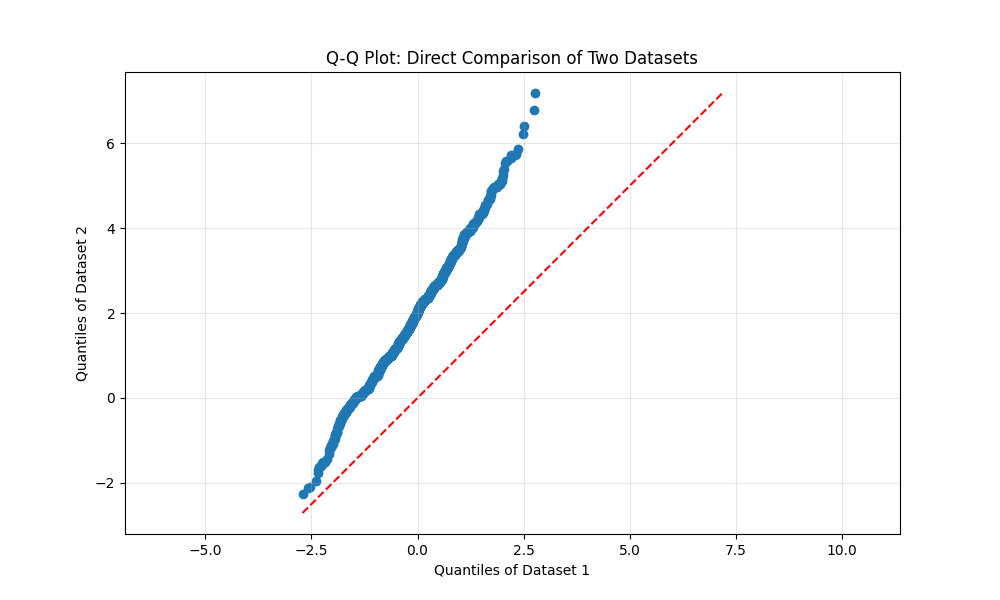

# Understanding Q-Q Plots (Probability Plots)

## הבדל בין התפלגות נורמלית להתפלגות אחידה

🌟 התפלגות נורמלית (Normal Distribution)
- צורת **פעמון (Bell Curve)** – רוב הערכים קרובים לממוצע, ופחות ערכים נמצאים בקצוות.
- **הממוצע, החציון והשכיח שווים** ונמצאים במרכז.
- **סטיית תקן** קובעת את הפיזור – כמה רחוקים הנתונים מהממוצע.
- דוגמה טיפוסית:
  - ציונים במבחן גדול
  - גובה של אנשים
  - מדידות ביולוגיות

🔹 **לדוגמה**: אם ממוצע הציונים הוא 75, רוב התלמידים יקבלו בין 65 ל-85, ומעטים יקבלו פחות מ-50 או יותר מ-95.

📦 התפלגות אחידה (Uniform Distribution)
- כל ערך בטווח מסוים סביר באותה מידה – **אין ערכים נפוצים יותר**.
- צורת הגרף: **קו ישר** – לא פעמון.
- **אין שכיח** (mode) – כל הערכים מופיעים באותה תדירות.
- דוגמה טיפוסית:
  - הטלת קובייה הוגנת (1-6)
  - הגרלה עם סיכוי שווה בין משתתפים

🔹 **לדוגמה**: אם מגרילים מספר בין 1 ל-100, כל מספר בטווח זהה בסיכויו להופיע.

🧠 סיכום השוואתי

| מאפיין               | התפלגות נורמלית       | התפלגות אחידה           |
|----------------------|------------------------|--------------------------|
| צורת הגרף            | פעמון                  | קו ישר                   |
| ערכים נפוצים         | סביב הממוצע            | כולם באותה תדירות       |
| שכיח (Mode)          | קיים                   | אין                       |
| שימושים נפוצים       | תופעות טבעיות, מדידות  | משחקים, סימולציות אקראיות |

## What is a Q-Q Plot?

A Quantile-Quantile plot (Q-Q plot), also known as a probability plot, is a graphical technique used to determine if a dataset follows a particular theoretical distribution. The Q-Q plot is called that because it plots Quantiles vs. Quantiles
— one from your data, one from a distribution you want to compare against.
The "Q" in Q-Q stands for quantile, which refers to the fraction or percent of points below a given value.

| **Name**       | **Description**                                      | **Percent**              |
|----------------|------------------------------------------------------|--------------------------|
| **Median**     | The 0.5 quantile — 50% of data is below this value   | 50%                      |
| **Quartiles**  | Divide data into **4 parts**                         | 25%, 50%, 75%            |
| **Deciles**    | Divide data into **10 parts**                        | 10%, 20%, ..., 90%       |
| **Percentiles**| Divide data into **100 parts**                       | 1%, 2%, ..., 99%         |

## How Q-Q Plots Work

A Q-Q plot works by comparing the quantiles of the observed data with the quantiles of a theoretical distribution. Here's the step-by-step process:

1. **Order the data**: The observed values are sorted from smallest to largest.
2. **Calculate empirical quantiles**: Each data point is assigned a probability based on its rank in the ordered dataset.
3. **Calculate theoretical quantiles**: For each empirical quantile, a corresponding theoretical quantile is calculated from the reference distribution.
4. **Plot the quantiles**: The empirical quantiles are plotted against the theoretical quantiles.
5. **Add a reference line**: A straight line is added to the plot, representing perfect agreement between observed and theoretical distributions.

## What Q-Q Plots Show

Q-Q plots reveal several important characteristics about your data:

1. **Distribution fit**: If the points approximately follow the reference line, your data follows the theoretical distribution.
2. **Location shifts**: Vertical shifts from the reference line indicate differences in central tendency (mean/median).
3. **Scale differences**: Changes in slope indicate differences in dispersion (variance).
4. **Shape differences**: Curvature indicates differences in skewness or tail behavior.
5. **Outliers**: Points far from the general pattern may indicate outliers.

## The `dist="norm"` Parameter

In Python's SciPy implementation, `stats.probplot(data, dist="norm", plot=plt)`:

- `dist="norm"` specifies that we're comparing our data to a normal (Gaussian) distribution.
- This is the default and most common reference distribution used in Q-Q plots.

## Other Available Distributions

SciPy's `probplot` function allows comparison to various distributions through the `dist` parameter:

- `"norm"`: Normal distribution (default)
- `"uniform"`: Uniform distribution
- `"expon"`: Exponential distribution
- `"logistic"`: Logistic distribution
- `"gumbel"`: Gumbel distribution
- `"cauchy"`: Cauchy distribution
- `"gamma"`: Gamma distribution (requires setting the 'sparams' parameter)
- `"laplace"`: Laplace distribution
- `"lognorm"`: Log-normal distribution (requires setting the 'sparams' parameter)
- `"weibull_min"`: Weibull distribution (requires setting the 'sparams' parameter)

You can also provide your own custom distribution function.

## Other Parameters and Features

The `stats.probplot` function offers several additional parameters:

- `plot`: The matplotlib axis object to plot on
- `fit`: Whether to calculate and draw the best-fit line (default is True)
- `rvalue`: Whether to return the correlation coefficient (default is False)
- `sparams`: Shape parameters for distributions that require them
- `scale`: Whether to compute standard score (default is False)
- `loc`: Used for plotting position formula (default is 0.5)

## Examples of Different Distributions

### 1. Normal Distribution Q-Q Plot

```python
import numpy as np
import matplotlib.pyplot as plt
import scipy.stats as stats

# Generate normal data
normal_data = np.random.normal(size=1000)

# Create Q-Q plot
plt.figure(figsize=(10, 6))
stats.probplot(normal_data, dist="norm", plot=plt)
plt.title('Q-Q Plot: Normal Distribution')
plt.grid(True, alpha=0.3)
plt.show()
```


## מה רואים כאן?

גרף מסוג Q-Q Plot (Quantile-Quantile Plot),  
שנועד לבדוק האם הנתונים שלנו מתפלגים בצורה מסוימת — במקרה הזה: **התפלגות נורמלית**.

ציר X לא מראה את אחוזי הקואנטיל עצמם (0.25, 0.5, 0.75...),
אלא מראה את הערכים שהתיאוריה אומרת שצריכים להיות בכל שלב

**לדוגמא מרכז ציר ה- X זה ה- 50% קואנטיל (כלומר הקואנטיל יחסי למספר המשבצות)**

יצרנו 1000 מספרים רנדומליים מתוך התפלגות נורמלית סטנדרטית:

```python
np.random.normal(size=1000)
```

## מה מייצג כל רכיב בגרף?

### הקו האדום:
- מייצג את **התפלגות נורמלית מושלמת**.
- אם כל הנתונים שלך היו בדיוק נורמליים, הם היו נופלים **בדיוק על הקו הזה**.
- הקו עובר באלכסון (מהשמאל למעלה לימין למטה), כי ככל שהקווינטיל עולה – גם הערכים עולים.

### הנקודות הכחולות:
- אלו הערכים **הממויינים** של הנתונים שיצרת.
- כל נקודה משווה בין:
  - הקוונטיל **התיאורטי** של התפלגות נורמלית.
  - לבין הקוונטיל **האמיתי** מתוך הדגימה שלך.

## למה הגרף "עולה"?

כי ככל שהאחוזון (quantile) גדל – גם הערך שקשור אליו בתיאוריה של ההתפלגות הנורמלית גדל.  
לכן נקודות שנמצאות בתחילת הדגימה (הקטנות) יהיו בצד שמאל למטה,  
ונקודות גבוהות יותר (הגדולות) בצד ימין למעלה.

## למה הטווח הוא בין מינוס 3 ל־3?

בגלל שהגרלנו את המספרים מתוך התפלגות נורמלית סטנדרטית:
N(0,1)

התפלגות נורמלית עם ממוצע 0 וסטיית תקן 1

וזו תכונת ההתפלגות הנורמלית:

- 68% מהערכים בטווח של 1- עד 1+
- 95% מהערכים בטווח של 2- עד 2+
- 99.7% מהערכים בטווח של 3- עד 3+

לכן הגרף מראה את רוב הערכים בתוך הטווח הזה.

## מה זה Ordered Values? ממויין

הכוונה היא שהנתונים **סודרו מהקטן לגדול**, לפני שמחשבים את הקוונטילים שלהם.  
זה חלק חשוב מתהליך בניית הגרף 

## סיכום

ה - Q Q PLOT 
היא דרך גרפית לבדוק אם הדגימה שלך נראית כמו התפלגות נורמלית.  
אם הנקודות נופלות על הקו האדום — סביר להניח שהנתונים מתפלגים נורמלית.  
אם לא — כנראה שיש סטייה מהנורמליות (כמו הטיה, זנבות כבדים, או חריגים).


### 2. Uniform Distribution Q-Q Plot

```python
# Generate uniform data
uniform_data = np.random.uniform(size=1000)

# Create Q-Q plot comparing to normal distribution
plt.figure(figsize=(10, 6))
stats.probplot(uniform_data, dist="norm", plot=plt)
plt.title('Q-Q Plot: Uniform Data vs Normal Distribution')
plt.grid(True, alpha=0.3)
plt.show()

# Create Q-Q plot comparing to uniform distribution
plt.figure(figsize=(10, 6))
stats.probplot(uniform_data, dist="uniform", plot=plt)
plt.title('Q-Q Plot: Uniform Data vs Uniform Distribution')
plt.grid(True, alpha=0.3)
plt.show()
```





## מה מוצג כאן?

במקרה הזה אנחנו בודקים איך נראית התפלגות **אחידה** מול שתי התפלגויות שונות:

1. השוואה בין התפלגות אחידה לבין התפלגות **נורמלית**
2. השוואה בין התפלגות אחידה לבין **התפלגות אחידה** (כלומר בדיקה עצמית)

## הקוד שיצר את הנתונים

```python
uniform_data = np.random.uniform(size=1000)
```

זה יוצר 1000 מספרים רנדומליים בטווח של 0 עד 1 מתוך התפלגות אחידה.

## גרף ראשון: התפלגות אחידה מול התפלגות נורמלית

### הקו האדום:
- מייצג את הקוונטילים של התפלגות נורמלית מושלמת

### הנקודות הכחולות:
- מייצגות את הקוונטילים של הנתונים שיצרנו (מהתפלגות אחידה)

### מה רואים כאן?
- הנקודות **לא נצמדות** לקו האדום.
- במקום זה, הן "מתעקמות" — בעיקר בקצוות.
- זה סימן ברור לכך שהנתונים **לא מתפלגים נורמלית**, אלא משהו אחר (כאן: אחיד).

## גרף שני: התפלגות אחידה מול עצמה (התפלגות אחידה)

### הקו האדום:
- מייצג קוונטילים של התפלגות אחידה (שווה למה שאנחנו מצפים)

### הנקודות הכחולות:
- הנתונים שלנו — גם כן התפלגות אחידה

### מה רואים כאן?
- הנקודות **נמצאות כמעט בדיוק על הקו**.
- כלומר — ההתפלגות האחידה מתאימה לעצמה באופן מושלם.
- זאת בדיוק ההתנהגות הרצויה כאשר בודקים Q-Q Plot של נתונים שמתאימים להתפלגות.

## סיכום:

- **גרף ראשון**: הנתונים לא נראים נורמליים — הקו והנקודות לא חופפים.
- **גרף שני**: הנתונים כן נראים אחידים — הקו והנקודות חופפים יפה.
- Q-Q Plot מאפשר לנו לבדוק **עד כמה דגימה מסוימת מתאימה להתפלגות תיאורטית מסוימת**.


### 3. Exponential Distribution Q-Q Plot

```python
# Generate exponential data
exponential_data = np.random.exponential(size=1000)

# Create Q-Q plot comparing to exponential distribution
plt.figure(figsize=(10, 6))
stats.probplot(exponential_data, dist="expon", plot=plt)
plt.title('Q-Q Plot: Exponential Data vs Exponential Distribution')
plt.grid(True, alpha=0.3)
plt.show()
```



---

## Visual Patterns in Q-Q Plots

Different patterns in Q-Q plots indicate specific characteristics of your data:

### 1. Perfect Match
- Points fall along the reference line
- Indicates data follows the specified distribution

### 2. Linear but Not on Reference Line
- Points form a straight line but with different slope/intercept
- Indicates data follows the same family of distribution but with different parameters

### 3. S-shaped Curve
- Points form an S-shape around the reference line
- Indicates data has different kurtosis (tail behavior) than the reference distribution

### 4. Concave/Convex Curves
- Upward or downward curve
- Indicates skewness relative to the reference distribution

### 5. Piecewise Linear
- Two or more straight-line segments
- Indicates potential mixture of distributions or truncated data

### 6. Step Function
- Horizontal segments in the plot
- Indicates discrete or rounded data

## Creating Specialized Q-Q Plots

You can also create Q-Q plots to compare two datasets directly, without reference to a theoretical distribution:

```python
# Generate two datasets to compare
data1 = np.random.normal(loc=0, scale=1, size=1000)
data2 = np.random.normal(loc=2, scale=1.5, size=1000)

# Create quantile-quantile plot
plt.figure(figsize=(10, 6))
plt.scatter(np.sort(data1), np.sort(data2))

# Add reference line
min_val = min(data1.min(), data2.min())
max_val = max(data1.max(), data2.max())
plt.plot([min_val, max_val], [min_val, max_val], 'r--')

plt.title('Q-Q Plot: Direct Comparison of Two Datasets')
plt.xlabel('Quantiles of Dataset 1')
plt.ylabel('Quantiles of Dataset 2')
plt.grid(True, alpha=0.3)
plt.axis('equal')
plt.show()
```


## Applications Beyond Normality Testing

Q-Q plots have many applications beyond testing for normality:

1. **Data exploration**: Understand the underlying distribution of your data
2. **Distribution fitting**: Identify which theoretical distribution best matches your data
3. **Data transformation**: Assess the effect of transformations on distributional properties
4. **Comparing datasets**: Determine if two datasets come from the same distribution
5. **Model diagnostics**: Check assumptions beyond just residual analysis
6. **Change detection**: Identify when a process distribution has changed over time

## Advantages of Q-Q Plots

1. **Visual assessment**: Easy to interpret visually without formal testing
2. **Informative about deviations**: Shows exactly how and where data deviates from theoretical distribution
3. **Works with any sample size**: Effective for both small and large datasets
4. **Flexible**: Can be used with many different distributions
5. **Reveals multiple issues**: Can simultaneously show outliers, skewness, and other characteristics

## Limitations of Q-Q Plots

1. **Subjective interpretation**: Can be difficult to quantify the degree of deviation
2. **Requires visual expertise**: Interpreting patterns takes practice
3. **Edge effects**: Extreme values can be difficult to interpret
4. **Overlapping points**: Large datasets may have overlapping points making patterns harder to see

## Conclusion

Q-Q plots are powerful graphical tools for assessing distributional properties of data. They provide a visual way to determine whether a dataset follows a particular theoretical distribution and can reveal specific ways in which the data deviates from that distribution. 

While often associated with checking normality in residual analysis, Q-Q plots are much more versatile and can be used to compare datasets to various distributions or directly to each other. Understanding how to read the patterns in Q-Q plots can provide insights into data characteristics that might not be obvious from summary statistics alone.
