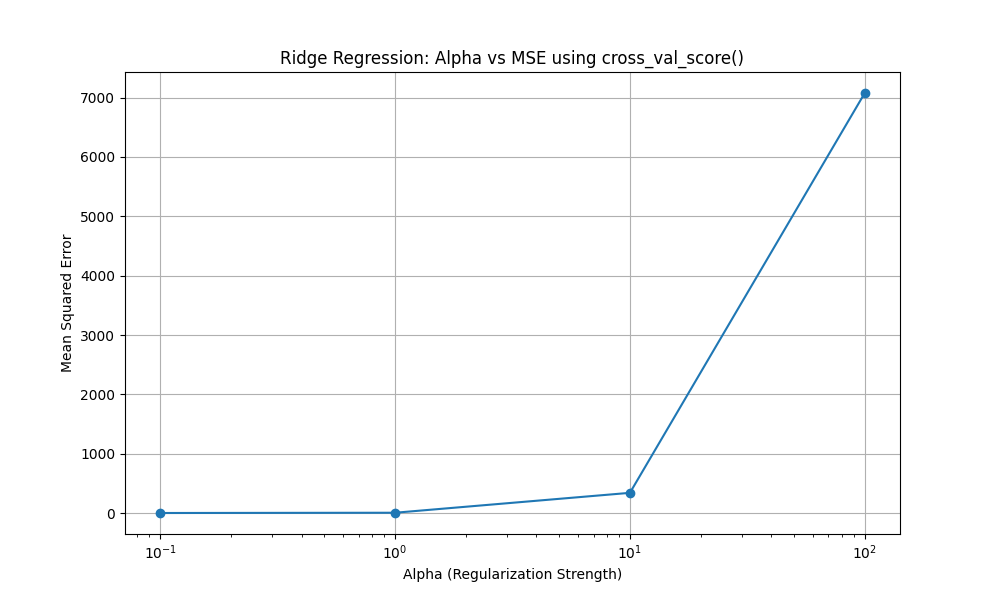
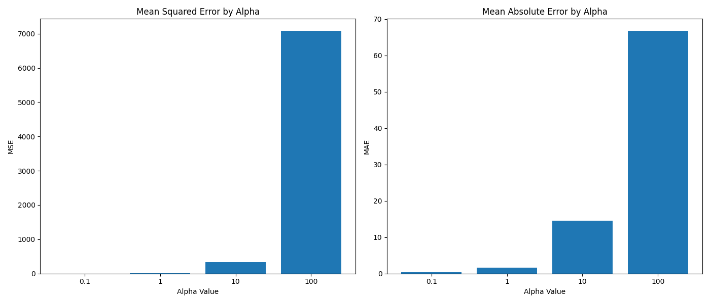

# Cross-Validation Techniques in Machine Learning

## Introduction to Cross-Validation

אימות צולב הוא טכניקה בסיסית בלמידה מונחית (supervised learning) המשמשת להערכת יכולת ההכללה של מודל למידת מכונה למערך נתונים עצמאי. טכניקה זו עוזרת בהבנת האפקטיביות של המודל ומצמצמת את בעיית ה-overfitting (התאמת יתר) על ידי בדיקת המודל על נתונים שלא נחשף אליהם במהלך האימון.
התהליך כולל חלוקת מערך הנתונים למספר תתי-קבוצות, אימון המודל על חלק מהתתי-קבוצות, ואימות המודל על התתי-קבוצות האחרות. גישה זו מספקת הערכה מדויקת ואמינה יותר בהשוואה לחלוקה פשוטה של הנתונים לקבוצת אימון וקבוצת בדיקה

## Types of Cross-Validation

### K-Fold Cross-Validation

K-fold cross-validation involves splitting the data into 'k' equal folds or groups. The model is trained on (k-1) folds and validated on the remaining fold. This process is repeated k times, with each fold serving as the validation set exactly once.

**Key advantages:**
- Every data point gets to be in the validation set once
- All data points are used for both training and validation
- The final performance metric is averaged across all k iterations


Train - Used to fit (train) the model

Validation - Used to tune the model (e.g. choose hyperparameters, detect overfitting)

Test - Used to evaluate final performance on completely unseen data

**Example of 5-fold cross-validation process:**

1. Split dataset into 5 equal parts (folds)
2. For iteration 1:
   - Train on folds 2-5
   - Validate on fold 1
   - Calculate error₁
3. For iteration 2:
   - Train on folds 1, 3-5
   - Validate on fold 2
   - Calculate error₂
4. Continue for iterations 3-5
5. Final error = average(error₁, error₂, error₃, error₄, error₅)

```python
# K-fold cross-validation example
from sklearn.model_selection import cross_val_score
from sklearn.linear_model import Ridge

# Create model
ridge_model = Ridge(alpha=10)

# Perform 5-fold cross-validation
scores = cross_val_score(ridge_model, X_scaled, y, 
                         cv=5, scoring='neg_mean_squared_error')

# Calculate average score
mean_score = abs(scores.mean())
print(f"Average MSE across all folds: {mean_score}")
```

### Leave-One-Out Cross-Validation (LOOCV)

LOOCV is a special case of k-fold cross-validation where k equals the total number of observations in the dataset. The model is trained on **all data points except one** and then tested on that single left-out observation.

**Key characteristics:**
- Maximum use of available data for training
- Each training set contains n-1 samples (where n is the total dataset size)
- Computationally expensive for large datasets
- Less biased but can have high variance

```python
# LOOCV example
from sklearn.model_selection import LeaveOneOut, cross_val_score

# Create LOOCV object
loo = LeaveOneOut()

# Perform LOOCV
scores = cross_val_score(ridge_model, X_scaled, y, 
                         cv=loo, scoring='neg_mean_squared_error')

# Calculate average score
mean_score = abs(scores.mean())
print(f"LOOCV Average MSE: {mean_score}")
```

## Implementation in Scikit-Learn

### cross_val_score()

`cross_val_score()` provides a simple way to evaluate a model using cross-validation. It returns a score metric for each fold of the cross-validation.

**Key parameters:**
- `estimator`: The model to evaluate
- `X`: Feature data
- `y`: Target data
- `cv`: Number of folds (default is 5)
- `scoring`: Metric used for evaluation (e.g., 'neg_mean_squared_error', 'r2', 'neg_mean_absolute_error')

**Example with visualization:**

```python
import numpy as np
import matplotlib.pyplot as plt
from sklearn.linear_model import Ridge
from sklearn.model_selection import cross_val_score
from sklearn.preprocessing import StandardScaler
from sklearn.datasets import make_regression

# Create a synthetic dataset
X, y = make_regression(n_samples=100, n_features=5, noise=0.5, random_state=42)

# Scale the features
scaler = StandardScaler()
X_scaled = scaler.fit_transform(X)

# Test different alpha values
alphas = [0.1, 1, 10, 100]
cv_scores = []

for alpha in alphas:
    ridge = Ridge(alpha=alpha)

    # Error metrics like mean squared error (MSE),
    # mean absolute error (MAE),
    # and root mean squared error (RMSE)
    # are typically represented with negative values
    # in scikit-learn's cross-validation
    # functions for a specific reason related to how the library
    # handles optimization.
    scores = cross_val_score(ridge, X_scaled, y,
                             cv=5, scoring='neg_mean_squared_error')
    cv_scores.append(abs(scores.mean()))
    print(abs(scores.mean()))

# Plot results
plt.figure(figsize=(10, 6))
plt.plot(alphas, cv_scores, marker='o')
plt.xscale('log')
plt.xlabel('Alpha (Regularization Strength)')
plt.ylabel('Mean Squared Error')
plt.title('Ridge Regression: Alpha vs MSE using cross_val_score()')
plt.grid(True)
plt.show()
```
output:
```
0.3120474252351334
4.705394279474865
340.16504915144077
7078.28159151424
```


### cross_validate()

`cross_validate()` is more flexible than `cross_val_score()` as it allows for multiple scoring metrics and returns additional information such as fit times and score times for each fold.

**Key differences from cross_val_score():**
- Returns a dictionary with multiple performance metrics
- Allows tracking of training and scoring times
- Can return train scores alongside test scores
- Supports multiple scoring metrics simultaneously

**Example:**

```python
from sklearn.model_selection import cross_validate

# Define multiple scoring metrics
scoring = {'MSE': 'neg_mean_squared_error', 
           'MAE': 'neg_mean_absolute_error'}

# Perform cross-validation with multiple metrics
cv_results = cross_validate(ridge_model, X_scaled, y,
                           cv=5, scoring=scoring, 
                           return_train_score=True)

# Convert results to DataFrame for better visualization
import pandas as pd
results_df = pd.DataFrame(cv_results)

# Display average scores
# Error metrics are typically represented with negative values
# in scikit-learn's cross-validation
# functions for a specific reason related to how the library
# handles optimization.
print("Test MSE:", abs(results_df['test_MSE'].mean()))
print("Test MAE:", abs(results_df['test_MAE'].mean()))
print("Train MSE:", abs(results_df['train_MSE'].mean()))
print("Train MAE:", abs(results_df['train_MAE'].mean()))
print("Average fit time:", results_df['fit_time'].mean())
```

**Sample output visualization:**

| Fold | Fit Time | Score Time | Test MSE | Test MAE | Train MSE | Train MAE |
|------|----------|------------|----------|----------|-----------|-----------|
| 0    | 0.0019   | 0.0016     | 3.44     | 1.56     | 0.22      | 0.37      |
| 1    | 0.0018   | 0.0014     | 1.40     | 1.03     | 0.31      | 0.42      |
| 2    | 0.0012   | 0.0007     | 5.77     | 1.52     | 0.25      | 0.38      |
| 3    | 0.0012   | 0.0003     | 2.18     | 1.06     | 0.33      | 0.45      |
| 4    | 0.0005   | 0.0003     | 4.65     | 1.52     | 0.26      | 0.40      |
| Mean | 0.0013   | 0.0009     | 3.49     | 1.33     | 0.27      | 0.40      |

## Comparing Alpha Values in Ridge Regression with Cross-Validation

Using cross-validation is particularly useful for hyperparameter tuning, such as finding the optimal alpha value in Ridge regression:

```python
# Compare different alpha values with cross_validate
alphas = [0.1, 1, 10, 100]
results = {}

for alpha in alphas:
    ridge = Ridge(alpha=alpha)
    cv_results = cross_validate(
        ridge, X_scaled, y, 
        cv=5, 
        scoring={'MSE': 'neg_mean_squared_error', 'MAE': 'neg_mean_absolute_error'}
    )
    results[alpha] = {
        'MSE': abs(cv_results['test_MSE'].mean()),
        'MAE': abs(cv_results['test_MAE'].mean())
    }

# Visualize results
fig, ax = plt.subplots(1, 2, figsize=(14, 6))

# Plot MSE
mse_values = [results[alpha]['MSE'] for alpha in alphas]
ax[0].bar([str(alpha) for alpha in alphas], mse_values)
ax[0].set_title('Mean Squared Error by Alpha')
ax[0].set_xlabel('Alpha Value')
ax[0].set_ylabel('MSE')

# Plot MAE
mae_values = [results[alpha]['MAE'] for alpha in alphas]
ax[1].bar([str(alpha) for alpha in alphas], mae_values)
ax[1].set_title('Mean Absolute Error by Alpha')
ax[1].set_xlabel('Alpha Value')
ax[1].set_ylabel('MAE')

plt.tight_layout()
plt.show()
```



## Using LinearRegression and Pipeline with Cross-Validation

Using cross-validation is particularly useful for hyperparameter tuning, such as finding the optimal alpha value in Ridge regression:

```python
import numpy as np
import matplotlib.pyplot as plt
from sklearn.preprocessing import PolynomialFeatures
from sklearn.linear_model import LinearRegression
from sklearn.pipeline import Pipeline
from sklearn.model_selection import cross_validate
from sklearn.preprocessing import StandardScaler
from sklearn.datasets import make_regression

# Create a synthetic dataset with non-linear relationship
np.random.seed(42)
X = np.sort(np.random.rand(100, 1), axis=0)
y = np.sin(2 * np.pi * X).ravel() + np.random.normal(0, 0.3, X.shape[0])

# Compare different polynomial degrees with cross-validation
degrees = [1, 2, 3, 4, 5, 7, 10]  # Different polynomial degrees to try
results = {}

for degree in degrees:
    # Create a pipeline with polynomial features and linear regression
    model = Pipeline([
        ('poly', PolynomialFeatures(degree=degree)),
        ('scaler', StandardScaler()),  # Scale features after polynomial transformation
        ('linear', LinearRegression())
    ])

    # Perform cross-validation
    cv_results = cross_validate(
        model, X, y,
        cv=5,
        scoring={'MSE': 'neg_mean_squared_error', 'MAE': 'neg_mean_absolute_error'}
    )

    # Store results
    results[degree] = {
        'MSE': abs(cv_results['test_MSE'].mean()),
        'MAE': abs(cv_results['test_MAE'].mean())
    }

mse_values = [results[degree]['MSE'] for degree in degrees]
mae_values = [results[degree]['MAE'] for degree in degrees]
```

results:
```
Degree   avg. MSE  avg. MAE
      1  0.224837  0.383312
      2  0.118023  0.277151
      3  0.089143  0.235771
      4  0.093571  0.240753
      5  0.098345  0.244723
      7  0.110872  0.258347
     10  0.139451  0.287291
```

## Summary

Cross-validation is essential for:
1. More reliable model evaluation than a single train-test split
2. Efficient use of limited data
3. Reducing overfitting
4. Hyperparameter tuning
5. Understanding model stability

The choice between K-fold cross-validation and LOOCV depends on dataset size, computational resources, and the bias-variance tradeoff you're willing to accept. Similarly, the choice between `cross_val_score()` and `cross_validate()` depends on whether you need multiple metrics and additional information about computation times.
