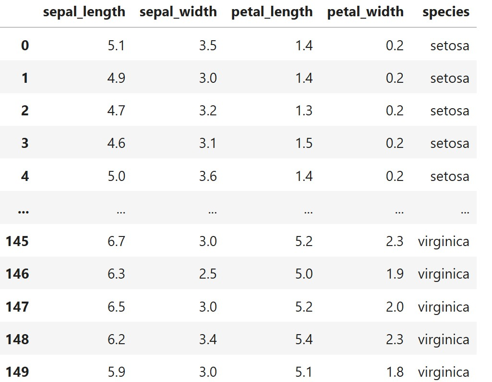
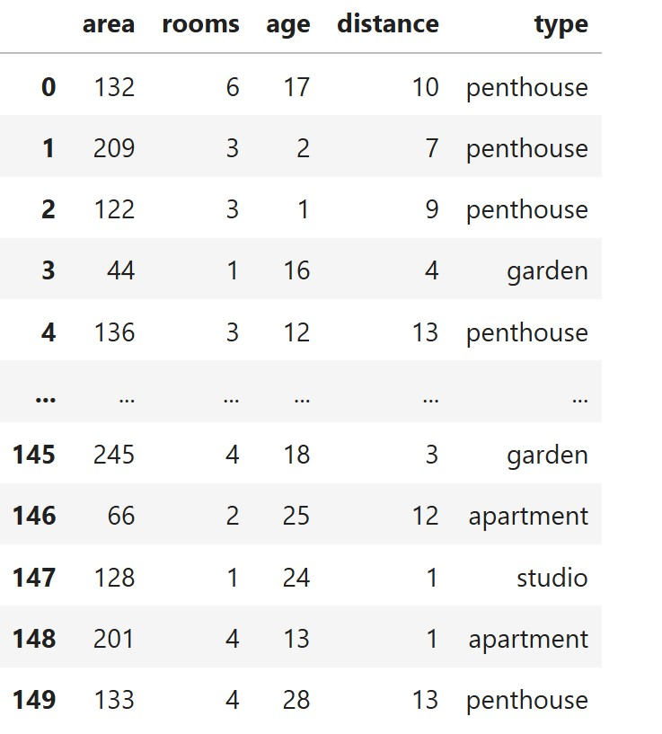

# 🌟 רגרסיה לוגיסטית עם כמה משתנים וכמה קלאסים

## 📘 מה זה רגרסיה לוגיסטית?
רגרסיה לוגיסטית היא שיטה סטטיסטית לחיזוי משתנה תלוי בינארי או רב־קטגורי (כמו: כן/לא, סוג פרח), על סמך ערכים של משתנים מסבירים (תכונות)

במקרה של מספר משתנים מסבירים (features), מדובר ברגרסיה לוגיסטית עם **כמה נעלמים**

---

## ✏️ מושגים בסיסיים:

- **משתנה תלוי (Y):** מה שאנחנו מנסים לחזות (למשל סוג פרח)
- **משתנים בלתי תלויים (X₁, X₂, X₃...):** התכונות שמסבירות את Y (למשל אורך עלי כותרת)
- **β (בטא):** מקדמים שנלמדים על ידי המודל. כל משתנה מקבל β משלו.

---

## 📐 נוסחה מתמטית (Softmax Multiclass):

אם יש לנו \( K \) קטגוריות ו־\( n \) משתנים:

$$
P(y = k \mid x) = \frac{e^{\beta_{k0} + \beta_{k1}x_1 + \beta_{k2}x_2 + \dots + \beta_{kn}x_n}}{\sum_{j=1}^K e^{\beta_{j0} + \beta_{j1}x_1 + \beta_{j2}x_2 + \dots + \beta_{jn}x_n}}
$$


כאשר יש לנו **K קטגוריות** שונות, אנחנו משתמשים בפונקציית Softmax כדי לחשב את ההסתברות שהדוגמה שלנו שייכת למחלקה .
  
- : וקטור התכונות של הדוגמה שלנו
- : bias (היסט) למחלקה 
- : משקלים של כל תכונה עבור מחלקה 
- : בסיס הלוגריתם הטבעי (≈ 2.718)
- : מספר הקטגוריות
- המכנה כולל את כל המחלקות האפשריות 
  

מה הנוסחה עושה?

- מחשבת **"ניקוד" (score)** לכל קטגוריה לפי מודל לינארי
- ממירה את כל הניקודים להסתברויות (בין 0 ל-1) בעזרת פונקציית Softmax
- מבטיחה שכל ההסתברויות ביחד יתנו בדיוק **1**
- הקטגוריה עם ההסתברות הגבוהה ביותר היא זו שהמודל ינבא

### 💬 דוגמה מילולית:

> אם אנחנו רוצים לנבא איזה סוג פרי בתמונה: תפוח, בננה או תפוז —  
> Softmax תחשב את ההסתברויות לכל אחת מהאפשרויות לפי התכונות (צבע, גודל, משקל),  
> ותחזיר:  
> - תפוח: 0.1  
> - בננה: 0.3  
> - תפוז: 0.6 ✅ ← הכי סביר

- זוהי פונקציית **Softmax** – ממירה את הציונים להסתברויות.
- כל קטגוריה מקבלת הסתברות, והחזויה היא זו עם ההסתברות הגבוהה ביותר.

## 🌸 דוגמה – על בסיס נתוני Iris:




ננסה לחזות את סוג הפרח (setosa, versicolor, virginica) על סמך 4 משתנים:
- sepal length (X₁)
- sepal width (X₂)
- petal length (X₃)
- petal width (X₄)

כל סוג פרח יקבל מקדמים משלו:

למשל:

$$
P(y = \text{setosa}) = \frac{e^{\beta_{0} + \beta_1 x_1 + \beta_2 x_2 + \beta_3 x_3 + \beta_4 x_4}}{\text{sum of all classes}}
$$

### לוגיסטית מרובת משתנים עם softmax

### 🎯 מטרה:
לחזות איזה פרח זה (Setosa / Versicolor / Virginica) לפי התכונות הבאות:

- `x₁` = sepal length = 5.0  
- `x₂` = sepal width = 3.0  
- `x₃` = petal length = 1.5  
- `x₄` = petal width = 0.2  

### 🧠 נניח את המקדמים הבאים:

| Class       | β₀ (bias) | β₁  | β₂  | β₃   | β₄   |
|-------------|-----------|-----|-----|------|------|
| Setosa      | 2.0       | 1.0 | 0.5 | -0.5 | -1.0 |
| Versicolor  | 1.0       | 0.5 | 0.2 |  0.1 |  0.3 |
| Virginica   | -0.5      | 0.3 | 0.1 |  0.8 |  0.9 |

### ✏️ נחשב את הציונים (logits):

$$
z_{setosa} = 2.0 + 1.0 \cdot 5.0 + 0.5 \cdot 3.0 - 0.5 \cdot 1.5 - 1.0 \cdot 0.2 = 7.55
$$

$$
z_{versicolor} = 1.0 + 0.5 \cdot 5.0 + 0.2 \cdot 3.0 + 0.1 \cdot 1.5 + 0.3 \cdot 0.2 = 4.31
$$

$$
z_{virginica} = -0.5 + 0.3 \cdot 5.0 + 0.1 \cdot 3.0 + 0.8 \cdot 1.5 + 0.9 \cdot 0.2 = 2.68
$$

### 🧮 מחשבים softmax:

$$
P(k) = \frac{e^{z_k}}{\sum_j e^{z_j}}
$$

$$
e^{7.55} ≈ 1902.56
$$

$$ 
e^{4.31} ≈ 74.46 
$$

$$ 
e^{2.68} ≈ 14.61 
$$
- סך הכול: \( 1991.63 \)


**הסתברויות לכל פרח:**

Setosa

$$
\frac{1902.56}{1991.63} = **0.955**  
$$

Versicolor

$$
\frac{74.46}{1991.63} = 0.037
$$

Virginica

$$
\frac{14.61}{1991.63} = 0.007
$$

### ✅ מסקנה:

> המודל חוזה שהפרח הוא **Setosa** עם הסתברות של **95.5%**  
> ולכן זה מה שתחזיר הפונקציה `predict` של המודל עבור הפרמטרים הנוכחיים


---


## 🔍 LogisticRegressionCV – Key Parameters Explained

`LogisticRegressionCV` is a version of logistic regression that automatically performs cross-validation to choose the best regularization parameter (`C`). It is ideal for both binary and multiclass classification

C is a hyperparameter that controls the strength of regularization in logistic regression

C controls how much we trust our training data versus how much we want to simplify the model to avoid overfitting

### 🔧 Important Parameters:

- **`solver`** – Optimization algorithm used for fitting the model:
  - `'lbfgs'` – Default. Efficient for multiclass problems and large datasets.
  - `'liblinear'` – Good for small datasets and binary classification; supports L1 penalty.
  - `'saga'` – Handles large datasets; supports both L1 and L2 penalties; supports `multinomial`.
  - `'newton-cg'`, `'sag'` – Also suitable for multiclass, but less commonly used.

- **`multi_class`** – Defines the strategy for handling multiple classes:
  - `'ovr'` – "One-vs-Rest": Trains one binary classifier per class. Suitable for binary and multiclass (less preferred).
  - `'multinomial'` – Performs true multiclass classification using softmax. More accurate when the number of classes > 2 (requires `lbfgs`, `saga`, `newton-cg`, or `sag`).

- **`cv`** – Number of cross-validation folds (default is 5). For example, `cv=5` splits the training data into 5 parts and uses each part as validation once.

- **`max_iter`** – Maximum number of iterations taken by the solver to converge. If your model does not converge, increase this value (e.g., 500, 1000).

### 🎯 What is Binary vs Multiclass Classification?

- **Binary classification**: The target `y` has **only 2 classes**  
  Example: `['yes', 'no']`, `['spam', 'not spam']`, `['approved', 'denied']`

- **Multiclass classification**: The target `y` has **more than 2 classes**  
  Example: `['studio', 'apartment', 'garden', 'penthouse']`

### ⚙️ `multi_class` – How to Handle Multiple Classes

- `'ovr'` (One-vs-Rest):
  - Trains one binary model **per class**
  - Simpler, but less accurate in real multiclass problems
  - Example: for 4 classes, builds 4 separate models

- `'multinomial'` (recommended):
  - Uses **softmax** to handle all classes in one model
  - Better for accuracy, especially when classes are related
  - Requires solver: `'lbfgs'`, `'saga'`, `'newton-cg'`, or `'sag'`

### 🛠️ `solver` – Optimization Algorithm

The solver handles how the model is trained. Each one has different features:

| Solver      | Supports L1 | Supports L2 | Works with Multinomial | Notes                      |
|-------------|-------------|-------------|--------------------------|-----------------------------|
| `'lbfgs'`   | ❌          | ✅          | ✅                       | Fast, stable, default choice |
| `'liblinear'` | ✅        | ✅          | ❌                       | Binary only, good for small data |
| `'saga'`    | ✅          | ✅          | ✅                       | Best for large datasets & L1 |
| `'newton-cg'` | ❌        | ✅          | ✅                       | Accurate but slower |
| `'sag'`     | ❌          | ✅          | ✅                       | For large datasets, not sparse |

### 🧮 `penalty='l1'` – L1 Regularization (a.k.a. Lasso)

- L1 pushes some coefficients to **zero** → simplifies the model
- You **don’t apply it manually** — you specify it in the model:

```python
LogisticRegressionCV(penalty='l1', solver='saga')
```

---

## 🧪 קוד פייתון לדוגמה:

```python
import pandas as pd
import numpy as np
import seaborn as sns
import matplotlib.pyplot as plt
from sklearn.linear_model import LogisticRegressionCV
from sklearn.model_selection import train_test_split
from sklearn.preprocessing import StandardScaler
from sklearn.metrics import classification_report, confusion_matrix

# Load dataset
df = pd.read_csv("iris.csv")
X = df.drop(columns="species")  # Features
y = df["species"]               # Target (3 flower types)

# Train/test split
X_train, X_test, y_train, y_test = train_test_split(X, y, test_size=0.3, random_state=42)

# Normalize features
scaler = StandardScaler()
X_train_scaled = scaler.fit_transform(X_train)
X_test_scaled = scaler.transform(X_test)

# Train logistic regression model
model = LogisticRegressionCV(
    solver='lbfgs',             # Efficient for multiclass
    multi_class='multinomial', # Softmax-based multiclass prediction
    cv=5,
    max_iter=500
)
model.fit(X_train_scaled, y_train)

# Predict on test set and print report
y_pred = model.predict(X_test_scaled)
print("Classification Report:")
print(classification_report(y_test, y_pred))

# Print learned coefficients
print("\nModel Coefficients (per class):")
coef_df = pd.DataFrame(model.coef_, columns=X.columns, index=model.classes_)
print(coef_df)

# Predict a specific custom case
sample = np.array([[5.0, 3.0, 1.5, 0.2]])  # Example input
sample_scaled = scaler.transform(sample)
predicted_class = model.predict(sample_scaled)[0]
predicted_proba = model.predict_proba(sample_scaled)

print(f"\nPrediction for input [5.0, 3.0, 1.5, 0.2]: {predicted_class}")
probs = predicted_proba[0]
class_labels = model.classes_

print("Class probabilities:")
for label, prob in zip(class_labels, probs):
    print(f"  {label}: {prob:.4f}")

# Plot confusion matrix heatmap
cm = confusion_matrix(y_test, y_pred)
plt.figure(figsize=(6, 4))
sns.heatmap(cm, annot=True, fmt="d", cmap="Blues",
            xticklabels=model.classes_,
            yticklabels=model.classes_)
plt.xlabel("Predicted")
plt.ylabel("Actual")
plt.title("Confusion Matrix Heatmap")
plt.tight_layout()
plt.show()
```


output:
```
lassification Report:
              precision    recall  f1-score   support

      setosa       1.00      1.00      1.00        19
  versicolor       1.00      1.00      1.00        13
   virginica       1.00      1.00      1.00        13

    accuracy                           1.00        45
   macro avg       1.00      1.00      1.00        45
weighted avg       1.00      1.00      1.00        45


Model Coefficients (per class):
            sepal_length  sepal_width  petal_length  petal_width
setosa         -2.379596     2.721570     -5.890557    -5.505229
versicolor      1.922642    -0.167737     -2.672822    -2.181061
virginica       0.456954    -2.553833      8.563378     7.686290

Prediction for input [5.0, 3.0, 1.5, 0.2]: setosa
Class probabilities:
  setosa: 0.9980
  versicolor: 0.0020
  virginica: 0.0000
```

---

# 🏠 תרגיל: חיזוי סוג הדירה בעזרת רגרסיה לוגיסטית מרובת משתנים

## 🎯 מטרת התרגיל:
לבנות מודל רגרסיה לוגיסטית מרובת משתנים (Multivariable Logistic Regression) שיחזה את **סוג הדירה** על פי מאפיינים כמותיים של הנכס.


## 🧠 משתנים:

| משתנה            | תיאור                                   |
|------------------|-------------------------------------------|
| `area`           | שטח הדירה במ״ר                           |
| `rooms`          | מספר חדרים                                |
| `age`            | גיל הבניין בשנים                         |
| `distance`       | מרחק ממרכז העיר בק\"מ                   |
| `type`           | סוג הדירה (המשתנה שנרצה לחזות): `studio`, `apartment`, `penthouse`, `garden`


## 📋 טבלת נתונים:



נמצא בקובץ apartments.csv 

## 📌 מה עליך לעשות?

1. **ייבא את הנתונים** ל־`pandas.DataFrame`
2. הפרד בין `type` (המשתנה התלוי) לבין שאר המשתנים (`X`)
3. חלק את הנתונים ל־Train/Test
4. נרמל באמצעות StandardScaler
5. אימן מודל `LogisticRegressionCV` עם:
   - `multi_class='multinomial'`
   - `solver='lbfgs'`
   - `cv=5`
   5. הדפס:
   - דיוק המודל (`accuracy`)
   - את ה- confusion matrix
   - את ה- heat map
   - תחזית לדוגמה: דירה עם 90 מ״ר, 4 חדרים, גיל 10, מרחק 4 ק״מ

