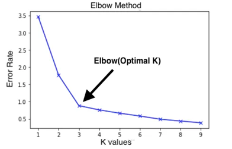
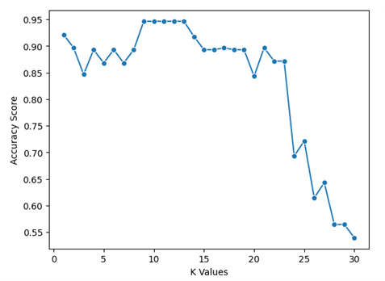
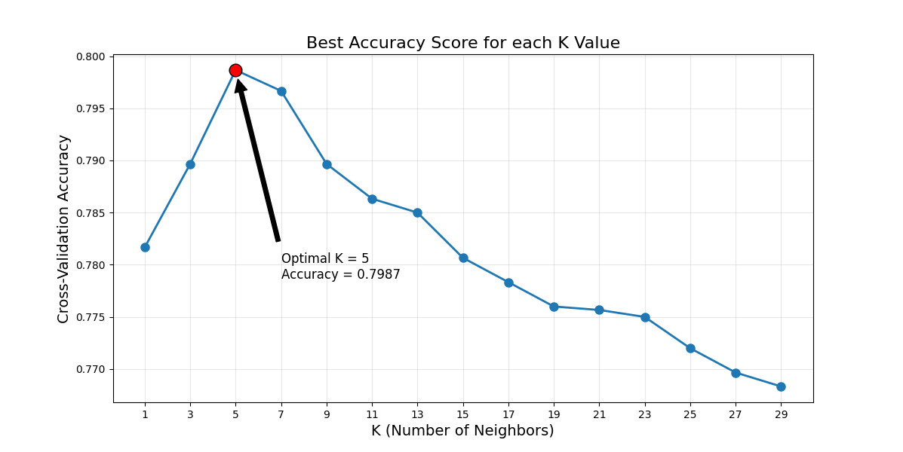
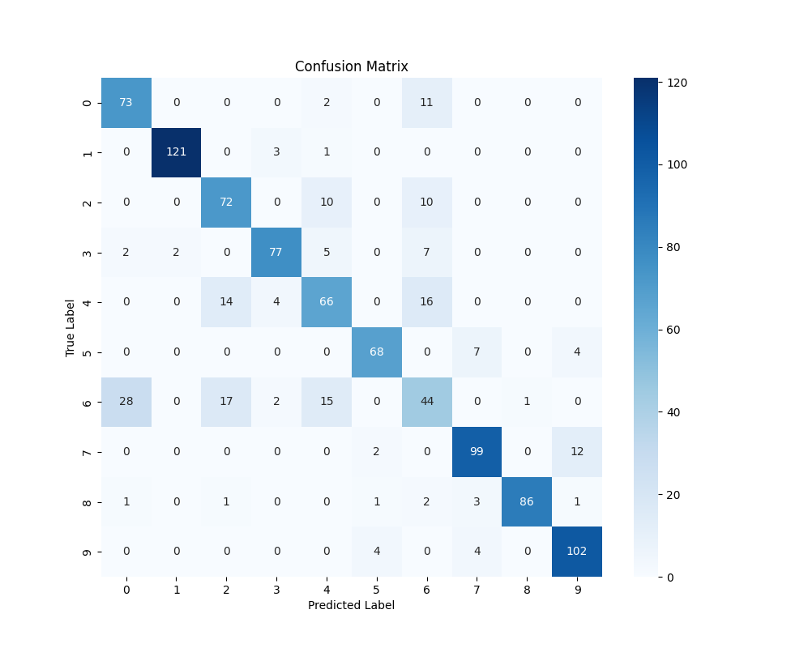
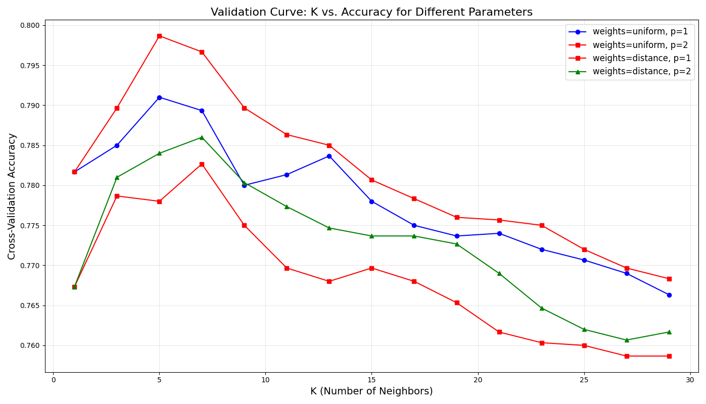

# KNN - תרחישי תיקו ושיטות מתקדמות

## טיפול במקרי תיקו

אחת הבעיות שעלולות להתעורר באלגוריתם KNN היא כאשר קיים תיקו (tie) בין מספר קטגוריות. מצב זה מתרחש כאשר K שכנים מתחלקים באופן שווה בין שתי קטגוריות או יותר

**דוגמה**: נניח שבחרנו K=4 ומצאנו שמתוך ארבעת השכנים הקרובים ביותר, 2 הם תפוחים ו-2 הם תפוזים. איך נחליט לאיזו קטגוריה לסווג את הפרי החדש?

### אסטרטגיות לטיפול בתיקו:

1. **בחירת K אי-זוגי**: השיטה הפשוטה ביותר היא להשתמש ב-K אי-זוגי (3, 5, 7, וכו') כדי למנוע תיקו מלכתחילה. זה עובד היטב עבור בעיות סיווג בינארי (שתי קטגוריות)

2. **שקלול לפי מרחק**: במקום לתת לכל שכן משקל זהה, נשקלל את הקבוצה של הנקודה לפי 1 חלקי d, כאשר d הוא המרחק מהנקודה החדשה. כך, שכנים קרובים יותר מקבלים השפעה גדולה יותר:

$$\text{משקל השכן} = \frac{1}{d(x, x_i)}$$

דוגמה מספרית –לפי 

$$
\frac{1}{d}
$$

נניח שהשתמשנו ב-K=4 והשכנים הקרובים ביותר לפרי חדש הם:

| Neighbor | Class     | Distance from new fruit \( d \) | Weight $\frac{1}{d}$ |
|----------|-----------|-------------------------------|--------------------------|
| 1        | Apple 🍎   | 1.0                           | 1.00                     |
| 2        | Apple 🍎   | 2.0                           | 0.50                     |
| 3        | Orange 🍊  | 3.0                           | 0.33                     |
| 4        | Orange 🍊  | 4.0                           | 0.25                     |

- **תפוח 🍎**:  
  \( 1.00 + 0.50 = 1.50 \)

- **תפוז 🍊**:  
  \( 0.33 + 0.25 = 0.58 \)

### למה דווקא 1 חלקי d

כי בגישה של סכום מרחקים ייתכן מצב שהשכנים של מחלקה מסוימת רחוקים יותר, אבל בגלל שהמרחקים של הקבוצה השנייה יותר מפוזרים, היא תנצח בטעות
אבל עם משקלים של 1 חלקי d, השכן הכי קרוב משפיע חזק מאוד — כמו שצריך

**מסקנה:**

למרות שיש תיקו במספר הקטגוריות (2 תפוחים, 2 תפוזים),  
כאשר מבצעים שקלול לפי המרחק – השכנים הקרובים משפיעים יותר,  
ולכן הקטגוריה **תפוח** מנצחת

3. **הורדת K ב-1**: אם מתרחש תיקו, ניתן להקטין את K באופן זמני ב-1 ולבדוק אם התיקו נפתר

4. **העדפת קטגוריה**: אם יש סיבה לוגית להעדיף קטגוריה מסוימת (למשל קטגוריה שכיחה יותר), ניתן להשתמש בה כמכריעה במקרי תיקו

5. **בחירה אקראית**: בחירה אקראית של אחת מהקטגוריות השוות

דוגמת קוד לטיפול בתיקו באמצעות שקלול מרחקים:

```python
def weighted_knn_predict(X_train, y_train, x_new, k):
    # חישוב מרחקים בין הנקודה החדשה לכל נקודות האימון
    distances = []
    for i, x_train in enumerate(X_train):
        dist = np.sqrt(np.sum((x_train - x_new) ** 2))
        distances.append((dist, i))
    
    # מיון המרחקים ובחירת K הקרובים ביותר
    distances.sort()
    k_nearest = distances[:k]
    
    # שקלול הצבעות לפי המרחק
    class_votes = {}
    for dist, idx in k_nearest:
        weight = 1.0 / max(dist, 0.000001)  # מניעת חלוקה באפס
        vote = y_train[idx]
        
        if vote in class_votes:
            class_votes[vote] += weight
        else:
            class_votes[vote] = weight
    
    # בחירת הקטגוריה עם הציון המשוקלל הגבוה ביותר
    return max(class_votes.items(), key=lambda x: x[1])[0]
```

## מדדי הערכה: Precision, Recall, F1, Support

להערכת ביצועי מודל KNN, משתמשים בכמה מדדים סטנדרטיים:

### 1. Precision (דיוק)
מודד את אחוז הניבויים החיוביים שהיו נכונים באמת:

$$\text{Precision} = \frac{TP}{TP + FP}$$

כאשר:
- TP (True Positive): חיזוי חיובי נכון
- FP (False Positive): חיזוי חיובי שגוי

דיוק גבוה משמעותו שכאשר המודל מנבא 'כן', הוא בדרך כלל צודק

### 2. Recall (כיסוי או רגישות)
מודד איזה אחוז מהמקרים החיוביים באמת המודל הצליח לזהות:

$$\text{Recall} = \frac{TP}{TP + FN}$$

כאשר:
- FN (False Negative): חיזוי שלילי שגוי

כיסוי גבוה משמעותו שהמודל מזהה את רוב המקרים החיוביים האמיתיים

### 3. F1 Score
ממוצע הרמוני של Precision ו-Recall, מאזן בין שני המדדים:

$$\text{F1} = 2 \cdot \frac{\text{Precision} \cdot \text{Recall}}{\text{Precision} + \text{Recall}}$$

גבוה משקף איזון טוב בין דיוק לכיסוי

### 4. Support
מספר המופעים בפועל של כל קטגוריה בקבוצת הבדיקה

### דוגמה מטריצת בלבול (Confusion Matrix):

```               
                  | Predicted: Apple | Predicted: Orange | Predicted: Banana
------------------|------------------|-------------------|-------------------
Actual: Apple     |        14        |         2         |         1
Actual: Orange    |         3        |        16         |         0
Actual: Banana    |         0        |         1         |        13
```

וחישוב המדדים:

```
              precision    recall  f1-score   support
       APPLE      0.82      0.82      0.82        17
       ORANGE     0.84      0.84      0.84        19
       BANANA     0.93      0.93      0.93        14

    accuracy                          0.86        50
   macro avg      0.86      0.86      0.86        50
weighted avg      0.86      0.86      0.86        50
```

הסבר על `macro avg` ו־`weighted avg` בדו"ח סיווג (Classification Report)

כאשר אנו משתמשים בפונקציה `classification_report` מ־Scikit-learn, אנו מקבלים טבלה עם מדדים לכל קטגוריה, כמו:
- **precision** – דיוק התחזיות
- **recall** – יכולת לזהות את המקרים הנכונים
- **f1-score** – the harmonic mean between precision and recall
- **support** – מספר הדוגמאות של כל קטגוריה

מה זה `macro avg`?

- **ממוצע פשוט** של המדדים עבור כל הקטגוריות.
- כל קטגוריה מקבלת **חשיבות שווה**, בלי קשר לגודל שלה.

📌 דוגמה:
אם נחשב את `macro avg` ל־precision:

$$
\text{macro avg precision} = \frac{0.82 + 0.84 + 0.93}{3} = 0.863
$$

מתאים כאשר חשוב לנו להתייחס לכל קטגוריה **באופן שווה**.

מה זה `weighted avg`?

- מחשבים ממוצע של המדדים, אבל כל קטגוריה מקבלת **משקל לפי כמות הדוגמאות שלה (support)**.
- קטגוריה שיש לה יותר דוגמאות תשפיע יותר על הממוצע.

📌 דוגמה:
אם נחשב את `weighted avg` ל־precision:

$$
\text{weighted avg precision} = \frac{(17 \times 0.82) + (19 \times 0.84) + (14 \times 0.93)}{50} = 0.858
$$

מתאים כאשר רוצים לקבל מדד כולל שמייצג **את המציאות של ההתפלגות** בדאטה.

טבלת סיכום:

| סוג ממוצע       | איך מחשבים?                   | מתי מתאים?                         |
|------------------|-------------------------------|-------------------------------------|
| `macro avg`      | ממוצע פשוט של כל הקטגוריות     | כשאתה רוצה לתת חשיבות שווה לכולן   |
| `weighted avg`   | ממוצע משוקלל לפי מספר דוגמאות | כשאתה רוצה לשקף את המציאות בדאטה   |


קוד פייתון להצגת מדדי ביצוע **על חלק הטסט:**

```python
import numpy as np
import pandas as pd
from sklearn.neighbors import KNeighborsClassifier
from sklearn.model_selection import train_test_split
from sklearn.metrics import classification_report, confusion_matrix
import matplotlib.pyplot as plt
import seaborn as sns

colors = np.array([200, 50, 220, 240, 250, 230, 30, 40, 20])
sizes = np.array([7, 7, 6, 9, 8, 9, 12, 13, 11])
weights = np.array([150, 160, 140, 170, 165, 180, 120, 130, 115])
fruit_types = np.array(['apple', 'apple', 'apple', 'orange', 'orange', 'orange', 'banana', 'banana', 'banana'])

# Create feature matrix
X = np.column_stack((colors, sizes, weights))
y = fruit_types

# אימון המודל
X_train, X_test, y_train, y_test = train_test_split(X, y, test_size=0.3, random_state=42)
model = KNeighborsClassifier(n_neighbors=3)
model.fit(X_train, y_train)
y_pred = model.predict(X_test)

# Calculate and display classification report (precision, recall, f1-score, support)
print("Classification Report:")
report = classification_report(y_test, y_pred)
print(report)

# Calculate and display confusion matrix
cm = confusion_matrix(y_test, y_pred)
print("\nConfusion Matrix:")
print(cm)

# Create prettier confusion matrix display with labels
fruit_labels = ['apple', 'orange', 'banana']
cm_df = pd.DataFrame(cm,
                    index=[f'Actual: {label}' for label in fruit_labels],
                    columns=[f'Predicted: {label}' for label in fruit_labels])
print("\nConfusion Matrix (labeled):")
print(cm_df)

# Visualize confusion matrix with heatmap
plt.figure(figsize=(8, 6))
sns.heatmap(cm, annot=True, fmt='d', cmap='Blues',
            xticklabels=fruit_labels,
            yticklabels=fruit_labels)
plt.xlabel('Predicted Label')
plt.ylabel('True Label')
plt.title('Confusion Matrix for Fruit Classification')
plt.tight_layout()
plt.show()
```

## שיטות לבחירת K אופטימלי

### 1. Elbow Method

שיטת ה-Elbow מבוססת על בדיקת שיעור השגיאה של המודל עם ערכי K שונים, וחיפוש נקודת "מרפק" שבה תוספת ערכי K נוספים אינה משפרת משמעותית את הביצועים:

```python
from sklearn.neighbors import KNeighborsClassifier
from sklearn.model_selection import train_test_split
from sklearn.metrics import accuracy_score
import matplotlib.pyplot as plt
import numpy as np

# הכנת הנתונים
X_train, X_test, y_train, y_test = train_test_split(X, y, test_size=0.3, random_state=42)

# בדיקת דיוק עבור ערכי K שונים
k_range = range(1, 31)
scores = []

for k in k_range:
    model = KNeighborsClassifier(n_neighbors=k)
    model.fit(X_train, y_train)
    y_pred = model.predict(X_test)
    scores.append(accuracy_score(y_test, y_pred))  # accuracy = (TP + TN) / (TP + TN + FP + FN)

# הצגת התוצאות בגרף
plt.figure(figsize=(10, 6))
plt.plot(k_range, scores, marker='o')
plt.title('KNN: Accuracy for different K values')
plt.xlabel('K Value')
plt.ylabel('Accuracy')
plt.xticks(k_range[::2])  # הצגת ערכי K זוגיים בלבד לנוחות
plt.grid(True)
plt.show()

# מציאת ערך K האופטימלי
optimal_k = k_range[np.argmax(scores)]
print(f"ערך K האופטימלי הוא: {optimal_k} עם דיוק של: {max(scores):.4f}")
```



בשיטת ה-Elbow, אנו מחפשים את הנקודה שבה השיפור בדיוק מתחיל להתמתן משמעותית, כמו "מרפק" בגרף.

### 2. Cross-Validation (אימות צולב)

אימות צולב מחלק את הנתונים למספר "קיפולים" (folds), ומבצע אימון וניבוי על כל קיפול, ממצע את התוצאות כדי לקבל הערכה מדויקת יותר של ביצועי המודל:

```python
from sklearn.model_selection import cross_val_score

# בדיקת ביצועים עם אימות צולב עבור ערכי K שונים
k_range = range(1, 31)
cv_scores = []

for k in k_range:
    model = KNeighborsClassifier(n_neighbors=k)
    scores = cross_val_score(model, X, y, cv=10, scoring='accuracy')  # 10-fold CV
    # accuracy = (TP + TN) / (TP + TN + FP + FN)
    cv_scores.append(scores.mean())

# הצגת התוצאות בגרף
plt.figure(figsize=(10, 6))
plt.plot(k_range, cv_scores, marker='o')
plt.title('KNN: CV Accuracy for different K values')
plt.xlabel('K Value')
plt.ylabel('CV Accuracy')
plt.xticks(k_range[::2])
plt.grid(True)
plt.show()

# מציאת ערך K האופטימלי
optimal_k_cv = k_range[np.argmax(cv_scores)]
print(f"ערך K האופטימלי (CV) הוא: {optimal_k_cv} עם דיוק ממוצע של: {max(cv_scores):.4f}")
```



# שיטות לבחירת פרמטרים אופטימליים

### GridSearchCV with KNN – Explanation & Example

`GridSearchCV` from Scikit-learn helps you **find the best parameters** for your model  
by searching through all possible combinations (a "grid") of parameters.

#### 📦 In the context of KNN:

You might want to try different values for:

- `n_neighbors`: Number of neighbors (K)
- `weights`: 
  - `'uniform'` — all neighbors have equal weight  
  - `'distance'` — closer neighbors get more weight
- `metric`: 
  - `'euclidean'` — standard distance  
  - `'manhattan'` — city block distance. It measures the distance between two points by only moving horizontally and vertically, like you would in a city with square blocks
    abs(x1-x2) + abs(y1-y2)

#### ⚙️ How it works:

1. You define a **grid of parameters** to test
2. `GridSearchCV` trains the model using **cross-validation** for each combination
3. It evaluates each setup using a scoring metric (e.g., accuracy)
4. It returns the **best parameter combination** based on results

#### 🧠 Python Example:

```python
from sklearn.model_selection import GridSearchCV
from sklearn.neighbors import KNeighborsClassifier

# Example data (X, y)
# Assume X and y are already defined

# Base model
knn = KNeighborsClassifier()

# Grid of parameters to try
param_grid = {
    'n_neighbors': list(range(1, 31)),
    'weights': ['uniform', 'distance'],
    'metric': ['euclidean', 'manhattan']
}

# Grid Search with 5-fold cross-validation
grid = GridSearchCV(knn, param_grid, cv=5, scoring='accuracy')
grid.fit(X, y)

# Show best results
print("Best parameters:", grid.best_params_)
print("Best accuracy:", grid.best_score_)
```

Demo output:
```
GridSearchCV completed in 3.64 seconds
Best parameters: {'knn__n_neighbors': np.int64(11), 'knn__p': 2, 'knn__weights': 'distance'}
  p stands for the Minkowski distance formula:
  if p = 1 → Manhattan (city block) distance
  if p = 2 → Euclidean distance
Best accuracy: 0.8239
```


### כיצד לבחור את K המתאים?

1. **גודל המדגם**: ככל שמדגם האימון גדול יותר, ניתן להשתמש ב-K גדול יותר.
   
2. **רמת הרעש בנתונים**: 
   - לנתונים עם מעט רעש: K קטן יותר (1-5)
   - לנתונים עם הרבה רעש: K גדול יותר (להפחית את השפעת הרעש)

3. **מורכבות הגבולות בין המחלקות**:
   - גבולות פשוטים: K גדול יותר
   - גבולות מורכבים: K קטן יותר

4. **כלל אצבע**: לעתים קרובות מומלץ להתחיל עם $K = \sqrt{n}$ כאשר n הוא מספר הדוגמאות במדגם האימון.

5. **ערכים אי-זוגיים**: עבור בעיות סיווג בינארי, כדאי לבחור ערכי K אי-זוגיים כדי למנוע תיקו.

6. ## סיכום

בחירת ערך K האופטימלי היא מפתח להצלחת אלגוריתם KNN:

1. **שיטות מומלצות לבחירת K**:
   - עבור מדגמים קטנים: אימות צולב (cross-validation)
   - עבור מדגמים גדולים: שיטת Elbow או GridSearchCV
   - שימוש ב-K אי-זוגי למניעת תיקו בבעיות בינאריות

2. **טיפול במקרי תיקו**:
   - שימוש במשקולות מרחק (`weights='distance'`)
   - בחירת K אי-זוגי
   - הפחתת K או הגדלתו במקרה הצורך

## נספח א': דוגמא עם fetch_openml

<a href="A10-fetch_openml.md">read here about fetch_openml</a>


```python
import numpy as np
import pandas as pd
import matplotlib.pyplot as plt
import seaborn as sns
from sklearn.neighbors import KNeighborsClassifier
from sklearn.model_selection import GridSearchCV, train_test_split, learning_curve
from sklearn.metrics import accuracy_score, classification_report, confusion_matrix
from sklearn.preprocessing import StandardScaler
from sklearn.datasets import fetch_openml
from sklearn.pipeline import Pipeline
import time
import warnings

warnings.filterwarnings('ignore')

# Load or create dataset
print("Loading dataset...")

# fetch_openml has different datasets like:
# mnist_784, fashion-mnist, covertype, shuttle, letter
dataset = fetch_openml('fashion-mnist', version=1, as_frame=False)
X, y = dataset.data, dataset.target

# Take a subset for faster computation if needed
subset_size = 5000
if X.shape[0] > subset_size:
    indices = np.random.choice(X.shape[0], subset_size, replace=False)
    X, y = X[indices], y[indices]
print(f"Dataset shape: {X.shape}, with {len(np.unique(y))} classes")

# Split the data into training, validation, and test sets
X_train, X_temp, y_train, y_temp = train_test_split(X, y, test_size=0.4, random_state=42)
X_val, X_test, y_val, y_test = train_test_split(X_temp, y_temp, test_size=0.5, random_state=42)

print(f"Training set: {X_train.shape}")
print(f"Validation set: {X_val.shape}")
print(f"Test set: {X_test.shape}")

# Create a pipeline that includes scaling and KNN
pipeline = Pipeline([
    ('scaler', StandardScaler()),
    ('knn', KNeighborsClassifier())
])

reduced_param_grid = {
    'knn__n_neighbors': np.arange(1, 31, 2),  # K values from 1 to 30 (odd numbers)
    'knn__weights': ['uniform', 'distance'],  # Weight function
    'knn__p': [1, 2]  # 1 for Manhattan, 2 for Euclidean
}

# Create GridSearchCV
print("Setting up GridSearchCV...")
grid_search = GridSearchCV(
    pipeline,
    reduced_param_grid,  # Use reduced_param_grid for faster execution
    cv=5,  # 5-fold cross-validation
    n_jobs=-1,  # Use all available cores
    verbose=1,
    scoring='accuracy',
    return_train_score=True
)

# Fit the model
print("Training model with GridSearchCV...")
start_time = time.time()
grid_search.fit(X_train, y_train)
end_time = time.time()
print(f"GridSearchCV completed in {end_time - start_time:.2f} seconds")

# Get the best parameters and score
print(f"Best parameters: {grid_search.best_params_}")
print(f"Best cross-validation score: {grid_search.best_score_:.4f}")

# Evaluate on validation set
best_model = grid_search.best_estimator_
val_predictions = best_model.predict(X_val)
val_accuracy = accuracy_score(y_val, val_predictions)
print(f"Validation accuracy: {val_accuracy:.4f}")

# Evaluate on test set
test_predictions = best_model.predict(X_test)
test_accuracy = accuracy_score(y_test, test_predictions)
print(f"Test accuracy: {test_accuracy:.4f}")

# Print classification report
print("\nClassification Report:")
print(classification_report(y_test, test_predictions))

### Visualize

```

output:
```
Loading dataset...
Dataset shape: (5000, 784), with 10 classes
Training set: (3000, 784)
Validation set: (1000, 784)
Test set: (1000, 784)
Setting up GridSearchCV...
Training model with GridSearchCV...
Fitting 5 folds for each of 60 candidates, totalling 300 fits
GridSearchCV completed in 50.65 seconds
Best parameters: {'knn__n_neighbors': np.int64(5), 'knn__p': 1, 'knn__weights': 'distance'}
Best cross-validation score: 0.7917
Validation accuracy: 0.7870
Test accuracy: 0.8120

Classification Report:
              precision    recall  f1-score   support

           0       0.77      0.84      0.81       108
           1       1.00      0.92      0.96        92
           2       0.73      0.59      0.65       103
           3       0.86      0.84      0.85        95
           4       0.60      0.84      0.70        90
           5       0.97      0.81      0.88       122
           6       0.57      0.48      0.53        95
           7       0.81      0.92      0.86       104
           8       0.97      0.92      0.94        97
           9       0.88      0.95      0.91        94
```

<a href="9zz-full-demo.py"/>see complete code...</a>









