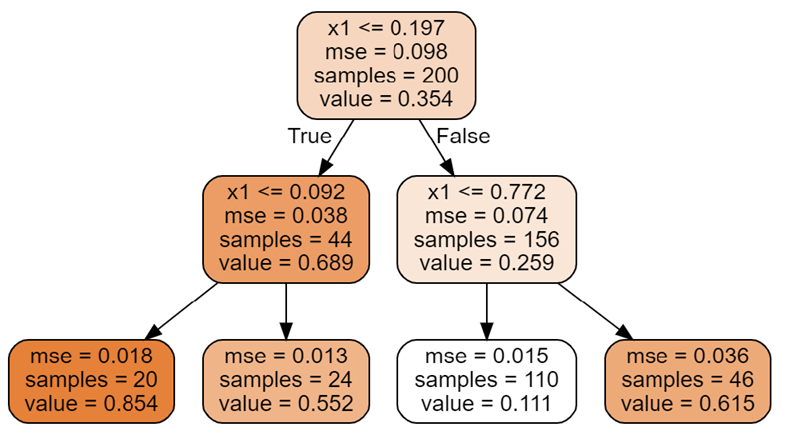
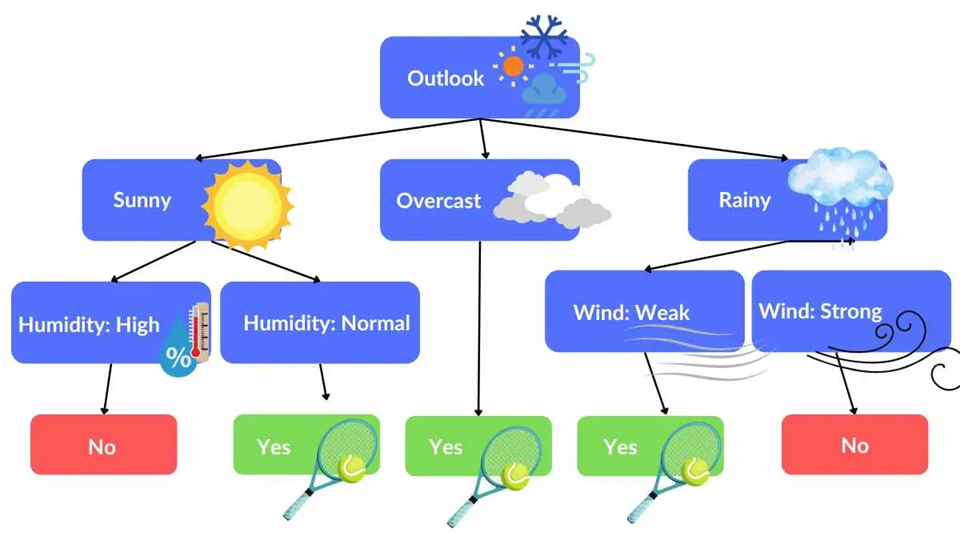
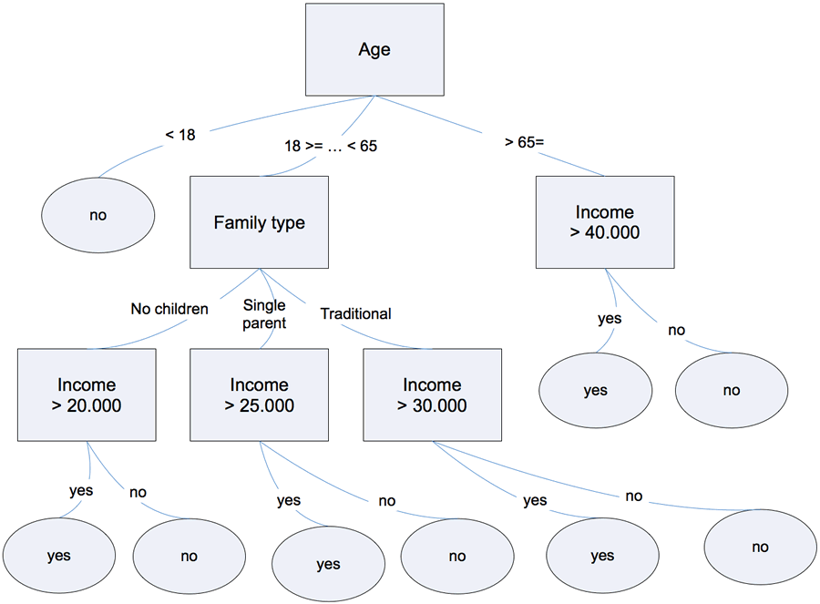

  
## סוגי עצי החלטה
  
## 1. CART (Classification and Regression Trees)
  
**דוגמה**  
- סיווג: חיזוי אם אדם יאושר להלוואה לפי גיל והכנסה  
- רגרסיה: חיזוי מחיר דירה לפי שטח ומספר חדרים
  
**מאפיין עיקרי**  
- יוצר תמיד **עץ בינארי** (כל צומת מתפצל לשני ענפים בלבד)  
- מתאים גם לבעיות **סיווג** וגם לבעיות **רגרסיה**
  
**מדד חלוקה**  
- **Gini impurity** (לבעיות סיווג)  
- **Mean Squared Error (MSE)** (לבעיות רגרסיה)
  
  
### מה זה Mean Squared Error (MSE) בעצי החלטה?
  

  
**מדד חלוקה** שנמצא בשימוש בעצי החלטה מסוג **רגרסיה**  
המטרה של המדד היא להעריך **כמה טוב הפיצול מנבא את הערכים הרציפים** (כמו מחיר, גיל, משקל)  
ככל שה-MSE קטן יותר, כך הפיצול נחשב **טוב יותר**  
  
##### הנוסחה של MSE
  

  
  
  
-  – מספר הדגימות בצומת  
-  – הערך האמיתי של דגימה   
-  – ממוצע הערכים בצומת (תחזית העץ)
  
##### איך זה עובד?
  
1. בכל צומת בעץ, העץ שוקל **פיצולים אפשריים** (למשל: האם לפצל לפי גיל גדול מ-30 או לא)  
2. עבור כל פיצול אפשרי, העץ מחשב את ה-MSE בכל תת-קבוצה שנוצרת  
3. העץ בוחר את הפיצול שמביא ל**ירידה הכי גדולה ב-MSE הכולל** (כלומר, שמקטין את השגיאה הכי הרבה)
  
##### דוגמה פשוטה
  
נניח שיש לנו את הנתונים הבאים (ננסה לנבא **מחיר דירה** לפי **שטח**):
  
| שטח (מ"ר) | מחיר (אלפי ₪) |
|------------|---------------|
| 50         | 1000          |
| 60         | 1200          |
| 70         | 1300          |
| 80         | 1500          |
  
##### צומת ראשי (לפני פיצול):
  
- ממוצע המחירים:  

  
  
  
- חישוב ה-MSE:  

  
  

  
  
  
##### אחרי פיצול (למשל לפי שטח גדול מ-65):
  
- קבוצה 1 (שטח ≤ 65):  
  - דירות: 50 מ"ר (1000), 60 מ"ר (1200)  
  - ממוצע: 1100  
  - MSE:  
  

  
  
  
- קבוצה 2 (שטח > 65):  
  - דירות: 70 מ"ר (1300), 80 מ"ר (1500)  
  - ממוצע: 1400  
  - MSE:  
  

  
  
  
- MSE כולל אחרי פיצול:  
  

  
  
  
##### סיכום:
  
- לפני פיצול: **MSE = 32500**  
- אחרי פיצול: **MSE = 10000**
  
מכאן שהפיצול **שיפר את הדיוק** (כי ה-MSE ירד)
  
## 2. ID3 (Iterative Dichotomiser 3)
  

  
**דוגמה**  
- סיווג אם לשחק טניס לפי תנאי מזג האוויר (תכונות כמו "שמשי", "גשום", "לח")
  
**מאפיין עיקרי**  
- עובד טוב עם **נתונים קטגוריים בלבד** – תכונות שמחולקות לקבוצות ברורות כמו צבע או מזג אוויר  
- **נתונים רציפים** (כמו גיל או הכנסה) דורשים **חלוקה לטווחים** לפני השימוש
- יוצר **עץ לא בהכרח בינארי** (כל צומת יכול להתפצל גם ליותר משני ענפים)  
  
**מדד חלוקה**  
- **Information Gain** (מבוסס על **Entropy**)
  
### מה זה Information Gain?
  
**מדד חלוקה** שמשמש בעצי החלטה (בעיקר **ID3** ו-**C4.5**)  
המטרה של IG היא למדוד **כמה אי-סדר (אנטרופי)** הצלחנו **להפחית** בעזרת פיצול נתונים לפי תכונה מסוימת  
ככל שה-IG **גבוה יותר**, הפיצול נחשב **טוב יותר** כי הוא עושה את הקבוצות **טהורות** יותר
  
##### למה צריך את זה?
  
בכל שלב בבניית עץ החלטה, צריך לבחור **איזו תכונה הכי משתלם לפצל לפיה**  
- תכונה עם **IG גבוה** תביא לחלוקה שבה הקבוצות הרבה יותר **אחידות**  
- תכונה עם **IG נמוך** לא תעזור לנו לסדר את הדאטה, והקבוצות ישארו **מעורבבות**
  
איי גיי עוזר לנו לבחור את **התכונה הכי טובה** לפיצול בכל צומת
  
##### איך מחשבים את זה?
  
1. מחשבים את ה-**Entropy** של הקבוצה לפני הפיצול:
  

  
  
  
-  – הקבוצה הנוכחית  
-  – מספר הקבוצות (קטגוריות)  
-  – הסיכוי של כל קבוצה (למשל, אחוז ה-Yes וה-No)
  
2. מחשבים את ה-**Entropy הממוצע אחרי הפיצול** (Weighted Average):
  

  
  
  
-  – מספר תתי הקבוצות שנוצרו מהפיצול  
-  – כל תת-קבוצה  
-  – גודל תת-הקבוצה  
-  – גודל הקבוצה המקורית
  
3. מחשבים את ה-**Information Gain**:
  

  
  
  
##### דוגמה
  
נתונים:  
| Outlook  | Play Tennis |
|----------|-------------|
| Sunny    | No          |
| Sunny    | No          |
| Overcast | Yes         |
| Rain     | Yes         |
| Rain     | Yes         |
| Rain     | No          |
| Overcast | Yes         |
| Sunny    | Yes         |
| Sunny    | Yes         |
| Rain     | Yes         |
| Sunny    | No          |
| Overcast | Yes         |
| Overcast | Yes         |
| Rain     | No          |
  
##### 1. מחשבים Entropy לפני הפיצול (כל הדאטה):
  
- **Yes** = 9, **No** = 5
  

  
  
  
##### 2. מחשבים Entropy אחרי פיצול לפי Outlook:
  
- **Sunny** (5 דגימות): 2 Yes, 3 No → Entropy ≈ 0.971  
- **Overcast** (4 דגימות): 4 Yes, 0 No → Entropy = 0  
- **Rain** (5 דגימות): 3 Yes, 2 No → Entropy ≈ 0.971
  
- Weighted Entropy after split:
  

  
  
  
##### 3. מחשבים Information Gain:
  

  
  
  
## 3. C4.5
  

  
**דוגמה**  
- חיזוי אם לקוח יקנה מחשב לפי גיל (רציף), תעסוקה (קטגוריה), והכנסה (רציף)
  
**מאפיין עיקרי**  
- **תומך בנתונים רציפים** – מסוגל להתמודד עם מספרים כמו גיל או הכנסה בלי לחלק לטווחים  
- **תומך בערכים חסרים** – יכול לעבוד גם אם חסר מידע בחלק מהפיצ'רים  
- כולל **גיזום (Pruning)** – קיצור העץ כדי למנוע **אוברפיטינג**
- יוצר **עץ לא בהכרח בינארי** (כל צומת יכול להתפצל גם ליותר משני ענפים)  
  
**מדד חלוקה**  
- **Gain Ratio** (שיפור של Information Gain)
  
### מה זה Gain Ratio?
  
  מדד חלוקה בעצי החלטה (למשל בעץ **C4.5**)  
המטרה שלו היא **לשפר** את **Information Gain** ולפתור את הבעיה שבה Information Gain **מעדיף תכונות עם הרבה ערכים שונים** (כמו ת"ז או מזהה ייחודי)  
**Gain Ratio** מתקן את זה על ידי חלוקה ב-**Split Information** (מידע על פיזור הפיצולים)
  
##### למה צריך את Gain Ratio?
  
- **איי גיי** יכול להעדיף תכונות שיש להן **המון ערכים ייחודיים**, גם אם זה **לא עוזר לסיווג**  
- **ראטיו גיין** בודק גם **כמה הפיצול מתפזר** – אם הפיצול מפזר את הנתונים להרבה קבוצות קטנות, הוא מעניש אותו
  
##### איך מחשבים Gain Ratio?
  
1. מחשבים את **Information Gain (IG)**:
  

  
  
  
2. מחשבים את **Split Information**:
  

  
  
  
3. מחשבים את **Gain Ratio**:
  

  
  
  
##### דוגמה
  
נניח שיש תכונה אחת עם **3 ערכים** (למשל: Low, Medium, High)  
ותכונה אחרת עם **14 ערכים שונים** (כמו ת"ז)
  
- **איי גיי** עשוי לבחור את ת"ז כי הוא רואה שכל דגימה נכנסת לקבוצה נפרדת (כלומר, הפיצול מאוד חד)  
- אבל **גיין ראטיו** יסתכל גם על **כמה התפזרו הדגימות** בין הקבוצות  
- הוא יעניש פיצולים שמפזרים את הנתונים ליותר מדי קבוצות קטנות, ולכן יעדיף את התכונה עם Low/Medium/High
  
  
## 4. Random Forest
  

  
**דוגמה**  
- חיזוי **נטישת לקוחות** (למשל אם לקוח יעזוב חברת סלולר) לפי דפוסי שימוש, היסטוריית תשלומים ופניות לשירות לקוחות
  
**מאפיין עיקרי**  
- יער של **עצים אקראיים**  
  - כל עץ נבנה על **מדגם אקראי** של הנתונים (Random Sampling עם החזרה)  
  - בכל פיצול בעץ נבחרת **קבוצת תכונות אקראית** לבדיקה (Random Feature Selection)  
- משפר **דיוק** ומפחית **אוברפיטינג** ע"י שילוב תחזיות של עצים רבים
  
**מדד חלוקה**  
- כל עץ בתוך היער הוא לרוב **CART** – משתמש ב-**Gini impurity** (לסיווג) או **MSE** (לרגרסיה)
  
---
  
  
  
## השוואה קצרה:
  
### השוואה קצרה:
  
| תכונה                | CART            | ID3                 | C4.5           | Random Forest                       |
|-----------------------|-----------------|---------------------|----------------|-------------------------------------|
| **שימוש**            | סיווג ורגרסיה   | סיווג בלבד          | סיווג בלבד    | סיווג ורגרסיה                      |
| **מדד חלוקה**        | Gini / MSE      | Entropy + Info Gain | Gain Ratio     | Gini / MSE בכל עץ (כמו CART)       |
| **תומך במספרים רציפים** | כן             | לא                  | כן             | כן                                  |
| **תומך בנתונים חסרים של פיצ'ר** | כן              | לא                  | כן             | כן                                  |
| **סוג הפיצול**       | בינארי בלבד     | לא חייב בינארי      | לא חייב בינארי | בינארי בכל עץ (כמו CART), אבל שילוב ביחד שיטת אנסמבל |
  
  
  
  
  
  