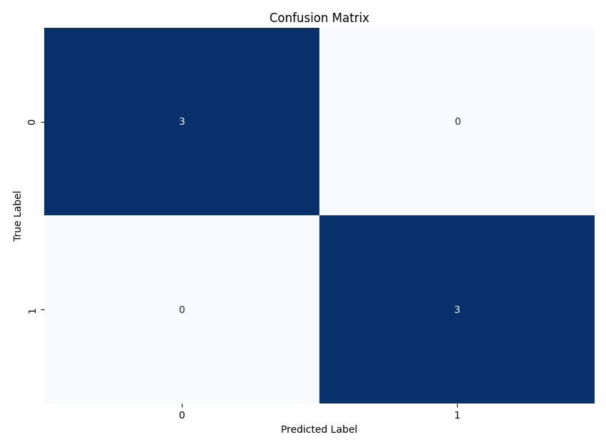
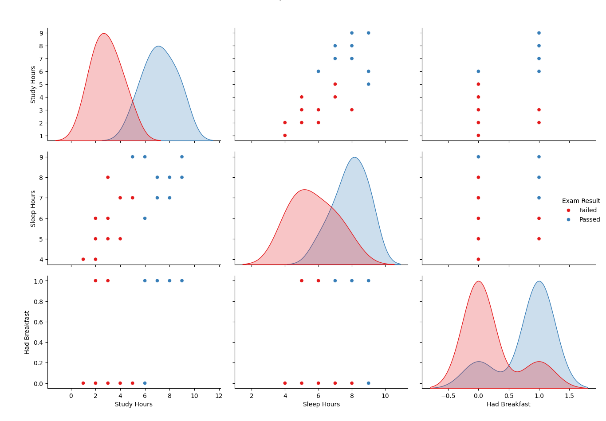

# יער רנדומלי (Random Forest)

## הבעיה שרוצים לפתור

עצי החלטה בודדים סובלים מבעיות כמו:
- **Overfitting** — העץ לומד טוב מדי את הדאטה ולא מסוגל לחזות על דאטה חדש
- **התעלמות מתכונות** — העץ מתמקד רק בחלק מהתכונות בפיצולים (כי עץ החלטה רגיל בנוי כך שהוא בכל שלב בוחר את הפיצול הכי טוב — כלומר את התכונה שמביאה להפרדה הכי ברורה בין המחלקות)

**דוגמה**:

נניח שאנו רוצים לחזות אם לקוח יקבל אשראי, בהתבסס על גיל ומשכורת. עץ החלטה יחיד עשוי לבנות חוקים מדויקים מאוד לדאטה הקיים, אך ייכשל לחזות נכונה לקוחות חדשים

## איך Random Forest פותר את הבעיה?

במקום לבנות **עץ אחד**, יער רנדומלי בונה **הרבה עצים שונים** על **חלקים שונים מהמידע** ו**חלקים שונים מהתכונות**:

- בבעיית סיווג (Classification) → לוקחים **רוב קולות** (Voting)
- בבעיית רגרסיה (Regression) → לוקחים **ממוצע** של התחזיות

## תהליך פעולה של Random Forest

1. בחירה **מדגם אקראי עם החזרה** מהדאטה (Bootstrapping)
2. בכל פיצול: **בחירה אקראית** של קבוצת תכונות
3. בערך 63% מהדאטה נכנס לכל עץ (לפי הסתברות), כלומר כ־37% מהשורות לא מופיעות בכלל באותו עץ
4. בניית עץ עד הסוף (ללא גיזום)
5. חזרה על השלבים כדי לבנות הרבה עצים
6. תחזית סופית על ידי רוב קולות או ממוצע

### ❌ Why Random Forest Skips Pruning

Random Forest uses a **different strategy** to avoid overfitting:

- Each tree is trained on a **random subset** of the data (bootstrapping)
- At each split, only a **random subset of features** is considered
- Each tree is grown **fully** (no pruning)

Instead of simplifying individual trees, Random Forest relies on the **diversity of the forest** — the idea that many different trees making mistakes in different ways will average out to a good prediction.

Why is This Effective?

- A single tree might overfit — but averaging many trees leads to stable predictions
- Fully grown trees can capture patterns better; randomness reduces the risk of memorizing noise
- No need to manually tune tree size — the ensemble handles it through averaging

### 🔍 Does Random Forest Use Gini Impurity?

Yes — by default, **Random Forest uses Gini Impurity** to decide how to split nodes in each decision tree it builds.

What is Gini Impurity?

Gini Impurity is a measure of how "pure" a node is. In classification:
- A node is **pure** if all examples belong to the same class.
- A node is **impure** if there's a mix of classes.

The formula for Gini Impurity is:

\[
G = 1 - \sum_{i=1}^{C} p_i^2
\]

Where:
- \( C \) is the number of classes
- \( p_i \) is the probability of a sample being in class \( i \) at that node

The goal is to **choose the split that minimizes impurity**

**Why is Gini used in Random Forest?**

Because each tree in the forest is a regular decision tree (CART), and CART uses Gini by default.
It is:
- Fast to compute
- Works well for classification
- Often performs similarly to entropy (information gain), but with less computation

**Can I use something else?**

Yes! You can use **entropy** instead by setting the `criterion` parameter:

```python
from sklearn.ensemble import RandomForestClassifier
model = RandomForestClassifier(criterion="entropy")
```

This uses **information gain** instead of Gini to evaluate splits.


In short: Why use Gini? | It's fast, simple, and performs well in practice. **Random Forest relies on Gini Impurity to guide how each tree splits the data — unless you tell it otherwise**

### 🌲 Does Random Forest Use CART Trees?

Yes — **Random Forest uses CART (Classification and Regression Trees)** as the base tree model for both classification and regression tasks.

**What is CART?**

**CART** stands for **Classification and Regression Trees**, introduced by Breiman et al. in 1986. It's a type of decision tree algorithm with the following characteristics:

✅ Key Features of CART:
- **Binary Splits Only**: Every internal node splits into exactly two branches (left/right)
- **Supports Two Tasks**:
  - **Classification** → typically uses **Gini Impurity** or **Entropy**
  - **Regression** → uses **Mean Squared Error (MSE)**
- **No Multi-way Splits**: Unlike algorithms like ID3 or C4.5, CART only splits one feature at a time into two groups
- **Can Grow Fully**: Unless explicitly pruned or limited, CART trees grow until all leaves are pure or stopping conditions are met

**🌳 How CART Fits into Random Forest**

Random Forest is essentially a collection (an ensemble) of CART trees:
- Each tree is built using the CART algorithm
- Random Forest adds randomness by:
  - Bootstrapping the data (random samples with replacement)
  - Randomly selecting features for each split (`max_features`)

This combination allows the forest to reduce overfitting while keeping the power of CART.

**Summary**

| Feature | CART | Random Forest |
|--------|------|----------------|
| Tree Type | Binary-only CART | Ensemble of CART trees|
| Supports Classification? | ✅ | ✅ |
| Supports Regression? | ✅ | ✅ |
| Uses pruning? | Optional | ❌ Not used by default |
| Split criterion | Gini, Entropy, MSE | Gini/Entropy per tree |

Ensemble = a method that combines multiple models (="weak learners") to produce a stronger, more accurate model

Random Forest builds **many CART trees** with added randomness — and combines their predictions to form a powerful, robust model

### ⚖️ Does Random Forest Require Feature Scaling?

No — **Random Forest does not require feature scaling** such as standardization or normalization.

**Why Not?**

Random Forest is based on **decision trees**, which split data using thresholds like:
```text
Is feature X <= some value?
```

This splitting behavior is **not affected** by the magnitude or distribution of the feature values.

- Whether a feature ranges from 0–1 or 0–1000, the tree only cares about where to split the data to separate classes.
- Unlike models like Logistic Regression or KNN, **distance and scale do not impact the tree’s logic.**

**When Is Scaling Needed?**

Feature scaling is needed when the algorithm relies on **distance, gradient optimization, or numerical stability**

Examples:
- ✅ **Needed**:
  - Logistic Regression
  - Linear Regression (if using gradient descent)
  - Polynomial Regression
  - K-Nearest Neighbors (KNN)
  - Support Vector Machines (SVM)
- ❌ **Not Needed**:
  - Decision Trees
  - Random Forest
  - XGBoost
  - LightGBM

**Summary**

| Model Type | Needs Scaling? |
|------------|----------------|
| Random Forest | ❌ No |
| Decision Tree | ❌ No |
| Logistic Regression | ✅ Yes |
| Linear Regression (with GD) | ✅ Yes |
| Polynomial Regression | ✅ Yes |
| KNN | ✅ Yes |

So with Random Forest, **you can skip feature scaling** — and it’ll still perform just fine

## מה זה Bootstrapping במודל?

 תהליך שבו אנו יוצרים מדגם חדש מהנתונים הקיימים **על ידי בחירה אקראית של דגימות עם החזרה**. כלומר:
- ייתכן שדוגמה תיבחר יותר מפעם אחת
- ייתכן שדוגמה מסוימת לא תיבחר בכלל

המטרה: כל עץ רואה גרסה מעט שונה של הדאטה. זה מייצר **גיוון** בין העצים ועוזר למודל להיות יותר יציב ולפחות מוטה.

**דוגמה פשוטה**:

אם יש לנו 5 דוגמאות: A, B, C, D, E

אחד העצים יכול להיבנות על בסיס מדגם כמו: A, B, B, D, E

## בקטנה: מה זה Out-Of-Bag Error?

כאשר עושים Bootstrapping, לא כל הדוגמאות נבחרות למדגם
- את הדוגמאות **שלא נבחרו** אפשר לשמור לבדיקה
- כך ניתן לבדוק **כמה טוב כל עץ מנבא** על הדוגמאות שלא שימשו לאימון שלו
- משם מחשבים **OOB Error** שהוא מדד לביצועי המודל בלי להפריד סט בדיקה (Train/Test)

**דוגמה סופר פשוטה:**

| גיל | משכורת | קיבל אשראי |
|-----|---------|--------------|
| 25  | 3000    | לא           |
| 30  | 5000    | כן           |
| 45  | 7000    | כן           |
| 22  | 2500    | לא           |
| 35  | 6000    | כן           |

ביער רנדומלי:
- כל עץ רואה מדגם שונה מהדאטה (עם החזרה)
- בכל פיצול ייבחרו תכונות שונות
- כל עץ ילמד על דאטה אחר
- התחזית הסופית תהיה ממוצעת מכל העצים ✨

## מתמטיקה בסיסית

אם:
$$
T_1(x), T_2(x), \ldots, T_K(x)
$$
הם העצים,

אז התחזית הסופית היא:

- **סיווג**:
$$
\text{Prediction}(x) = \text{Majority Vote}(T_1(x), T_2(x), \ldots, T_K(x))
$$

- **רגרסיה**:
$$
\text{Prediction}(x) = \frac{1}{K} \sum_{i=1}^{K} T_i(x)
$$

## השוואה: עץ החלטה יחיד מול Random Forest

| נושא | עץ החלטה בודד | יער רנדומלי |
|:-----|:--------------|:------------|
| דיוק | גבוה על אימון, נמוך על חדש | יציב וגבוה |
| שימוש בתכונות | חלק מהתכונות מוזנחות | רוב התכונות משולבות |
| שונות | גבוהה | נמוכה |

## פרמטרים חשובים ב-Random Forest

- `n_estimators` → כמה עצים לבנות. ככל שיש יותר עצים, המודל לומד טוב יותר (עד גבול מסוים)
- `max_features` → כמה תכונות ייבחרו באקראי בכל פיצול. משפיע על גיוון העצים
- `bootstrap` → האם לבצע דגימה עם החזרה (בוטסטראפ). ברירת מחדל: אמת
- `oob_score` → אם אמת, המודל ישתמש בדוגמאות שלא נבחרו במדגם כדי להעריך את הדיוק (שגיאת-מחוץ-לתיק) בלי צורך בסט בדיקה נפרד

### למה Bootstrapping חשוב?

- יוצר גיוון בין העצים
- מפחית קורלציה בין עצים
- משפר יציבות והכללה (generalization)
- מאפשר לחשב Out-Of-Bag Error מבלי להפריד דאטה

---

## דוגמת קוד פשוטה בפייתון

```python
import numpy as np
import seaborn as sns
from matplotlib import pyplot as plt
from sklearn.ensemble import RandomForestClassifier
from sklearn.model_selection import train_test_split
from sklearn.metrics import accuracy_score, confusion_matrix, classification_report

# Creating a sample dataset directly in the code
# Data represents students with study hours, sleep hours, and breakfast (yes/no)
# Target is whether they passed an exam (1) or failed (0)

# Features data
study_hours = [2, 8, 5, 1, 7, 3, 6, 4, 9, 2, 7, 4, 8, 3, 6, 9, 5, 3, 7, 2]
sleep_hours = [5, 8, 9, 4, 7, 8, 6, 7, 9, 6, 8, 5, 7, 6, 9, 8, 7, 5, 8, 4]
had_breakfast = [1, 1, 0, 0, 1, 0, 1, 0, 1, 0, 1, 0, 1, 1, 0, 1, 0, 0, 1, 0]  # 1=yes, 0=no

# Create features array
X = np.column_stack((study_hours, sleep_hours, had_breakfast))

# Target data (pass/fail)
y = np.array([0, 1, 1, 0, 1, 0, 1, 0, 1, 0, 1, 0, 1, 0, 1, 1, 0, 0, 1, 0])

# Feature names for better visualization
feature_names = ["Study Hours", "Sleep Hours", "Had Breakfast"]

# Split the data into training and testing sets
X_train, X_test, y_train, y_test = train_test_split(
    X, y, test_size=0.3, random_state=42
)

# Create a Random Forest model
rf_model = RandomForestClassifier(
    n_estimators=100,
    bootstrap=True,
    oob_score=True,
    random_state=42
)

# Train the model
rf_model.fit(X_train, y_train)

# Predict on test set
y_pred = rf_model.predict(X_test)

# Calculate accuracy scores
accuracy = accuracy_score(y_test, y_pred)
print(f"Model Accuracy: {accuracy:.2f}")
print(f"Out-of-Bag Accuracy: {rf_model.oob_score_:.2f}")

# Print detailed classification report
print("\nClassification Report:")
print(classification_report(y_test, y_pred))
```

Output
```
Model Accuracy: 1.00
Out-of-Bag Accuracy: 0.93

Classification Report:
              precision    recall  f1-score   support

           0       1.00      1.00      1.00         3
           1       1.00      1.00      1.00         3

    accuracy                           1.00         6
   macro avg       1.00      1.00      1.00         6
weighted avg       1.00      1.00      1.00         6
```

**הסבר:**
- הדאטה מפוצל על עצים שונים (עם תכונות שונות)
- בסוף אוספים את כל התחזיות ומקבלים החלטה סופית

### דיוק המודל (Model Accuracy) מול Out-of-Bag Accuracy

בואו נבין בצורה ברורה מה ההבדל בין שני מדדי הדיוק החשובים האלו: `Model Accuracy` ו־`OOB Accuracy`

#### ✅ מה זה `accuracy_score` ואיך מחשבים אותו?

```python
accuracy = accuracy_score(y_true, y_pred)
```

זו פשוט הנוסחה:

\[
\text{Accuracy} = \frac{CorrectPredictions}{TotalPredictions}
\]

#### דוגמה:
אם היו לך 10 דוגמאות, והמודל ניחש נכון ב־9 מהן:

\[
\text{Accuracy} = \frac{9}{10} = 0.90
\]

#### מה זה Out-of-Bag Accuracy (OOB Accuracy)?

כשאנחנו משתמשים ב־**Bootstrapping** (מדגם עם החזרה), כל עץ ביער רנדומלי מקבל רק חלק מהשורות מהדאטה

- חלק מהשורות **לא נכנסות בכלל** לאימון של אותו עץ — אלו נקראות **Out-of-Bag samples**
- אנחנו יכולים להשתמש בשורות האלו כדי לבדוק **כמה טוב העץ מנבא דוגמאות שהוא לא ראה**

**התהליך:**
- עבור כל דוגמה — אוספים תחזיות רק מהעצים **שלא ראו אותה באימון**
- לוקחים ממוצע/רוב קולות → זו התחזית הסופית
- משווים לתוצאה האמיתית
- כך מחשבים את הדיוק הכולל על דוגמאות ה־OOB

#### 🔢 דוגמה תוצאה:
```python
Model Accuracy: 1.00
Out-of-Bag Accuracy: 0.93
```

#### הסבר:
- `Model Accuracy = 1.00` → המודל ניחש את **כל הדוגמאות בסט הבדיקה** נכונה (יופי!)
- `OOB Accuracy = 0.93` → המודל הצליח ב־93% מהמקרים **על הדאטה שלא שימש לאימון** בכל עץ

**✨ יתרונות OOB Accuracy**

- מאפשר **הערכה פנימית** של המודל בלי להשתמש ב־`train_test_split`
- חוסך זמן ומאמץ
- מזכיר מאוד **Cross Validation** אבל אוטומטי

**לסיכום:**

| מדד | איך נבנה | מה הוא מודד |
|-----|----------|--------------|
| `Model Accuracy` | תחזית על סט בדיקה | דיוק חיצוני קלאסי |
| `OOB Accuracy` | תחזיות על דוגמאות שלא נבחרו במדגם | הערכה פנימית לאימון |


## גרף המחשה






### Pairplot – הסבר על הגרף

ה-פייר-פלוט הוא כלי ויזואלי חשוב להבנת הדאטה עוד לפני שמריצים עליו מודל. הנה הסבר פשוט למה הוא משמש, איך לקרוא אותו, ומה אפשר ללמוד ממנו

### מה זה Pairplot?

מציג:
- את **ההתפלגות של כל פיצ'ר** לאורך האלכסון הראשי
- את **הקשרים (קורלציה)** בין כל זוג פיצ'רים במשבצות האחרות
- צבע שונה לכל **מחלקה (Class)** – למשל: "עבר" בצבע כחול, "נכשל" בצבע אדום

### איך לקרוא את הגרף?

- אם שתי קבוצות (למשל: עבר/נכשל) מופרדות יפה בציר מסוים → כנראה שזה פיצ'ר חזק
- אם ההתפלגות חופפת בין הקבוצות → הפיצ'ר כנראה לא תורם הרבה למודל
- בין זוגות פיצ'רים: אם רואים הצטברות צבעים מסוימת בזווית → ייתכן קשר מעניין ביניהם

1. **Study Hours**:
   - העקומה של ה"עברו" נוטה לשעות לימוד גבוהות יותר
   - העקומה של ה"נכשלו" נוטה לשעות לימוד נמוכות
   - מסקנה: זה פיצ'ר טוב למודל!

2. **Had Breakfast**:
   - העקומות כמעט נפרדות לגמרי
   - תלמידים שאכלו ארוחת בוקר עברו יותר!
   - גם זה פיצ'ר חזק מאוד 💪

3. **Sleep Hours**:
   - קצת חופף, אבל בכל זאת יש נטייה ברורה
   - כן תורם, אבל פחות חזק מהשניים האחרים

### למה משתמשים בו?

- כדי להבין במהירות את הדאטה
- כדי לבחור אילו פיצ'רים שווה להכניס למודל
- כדי למצוא דפוסים מעניינים שלא רואים בטבלה

### סיכום 

פייר-פולט נותן תמונה ראשונית חשובה על הקשרים בין פיצ'רים לבין התוצאה. בעזרת גרף פשוט אחד, אפשר לזהות אילו משתנים הם בעלי משמעות חזקה יותר ולהתמקד בהם

אחרי זה – אפשר להיכנס לכלי כמו Random Forest ולתת לו לעשות את העבודה הרצינית 

---

## ✨ סיכום ראשוני

- יער רנדומלי = הרבה עצי החלטה שונים
- מתאים לסיווג ולרגרסיה
- מפחית Overfitting ומשפר דיוק
- דורש יותר זמן חישוב, אבל מאוד אמין וביציב


