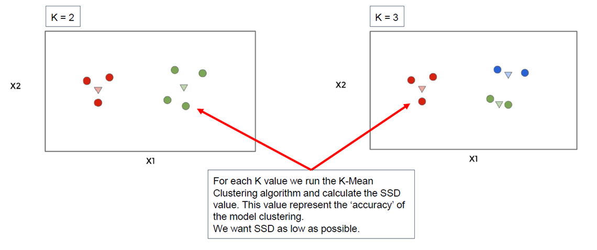
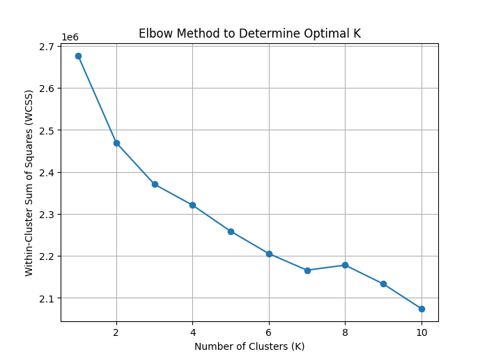

# Optimal K Value
  
בשלב הזה אנחנו רוצים לבחור את מספר הקבוצות הטוב ביותר למודל שלנו  
עד עכשיו בחרנו את המספר קיי בצורה אקראית, אבל עכשיו ננסה לבחור אותו בצורה חכמה  
בשונה מלמידה עם מורה, כאן אין לנו תשובה נכונה להשוות אליה – אז אי אפשר לחשב דיוק רגיל  
לכן נשתמש במדד פנימי שמודד עד כמה הנקודות קרובות למרכז הקבוצה שלהן
  
### Sum of Squared Distances (SSD)
  
**סכום ריבועי המרחקים** הוא מדד פנימי שמשמש אותנו לבדוק עד כמה הקבוצות שיצרנו טובות  
בכל קבוצה אנחנו מחשבים את המרחק של כל נקודת דאטה מהמרכז של הקבוצה שלה – ואז מעלים את המרחק הזה בריבוע  
עושים את זה לכל הנקודות בכל הקבוצות – ובסוף מחברים את כל הערכים האלה  
ככל שהסכום הזה קטן יותר – סימן שהנקודות קרובות יותר למרכזים, כלומר הקבוצות **מהודקות** וטובות
  
📌 **למה מעלים בריבוע?**  
כדי להעניש מרחקים גדולים יותר – אם יש נקודה שחרגה מאוד, היא תשפיע הרבה יותר על המדד
  
📌 **מתי משתמשים בזה?**  
כאשר אין לנו תשובות נכונות להשוות אליהן, כמו בלמידה לא מונחית – זו הדרך לבדוק אם המודל שלנו מתפקד טוב
  
📌 **דוגמה פשוטה:**  
אם יש קבוצה של 5 נקודות שכולן קרובות למרכז – אז הסכום יהיה נמוך  
אם בקבוצה אחרת הנקודות מפוזרות – הסכום יהיה גבוה יותר, והמחשב יבין שהקבוצה הזו פחות טובה
  
#### Formula
  
הנוסחה הכללית לחישוב סכום ריבועי המרחקים היא:
  
<p align="center"></p>  
  
  
**Where:**
-  is the total sum of squared distances  
-  is a single data point  
-  is the centroid of the cluster that  belongs to  
-  is the squared Euclidean distance between the point and the cluster center  
  
Why is there a norm (|| · ||) in the SSD formula?
  
The Formula uses a **vector norm**, not an absolute value.
  
What is ?
  
-  is a **vector** representing a single data point  
- It can have multiple features (dimensions), for example:  
  - If the data is 2D:   
  - If the data is 4D: 
  
What does  mean?
  
- This is the **squared Euclidean distance** between the point  and its cluster center 
- The norm | | means: “calculate the distance in the multi-dimensional space”
- Then we square it to penalize points that are far from the center
  
So it's not an absolute value like in regular math for scalars 
  
**Numerical Example: Squared Distance in SSD**
  
Let's say we have a 2D dataset:
  
- A single data point:   
- Its cluster centroid: 
  
We want to calculate:
  
<p align="center"></p>  
  
  
Step by step:
  
1. Subtract the centroid from the point:
  
   <p align="center"></p>  
  
  
2. Calculate the squared Euclidean norm:
  
   <p align="center"></p>  
  
  
✅ So the contribution of this data point to the SSD is **13**
  
**What does this mean?**  
The point is “13 units squared” away from the cluster center.  
If many points are far like this, the overall SSD will be large — and the model is less optimal
  
  
—  
it's a vector norm used to calculate distance in **multi-dimensional space**
  
📌 **מה זה אומר בפשטות?**  
לוקחים כל נקודה, מודדים כמה היא רחוקה מהמרכז של הקבוצה שלה, מעלים בריבוע – ואז מחברים את כל הערכים האלה
  
📌 **אם יש כמה קבוצות (קלאסטרים)**  
מחשבים את זה עבור כל קבוצה בנפרד ומחברים הכול כדי לקבל את התמונה הכללית
  
המטרה של המודל היא **להקטין את הערך הזה כמה שיותר**
  
---
  
# Variation Within Cluster
  
כדי למדוד את איכות החלוקה אנחנו משתמשים במרחק הכולל של כל נקודה מהמרכז של הקבוצה שלה  
אם כל הנקודות קרובות מאוד למרכז – סימן שהחלוקה טובה  
ככל שהקבוצות מהודקות – כלומר כל נקודה קרובה מאוד לצנטרואיד – ככה המודל טוב יותר  
כדי למדוד את זה, מחשבים את המרחק של כל נקודה מהמרכז, מעלים בריבוע, ומחברים את כל התוצאות  
המטרה שלנו היא להקטין את הערך הזה כמה שיותר
  
---
  
# Increasing K
  
אם נמשיך להגדיל את מספר הקבוצות – הערך שאנחנו מודדים ילך ויירד  
למה? כי כל נקודה תוכל להיות קרובה יותר לצנטרואיד  
אם נגדיל את קיי למספר מאוד גדול, אפילו כזה שכל נקודה תקבל קבוצה משלה – אז המרחקים יהיו אפס  
אבל זה לא טוב – כי אז אנחנו פשוט מתאימים את עצמנו בדיוק לנתונים הקיימים – וזה נקרא **למידת יתר**  
המודל הזה ייכשל על דאטה חדש
  

  
-

  
---
  
# Elbow Method
  
כדי למצוא את מספר הקבוצות הכי מתאים – אנחנו משתמשים בשיטה שנקראת **שיטת המרפק**  
בונים גרף שבו על ציר X שמים את מספר הקבוצות, ועל ציר Y את מדד המרחקים  
מחפשים את הנקודה שבה השיפור מפסיק להיות משמעותי – שם זה נראה כמו "מרפק"  
משם והלאה, כל תוספת קבוצה לא מוסיפה הרבה לאיכות המודל – אז עוצרים שם
  

  
### WCSS - Within-Cluster Sum of Squares
  
זהו שם נוסף למושג שאנחנו כבר מכירים בשם **סכום ריבועי המרחקים**  
כלומר: בכל קבוצה, מחשבים את המרחק של כל נקודה מהמרכז של הקבוצה שלה, מעלים בריבוע – ואז מחברים את כל זה  
עושים את זה בכל הקבוצות, ומחברים בין כולן  
זה נותן לנו מדד כללי של כמה **הנקודות בכל קלאסטר קרובות למרכז שלהן**
  
📌 **למה זה חשוב?**  
אנחנו רוצים שהמרחקים בתוך כל קבוצה יהיו כמה שיותר קטנים  
ככה נדע שהקלאסטרים טובים והמודל מוצלח
  
📌 **מתי משתמשים בזה?**  
כשרוצים לבחור את מספר הקבוצות האידיאלי בשיטת **המרפק**
  
📉 **הערך הזה תמיד יורד ככל שמעלים את מספר הקבוצות**  
אבל בשלב מסוים הירידה מפסיקה להיות משמעותית – ושם נמצא "המרפק", שזה מספר הקבוצות הכי טוב
  
בנקודה K = 4 רואים שהירידה נעצרת – ולכן זה כנראה המספר האופטימלי לקלאסטרים
  
---
  
# Elbow Method - Python Example
  
## pd.get_dummies
  
הפקודה הזו משמשת כדי להמיר עמודות טקסטואליות לעמודות מספריות בינאריות  
היא יוצרת עמודות חדשות, אחת לכל ערך אפשרי בטקסט, ומסמנת עם 1 או 0 האם הערך מופיע
  
### דוגמה:
  
אם בעמודת 'צבע' יש את הערכים:
- אדום  
- כחול  
- ירוק  
  
אז אחרי הפקודה נקבל שלוש עמודות חדשות:
- צבע_אדום  
- צבע_כחול  
- צבע_ירוק  
  
וכל שורה תקבל 1 בעמודה המתאימה, ו־0 בשאר
  
### למה זה חשוב?
  
מודלים של למידת מכונה לא יודעים להתמודד עם מחרוזות  
לכן חייבים להפוך את המידע הקטגורי למספרים לפני שמכניסים אותו למודל  
המרה כזו נקראת **קידוד אחד חם**, והיא מאפשרת להפעיל חישובים מתמטיים על הדאטה One-Hot Encoding
  
📌 טיפ: לאחר הקידוד כדאי לבצע **סקיילינג** – כדי שכל הערכים יהיו באותו סדר גודל בחישוב המרחקים
  
### דוגמה ל־get_dummies
  
נניח שיש לנו דאטה כזה:
  
| שם     | צבע    | מין   |
|--------|--------|--------|
| דני    | אדום   | זכר   |
| תמר    | כחול   | נקבה  |
| יוסי   | ירוק   | זכר   |
| רוני   | כחול   | נקבה  |
  
אחרי הפעלת הפקודה `get_dummies(df)` נקבל:
  
| שם     | צבע_אדום | צבע_כחול | צבע_ירוק | מין_נקבה | מין_זכר |
|--------|-----------|------------|-----------|------------|-----------|
| דני    | 1         | 0          | 0         | 0          | 1         |
| תמר    | 0         | 1          | 0         | 1          | 0         |
| יוסי   | 0         | 0          | 1         | 0          | 1         |
| רוני   | 0         | 1          | 0         | 1          | 0         |
  
📌 המחשב לא רואה "כחול" או "נקבה" – הוא רואה **0 או 1**  
כך אפשר לחשב מרחקים בין נקודות, כי הכול מבוסס מספרים
  
  
  
הנה דוגמה לפייתון שבה אנחנו מחשבים את הגרף:
  
```python
import pandas as pd
from sklearn.cluster import KMeans
from sklearn.preprocessing import StandardScaler
import matplotlib.pyplot as plt
  
df = pd.read_csv("bank-full.csv")
  
# Convert categorical columns to binary using one-hot encoding
df_dummies = pd.get_dummies(df)
  
# Apply feature scaling
scaler = StandardScaler()
df_scaled = scaler.fit_transform(df_dummies)
  
# Calculate the sum of squared distances (SSD) for K values from 1 to 10
ssd = []
for k in range(1, 11):
    kmeans = KMeans(n_clusters=k, random_state=42)
    kmeans.fit(df_scaled)
    ssd.append(kmeans.inertia_)
  
# Elbow method plot
plt.plot(range(1, 11), ssd, marker='o')
plt.xlabel("Number of Clusters (K)")
plt.ylabel("Within-Cluster Sum of Squares (WCSS)")
plt.title("Elbow Method to Determine Optimal K")
plt.grid(True)
plt.show()
```
  

  
SSD = 6 is optimal
  
### על אילו פיצ’רים המודל רץ?
  
המודל רץ על כל העמודות שבקובץ – גם מספריות וגם טקסטואליות  
כדי לעבוד עם עמודות טקסט, מבצעים **קידוד אחד-חם** שהופך כל ערך מילולי לעמודות של 0 ו־1  
לאחר מכן מבצעים **סקיילינג** כדי שהערכים יהיו באותו סדר גודל  
רק אז המודל מבצע את החלוקה לקבוצות
  
### מה המודל בעצם עושה?
  
המודל לא יודע כלום מראש – לא מה טוב, לא מה רע  
הוא סורק את כל הלקוחות, משווה ביניהם לפי מאפיינים ומחפש קבוצות של לקוחות שדומים זה לזה  
התוצאה היא חלוקה של כל הדאטה למספר קבוצות שהמשתמש הגדיר (למשל 6)
  
### מה זה אומר שיש 6 קבוצות?
  
זה אומר שהמודל חילק את כל האנשים בקובץ ל־6 קבוצות שונות על סמך הדמיון ביניהם  
למשל:
- קבוצה אחת עשויה להיות לקוחות צעירים עם משכורת נמוכה
- קבוצה אחרת יכולה להיות לקוחות עם פיקדונות ויציבות תעסוקתית
- קבוצה שלישית אולי כוללת את מי שענו כן לקמפיין שיווק
  
הקבוצות האלה לא מגיעות עם שמות – אתה צריך **לחקור ולתת משמעות לכל קבוצה**
  
### מה יוצא לי מזה?
  
✅ פילוח חכם של לקוחות  
✅ שיווק מותאם אישית לכל קבוצה  
✅ מיקוד בטיפול בלקוחות מסוכנים או יקרים  
✅ הבנה עמוקה של מבנה הדאטה שלך
  
### מה כדאי לעשות אחרי שמקבלים קבוצות?
  
- לבדוק מאפיינים עיקריים בכל קבוצה (למשל גיל ממוצע, רמת השכלה, תגובה לשיווק)
- לתת שמות ברורים לכל קבוצה – זה הופך את המודל לכלי עסקי
- להשתמש בקבוצות במודלים אחרים (כמו ניבוי) או בקבלת החלטות
  
### איך יודעים מה מאפיין כל קבוצה אחרי החלוקה?
  
ברגע שיש לנו את העמודה "קלאסטר" עם מספר הקבוצה של כל שורה –  
אנחנו יכולים לבצע ניתוח פשוט: לחשב **ממוצע**, **שכיח** או **אחוזים** בכל קבוצה
  
### לדוגמה:
  
- מה הגיל הממוצע של כל קבוצה?  
- איזה סוג עבודה הכי נפוץ בכל קבוצה?  
- מה שיעור האנשים שענו "yes" לקמפיין בכל קבוצה?
  
ככה מזהים תבניות ומתחילים להבין מה מאפיין כל קלאסטר
  
```python
import pandas as pd
from sklearn.cluster import KMeans
from sklearn.preprocessing import StandardScaler
  
# Load the data
df = pd.read_csv("bank-full.csv")
  
# 1. Data preprocessing
# Handle categorical variables
df_encoded = pd.get_dummies(df, drop_first=True)
  
# Scale numerical features
scaler = StandardScaler()
features = df_encoded.columns
df_scaled = pd.DataFrame(scaler.fit_transform(df_encoded), columns=features)
  
# 2. Apply K-means with k=6 (as determined by your elbow method)
k = 6
kmeans = KMeans(n_clusters=k, random_state=42, n_init=10)
df['cluster'] = kmeans.fit_predict(df_scaled)
  
# 3.1 Size of each cluster
cluster_sizes = df['cluster'].value_counts().sort_index()
print("\nCluster sizes:")
print(cluster_sizes)
print("\nPercentage of total:")
print(round(cluster_sizes / len(df) * 100, 2))
  
# 3.2 Calculate mean values for numerical variables by cluster
numerical_cols = ['age', 'duration', 'campaign', 'pdays', 'previous',
                  'emp.var.rate', 'cons.price.idx', 'cons.conf.idx',
                  'euribor3m', 'nr.employed']
cluster_means = df.groupby('cluster')[numerical_cols].mean()
print("\nNumerical feature means by cluster:")
print(cluster_means)
```
  
Output:
```
  
Cluster sizes:
cluster
0    11622
1     3775
2    11482
3     1498
4    11836
5      975
Name: count, dtype: int64
  
Percentage of total:
cluster
0    28.22
1     9.17
2    27.88
3     3.64
4    28.74
5     2.37
Name: count, dtype: float64
  
Numerical feature means by cluster:
               age    duration  campaign  ...  cons.conf.idx  euribor3m  nr.employed
cluster                                   ...                                       
0        39.940458  251.873516  3.062984  ...     -39.819472   4.962974  5228.097221
1        40.948079  243.476026  1.920265  ...     -41.553272   3.886565  5182.548821
2        39.285752  263.408465  2.125588  ...     -43.366591   1.211547  5079.549747
3        41.857143  321.419893  1.825768  ...     -38.326702   0.985517  5029.139252
4        40.299510  257.087783  2.809902  ...     -38.350566   4.884378  5204.281776
5        39.977436  249.244103  2.572308  ...     -40.317641   3.695877  5169.115385
  
[6 rows x 10 columns]
```
  
### Graphs:
  
#### Amount of each cluster
  

  
#### Percentage of subscription="yes" for each cluster
  

  
#### Heatmap of numeric mean for each cluster
  

  