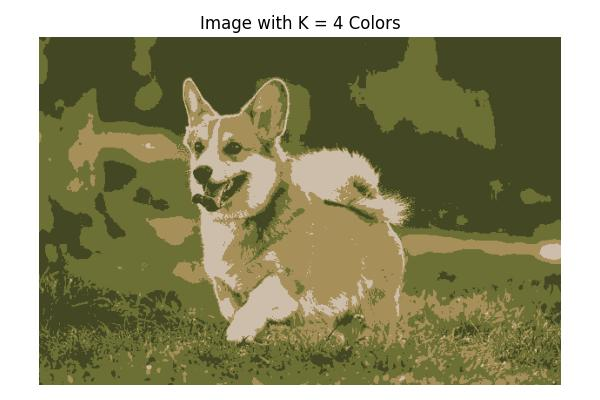

# כיווץ צבעים בתמונה בעזרת קיי-מינס

## מבוא

כמות הצבעים בתמונה דיגיטלית יכולה להיות עצומה – לפעמים מאות אלפים של גוונים שונים  
אבל לפעמים אנחנו רוצים לצמצם את כמות הצבעים למספר קטן יותר – למשל 4, 10 או 25 צבעים עיקריים בלבד  
המטרה: לשמר את הצורה והפרטים המרכזיים של התמונה, אבל עם הרבה פחות צבעים

לשם כך נשתמש באלגוריתם של **למידה לא מונחית** מסוג **קיי-מינס**, שיחלק את הפיקסלים בקובץ התמונה לקבוצות דומות לפי הצבע  
כל קבוצה תיוצג על ידי **צבע ממוצע אחד**, וכל הפיקסלים בקבוצה יקבלו את הצבע הזה


## לוגיקה

תמונות דיגיטליות מכילות המון צבעים – לפעמים מאות אלפים של גוונים  
אבל בהרבה מקרים נרצה **לפשט את התמונה** ולשמור רק על מספר צבעים עיקריים  
למשל: לדחוס תמונה לצורך עיצוב, ניתוח צבעים, או שמירה על משקל נמוך

כדי לעשות את זה נשתמש בלמידה לא מונחית מסוג **קיי-מינס**  
כל פיקסל בתמונה הוא וקטור של שלושה ערכים (R, G, B)  
המודל יחלק את הפיקסלים לקבוצות לפי דמיון בצבע, וכל קבוצה תקבל צבע מייצג  
ככה נוכל ליצור גרסה חדשה של התמונה – עם K צבעים בלבד


---

## קוד פייתון לביצוע קיי-מינס על תמונה

## הסבר שלב אחר שלב

### טעינת התמונה  
אנחנו טוענים את קובץ התמונה לקוד וממירים אותו למערך של מספרים  
כל פיקסל הוא שילוב של שלושה ערכים: אדום, ירוק, כחול

### שינוי מבנה המידע  
משטחים את התמונה כך שהמערך יהיה בגודל של מספר פיקסלים × 3  
כל שורה היא פיקסל, וכל עמודה מייצגת ערוץ צבע

### הרצת קיי-מינס  
מריצים את האלגוריתם עבור ערכים שונים של K – לדוגמה: 4, 10, 25, 50  
בכל פעם הוא מחלק את הפיקסלים לקבוצות לפי דמיון בצבע

### שחזור התמונה  
במקום להשתמש בצבע המקורי של כל פיקסל, מחליפים אותו לצבע הממוצע של הקבוצה שהוא שייך אליה  
כך נוצר אפקט של פישוט צבעים, אבל צורת התמונה נשמרת

### תוצאה  
לכל ערך של K מתקבלת גרסה חדשה של התמונה, עם פחות צבעים אבל עדיין ברורה ויפה  
אפשר לראות איך ככל ש־K גדל, האיכות משתפרת – אבל גם העיבוד כבד יותר

```python
import numpy as np
import matplotlib.pyplot as plt
import matplotlib.image as mpimg
from sklearn.cluster import KMeans
from PIL import Image

# Load the image
image = Image.open("dog_image.jpeg")
image_np = np.array(image)

# Save original shape
original_shape = image_np.shape

# Reshape to (num_pixels, 3)
pixels = image_np.reshape(-1, 3)

# Define K values to test
k_values = [4, 10, 25, 50]

# Loop over each K and generate quantized image
for k in k_values:
    # Fit KMeans on pixel RGB values
    kmeans = KMeans(n_clusters=k, random_state=42)
    kmeans.fit(pixels)

    # Replace each pixel with the centroid color of its cluster
    new_colors = kmeans.cluster_centers_[kmeans.labels_]
    new_image = new_colors.reshape(original_shape).astype(np.uint8)

    # Plot result
    plt.figure(figsize=(6, 4))
    plt.imshow(new_image)
    plt.title(f"Image with K = {k} Colors")
    plt.axis("off")
    plt.tight_layout()
    plt.show()
```

Output:


-

-

-

-

# K-Means Image Segmentation Code Explanation

This code performs color quantization on an image using K-means clustering. Let me break down how it works step by step:

## 1. Import Libraries

```python
import numpy as np              # For numerical operations and array handling
import matplotlib.pyplot as plt # For displaying images and creating plots
import matplotlib.image as mpimg # For image loading (though not used in this code)
from sklearn.cluster import KMeans # For K-means clustering algorithm
from PIL import Image           # For opening and processing the image
```

## 2. Load the Image

```python
# Load the image using PIL (Python Imaging Library)
image = Image.open("dog_image.jpeg")

# Convert the PIL image to a NumPy array
image_np = np.array(image)
```

This converts the image to a 3D NumPy array with dimensions: (height, width, color_channels).
For a typical RGB image, the shape would be something like (500, 750, 3).

## 3. Prepare the Data for Clustering

```python
# Save the original shape to use later when reconstructing the image
original_shape = image_np.shape

# Reshape the image array from 3D to 2D
# New shape: (number_of_pixels, 3) where 3 represents RGB values
pixels = image_np.reshape(-1, 3)
```

Here, the code:
- Saves the original dimensions of the image to use later
- Reshapes the 3D array into a 2D array where:
  - Each row represents one pixel
  - Each column represents one color channel (R, G, or B)
  - The `-1` tells NumPy to automatically calculate that dimension based on the other dimensions

## 4. Define K Values and Loop Through Them

```python
# Define K values to test
k_values = [4, 10, 25, 50]

# Loop over each K and generate quantized image
for k in k_values:
    # ...processing for each k value
```

This creates a list of different k values to test and loops through each one.

## 5. Apply K-Means Clustering

```python
# Fit KMeans on pixel RGB values
kmeans = KMeans(n_clusters=k, random_state=42)
kmeans.fit(pixels)
```

For each value of k, the code:
- Creates a K-means model with k clusters
- Fits the model to the pixel data
- The `random_state=42` parameter ensures reproducible results by setting a specific seed for the random initialization

## 6. Reconstruct the Image Using the Cluster Centers

```python
# Replace each pixel with the centroid color of its cluster
new_colors = kmeans.cluster_centers_[kmeans.labels_]
new_image = new_colors.reshape(original_shape).astype(np.uint8)
```

This is where the magic happens:
- `kmeans.labels_` contains the cluster assignment for each pixel (a 1D array of length number_of_pixels)
- `kmeans.cluster_centers_` contains the RGB values of each cluster center (a 2D array of shape (k, 3))
- `kmeans.cluster_centers_[kmeans.labels_]` uses the labels to look up the corresponding cluster center for each pixel
- The result is reshaped back to the original image dimensions
- `.astype(np.uint8)` converts the floating-point values to 8-bit unsigned integers (the standard format for image display)

### How Each Pixel Gets Its New Color in K-Means Image Segmentation

Let's break down this crucial step with a simple example:

```python
# Replace each pixel with the centroid color of its cluster
new_colors = kmeans.cluster_centers_[kmeans.labels_]
new_image = new_colors.reshape(original_shape).astype(np.uint8)
```

### Step-by-Step Example

Imagine we have a tiny 2×2 image (4 pixels total) and we're using K=2 (two clusters):

#### a. Original Image

Our original image might have these RGB values:
```
Pixel (0,0): [255, 0, 0]     # Red
Pixel (0,1): [240, 10, 10]   # Slightly different red
Pixel (1,0): [10, 10, 240]   # Slightly different blue
Pixel (1,1): [0, 0, 255]     # Blue
```

### b. Reshaping to 2D Array

The pixels are reshaped to a 2D array with shape (4, 3):
```
pixels = [
    [255, 0, 0],    # Pixel (0,0)
    [240, 10, 10],  # Pixel (0,1)
    [10, 10, 240],  # Pixel (1,0)
    [0, 0, 255]     # Pixel (1,1)
]
```

### c. K-Means Results After Fitting

After fitting K-means (with K=2), we get:

a) **Cluster Centers** (`kmeans.cluster_centers_`):
```
kmeans.cluster_centers_ = [
    [247.5, 5.0, 5.0],    # Cluster 0 (average of the reds)
    [5.0, 5.0, 247.5]     # Cluster 1 (average of the blues)
]
```

b) **Cluster Labels** (`kmeans.labels_`):
```
kmeans.labels_ = [0, 0, 1, 1]
```
This means:
- Pixel (0,0) is assigned to cluster 0
- Pixel (0,1) is assigned to cluster 0
- Pixel (1,0) is assigned to cluster 1
- Pixel (1,1) is assigned to cluster 1

### d. Replacing Pixels with Their Cluster Centers

Now, the magic happens with this line:
```python
new_colors = kmeans.cluster_centers_[kmeans.labels_]
```

This is an **indexing operation** that works like this:
- For each pixel, look up its cluster label in `kmeans.labels_`
- Use that label as an index to select the corresponding color from `kmeans.cluster_centers_`

Step by step:
1. Pixel (0,0): Label is 0 → Use color from cluster_centers_[0] → [247.5, 5.0, 5.0]
2. Pixel (0,1): Label is 0 → Use color from cluster_centers_[0] → [247.5, 5.0, 5.0]
3. Pixel (1,0): Label is 1 → Use color from cluster_centers_[1] → [5.0, 5.0, 247.5]
4. Pixel (1,1): Label is 1 → Use color from cluster_centers_[1] → [5.0, 5.0, 247.5]

So `new_colors` becomes:
```
new_colors = [
    [247.5, 5.0, 5.0],    # Pixel (0,0) - now reddish
    [247.5, 5.0, 5.0],    # Pixel (0,1) - now reddish
    [5.0, 5.0, 247.5],    # Pixel (1,0) - now bluish
    [5.0, 5.0, 247.5]     # Pixel (1,1) - now bluish
]
```

### e. Reshaping Back to Image Format

Finally:
```python
new_image = new_colors.reshape(original_shape).astype(np.uint8)
```

This reshapes our 1D list of pixel values back to a 2×2×3 image:
```
new_image = [
    [[248, 5, 5], [248, 5, 5]],
    [[5, 5, 248], [5, 5, 248]]
]
```

(Values are rounded to integers due to the `astype(np.uint8)` conversion)

### What's Really Happening: The NumPy Magic

The line `kmeans.cluster_centers_[kmeans.labels_]` is using NumPy's advanced indexing, which is extremely efficient. 

Instead of using a for-loop like:
```python
new_colors = []
for label in kmeans.labels_:
    new_colors.append(kmeans.cluster_centers_[label])
```

NumPy allows you to use one array (`kmeans.labels_`) as indices to select elements from another array (`kmeans.cluster_centers_`). This is known as "fancy indexing" and is both more concise and much faster than iterating through pixels one by one.

### In a Larger Image

In your real dog image with thousands of pixels:
1. Each pixel gets assigned to one of the K clusters
2. Every pixel in the same cluster gets replaced with the exact same color
3. The result is an image with exactly K unique colors

When K is small (like 4), large regions of similar colors get merged into the same cluster, creating a simplified, poster-like effect. When K is larger (like 50), more subtle color variations are preserved, resulting in a more detailed image.

## 7. Display the Result

```python
# Plot result
plt.figure(figsize=(6, 4))
plt.imshow(new_image)
plt.title(f"Image with K = {k} Colors")
plt.axis("off")
plt.tight_layout()
plt.show()
```

Finally, for each value of k, the code:
- Creates a new figure with the specified size
- Displays the quantized image
- Adds a title showing the value of k
- Removes the axis markings
- Adjusts the layout for better display
- Shows the plot

## In Summary

The K-means algorithm works by:
1. Starting with k randomly initialized cluster centers
2. Assigning each pixel to the nearest cluster center
3. Updating each cluster center to be the mean of all pixels assigned to it
4. Repeating steps 2-3 until convergence (or a maximum number of iterations)

The result is an image with exactly k colors, where each original pixel has been replaced by its closest cluster center color. This technique is known as "color quantization" and is used in image compression, stylization, and segmentation.

As k increases:
- K=4: The image is extremely simplified with only 4 colors
- K=10: More color detail emerges but still highly simplified
- K=25: Medium level of detail with more color variation
- K=50: Higher fidelity representation with enough colors to capture most visual elements

This demonstrates the tradeoff between compression (fewer colors) and visual fidelity (more colors).
