# NLP FETAURES

## מהו 🧠 Text Classification – סיווג טקסטים

### מה זה סיווג טקסטים

סיווג טקסטים (Text Classification) הוא משימה מרכזית בתחום עיבוד שפה טבעית (NLP)  
במשימה זו מקצים לכל טקסט תגית אחת או יותר מתוך רשימת קטגוריות ידועה מראש

דוגמאות לקטגוריות נפוצות:
- חיובי / שלילי (Sentiment Analysis)
- ספאם / לא ספאם
- נושאים: ספורט, פוליטיקה, טכנולוגיה ועוד

### רכיבים עיקריים בתהליך

פ- **Labels / Categories** – הקבוצות האפשריות שהטקסט יכול להשתייך אליהן  
  דוגמה: אימייל → `spam` או `not spam`  
  דוגמה: סקירת סרט → `positive` או `negative`  
  דוגמה: חדשות → `sports`, `politics`, `entertainment`

פ- **Features** – מאפיינים המופקים מהטקסט לצורך סיווג  
  דוגמה: תדירות מילים, האם הטקסט מכיל סימני קריאה, מספר מילים חיוביות או שליליות  
  דוגמה: האם המילים כתובות באותיות גדולות, האם יש אזכור של ישות מסוימת (כמו שם של מוצר)

פ- **Model** – אלגוריתם לומד שמקבל את המאפיינים ומחזיר תחזית לסיווג  
  דוגמה:  
  - Naive Bayes – פשוט ומהיר, מתאים לבסיסים טקסטואליים  
  - SVM – מתאים למקרים עם הפרדה חדה בין קטגוריות  
  - מודלים עמוקים (LSTM, BERT) – לטקסטים ארוכים ומורכבים

### מהו ✨ Feature Extraction – הפקת מאפיינים מהטקסט

כדי שנוכל להשתמש בטקסט במודל למידת מכונה, עלינו להמיר אותו לייצוג מספרי  
נשתמש בטכניקות שונות ל־Feature Extraction

### טכניקות נפוצות:

- Tokenization – חלוקה למילים
- Bag of Words (BoW) – מונה כמה פעמים כל מילה מופיעה
- TF-IDF – מדגיש מילים נדירות יחסית למסמך
- POS Tagging – זיהוי חלקי דיבר
- NER – זיהוי ישויות

**Tokenization** – חלוקה למילים  
  דוגמה: המשפט `"I love NLP"` יפוצל ל־["I", "love", "NLP"]

**Bag of Words (BoW)** – מונה כמה פעמים כל מילה מופיעה בטקסט  
  דוגמה:  
  מסמך 1: `"I love NLP"`  
  מסמך 2: `"NLP is fun"`  
  יתקבל:  
  - Doc1: {"I": 1, "love": 1, "NLP": 1, "is": 0, "fun": 0}  
  - Doc2: {"I": 0, "love": 0, "NLP": 1, "is": 1, "fun": 1}

ה- BoW היא שיטה פשוטה שבה בונים אוסף של כל המילים הייחודיות מהמסמכים  
לאחר מכן יוצרים מטריצה בה כל שורה היא מסמך, וכל עמודה היא מילה מהאוסף  
התאים מציינים כמה פעמים מילה הופיעה במסמך

דוגמה:

- Document 1: "I love NLP"  
- Document 2: "NLP is fun"

Vocabulary: ["I", "love", "NLP", "is", "fun"]

|       | I | love | NLP | is | fun |
|-------|---|------|-----|----|-----|
| Doc1  | 1 | 1    | 1   | 0  | 0   |
| Doc2  | 0 | 0    | 1   | 1  | 1   |

📌 שיטה זו מתעלמת מסדר המילים ומתמקדת רק בספירה  

**TF-IDF** – מדגיש מילים נדירות יחסית למסמכים אחרים  
  `"NLP"` מופיעה בכל המסמכים ולכן תקבל משקל נמוך  
  `"disambiguation"` מופיעה רק במסמך אחד ולכן תקבל משקל גבוה יותר

TF = Term Frequency = כמה פעמים מילה מופיעה במסמך

IDF = Inverse Document Frequency = עד כמה המילה נדירה בכלל הקורפוס

השיטה הזו משפרת את BoW על ידי הדגשת מילים נדירות  
היא כוללת 3 שלבים:

1. TF – תדירות המילה במסמך  
2. IDF – הופכיות תדירות המילה בכלל המסמכים  
3. TF * IDF – נותן ציון סופי למילה במסמך

דוגמה:

- Document 1: "I love NLP"  
- Document 2: "NLP is fun"

TF:
- NLP מופיעה פעם אחת מתוך 3 מילים בכל מסמך → TF = 1/3

IDF:

**formula**

$$
\text{IDF}(t) = \log\left( \frac{N}{df(t)} \right)
$$

-  t  – המילה שאנו בודקים
-  N  – מספר המסמכים הכולל
-  df(t)  – כמה מסמכים כוללים את המילה t


- NLP מופיעה בשני המסמכים → IDF = log(2/2) = 0  
- I מופיעה רק במסמך 1 → IDF = log(2/1) = 0.301

TF-IDF:
- NLP → 1/3 * 0 = 0  
- I → 1/3 * 0.301 ≈ 0.1003

|       | I      | love   | NLP | is     | fun    |
|-------|--------|--------|-----|--------|--------|
| Doc1  | 0.1003 | 0.1003 | 0   | 0      | 0      |
| Doc2  | 0      | 0      | 0   | 0.1003 | 0.1003 |


**POS Tagging** – זיהוי חלקי דיבר עבור כל מילה  
  דוגמה:  
  `"I love NLP"`  
  → I = PRON, love = VERB, NLP = PROPN

**NER** – זיהוי ישויות בשם כמו שמות של אנשים, מקומות, תאריכים  
  דוגמה:  
  `"Barack Obama was born in Hawaii"`  
  → Barack Obama = PERSON, Hawaii = GPE

---

## דוגמא בפייתון ל feature extraction ידני

**🧠 בניית אוצר מילים (Vocabulary) באמצעות Python**

כדי לבצע סיווג טקסט, אנחנו צריכים לבנות תחילה **אוצר מילים (Vocabulary)** שיכיל את כל המילים הייחודיות במסמכים שלנו  
לאחר מכן כל מילה מקבלת מזהה מספרי ייחודי שנוכל להשתמש בו ל־Vectorization

### שלבים:
1. יצירת קובצי טקסט
2. קריאת המילים מכל מסמך
3. המרה לאותיות קטנות (lowercase)
4. הוספה למילון עם מזהה ייחודי

### 📄 יצירת קבצים

```python
%%writefile 1.txt
This is a story about cats
our feline pets
Cats are furry animals
```

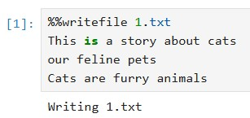

```python
%%writefile 2.txt
This story is about surfing
Catching waves is fun
Surfing is a popular water sport
```

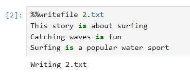

בניית אוצר מילים

```python
vocab = {}
i = 0

with open("1.txt") as f:
    for word in f.read().split():
        word = word.lower()
        if word not in vocab:
            vocab[word] = i
            i += 1

with open("2.txt") as f:
    for word in f.read().split():
        word = word.lower()
        if word not in vocab:
            vocab[word] = i
            i += 1

print(vocab)
```

Output:
```
{'this': 0, 'is': 1, 'a': 2, 'story': 3, 'about': 4, 'cats': 5, 'our': 6, 'feline': 7, 'pets': 8, 
 'are': 9, 'furry': 10, 'animals': 11, 'surfing': 12, 'catching': 13, 'waves': 14, 'fun': 15, 
 'popular': 16, 'water': 17, 'sport': 18}
```

---

## דוגמא בפייתון ל ??

בדוגמה הזו נשתמש בקובץ `smsspamcollection.tsv`

הקובץ מכיל נתונים על הודעות אימייל, כולל תוכן ההודעה, האורך שלה וסימני הפיסוק שבה

בנוסף, הקובץ כולל תווית עבור כל הודעה – `ham` (אימייל לגיטימי) או `spam` (אימייל זבל)

המטרה שלנו היא להשתמש במודל למידה מונחית כדי לחזות האם אימיילים עתידיים יסווגו כ־`spam` או לא


```python
      df.count() = 5,572 rows
```

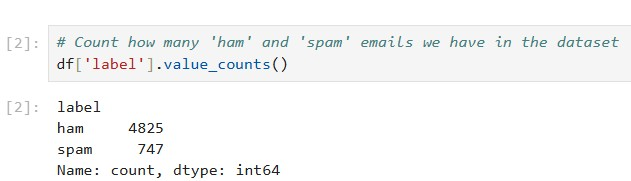

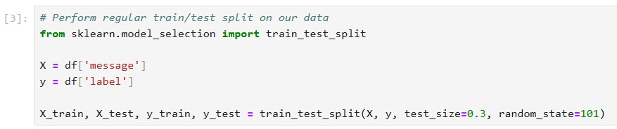

בשלב זה אנו מפרידים את הנתונים לשני חלקים:
- קבוצת **אימון** – משמשת לאימון המודל (במקרה הזה 70% מהנתונים)
- קבוצת **בדיקה** – משמשת לבדוק את ביצועי המודל על טקסטים שהוא לא ראה (30%)

ההפרדה הזו חשובה כדי לוודא שהמודל לא רק "שינן" את הנתונים, אלא באמת למד לזהות דפוסים כלליים

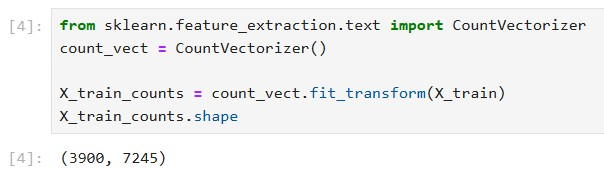

### 🧮 מטריצת ספירה (Count Vector Matrix)

בשלב זה אנו ממירים את ההודעות ממילים לטבלה של מספרים, באמצעות **שיטת Bag of Words**  
כל שורה מייצגת הודעה  
כל עמודה מייצגת מילה מתוך כלל אוצר המילים  
והערך בכל תא מציין כמה פעמים המילה הופיעה באותה הודעה

לדוגמה: אם המילה "free" מופיעה 3 פעמים בהודעה מסוימת – זה יוצג כ־3 בטבלה

**📏 מה זה `(3900, 7245)`?**

זהו גודל המטריצה שנוצרה לאחר הספירה:

- `3900` = מספר ההודעות בקבוצת האימון (train set)  
- `7245` = מספר המילים הייחודיות בכל הודעות האימון (גודל אוצר המילים)

כלומר: יצרנו מטריצה בגודל **3900 שורות × 7245 עמודות** שבה כל תא הוא מספר ההופעות של מילה בהודעה

📌 זהו השלב שבו הטקסט הפך לנתונים מספריים – מוכנים ללמידת מכונה

כאשר אנו מבצעים המרה של טקסט למספרים באמצעות **CountVectorizer**, נוצרת **מטריצה** – כלומר טבלה של מספרים

- כל **שורה** מייצגת הודעה אחת (מסמך טקסט יחיד)
- כל **עמודה** מייצגת מילה ייחודית מאוצר המילים (כל המילים שהופיעו בכל ההודעות)
- כל **תא** בטבלה מכיל את מספר הפעמים שהמילה מופיעה באותה הודעה

לדוגמא

אם יש לנו 2 הודעות:

1. `"I love NLP"`  
2. `"NLP is fun"`

**אוצר המילים (Vocabulary):**
["I", "love", "NLP", "is", "fun"]

**מטריצת הספירה:**

| הודעה \ מילה | I | love | NLP | is | fun |
|--------------|---|------|-----|----|-----|
| הודעה 1      | 1 | 1    | 1   | 0  | 0   |
| הודעה 2      | 0 | 0    | 1   | 1  | 1   |

- `3900` שורות = 3900 הודעות טקסט (train set)
- `7245` עמודות = 7245 מילים שונות שהופיעו בכלל ההודעות

כל שורה = מסמך אחד  
כל עמודה = מילה ייחודית  
כל תא = כמה פעמים המילה מופיעה במסמך

**❓ למה יש לנו 5572 שורות אבל רק 3900 במספר המסמכים?**

**✅ 1. סך כל השורות בטבלה**
- הנתונים בקובץ `smsspamcollection.tsv` מכילים **5572 הודעות טקסט**
- כלומר: 5572 שורות בטבלה = 5572 מסמכים פוטנציאליים

**✂️ 2. חלוקה ל־Train ו־Test**

בשלב ההכנה לקראת המודל, מבצעים חלוקה של הנתונים:

- **70%** → לאימון (Train set) → בערך **3900 שורות**
- **30%** → לבדיקה (Test set) → בערך **1672 שורות**

ה־`CountVectorizer` מאמן את עצמו **רק על קבוצת האימון (3900 הודעות)**  
ולכן מטריצת הספירה שהוא מחזיר היא בגודל **3900 × N מילים**


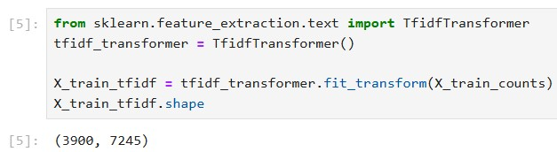

Print sample row:
```
{'are': 0.2524422607133928, 'going': 0.3230441330419753, 'make': 0.36308344981075574, 'me': 0.22163671451015382, 
 'moan': 0.5328892367086496, 'princess': 0.44029157228894206, 'to': 0.15576398008518208, 'yes': 0.35100930940159797, 
 'you': 0.1602042707313863}
```

### 🧮 חישוב ה- TF-IDF

בשלב זה אנו מעדכנים את ערכי הספירה לפי חשיבותן היחסית של המילים בכל המסמכים  
המטרה היא לתת משקל גבוה למילים ייחודיות ומידעיות, ולהפחית משקל ממילים שכיחות מדי כמו "the" או "is"

כך נוצר ייצוג מדויק יותר של הטקסט עבור המודל

**🧠 מה זה TfidfTransformer ומה הוא עושה?**

**📌 המטרה:**
להמיר את מטריצת הספירה (שנוצרה ע"י CountVectorizer) למטריצה חכמה יותר  
כזו שלא רק סופרת מילים – אלא יודעת להעריך **כמה מילה באמת חשובה** במסמך

**למה CountVectorizer לא מספיק?**

ה- CountVectorizer פשוט סופר כמה פעמים כל מילה מופיעה  
אבל:
- מילים נפוצות כמו `"the"`, `"is"` או `"and"` יופיעו המון – וזה **מטעה**
- הן לא באמת מייחדות מסמך אחד מאחר
- הן מקבלות משקל גבוה בטעות

**🧠 מה כן עושה TF-IDF?**

ה- TF-IDF = Term Frequency – Inverse Document Frequency  
הוא מחשב ציון משוקלל לכל מילה לפי:
- **TF** – כמה פעמים המילה מופיעה במסמך (כמו בספירה)
- **IDF** – כמה היא נדירה בכל שאר המסמכים

$$
\text{TF-IDF}(t, d) = \text{TF}(t, d) \times \log \left( \frac{N}{df(t)} \right)
$$

**🧪 מה עושה `TfidfTransformer`?**

המחלקה `TfidfTransformer` מקבלת את מטריצת הספירה (3900 × 7245)  
ומחשבת **ציון TF-IDF לכל מילה במסמך**

- אם מילה נדירה (למשל: `"unsubscribe"`) → תקבל **משקל גבוה**
- אם מילה מאוד נפוצה (למשל: `"the"`) → תקבל **משקל נמוך**

**🧠 למה זה טוב?**

ה- TF-IDF נותן ייצוג מדויק יותר לטקסט  
כך המודל יוכל להבין:
- אילו מילים באמת משמעותיות
- ואילו רק "רעש רקע"

וזה עוזר מאוד לשפר את הביצועים של המודל

**דוגמא:**

נניח שיש לנו שני מסמכים (הודעות):

- Document 1: `"I love NLP"`
- Document 2: `"NLP is fun"`

מתוך זה נבנה אוצר מילים עם 5 מילים ייחודיות:

- Vocabulary = ["I", "love", "NLP", "is", "fun"]

**🎯 מטריצת TF-IDF**

| מילה / הודעה | I      | love   | NLP    | is     | fun    |
|--------------|--------|--------|--------|--------|--------|
| Document 1   | 0.1003 | 0.1003 | 0      | 0      | 0      |
| Document 2   | 0      | 0      | 0      | 0.1003 | 0.1003 |

**הסבר המספרים**

- המילה **"NLP"** מופיעה בשני המסמכים → IDF = log(2/2) = 0 → משקל = 0
- המילים **"I"**, **"love"**, **"is"**, **"fun"** מופיעות רק במסמך אחד → IDF = log(2/1) = 0.301  
- TF עבור מילים שמופיעות במסמך = 1/3 (כי בכל מסמך 3 מילים)  
- TF-IDF = 1/3 × 0.301 ≈ **0.1003**

📌 כך אפשר לראות איך מילה נדירה מקבלת **ציון גבוה יותר**, בעוד מילה שכיחה מדי (כמו "NLP" פה) מקבלת **ציון 0**

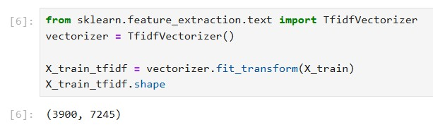

### מהו TfidfVectorizer?

ה- TfidfVectorizer מקצר את הפעולה הקודמת

זו רק דוגמא פה כיצד להשתמש בו

זה פשוט שילוב של 2 השלבים הקודמים לתוך שלב מאוחד

**קודם כל נבין מה קרה בשני השלבים:**

1. **CountVectorizer**  
   סופר כמה פעמים כל מילה מופיעה בטקסט  
   יוצר מטריצה של: כמה פעמים מילה א מופיעה במסמך ב

2. **TfidfTransformer**  
   לוקח את מטריצת הספירה ומחשב TF-IDF  
   כלומר – במקום רק לספור, הוא שוקל את החשיבות היחסית של כל מילה

**אז למה בכלל יש `TfidfVectorizer`?**

כי הוא משלב **שני שלבים באחד**:

- גם בונה את אוצר המילים (כמו CountVectorizer)
- וגם מחשב TF-IDF (כמו TfidfTransformer)

כלומר:
במקום לכתוב:

```python
X_counts = CountVectorizer().fit_transform(X_train)
X_tfidf = TfidfTransformer().fit_transform(X_counts)
```

אפשר פשוט לכתוב:

```python
X_tfidf = TfidfVectorizer().fit_transform(X_train)
```

**מתי נשתמש בזה?**

- אם אתה **רוצה שליטה מלאה** – תשתמש ב־`CountVectorizer` + `TfidfTransformer`
- אם אתה **רוצה קיצור דרך** ונוחות – פשוט תשתמש ב־`TfidfVectorizer`

**📌 סיכום קצר:**

| שיטה | שלבים | יתרון |
|------|--------|--------|
| CountVectorizer + TfidfTransformer | 2 שלבים | שליטה ידנית |
| TfidfVectorizer | שלב אחד | פשוט ויעיל |


### 🧠 אימון מודל סיווג עם LinearSVC

**🧠 מה זה LinearSVC ואיך הוא שונה ממודלים אחרים?**

**📌 רקע קצר:**

- **LinearRegression** – מודל לחיזוי ערכים מספריים (רגרסיה)
- **SVM (Support Vector Machine)** – שיטה כללית לסיווג ולרגרסיה, שפועלת על ידי חיפוש גבול שמפריד בין מחלקות
- **SVC (Support Vector Classifier)** – מימוש של SVM לסיווג (classification) כללי, שיכול להיות גם לא־ליניארי

**✅ אז מה זה LinearSVC?**

ה- `LinearSVC` הוא גרסה מהירה ופשוטה של SVM שמתמקדת רק במקרים שבהם **יש הפרדה ליניארית בין המחלקות**  
כלומר – אם אפשר להפריד בין המחלקות בקו ישר (במימד גבוה – מישור או היפר-מישור)

**⚙️ תכונות עיקריות של LinearSVC:**

- מתאים מאוד ל־**datasets עם הרבה דוגמאות ומאפיינים** (כמו טקסט!)
- משתמש ב־**L2 regularization** כברירת מחדל
- מאפשר להגדיר פרמטר בשם `C` לקביעת רמת העונש על שגיאות
- הרבה יותר **מהיר** מ־`SVC` כשיש הרבה תכונות (features), כמו TF-IDF

**💬 למה משתמשים בו ב־NLP?**

בטקסט יש **אלפי מאפיינים (מילים)** לכל מסמך  
לכן מודל כמו `LinearSVC` שמתמודד טוב עם **מימד גבוה** ועובד מהר – הוא בחירה מעולה

**📌 סיכום:**

| מודל             | שימוש                | קו הפרדה     | מתאים ל־           |
|------------------|----------------------|--------------|--------------------|
| LinearRegression | חיזוי מספרים         | רציף         | רגרסיה             |
| SVC              | סיווג כללי           | גם לא-ליניארי | דאטה מורכב         |
| LinearSVC        | סיווג ליניארי מהיר  | קו ישר        | טקסטים ומימד גבוה  |


בשלב הזה אנו משתמשים באלגוריתם למידת מכונה מסוג **Linear Support Vector Classifier (LinearSVC)**  
זהו מודל נפוץ לביצוע **סיווג טקסט**, במיוחד כאשר מדובר בנתונים לאחר עיבוד TF-IDF

**⚙️ מה כל שורה עושה?**

`from sklearn.svm import LinearSVC`  

מייבא את מחלקת `LinearSVC` מתוך מודול הסיווג של Scikit-Learn

`clf = LinearSVC()`  

יוצרת מופע חדש של המודל – כלומר מכונה מוכנה ללמידה

`clf.fit(X_train_tfidf, y_train)`  

מאמנים את המודל על הנתונים:
- `X_train_tfidf` = המאפיינים המספריים של הודעות האימון (לאחר TF-IDF)
- `y_train` = התוויות (spam / ham)

**📌 תוצאה**

בסיום השלב הזה, המודל `clf` יודע:
- לזהות דפוסים בטקסטים
- ולסווג הודעות חדשות כ־`spam` או `ham`

זהו שלב האימון בפועל של המודל


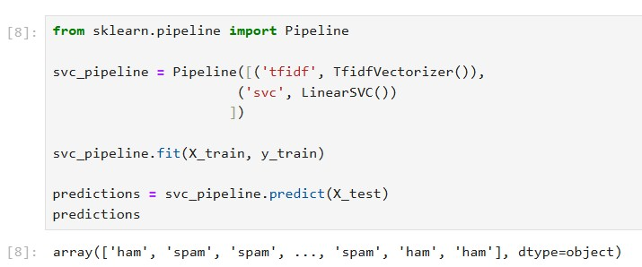

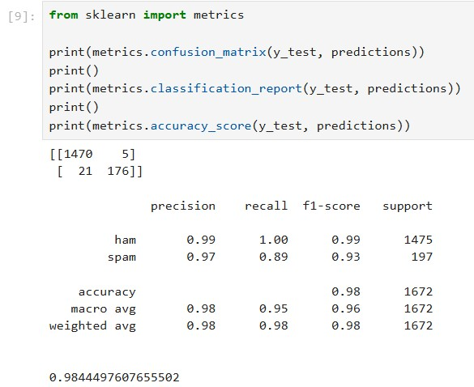

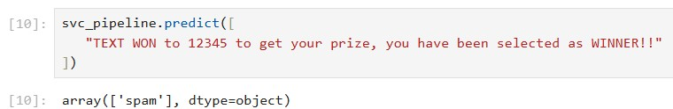

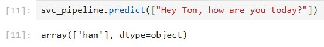


