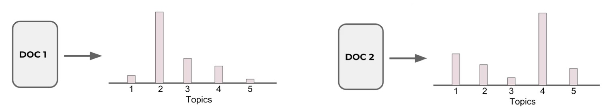
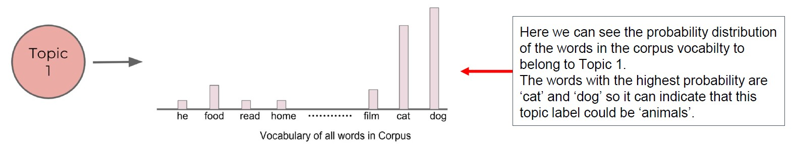

# Topic Modeling 

## 🧠 מה זה Topic Modeling?

ה- Topic Modeling הוא שיטה ב־NLP שמטרתה **לגלות נושאים סמויים** מתוך טקסטים לא מתויגים  
(כלומר: Unsupervised Learning).  
זהו מודל סטטיסטי שמנסה להבין על מה מדברים בטקסט, מבלי שהתווינו לו תגיות מראש

## 📌 מה זה Topic?

ה- "Topic" (נושא) הוא אוסף מילים שמופיעות הרבה יחד ומרמזות על נושא משותף  
לדוגמה: נושא על פירות עשוי לכלול את המילים "apple", "banana", "orange"

## 🛠️ למה משתמשים בזה?

- **המלצות תוכן** – התאמת מאמרים דומים לפי נושאים
- **קיבוץ מסמכים** – על בסיס דמיון רעיוני
- **ניתוח מגמות** – מעקב אחרי שינויי נושאים לאורך זמן
- **שיפור מנועי חיפוש** – על ידי הבנת נושא המסמך

## 🔑 שלבים עיקריים ב־Topic Modeling:

**עיבוד מקדים של הטקסט**  
כולל טוקניזציה, הסרת stop words, סטמינג / למטיזציה, וקטוריזציה (TF-IDF / Count)
- פ- טוקניזציה פיצול הטקסט למילים בודדות
- פ- הסרת stop words
- פ- למטיזציה מחזירים את המילים לשורש שלהן
- פ- וקטוריזציה: סופרים כמה פעמים כל מילה מופיעה (Count), או מחשבים משקל לכל מילה לפי הופעתה במסמך ביחס לשאר המסמכים (TF-IDF)

**בחירת מספר נושאים (k)**  
כמו ב־Clustering – אנחנו קובעים כמה נושאים המודל ינסה למצוא

**אימון המודל**  
שתמשים באלגוריתמים כמו:
- פ- LDA – Latent Dirichlet Allocation - יוסבר בהמשך
- פ- NMF – Non-Negative Matrix Factorization - יוסבר בהמשך

**פרשנות והבנה של הנושאים**  
המודל מחזיר:
- עבור כל נושא → רשימת מילים אופייניות
- עבור כל טקסט → הסתברות לכל נושא

## מודל LDA Model

### מה זה LDA – Latent Dirichlet Allocation?

 Latent = סמוי, חבוי

 Dirichlet = שם של התפלגות סטטיסטית

 Allocation = הקצאה

Latent Dirichlet Allocation = הקצאה של נושאים סמויים למסמכים, בעזרת התפלגות דירישלה

ה- LDA הוא מודל הסתברותי גנרטיבי שמשמש ל־**Topic Modeling**  
המטרה שלו היא לגלות אילו נושאים סמויים מרכיבים אוסף של מסמכים

#### 💡 מה ההנחה של המודל?

- כל **מסמך** הוא תערובת של **כמה נושאים**
- כל **נושא** הוא תערובת של **כמה מילים**

המשימה של המודל היא:
> לגלות מהי תערובת הנושאים בכל מסמך, ומהי תערובת המילים בכל נושא

#### 🧪 איך זה עובד?

1. עבור כל מסמך, המודל מחזיר התפלגות הסתברותית – כמה הוא שייך לכל נושא  
2. עבור כל נושא, המודל מחזיר את המילים שמאפיינות אותו (עם הסתברויות)

#### 🔍 לדוגמה:

- מסמך 1: 70% נושא "טכנולוגיה", 30% נושא "ספורט"  
- נושא "טכנולוגיה": ["computer", "keyboard", "internet"]  
- נושא "ספורט": ["game", "score", "team"]

#### 🧩 למה זה דומה?

אפשר לחשוב על נושאים כעל קלאסטרים (clusters)  
המסמכים לא משתייכים רק לאחד – אלא לכל הנושאים, עם הסתברויות שונות

#### 🎯 מתי זה שימושי?

- כשאין תוויות למסמכים
- כשאנחנו רוצים להבין על מה מדברים טקסטים
- כשצריך לסכם או לקבץ טקסטים לפי רעיונות סמויים

#### 📊 ההבדל בין Topic Modeling לבין Clustering רגיל

| תכונה                      | Topic Modeling (LDA)           | Clustering רגיל (KMeans למשל) |
|----------------------------|--------------------------------|-------------------------------|
| מספר תוויות לכל מסמך       | כמה נושאים עם הסתברויות       | רק קלאסטר אחד                |
| למידה מונחית או לא?         | לא מונחית (Unsupervised)        | לרוב לא מונחית               |
| משקל לכל תכונה              | לפי הסתברות מילה לנושא         | לפי מיקום במרחב              |

#### 🧪 בפועל:

> נריץ LDA על טקסטים ונקבל:
> - עבור כל מסמך: לאיזה נושאים הוא שייך (ואחוז שייכות)
> - עבור כל נושא: אילו מילים מייצגות אותו הכי חזק

### 🧩 ההבדל בין LDA לבין Clustering רגיל

ב־**Clustering רגיל** (כמו K-Means):
- כל מסמך משויך **לאשכול אחד בלבד**

לעומת זאת, ב־**LDA**:
- כל מסמך משויך **לכמה נושאים שונים**, לפי **הסתברות**  
- כלומר, כל מסמך מורכב מתערובת של נושאים

#### דוגמה:

נניח שיש לנו 2 מסמכים והרצנו עליהם מודל LDA עם 5 נושאים (`Topics 1–5`)

#### עבור כל מסמך, נקבל:
- **DOC 1**: Mostly belongs to topic 2, and partially to topics 3 and 4  
- **DOC 2**: Mostly belongs to topic 4, and partially to topics 1, 2, and 5

🟩 כלומר:
> כל מסמך מיוצג כווקטור הסתברויות – כמה הוא שייך לכל Topic

### 🎯 התפלגות מילים לפי נושא (Topic)

בנוסף לשיוך נושאים למסמכים, המודל של LDA גם מספק **התפלגות הסתברותית של מילים בכל נושא**  
כלומר: עבור כל Topic, המודל מראה אילו מילים הן הנפוצות ביותר בו

#### 🐾 דוגמה:

ב־**Topic 1** המילים עם ההסתברות הכי גבוהה הן:

- **cat**
- **dog**

מכאן ניתן לשער שהנושא הזה מדבר על **חיות**

### ⚙️ איך המודל של LDA עובד?

כדי ליצור את הנושאים ולחשב הסתברויות, המודל משתמש בטכניקה שנקראת:

#### **Gibbs Sampling** (חלק ממשפחת **MCMC** – Markov Chain Monte Carlo)

מדובר באלגוריתם הסתברותי שמעריך:
- עד כמה מילה מסוימת שייכת לנושא מסוים
- עד כמה נושא מסוים מופיע במסמך

#### תהליך העבודה:

1. עובר מילה־מילה בכל מסמך  
2. מחשב:  
   - מה הסיכוי שהמילה שייכת לכל נושא  
   - מה הסיכוי שהנושא שייך למסמך  
3. מחשב הסתברות משותפת (joint probability)  

$$
P(\text{Topic X and word w}) = P(\text{w belongs to Topic X}) × P(\text{Topic X belongs to document})
$$

4. חוזר על התהליך שוב ושוב (איטרציות) כדי לדייק

💡 בסוף התהליך נקבל:
- שיוך מילים לנושאים
- התפלגות נושאים לכל מסמך

### 🔁 איך עובד מודל LDA שלב אחר שלב

מודל LDA הוא מודל איטרטיבי (חוזר על עצמו), שמשתמש באיטרציות כדי לחשב את ההתפלגות הסופית של:
- ההסתברות של כל מילה לשייך לנושא מסוים
- ההסתברות של כל נושא להופיע במסמך מסוים

#### שלבי העבודה של המודל:

- **Parameters selection**  
  בחירה של מספר הנושאים (K) 
  
  וכמה איטרציות לבצע (פרמטר אופציונלי)

- **Random Initialization**  
  בתחילת התהליך, כל מילה במסמכים משויכת **באופן רנדומלי** לאחד מהנושאים

- **Iterative Refinement**  
  המודל מעדכן בכל איטרציה את שיוך המילים לנושאים:
  - מחשב את ההסתברות המשותפת של מילה לנושא ושל נושא למסמך
  - אם מוצא נושא עם הסתברות גבוהה יותר, המודל מעדכן את שיוך המילה

- **Model prediction**  
  בסיום האימון, כל מסמך יקבל רשימה של נושאים עם הסתברויות מתאימות  
  בנוסף, לכל נושא תהיה רשימת מילים עם הסתברויות שמייצגות את הנושא

### דוגמא

#### נניח שיש לנו את המסמכים הבאים:

- Doc 1: `"cats eat fish"`
- Doc 2: `"dogs eat bones"`
- Doc 3: `"fish swim in water"`

#### מטרת המודל:
למצוא **נושאים (topics)** במסמכים האלו, מבלי לדעת מראש מה הם  
למשל, אולי אחד הנושאים הוא "חיות בית" והשני "מים/טבע"

### שלב 1: Parameters selection

- בוחרים `K = 2` → כלומר נרצה לגלות 2 נושאים
- נגדיר גם מספר איטרציות (נניח 10)

### שלב 2: Random Initialization

בהתחלה – כל מילה בקורפוס מקבלת Topic אקראי  
לדוגמה: המילה "fish" תקבל למשל Topic 2, בלי קשר למהות שלה  
המילה "bones" אולי Topic 4, גם אם זה לא הגיוני  
אבל... אל תדאג – זה רק צעד ראשוני. כאן מתחיל הקסם של למידה איטרטיבית

### שלב 3: Iterative Refinement

אחרי ההקצאה הראשונית, המודל מתחיל להסתכל על הנתונים ומעדכן את השיוך של כל מילה לפי:

כמה פעמים מילה הופיעה ב־Topic מסוים (**בכל הקורפוס**)  
→ זה נותן P(mila | topic)

כמה Topic הזה נפוץ במסמך  
→ זה נותן P(topic | doc)

ואז מחשבים את ההסתברות המשולבת:  
P(mila ∈ topic) × P(topic ∈ doc)

**דוגמא:**

Doc: "cat eats fish"

ונניח שיש 2 נושאים:  
Topic 1 = חיות (cat, dog, bones...)  
Topic 2 = מים/טבע (fish, water, swim...)

מצב נוכחי:  
"cat" כבר משויך ל־Topic 1  
"fish" כבר משויך ל־Topic 2  
עכשיו נחליט לאן לשייך את "eats"

מה המודל בודק?  
האם "eats" מופיעה יותר ב־Topic 1 או Topic 2 במסמכים אחרים?  
האם במסמך הזה כבר יש יותר מילים שקשורות ל־Topic 1 או Topic 2?

נניח:  
"eats" מופיעה 30 פעמים ב־Topic 1, ו־5 פעמים ב־Topic 2  
במסמך הזה "cat" כבר ב־Topic 1  
אז רוב הסיכויים שהמודל ישייך גם את "eats" ל־Topic 1  

🎯 בסוף, המילים נאספות סביב נושאים הגיוניים, לפי התפלגות סטטיסטית וזה יוצר את ה־Topic Modeling החכם של LDA

🔁 המודל בודק את כל זה מחדש בכל איטרציה, ועד שהוא מתייצב על חלוקה סופית של מילים לטופיקים

### שלב 4: Model Prediction

בשלב הזה, לאחר מספר איטרציות של אימון, המודל כבר למד אילו מילים שייכות לאילו נושאים  
כעת אפשר לבדוק את ההתפלגות של המילים בתוך כל Topic

מה בדיוק בודקים?  
המודל מחזיר מטריצה בשם components_ (אם משתמשים ב־sklearn)

כל שורה במטריצה מייצגת נושא (Topic)

כל עמודה מייצגת מילה מאוצר המילים

ה- כל ערך מספרי הוא מדד להסתברות (או משקל) של המילה באותו Topic

### ⚡ התוצאה:

- לכל מסמך → הסתברות לכל נושא  
- לכל נושא → הסתברות לכל מילה

### 🟢 Final Summary:

| Document | Topic 1 (Animals) | Topic 2 (Nature/Water) | Main Assignment |
|----------|-------------------|------------------------|-----------------|
| Doc 1    | Medium–High       | Medium                 | Likely Topic 1  |
| Doc 2    | Very High         | Very Low               | Topic 1         |
| Doc 3    | Low               | Very High              | Topic 2         |

וזה עוזר לנו להבין על מה מדברים המסמכים גם בלי תיוגים מראש 🧩

  
  שקף הבא דוגמא בפייתון ...

