# Topic Modeling with LDA – Python Example 

### שלב 1: טעינת הקובץ ובדיקת טקסט לדוגמה

המודל יתבסס על הקובץ `npr.csv` שמכיל מסמכי טקסט לא מתויגים ממגוון תחומים  
נתבונן על דוגמה אחת מתוך המסמכים כדי להבין את מבנה הטקסט

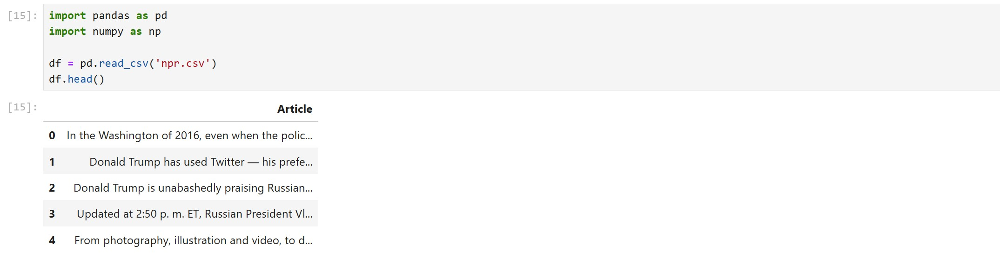

נסתכל על המסמך הראשון

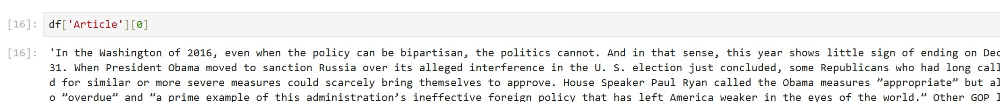

### שלב 2: וקטוריזציה באמצעות CountVectorizer

נשתמש ב־CountVectorizer כדי להמיר את הטקסטים למטריצת תכונות  
נשתמש בפרמטרים:

- `min_df=2` → מסיר מילים שמופיעות בפחות משני מסמכים
- `max_df=0.9` → מסיר מילים שמופיעות בלמעלה מ־90% מהמסמכים

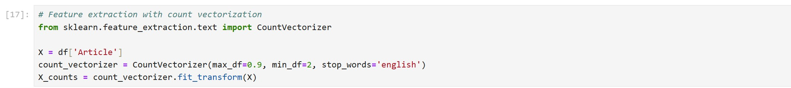

### שלב 3: אימון מודל LDA

נאמן את המודל בעזרת המחלקה `LatentDirichletAllocation` מ־sklearn

- `n_components=7` → נגדיר שנרצה לגלות 7 נושאים
- `random_state=42` → להבטיח תוצאה עקבית

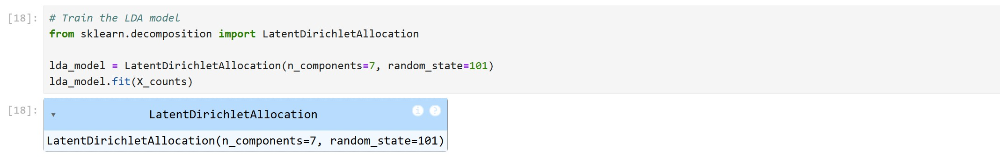

### שלב 4: בדיקת התפלגות הסתברויות של מילים לכל נושא

נשתמש במתודה `get_feature_names_out` כדי לקבל את רשימת כל הטוקנים  
ולאחר מכן נבדוק את המטריצה שנוצרה — שבה:

- כל שורה מייצגת נושא
- כל עמודה מייצגת מילה
- הערכים הם הסתברות שהמילה שייכת לאותו נושא

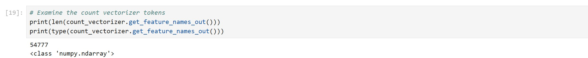

יש 54,777 מילים שונות

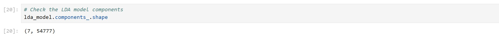

יש 7 שורות של 7 נושאים ולכל נושא 54,777 מילים

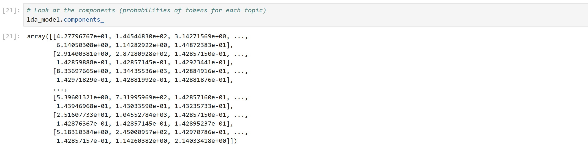

הסיכוי של כל מילה להיות שייכת לנושא

### שלב 5: איתור המילים החזקות ביותר לכל נושא

דומא איך argsort עובד  
ניצור נערך עם 3 איברים ונקבל מיון של האינדקס שלהם מהקטן לגדול

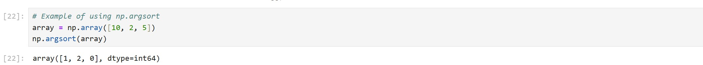

נשתמש ב־`np.argsort` כדי לסדר את כל המילים לפי ההסתברות שלהן  
ונבחר את **10 המילים עם ההסתברות הגבוהה ביותר לכל Topic**

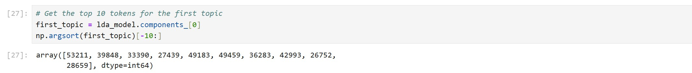

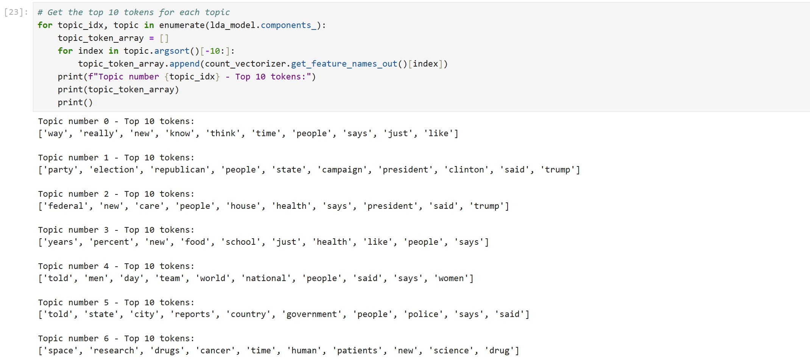

כך בהמשך נוכל **לנסות לתת שם לנושא לפי המילים שמייצגות אותו**  
לדוגמה: נושא 1 מכיל מילים שקשורות ל־Politics → ניתן לתייג אותו כ־"בחירות"

### שלב 6: שיוך נושא לכל מסמך

בשלב זה, אנו רוצים לקבוע לאיזה נושא (Topic) הכי סביר שכל מסמך שייך

**איך זה מחושב?**

עבור כל מסמך, המודל בודק את כל המילים שבו, ולכל מילה מחפש את ההסתברות שלה להשתייך לכל אחד מהנושאים האפשריים

> לדוגמה, עבור המילה `"fish"`:

- P("fish" | Topic 1) = 0.01
- P("fish" | Topic 2) = 0.35 ✅
- P("fish" | Topic 3) = 0.02

וכך גם עבור כל שאר המילים במסמך

#### חישוב ניקוד כולל לכל נושא:

המודל מחשב סכימה של ההסתברויות לכל נושא, לפי כל המילים במסמך

לדוגמה, עבור מסמך שמכיל את המילים "fish", "swim", "water":

- Topic 1 score = P("fish"|T1) + P("swim"|T1) + P("water"|T1) + ...
- Topic 2 score = P("fish"|T2) + P("swim"|T2) + P("water"|T2) + ...
- Topic 3 score = ...

המודל בוחר את הנושא עם הסכום הגבוה ביותר ומקצה אותו למסמך

#### יישום בפועל (קוד):

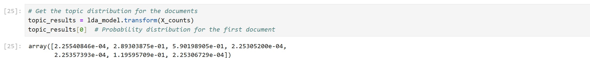

קיבלנו רשימה של סבירות שכל מסמך שייך לכל אחד מה- 7 נושאים  
נבחר את הנושא שקיבל ציון הכי גבוה עבור כל מסמך

לבסוף, נגדיר עמודה חדשה ב־DataFrame עם השיוך לנושא הכי סביר  
נשתמש ב־`argmax(axis=1)` על מטריצת התוצאות כדי לשייך כל מסמך לנושא בעל ההסתברות הגבוהה ביותר

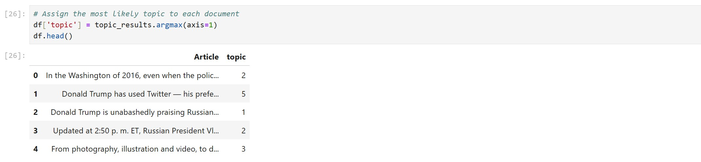

## הקוד המלא

```python
# Load the data
import pandas as pd
import numpy as np

df = pd.read_csv('npr.csv')
df.head()

# Look at a specific document
df['Article'][0]

# Feature extraction with count vectorization
from sklearn.feature_extraction.text import CountVectorizer

X = df['Article']
count_vectorizer = CountVectorizer(max_df=0.9, min_df=2, stop_words='english')
X_counts = count_vectorizer.fit_transform(X)

# Train the LDA model
from sklearn.decomposition import LatentDirichletAllocation

lda_model = LatentDirichletAllocation(n_components=7, random_state=101)
lda_model.fit(X_counts)

# Examine the count vectorizer tokens
print(len(count_vectorizer.get_feature_names_out()))
print(type(count_vectorizer.get_feature_names_out()))

# Check the LDA model components
lda_model.components_.shape

# Look at the components (probabilities of tokens for each topic)
lda_model.components_

# Example of using np.argsort
array = np.array([10, 2, 5])
np.argsort(array)

# Get the top 10 tokens for the first topic
first_topic = lda_model.components_[0]
np.argsort(first_topic)[-10:]

# Get the top 10 tokens for each topic
for topic_idx, topic in enumerate(lda_model.components_):
    topic_token_array = []
    for index in topic.argsort()[-10:]:
        topic_token_array.append(count_vectorizer.get_feature_names_out()[index])
    print(f"Topic number {topic_idx} - Top 10 tokens:")
    print(topic_token_array)
    print()

# Get the topic distribution for the documents
topic_results = lda_model.transform(X_counts)
topic_results[0]  # Probability distribution for the first document

# Assign the most likely topic to each document
df['topic'] = topic_results.argmax(axis=1)
df.head()
```