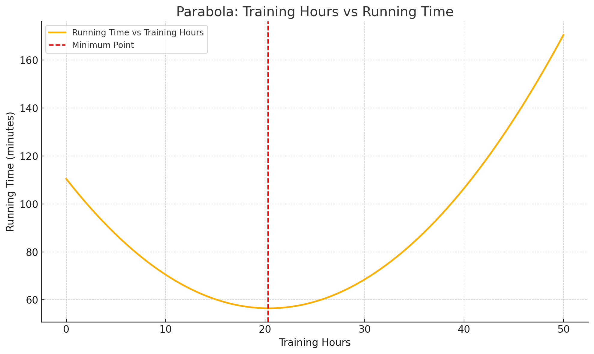

# Explanation of Quadratic Polynomial Regression Solution

## From Formula to Solution

In quadratic polynomial regression, we're trying to find the coefficients $\beta_0$, $\beta_1$, and $\beta_2$ in the equation:

$$y = \beta_0 + \beta_1 x + \beta_2 x^2$$

Similar to linear regression, we want to find the values that minimize the Sum of Squared Errors (SSE):

$$SSE = \sum_{i=1}^{n} (y_i - (\beta_0 + \beta_1 x_i + \beta_2 x_i^2))^2$$

## Step 1: Differentiating the SSE with respect to each parameter

To find the optimal parameters, we differentiate the SSE with respect to each parameter and set it equal to zero:

**Differentiation with respect to $\beta_0$**:
$$\frac{\partial SSE}{\partial \beta_0} = -2 \sum_{i=1}^{n} (y_i - (\beta_0 + \beta_1 x_i + \beta_2 x_i^2)) = 0$$

**Differentiation with respect to $\beta_1$**:
$$\frac{\partial SSE}{\partial \beta_1} = -2 \sum_{i=1}^{n} x_i(y_i - (\beta_0 + \beta_1 x_i + \beta_2 x_i^2)) = 0$$

**Differentiation with respect to $\beta_2$**:
$$\frac{\partial SSE}{\partial \beta_2} = -2 \sum_{i=1}^{n} x_i^2(y_i - (\beta_0 + \beta_1 x_i + \beta_2 x_i^2)) = 0$$

## Step 2: Simplifying the equations

**From differentiation with respect to $\beta_0$**:
$$\sum_{i=1}^{n} (y_i - \beta_0 - \beta_1 x_i - \beta_2 x_i^2) = 0$$

Simplifying:
$$\sum_{i=1}^{n} y_i - \beta_0 \sum_{i=1}^{n} 1 - \beta_1 \sum_{i=1}^{n} x_i - \beta_2 \sum_{i=1}^{n} x_i^2 = 0$$

Since $\sum_{i=1}^{n} 1 = n$ (the number of data points), we get:
$$\sum_{i=1}^{n} y_i - n\beta_0 - \beta_1 \sum_{i=1}^{n} x_i - \beta_2 \sum_{i=1}^{n} x_i^2 = 0$$

Thus:
$$\sum_{i=1}^{n} y_i = n\beta_0 + \beta_1 \sum_{i=1}^{n} x_i + \beta_2 \sum_{i=1}^{n} x_i^2$$

**From differentiation with respect to $\beta_1$**:
$$\sum_{i=1}^{n} x_i(y_i - \beta_0 - \beta_1 x_i - \beta_2 x_i^2) = 0$$

Simplifying:
$$\sum_{i=1}^{n} x_iy_i - \beta_0 \sum_{i=1}^{n} x_i - \beta_1 \sum_{i=1}^{n} x_i^2 - \beta_2 \sum_{i=1}^{n} x_i^3 = 0$$

Thus:
$$\sum_{i=1}^{n} x_iy_i = \beta_0 \sum_{i=1}^{n} x_i + \beta_1 \sum_{i=1}^{n} x_i^2 + \beta_2 \sum_{i=1}^{n} x_i^3$$

**From differentiation with respect to $\beta_2$**:
$$\sum_{i=1}^{n} x_i^2(y_i - \beta_0 - \beta_1 x_i - \beta_2 x_i^2) = 0$$

Simplifying:
$$\sum_{i=1}^{n} x_i^2y_i - \beta_0 \sum_{i=1}^{n} x_i^2 - \beta_1 \sum_{i=1}^{n} x_i^3 - \beta_2 \sum_{i=1}^{n} x_i^4 = 0$$

Thus:
$$\sum_{i=1}^{n} x_i^2y_i = \beta_0 \sum_{i=1}^{n} x_i^2 + \beta_1 \sum_{i=1}^{n} x_i^3 + \beta_2 \sum_{i=1}^{n} x_i^4$$

## Step 3: Representing as a system of equations

We've obtained a system of three linear equations with three unknowns ($\beta_0$, $\beta_1$, $\beta_2$):

1. $\sum_{i=1}^{n} y_i = n\beta_0 + \beta_1 \sum_{i=1}^{n} x_i + \beta_2 \sum_{i=1}^{n} x_i^2$
2. $\sum_{i=1}^{n} x_iy_i = \beta_0 \sum_{i=1}^{n} x_i + \beta_1 \sum_{i=1}^{n} x_i^2 + \beta_2 \sum_{i=1}^{n} x_i^3$
3. $\sum_{i=1}^{n} x_i^2y_i = \beta_0 \sum_{i=1}^{n} x_i^2 + \beta_1 \sum_{i=1}^{n} x_i^3 + \beta_2 \sum_{i=1}^{n} x_i^4$

## Step 4: Matrix solution

We can represent this system in matrix form:

$$\begin{bmatrix} 
n & \sum x_i & \sum x_i^2 \\
\sum x_i & \sum x_i^2 & \sum x_i^3 \\
\sum x_i^2 & \sum x_i^3 & \sum x_i^4
\end{bmatrix}
\begin{bmatrix} 
\beta_0 \\
\beta_1 \\
\beta_2
\end{bmatrix} = 
\begin{bmatrix} 
\sum y_i \\
\sum x_i y_i \\
\sum x_i^2 y_i
\end{bmatrix}$$

This is exactly the normal equation $X^TX\beta = X^Ty$ that we get when applying linear regression to data that has undergone polynomial transformation.

In short form:
$$A\beta = b$$

And the solution:
$$\beta = A^{-1}b$$

## Step 5: Numerical solution for the example

For the training hours and running times example, we need to calculate the sums:

- $n = 10$ (number of data points)
- $\sum x_i = 129$ (sum of training hours)
- $\sum y_i = 661$ (sum of running times)
- $\sum x_i^2 = 2,493$ (sum of squared training hours)
- $\sum x_i y_i = 7,860$ (sum of products of hours and times)
- $\sum x_i^2 y_i = 152,110$ (sum of products of squared hours and times)
- $\sum x_i^3$ = needs to be calculated
- $\sum x_i^4$ = needs to be calculated

If we calculate the missing sums and substitute into the matrix, we can find the numerical solution:

$$\beta_0 \approx 110.5$$
$$\beta_1 \approx -5.3$$
$$\beta_2 \approx 0.13$$

Therefore, the polynomial regression equation is:
$$y = 110.5 - 5.3x + 0.13x^2$$

## Graphical interpretation

This equation represents a parabola (U-shaped curve) where:
- $\beta_0 = 110.5$ is the y-intercept (the value when x=0)
- $\beta_1 = -5.3$ represents the initial slope (negative, meaning performance improves initially)
- $\beta_2 = 0.13$ represents the curvature of the parabola (positive, meaning the parabola opens upward - performance starts to deteriorate after a certain point)

This parabola describes the relationship between training hours and running time, showing that it reaches a minimum (best time) and then increases again.

## Finding the optimal point

To find the minimum point of the parabola, we differentiate the equation with respect to x and set it to zero:

$$\frac{dy}{dx} = -5.3 + 2 \cdot 0.13 \cdot x = 0$$
$$-5.3 + 0.26x = 0$$
$$0.26x = 5.3$$
$$x = \frac{5.3}{0.26} \approx 20.4$$

Therefore, the optimal number of training hours is approximately 20.4 hours per week. To find the best time, we substitute this value into the original equation:

$$y = 110.5 - 5.3 \cdot 20.4 + 0.13 \cdot 20.4^2$$
$$y = 110.5 - 108.12 + 0.13 \cdot 416.16$$
$$y = 110.5 - 108.12 + 54.1$$
$$y \approx 56.48 \text{ seconds}$$

This is the minimum time predicted by our model.

## Advantages of using a polynomial model

The polynomial model allows us to:
1. Describe non-linear relationships
2. Find optimum points (minimum or maximum)
3. Predict performance more accurately in cases where the relationship is not linear

It's important to remember that high-degree polynomial models may suffer from "overfitting" - fitting the existing data too closely, which might impair the ability to generalize to new data. Therefore, we usually start with a quadratic model (degree 2) and increase the degree only if there is justification from the data and theory.
