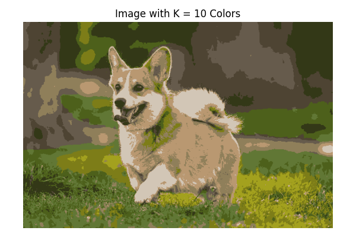
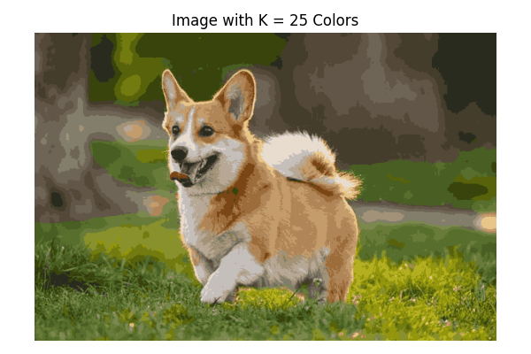

# כיווץ צבעים בתמונה בעזרת קיי-מינס

## מבוא

כמות הצבעים בתמונה דיגיטלית יכולה להיות עצומה – לפעמים מאות אלפים של גוונים שונים  
אבל לפעמים אנחנו רוצים לצמצם את כמות הצבעים למספר קטן יותר – למשל 4, 10 או 25 צבעים עיקריים בלבד  
המטרה: לשמר את הצורה והפרטים המרכזיים של התמונה, אבל עם הרבה פחות צבעים

לשם כך נשתמש באלגוריתם של **למידה לא מונחית** מסוג **קיי-מינס**, שיחלק את הפיקסלים בקובץ התמונה לקבוצות דומות לפי הצבע  
כל קבוצה תיוצג על ידי **צבע ממוצע אחד**, וכל הפיקסלים בקבוצה יקבלו את הצבע הזה


## לוגיקה

תמונות דיגיטליות מכילות המון צבעים – לפעמים מאות אלפים של גוונים  
אבל בהרבה מקרים נרצה **לפשט את התמונה** ולשמור רק על מספר צבעים עיקריים  
למשל: לדחוס תמונה לצורך עיצוב, ניתוח צבעים, או שמירה על משקל נמוך

כדי לעשות את זה נשתמש בלמידה לא מונחית מסוג **קיי-מינס**  
כל פיקסל בתמונה הוא וקטור של שלושה ערכים (R, G, B)  
המודל יחלק את הפיקסלים לקבוצות לפי דמיון בצבע, וכל קבוצה תקבל צבע מייצג  
ככה נוכל ליצור גרסה חדשה של התמונה – עם K צבעים בלבד


---

## קוד פייתון לביצוע קיי-מינס על תמונה

## הסבר שלב אחר שלב

### טעינת התמונה  
אנחנו טוענים את קובץ התמונה לקוד וממירים אותו למערך של מספרים  
כל פיקסל הוא שילוב של שלושה ערכים: אדום, ירוק, כחול

### שינוי מבנה המידע  
משטחים את התמונה כך שהמערך יהיה בגודל של מספר פיקסלים × 3  
כל שורה היא פיקסל, וכל עמודה מייצגת ערוץ צבע

### הרצת קיי-מינס  
מריצים את האלגוריתם עבור ערכים שונים של K – לדוגמה: 4, 10, 25, 50  
בכל פעם הוא מחלק את הפיקסלים לקבוצות לפי דמיון בצבע

### שחזור התמונה  
במקום להשתמש בצבע המקורי של כל פיקסל, מחליפים אותו לצבע הממוצע של הקבוצה שהוא שייך אליה  
כך נוצר אפקט של פישוט צבעים, אבל צורת התמונה נשמרת

### תוצאה  
לכל ערך של K מתקבלת גרסה חדשה של התמונה, עם פחות צבעים אבל עדיין ברורה ויפה  
אפשר לראות איך ככל ש־K גדל, האיכות משתפרת – אבל גם העיבוד כבד יותר

```python
import numpy as np
import matplotlib.pyplot as plt
import matplotlib.image as mpimg
from sklearn.cluster import KMeans
from PIL import Image

# Load the image
image = Image.open("dog_image.jpeg")
image_np = np.array(image)

# Save original shape
original_shape = image_np.shape

# Reshape to (num_pixels, 3)
pixels = image_np.reshape(-1, 3)

# Define K values to test
k_values = [4, 10, 25, 50]

# Loop over each K and generate quantized image
for k in k_values:
    # Fit KMeans on pixel RGB values
    kmeans = KMeans(n_clusters=k, random_state=42)
    kmeans.fit(pixels)

    # Replace each pixel with the centroid color of its cluster
    #
    # instead of:
    #   new_colors = []
    #   for label in kmeans.labels_:
    #      new_colors.append(kmeans.cluster_centers_[label])    
    # 
    # doing it in 1 line (np shortcut):
    new_colors = kmeans.cluster_centers_[kmeans.labels_]

    new_image = new_colors.reshape(original_shape).astype(np.uint8)

    # Plot result
    plt.figure(figsize=(6, 4))
    plt.imshow(new_image)
    plt.title(f"Image with K = {k} Colors")
    plt.axis("off")
    plt.tight_layout()
    plt.show()
```

Output:

  






