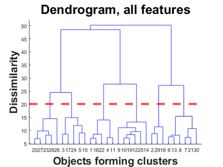
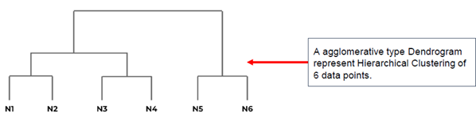
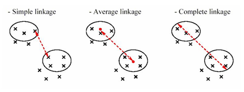
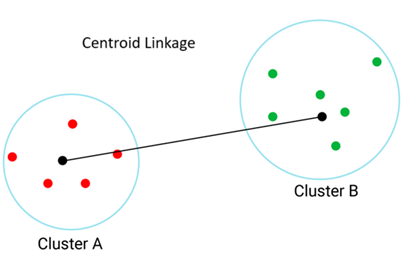

# Hierarchical Clustering

למידה לא מונחית מסוג **אשכול היררכי** היא שיטה שמבצעת חלוקה של דאטה לקבוצות לפי היררכיה  
כל נקודת דאטה מתחילה כקבוצה בפני עצמה, ובהדרגה מאחדים קבוצות קרובות יותר  
זה שונה מקיי-מינס כי לא חייבים להחליט מראש מה מספר הקבוצות – אפשר "לחתוך" את ההיררכיה איפה שרוצים

# Dendrogram

הצורה הכי מקובלת לייצוג של אשכול היררכי היא בעזרת **דנדרוגרמה**  
זו תרשים עץ שמראה מתי ואיך נקודות התחברו לקבוצות  
בציר ה־X יש את כל הנקודות, ובציר ה־Y רואים את המרחקים שבהם הן התאחדו

🔸 ככל שהקו שמחבר שתי נקודות גבוה יותר – כך הן רחוקות זו מזו

# Interpreting the Dendrogram

אפשר "לחתוך" את הדנדרוגרמה בגובה מסוים כדי לקבוע את מספר הקבוצות  
אם נראה שקבוצות מתחברות בקפיצה גבוהה – זה סימן ששם כדאי לעצור ולחתוך

# Distance Calculation

בשלב הראשון האלגוריתם מחשב את המרחקים בין כל נקודה לנקודה  
המרחק הנפוץ ביותר הוא **מרחק אוקלידי**, שמבוסס על משפט פיתגורס

הנוסחה:

$$
D = \sqrt{(x_1 - y_1)^2 + (x_2 - y_2)^2 + \cdots + (x_n - y_n)^2}
$$

📌 ככל שהמרחק קטן יותר – הנקודות דומות יותר

# Cluster Distance Methods

כאשר אנחנו מאחדים קבוצות (ולא רק נקודות בודדות), חשוב להחליט איך נמדוד את המרחק בין הקבוצות  
יש כמה גישות, וכל אחת נותנת תוצאה שונה – לכן בחירה נכונה תתאים למבנה הנתונים שלך

כשמתחילים לאחד קבוצות שלמות (ולא רק נקודות בודדות) – יש כמה דרכים לחשב מרחק בין קבוצות:

- **Single Linkage** – המרחק הכי קצר בין שתי נקודות (אחת מכל קבוצה)
- **Complete Linkage** – המרחק הכי ארוך בין שתי נקודות
- **Average Linkage** – הממוצע של כל המרחקים בין כל זוגות הנקודות
- **Centroid Linkage** – המרחק בין המרכזים של הקבוצות (כמו בקיי-מינס)
- **Ward Linkage** – איחוד הקבוצות שמביא לעלייה הקטנה ביותר בשונות הפנימית של הקלאסטרים

## Single Linkage

מסתכל רק על **המרחק הכי קצר בין שתי קבוצות**  
זה אומר שיכול להיות שרוב הנקודות רחוקות, אבל **שתי נקודות בלבד** (אחת מכל קבוצה) קרובות – וזה מספיק בשביל לאחד את הקבוצות

📌 דוגמה:  
קבוצה A: (1,1), (2,1)  
קבוצה B: (5,5), (6,6)  
המרחק הכי קצר הוא בין (2,1) ל־(5,5) ≈ 5.0

💡 אז מתי זה טוב?

- **כשקבוצות הן מוארכות או מפוזרות**  
  לפעמים הקלאסטרים לא "עגולים" אלא נמרחים לאורך כיוון מסוים  
  Single Linkage מאפשר לקלוט את הקשר הזה גם אם רוב הנקודות רחוקות, כי הוא לא "דורש" שכל הקבוצה תהיה צפופה

- **כשאתה מחפש חיבורים נקודתיים**  
  נניח שיש שתי קבוצות, אבל יש ביניהן נקודה אחת שמחברת ביניהן (כמו גשר)  
  Single Linkage יתפוס את זה מיד

- **כשרוצים לאחד קבוצות על בסיס קשר "חלש"**  
  לא אכפת לך אם הרוב לא קרוב – מספיק שיש נקודה אחת קרובה  
  זה כמו להגיד: "אם יש מישהו אחד שמכיר – נחבר את הקבוצות"

⚠️ חסרון: עלול ליצור **שרשראות ארוכות ולא צפופות** – כלומר קלאסטרים שבהם הנקודות מחוברות רק בקשר עקיף ונקודתי

## Complete Linkage

קומפליט לינקאג' עושה את ההפך סינגל – הוא מסתכל על **המרחק הכי רחוק** בין כל זוג של נקודות – אחת מכל קבוצה  
הקבוצות יתאחדו רק אם כל הנקודות שלהן קרובות אחת לשנייה

📌 דוגמה:  
קבוצה A: (1,1), (2,1)  
קבוצה B: (5,5), (6,6)  
המרחק הכי רחוק הוא בין (1,1) ל־(6,6) ≈ 7.07

💡 אז מתי זה טוב?

- **כשאתה רוצה קבוצות צפופות ומהודקות**  
  אתה רוצה להבטיח שכל נקודה בתוך קבוצה לא תהיה רחוקה מדי מאף אחת אחרת

- **כשאתה מונע "זליגה" של נקודות רחוקות**  
  אפילו אם יש נקודה אחת שמתרחקת מהקבוצה – Complete Linkage ידחה את האיחוד עד שהקבוצות באמת קרובות כולן

- **כשרוצים קלאסטרים קטנים ומוגדרים היטב**  
  לדוגמה: אם אתה מחפש לקוחות עם התנהגות מאוד דומה, בלי חריגים

⚠️ חסרון: רגיש מאוד לנקודות קצה – כל נקודה קיצונית תגדיל את המרחק המקסימלי בין הקבוצות

## Average Linkage

אואריג' לינקאג' מחשבת את כל המרחקים האפשריים בין נקודות של שתי קבוצות – ולוקחת את **הממוצע**  
זו שיטה "מאוזנת" בין סינגל קומפליט ל- 

📌 דוגמה:  
נקודות:
- A: (1,1), (2,1)  
- B: (5,5), (6,6)

המרחקים האפשריים הם:  
(1,1)-(5,5), (1,1)-(6,6), (2,1)-(5,5), (2,1)-(6,6)  
מחשבים את כולם ואז עושים ממוצע – נגיד ≈ 6.0

💡 אז מתי זה טוב?

- **כשרוצים פשרה בין חיבור נקודתי לצפיפות**  
  לא דורש שכל הנקודות יהיו קרובות כמו Complete, אבל גם לא מסתפק רק בזוג הכי קרוב כמו Single

- **כשיש קצת רעש או פיזור בדאטה**  
  ממוצע מפחית השפעה של נקודה אחת קיצונית, ולכן נותן תוצאה יציבה יותר

- **כשרוצים קלאסטרים טבעיים**  
  מתאים לדאטה גאומטרי או התנהגותי שיש בו דמיון כללי – לא בהכרח קשר קיצוני

⚠️ חסרון: פחות יעיל בדאטה עם קבוצות מאוד שונות בגודל או מבנה

## Centroid Linkage

סנטרואיד לינקאג' מסתכל רק על **המרכז של כל קבוצה** – הצנטרואיד  
הוא מחשב את הממוצע של כל הנקודות בכל קבוצה, ואז מודד את המרחק בין שני המרכזים

📌 דוגמה:  
צנטרואיד של A = (1.5, 1)  
צנטרואיד של B = (5.5, 5.5)  
המרחק ביניהם ≈ 5.7

💡 אז מתי זה טוב?

- **כשרוצים גישה דומה לקיי-מינס**  
  השיטה מתנהגת כמו קיי-מינס בכך שהיא מתעלמת מהפרטים ומסתכלת רק על "מיקום כללי" של כל קבוצה

- **כשהקבוצות סימטריות ונקיות מרעש**  
  המרכז מייצג טוב את הקבוצה רק כשהקבוצה עצמה לא פוזרת ולא רועשת

- **כשרוצים חישוב מהיר ופשוט**  
  השיטה הכי קלה למימוש מבחינה מתמטית, כי כל מה שצריך זה לחשב ממוצעים

⚠️ חסרון: יכול לאחד קבוצות שרחוקות מאוד זו מזו – אם במקרה הצנטרואידים שלהן קרובים  
הדבר הזה עלול להטעות ולגרום לאיחוד בין קבוצות שלא באמת קשורות

### ההבדל בין Centroid Linkage ל־Average Linkage

למרות ששתי השיטות משתמשות במושג "ממוצע", הן **מחשבות דברים שונים לגמרי**  
ההבדל ביניהן משפיע מאוד על תוצאת הקיבוץ

### 💠 Average Linkage – ממוצע של כל המרחקים

- מחשבים את **כל המרחקים האפשריים** בין נקודות של שתי הקבוצות
- לאחר מכן מחשבים את **הממוצע** של כל המרחקים האלה
- כלומר: כל נקודה בכל קבוצה משתתפת בחישוב

🟢 היתרון:  
מתחשב בכל הנתונים – נותן תוצאה יציבה שמאזנת בין קצוות

### 💠 Centroid Linkage – מרחק בין ממוצעים (צנטרואידים)

- לוקחים את **הממוצע של כל הנקודות בכל קבוצה** – זה הצנטרואיד
- ואז מחשבים **מרחק אחד בלבד** – בין שני הצנטרואידים

🟡 החישוב מהיר יותר – כי מחשבים רק ממוצע ומרחק אחד

### ⚠️ למה זה הבדל חשוב?

- Average Linkage לוקח בחשבון **את כל מבנה הקבוצות**  
- Centroid Linkage מסתכל רק על המרכז – ולכן יכול **להתעלם מהמרחקים האמיתיים** בין הנקודות

💡 זה אומר ש־סנטרואיד לינקאג' יכול לאחד קבוצות שהן רחוקות מאוד בפועל – רק כי הצנטרואידים שלהן במקרה קרובים

### 🧠 סיכום:

| שיטה             | מה היא מודדת                          | מתי מתאימה?                        |
|------------------|----------------------------------------|------------------------------------|
| Average Linkage  | ממוצע כל המרחקים בין כל זוג נקודות     | כשיש פיזור ורוצים יציבות          |
| Centroid Linkage | מרחק בין המרכזים של הקבוצות            | כשיש קבוצות סימטריות ונקיות מרעש  |

## שיטת Ward Linkage

וורד לינקאג' היא שיטה לחישוב מרחק בין קבוצות באשכול היררכי – אבל בניגוד לשאר השיטות,  
היא לא בודקת "מרחק" פיזי רגיל, אלא שואלת:  
**"איזה חיבור בין קבוצות יגדיל הכי מעט את השונות בתוך הקבוצות?"**

📌 הרעיון:  
בכל שלב של האיחוד, בוחרים את שתי הקבוצות שהמיזוג ביניהן יגרום להכי פחות עלייה ב־**variance (שונות פנימית)**  
זה יוצר קלאסטרים כמה שיותר **אחידים וצפופים**

### שלבי Ward Linkage – שלב אחר שלב

כאשר משתמשים בשיטת Ward לבניית קלאסטרים היררכיים, האלגוריתם פועל לפי עיקרון של **מיזוג עם מינימום עלייה בשונות (variance)**  
הנה פירוט מדויק של כל שלב בתהליך:

#### 1. אתחול – כל נקודה היא קבוצה בפני עצמה

האלגוריתם מתחיל עם כל נקודה כקלאסטר נפרד  
אם יש N תצפיות – מתחילים עם N קבוצות  
🔸 לדוגמה: 150 פרחים = 150 קלאסטרים התחלתיים

#### 2. חישוב שונות פנימית (variance) לכל קבוצה

בהתחלה, כל קבוצה היא רק נקודה אחת – ולכן השונות שלה היא 0  
אבל כאשר נתחיל לאחד קבוצות, נצטרך לחשב את **השונות של כל קלאסטר**

#### 3. בדיקת כל זוגות הקבוצות האפשריים

לוקחים כל זוג של קבוצות ובודקים:  
> "אם נחבר את A ו־B, בכמה תגדל השונות של הקלאסטר החדש?"

#### 4. בוחרים את הזוג עם הגידול הכי קטן בשונות

מבין כל הזוגות האפשריים – האלגוריתם בוחר את הזוג שיביא לעלייה **הכי קטנה** ב־variance  
זו המהות של Ward – שמירה על **אחידות פנימית מקסימלית**

#### 5. מאחדים את שתי הקבוצות

הקלאסטר החדש נבנה – מחברים את A ו־B לקבוצה אחת  
מעבירים לרשימת הקבוצות הפעילות

#### 6. חוזרים על התהליך

ממשיכים לחזור על שלבים 2–5 עד שכל הקבוצות אוחדו לאחת  
במקביל נבנה עץ היררכי – **הדנדרוגרמה** – שמתעד את כל תהליך האיחוד

#### ✂️ קביעת מספר הקבוצות

לאורך כל הדרך Ward לא מחליט על מספר הקבוצות – זה תלוי בך  
בסוף התהליך, אתה בוחר "גובה חיתוך" בעץ כדי לקבוע כמה קלאסטרים תרצה

ככל שהחיתוך נמוך יותר → יותר קבוצות  
ככל שהחיתוך גבוה יותר → פחות קבוצות, גדולות יותר

💡 מתי זה טוב?

- **כשרוצים קלאסטרים ברורים, מעוגלים וצפופים**  
  וורד מחפש חיבורים "סטטיסטיים נוחים" – כאלה שלא שוברים את האחידות של הקבוצות

- **כשרוצים תוצאה שמבוססת על גישה מתמטית ולא רק גיאומטרית**  
  זו לא רק שאלה של מרחק – אלא של כמה "רעש" מוסיף החיבור

- **כשעובדים עם דאטה נומרי ורוצים תוצאה דומה ל־k-means**  
  כי גם קיי־מינס ממזער שונות – לכן Ward דומה לו בהתנהגות

⚠️ חסרון:  
עלול להיות רגיש לנורמליזציה – אז חשוב לסקייל את הדאטה לפני השימוש

📌 דוגמה:  
אם שתי קבוצות שונות מאוד מתחברות – השונות תעלה  
Ward ימנע את זה ויחפש חיבור בין קבוצות שדומות בממוצע ובפיזור

## 🧠 סיכום השוואתי – כל שיטות הלינקאג'

| שיטה               | מה היא מודדת                                     | מתי מתאימה?                                 |
|--------------------|---------------------------------------------------|----------------------------------------------|
| Single Linkage     | המרחק הכי קצר בין שתי נקודות                     | לקלאסטרים מוארכים או כשמחפשים חיבורים רכים |
| Complete Linkage   | המרחק הכי ארוך בין שתי נקודות                    | לקבוצות צפופות ומהודקות                     |
| Average Linkage    | ממוצע של כל המרחקים בין כל זוג נקודות           | כשיש רעש ורוצים איזון                        |
| Centroid Linkage   | מרחק בין הצנטרואידים של שתי קבוצות              | כשיש מבנה גאומטרי ברור ונקי                 |
| **Ward Linkage**   | העלייה בשונות (variance) כתוצאה מאיחוד קבוצות   | כשמחפשים קלאסטרים אחידים וצפופים מאוד      |

📌 שים לב:  
- כל שיטה תבנה דנדרוגרמה שונה  
- הבחירה הנכונה תלויה אם אתה רוצה קלאסטרים מהודקים, גמישים, או איזון ביניהם  
- מומלץ לנסות כמה שיטות ולראות איזו הכי מייצגת את המבנה האמיתי של הדאטה

