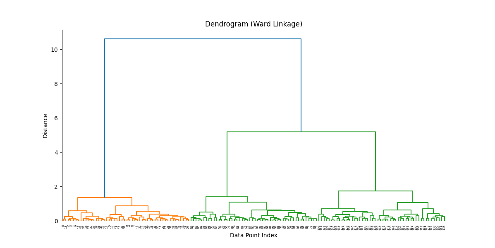

# Hierarchical Clustering 

# דוגמא בפייתון

```python
import pandas as pd
import seaborn as sns
import matplotlib.pyplot as plt
from sklearn.preprocessing import MinMaxScaler
from sklearn.cluster import AgglomerativeClustering
from scipy.cluster.hierarchy import linkage, dendrogram

# 1. טוענים את הדאטה
df = pd.read_csv("iris_unlabaled.csv")

# 2. מנקים רק עמודות מספריות
df_numeric = df.select_dtypes(include=['float64', 'int64'])

# 3. סקיילינג (נרמול) עם MinMaxScaler
scaler = MinMaxScaler()
df_scaled = pd.DataFrame(scaler.fit_transform(df_numeric), columns=df_numeric.columns)

# 4. בונים לינקג' עם שיטת ward
linkage_matrix = linkage(df_scaled, method='ward')

# 5. מציירים דנדרוגרמה
plt.figure(figsize=(12, 6))
dendrogram(linkage_matrix)
plt.title("Dendrogram (Ward Linkage)")
plt.xlabel("Data Point Index")
plt.ylabel("Distance")
plt.show()

# 6. Cut the tree into 3 clusters and get labels (1..3)
cluster_labels = fcluster(linkage_matrix, t=3, criterion='maxclust')

# 7. Attach labels back to the (scaled or original) dataframe
df['cluster'] = cluster_labels  # or df_scaled['cluster'] = cluster_labels

# (Optional) quick peek at counts
print(df['cluster'].value_counts().sort_index())
```



```
cluster
1    50
2    50
3    50
Name: count, dtype: int64
```


## דנדרוגרמה (Ward Linkage) – הסבר

מה שאנחנו רואים כאן הוא גרף היררכי שנקרא **דנדרוגרמה**  
זה חלק מהשיטה של **למידה לא מונחית** שנקראת **אשכול היררכי (Hierarchical Clustering)**  
במקרה הזה השתמשנו בשיטת החיבור **Ward**, שהיא שיטה שממזגת קבוצות לפי הקטנת השונות הכללית (variance)

### 🧱 ציר X – תצפיות (Data Point Index)

- כל נקודה בציר X מייצגת **פרח בודד (שורה מהדאטה)**  
- אין משמעות לערכים על הציר עצמו – זה פשוט אינדקסים של הדאטה (מספרי שורות)

### 📏 ציר Y – מרחק (Distance)

- הציר האנכי מייצג **כמה רחוקות או שונות היו הקבוצות לפני שחיברו אותן**  
- ככל שקו המחבר גבוה יותר – כך הקבוצות היו **פחות דומות**

### 🌿 מה רואים בעץ?

- כל "ענף" מתחיל בשתי נקודות (תצפיות או קבוצות) שמתמזגות  
- ענפים קטנים (למטה) = חיבורים בין נקודות מאוד דומות  
- ענפים גבוהים (למעלה) = חיבורים בין קבוצות גדולות שכבר שונות יותר

### ✂️ איפה חותכים כדי לבחור קבוצות?

- אם תמשוך קו אופקי בגובה מסוים (למשל בגובה 6), תוכל לספור כמה פעמים הוא חותך את הקווים האנכיים  
- מספר החיתוכים = מספר הקבוצות שתקבל

🔸 בדוגמה כאן, אם נחתוך בגובה 6 – נקבל **3 קבוצות עיקריות**  
- צד שמאל (כתום)  
- צד ימין (שתי תתי־קבוצות ירוקות שהתאחדו)

### 📌 למה זה חשוב?

- מאפשר להבין **מבנה פנימי של הדאטה** גם בלי לדעת תגיות  
- נותן **שליטה על כמות הקבוצות** – אפשר לחתוך בגובה אחר ולקבל יותר או פחות קלאסטרים

