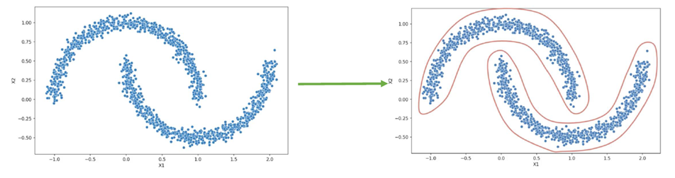
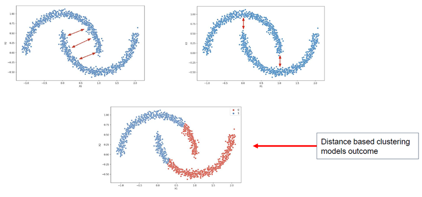
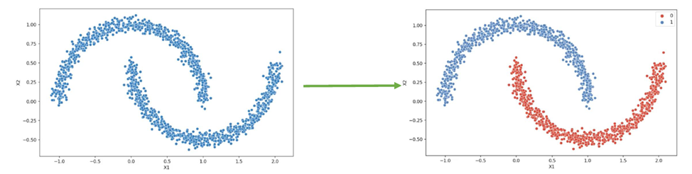
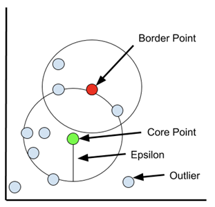
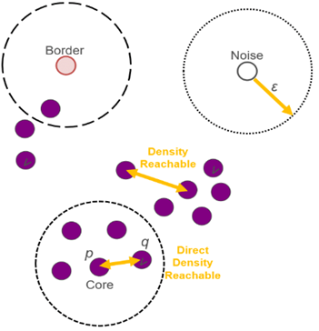
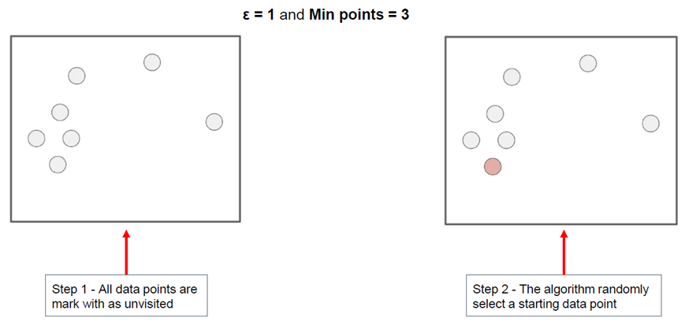
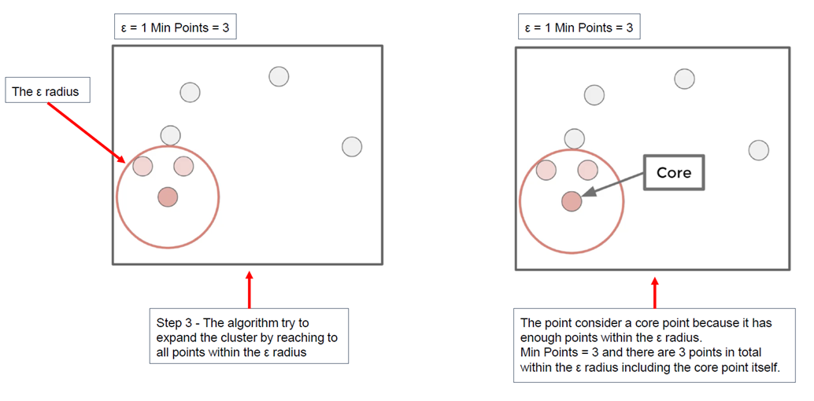
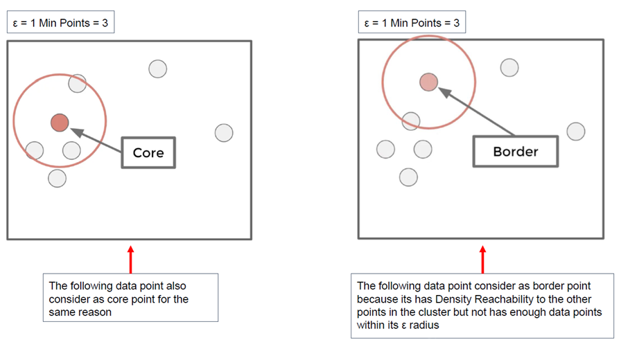
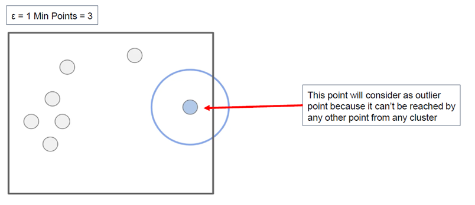
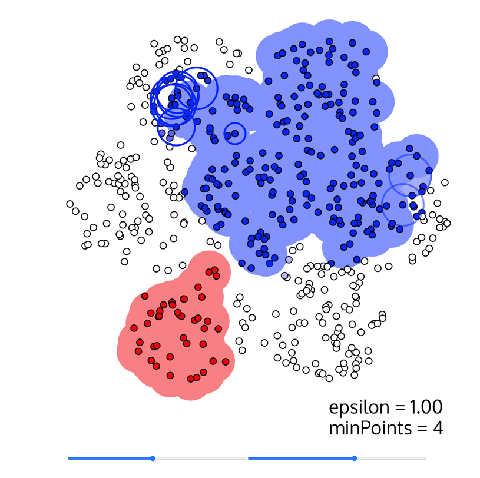

## DBSCAN -- Density-Based Spatial Clustering of Applications with Noise

Desnsity = צפיפות  
Spatial = מרחבי

אלגוריתם קלאסטרינג מבוסס צפיפות  
בניגוד ל־K-Means או קלאסטרינג היררכי, הוא לא מחפש קבוצות לפי מרחק למרכז, אלא לפי **צפיפות** של נקודות במרחב  
הוא יודע לזהות קבוצות בכל צורה וגם מסמן נקודות חריגות כ־Outliers

### דוגמא לקלאסטרינג בצורת ירח

## Why Distance-Based Fails

אלגוריתמים מבוססי מרחק מניחים שכל קלאסטר הוא סימטרי ועגול  
כאשר הדאטה מכיל קבוצות בצורות מוזרות או מעוקמות, הם נכשלות בזיהוי נכון

### דוגמה של כישלון כשקלאסטרים לא סימטריים

## DBSCAN Result

כאשר מפעילים DBSCAN על אותו דאטה, הוא מצליח להפריד בין קבוצות בצורות שונות ומזהה את הרעש  
כלומר הוא גמיש יותר ומותאם למצבים אמיתיים

### תוצאה טובה של DBSCAN

## Graph concepts:

### Epsilon (ε)

 המרחק המקסימלי שבו שתי נקודות נחשבות שכנות  
זה רדיוס הסריקה של כל נקודה – אם יש מספיק נקודות בטווח הזה, אפשר להתחיל קלאסטר

### Min Points

המספר המינימלי של נקודות שצריכות להימצא בטווח ε כדי שהנקודה תיחשב נקודת ליבה  
למשל: אם MinPts = 4, כל נקודה צריכה שלושה שכנים לפחות

### Core Point

נקודה שיש סביבה מספיק נקודות בטווח של ε  
היא מתחילה את הקלאסטר ויכולה למשוך אליה נקודות אחרות

### Border Point

נקודה שנמצאת בטווח של נקודת ליבה, אך אין סביבה מספיק נקודות להיות בעצמה ליבה  
היא שייכת לקלאסטר אבל לא יוצרת קלאסטר

### Outlier Point

נקודה שלא קשורה לשום נקודת ליבה ולא שייכת לאף קלאסטר  
היא נחשבת רעש – ו־DBSCAN יודע לזהות ולבודד אותה

### Density Reachability

נקודה p היא צפיפות־ניתנת־להגעה מנקודה q אם p נמצאת בטווח ε מ־q  
ו־q היא נקודת ליבה  
זהו קשר חד־כיווני

### Density Connectivity

שתי נקודות נחשבות צפיפות־מחוברות אם קיימת שרשרת של נקודות ליבה שמחברת ביניהן  
כלומר – אם ניתן להגיע מ־p ל־q דרך רצף של Core Points

## DBSCAN Algorithm

1. סמן את כל הנקודות כלא־מבוקרות  
2. בחר נקודה אקראית  
3. אם יש לה מספיק שכנים – התחל קלאסטר  
4. הרחב את הקלאסטר לפי כל הנקודות reachable  
5. אם אין מספיק שכנים – סמן את הנקודה כרעש  
6. עבור לנקודה הבאה  
7. סיים כשתסיים לעבור על כל הדאטה

## Visual Steps

שלבי האלגוריתם עם ערכים ε = 1, MinPts = 3

## Cool DBSCAN Simulation Site

ניתן להתנסות בסימולציה בלינק הבא:  
https://www.naftaliharris.com/blog/visualizing-dbscan-clustering/

