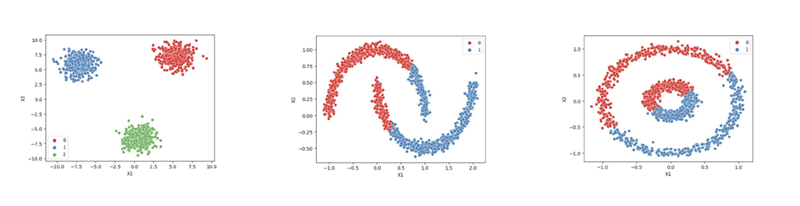
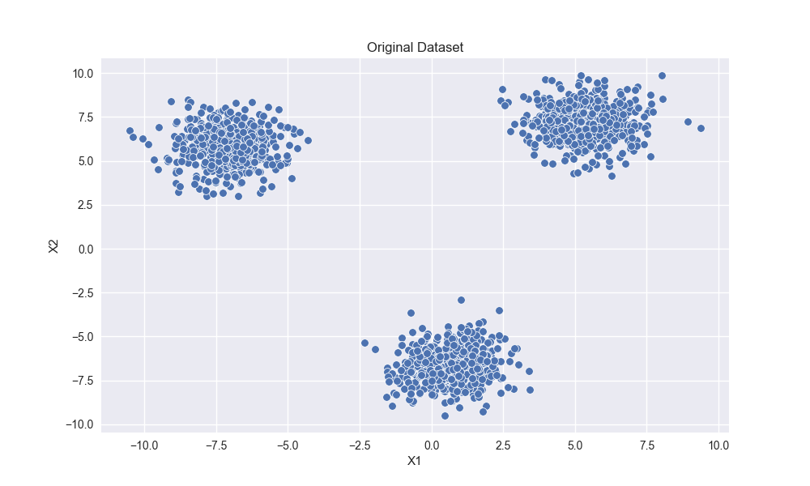
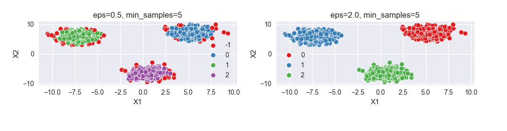
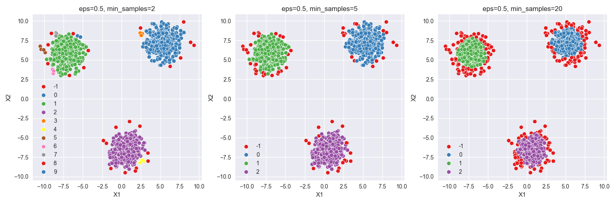
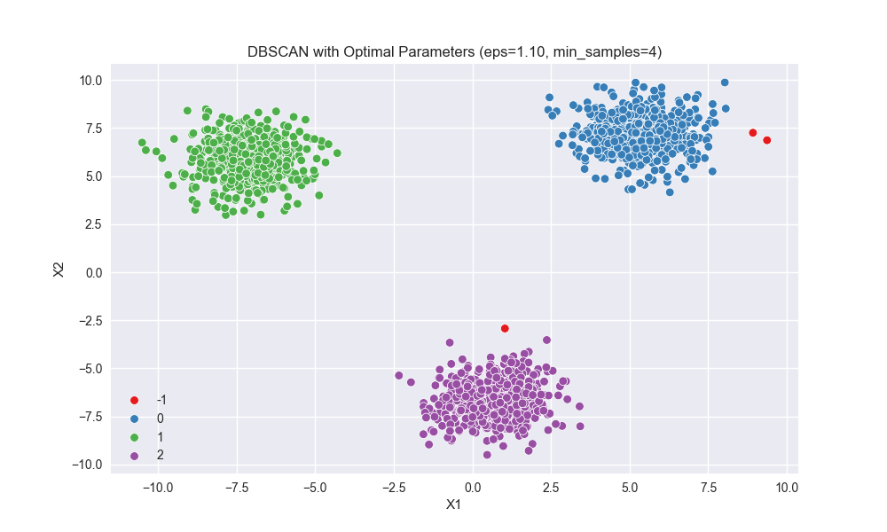

## DBSCAN - Python Example

### Epsilon (ε)
קובע את הרדיוס סביב כל נקודה. משפיע על כמה נקודות ייכנסו לאותה "שכונה":
- ערך קטן = הרבה נקודות יסווגו כרעש
- ערך גדול = כל הנקודות יהפכו לאותה קבוצה

### MinPts
המספר המינימלי של נקודות בשכונה (רדיוס ε) כדי שזאת תיחשב כנקודת ליבה (Core Point)
- MinPts קטן = הרבה קבוצות, מעט רעש
- MinPts גדול = מעט קבוצות, הרבה רעש

### מציאת פרמטרים אופטימליים
ניתן להשתמש ב־**שיטת המרפק** כדי למצוא את ערך ε האופטימלי על פי מספר האאוטליירים המוגדר מראש (לדוגמה: נרצה 3 אאוטליירים)
- מבצעים מספר הרצות עם ערכי ε שונים ובודקים באיזה ערך בדיוק מתקבלים 3 אאוטליירים
- ניתן לחזור על אותו רעיון גם עבור MinPts
- כלל אצבע: MinPts = 2 × מספר התכונות

---

## קוד Python DBSCAN

דוגמה לשימוש ב־DBSCAN על שלושה קבצים:
- `cluster_blobs.csv`
- `cluster_moons.csv`
- `cluster_circles.csv`



לכל קובץ יש שתי תכונות בלבד (X1 ו־X2) וניתן לבחון את צורת הקלאסטרים הנוצרים

```python
import numpy as np
import pandas as pd
import matplotlib.pyplot as plt
import seaborn as sns
from sklearn.cluster import DBSCAN

# Set plot style
plt.style.use('seaborn-v0_8')

# Load dataset
two_blobs_outliers = pd.read_csv('cluster_blobs.csv')

# Display original dataset
plt.figure(figsize=(10, 6))
sns.scatterplot(data=two_blobs_outliers, x='X1', y='X2')
plt.title('Original Dataset')
plt.show()

# Default DBSCAN parameters
model = DBSCAN(eps=0.5, min_samples=5)
labels = model.fit_predict(two_blobs_outliers)
plt.figure(figsize=(10, 6))
sns.scatterplot(data=two_blobs_outliers, x='X1', y='X2', hue=labels, palette='Set1')
plt.title('Default DBSCAN (eps=0.5, min_samples=5)')
plt.show()

# Count and percentage of outliers
print("Default DBSCAN outliers:")
print(f"Number of outliers: {np.sum(labels == -1)}")
print(f"Percentage of outliers: {100 * np.sum(labels == -1) / len(labels):.2f}%\n")
```




Default DBSCAN outliers:
Number of outliers: 62
Percentage of outliers: 4.13%

### Different Epsilon Values

```python
epsilons = [0.1, 0.5, 2.0]

plt.figure(figsize=(15, 5))
for i, eps in enumerate(epsilons):
    plt.subplot(1, 3, i+1)
    model = DBSCAN(eps=eps, min_samples=5)
    labels = model.fit_predict(two_blobs_outliers)
    sns.scatterplot(data=two_blobs_outliers, x='X1', y='X2', hue=labels, palette='Set1')
    plt.title(f'eps={eps}, min_samples=5')
    print(f"eps={eps}: Number of outliers: {np.sum(labels == -1)}")

plt.tight_layout()
plt.show()
```



### Different Min

```python
min_points = [2, 5, 20]

plt.figure(figsize=(15, 5))
for i, min_sample in enumerate(min_points):
    plt.subplot(1, 3, i+1)
    model = DBSCAN(eps=0.5, min_samples=min_sample)
    labels = model.fit_predict(two_blobs_outliers)
    sns.scatterplot(data=two_blobs_outliers, x='X1', y='X2', hue=labels, palette='Set1')
    plt.title(f'eps=0.5, min_samples={min_sample}')
    print(f"min_samples={min_sample}: Number of outliers: {np.sum(labels == -1)}")

plt.tight_layout()
plt.show()
```



### Elbow Method for Finding Optimal Epsilon

```python
eps_range = np.linspace(0.1, 2.0, 20)
number_of_outliers = []

for eps in eps_range:
    dbscan = DBSCAN(eps=eps, min_samples=5)
    labels = dbscan.fit_predict(two_blobs_outliers)
    number_of_outliers.append(np.sum(labels == -1))

# Plot number of outliers vs epsilon
plt.figure(figsize=(10, 6))
plt.plot(eps_range, number_of_outliers, 'o-', linewidth=2)
plt.xlabel('Epsilon (ε)', fontsize=12)
plt.ylabel('Number of outliers', fontsize=12)
plt.title('Elbow Method: Number of Outliers vs Epsilon', fontsize=14)
plt.grid(True)
plt.show()
```





