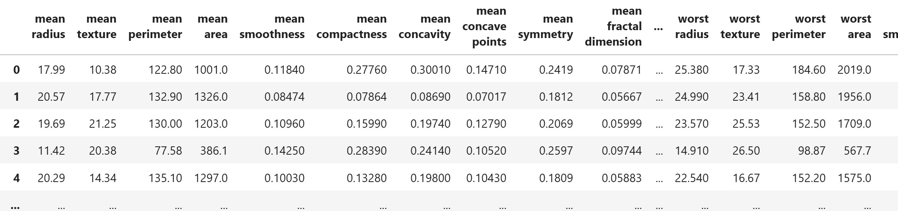

# 📉 תהליך צמצום מימדים עם PCA

### 1. טעינת הנתונים
יש לנו קובץ נתונים עם 20 פיצ'רים שונים. נרצה לבדוק אם אפשר לצמצם את כמות הפיצ'רים מבלי לאבד מידע מהותי

```python
pd.read_csv('tumor_data_features.csv')
```



### 2. פיצ'ר סקיילינג

נשתמש ב- StandardScaler 

```python
scaler = StandardScaler()
scaled_data = scaler.fit_transform(df)
```

### 3. הפעלת PCA עם 2 רכיבים

```python
pca = PCA(n_components=2)
pca_result = pca.fit_transform(scaled_data)
```

נבצע ניתוח PCA על הדאטה תוך שמירה על 2 רכיבים בלבד
המטרה היא לבדוק האם שני הרכיבים מצליחים לשמר חלק משמעותי מהשונות (המידע) של הדאטה

נציג את הנתונים בעזרת תרשים פיזור (Scatter Plot) כדי להבין איך הם מתפלגים במרחב


**📊 ניתוח גרף PCA עם שני רכיבים**

הגרף מציג את התוצאה של הפעלת PCA עם 2 רכיבים עיקריים בלבד

ציר ה-X מייצג את **PC1** (Principal Component 1)  
ציר ה-Y מייצג את **PC2** (Principal Component 2)

**🎯 מה מייצג כל ציר?**

- **PC1**: הרכיב שמכיל את מרב השונות בדאטה. הוא הציר החדש שמכיל הכי הרבה מידע רלוונטי מתוך הפיצ'רים המקוריים
- **PC2**: הציר השני בחשיבותו, מאונך ל-פי.סי1. הוא מייצג שונות נוספת שאינה מוסברת על ידי פי.סי1

**🔍 מה רואים בגרף?**

- כל נקודה מייצגת שורה אחת (תצפית) בדאטה המקורי, לאחר שהוקרנה על הצירים החדשים
- רוב הנקודות מרוכזות סביב המרכז (0,0), מה שמעיד על הנרמול
- יש מספר נקודות רחוקות מאוד מהמרכז — ייתכן שמדובר בנתונים חריגים (outliers)
- הפיזור הנרחב בציר PC1 מרמז ש־PC1 שומר על הרבה מהשונות של הדאטה

**📈 מסקנה**

אם התפלגות הנקודות מראה מבנה ברור, זה סימן ש־2 הרכיבים שבחרנו **מצליחים לייצג היטב את הדאטה**  
אם כל הנקודות היו מצטופפות לגוש אחד חסר צורה, היינו שוקלים להוסיף עוד רכיבים

### 4. נתבונן ב PCA COMPONENTS

נראה שיש לנו מערך של שני רכיבים עם 30 ערכים:

מערך ראשון PC1

מערך שני PC2

```python

print(pca.components_)


PCA Components:
[[ 0.21890244  0.10372458  0.22753729  0.22099499  0.14258969  0.23928535
   0.25840048  0.26085376  0.13816696  0.06436335  0.20597878  0.01742803
   0.21132592  0.20286964  0.01453145  0.17039345  0.15358979  0.1834174
   0.04249842  0.10256832  0.22799663  0.10446933  0.23663968  0.22487053
   0.12795256  0.21009588  0.22876753  0.25088597  0.12290456  0.13178394]
 [-0.23385713 -0.05970609 -0.21518136 -0.23107671  0.18611302  0.15189161
   0.06016536 -0.0347675   0.19034877  0.36657547 -0.10555215  0.08997968
  -0.08945723 -0.15229263  0.20443045  0.2327159   0.19720728  0.13032156
   0.183848    0.28009203 -0.21986638 -0.0454673  -0.19987843 -0.21935186
   0.17230435  0.14359317  0.09796411 -0.00825724  0.14188335  0.27533947]]
```

### 5. מדידת שונות מוסברת (Explained Variance)
נבדוק כמה מהשונות הכוללת בדאטה נשמרת על ידי שני הרכיבים
אם השונות גבוהה (למשל מעל 80%) — ייתכן שאין צורך ביותר מ-2 רכיבים

```python
print(pca.explained_variance_ratio_)
[0.44272026 0.18971182]
```

**📈 מה אומר הפלט הזה של explained_variance_ratio_?**

- כל מספר מייצג את **אחוז השונות היחסית** שכל רכיב PCA מסביר מתוך השונות הכוללת בדאטה
- הערכים הם בין 0 ל־1 (כלומר בין 0% ל־100%)

**✅ הפירוש של הפלט:**
- **PC1** (הרכיב הראשון) מסביר **44.27%** מהשונות בדאטה
- **PC2** (הרכיב השני) מסביר **18.97%** מהשונות בדאטה

**🧮 סך הכול שונות מוסברת:**

אם נחבר:

$$
0.44272026 + 0.18971182 = 0.63243208
$$

כלומר, **שני הרכיבים יחד מסבירים כ־63.24% מהשונות**  
אם תוסיף עוד רכיבים, הסכום ימשיך לעלות עד שיגיע ל־1 (או 100%) כשמספר הרכיבים שווה למספר הפיצ'רים המקוריים

### 6. העלאת כמות הרכיבים
נריץ את PCA שוב, הפעם עם כמות משתנה של רכיבים (3, 4, ..., 20)  
בכל פעם נמדוד את **השונות המצטברת** שנשמרת

נציג גרף של "כמות רכיבים" מול "שונות מוסברת מצטברת" כדי לזהות את נקודת המפנה (elbow point)  
כך נוכל לבחור את מספר הרכיבים האופטימלי שמסביר מספיק מהמידע תוך שמירה על פשטות


הנקודה האופטימלית (Elbow Point) היא כנראה בין הרכיב ה־6 ל־8

---

## הקוד

```python
# Step 1: Load the data
import pandas as pd
from sklearn.decomposition import PCA
from sklearn.preprocessing import StandardScaler
import matplotlib.pyplot as plt

df = pd.read_csv('tumor_data_features.csv')

# Step 2: Feature scaling
scaler = StandardScaler()
scaled_data = scaler.fit_transform(df)

# Step 3: PCA with 2 components
pca = PCA(n_components=2)
pca_result = pca.fit_transform(scaled_data)

# Step 4: Scatter plot of the PCA result
plt.scatter(pca_result[:, 0], pca_result[:, 1])
plt.title('PCA - 2 Principal Components')
plt.xlabel('PC1')
plt.ylabel('PC2')
plt.grid(True)
plt.show()

# Step 5: View the PCA components
print("PCA Components:")
print(pca.components_)

# Step 6: View the explained variance ratio
print("Explained Variance Ratio:")
print(pca.explained_variance_ratio_)

# Step 7: Calculate explained variance for different number of components
explained = []
for i in range(1, 31):  # assuming there are 30 original features
    pca = PCA(n_components=i)
    pca.fit(scaled_data)
    explained.append(sum(pca.explained_variance_ratio_))

# Step 8: Line plot of explained variance vs number of components
plt.plot(range(1, 31), explained, marker='o')
plt.title('Explained Variance vs Number of Components')
plt.xlabel('Number of Principal Components')
plt.ylabel('Cumulative Explained Variance')
plt.grid(True)
plt.show()

```