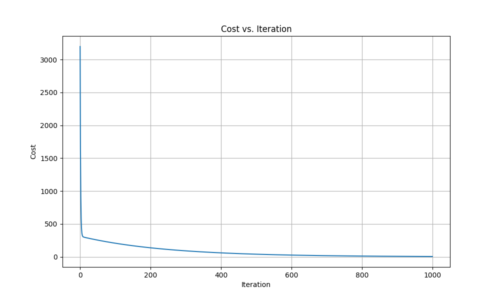
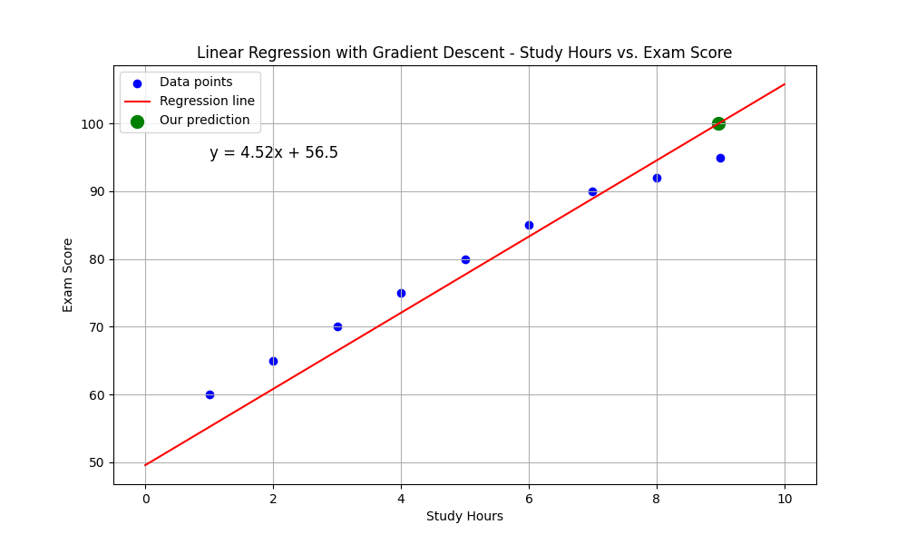

# רגרסיה לינארית באמצעות Gradient Descent

## הבעיה שרוצים לפתור

רגרסיה לינארית היא שיטה סטטיסטית המאפשרת לנו למצוא קשר בין משתנים ולחזות ערכים עתידיים. 

**דוגמה**: אנו רוצים לחזות כמה שעות לימוד נדרשות כדי לקבל ציון מסוים במבחן. למשל, כמה שעות צריך ללמוד כדי לקבל 100 במבחן?

נניח שיש לנו נתונים היסטוריים של תלמידים שלמדו מספר שעות מסוים וקיבלו ציונים שונים:

| שעות לימוד | ציון במבחן |
|------------|------------|
| 1          | 60         |
| 2          | 65         |
| 3          | 70         |
| 4          | 75         |
| 5          | 80         |
| 6          | 85         |
| 7          | 90         |
| 8          | 92         |
| 9          | 95         |

עלינו למצוא את הקשר בין שעות הלימוד לציון, כדי שנוכל לחזות כמה שעות צריך ללמוד כדי לקבל ציון 100.

## הגישה החלופית: Gradient Descent

בעוד שבגישה האנליטית אנו מוצאים את התשובה המדויקת בצעד אחד, בגישת Gradient Descent (ירידת גרדיאנט) אנו מתקרבים לפתרון האופטימלי באופן איטרטיבי. זוהי שיטה יעילה במיוחד כאשר יש לנו כמויות גדולות של נתונים או מספר רב של משתנים.

## Mathematical Formula and Complete Calculation

In linear regression, we want to find the best-fitting line of the form:

$$y = mx + b$$

Where:
- $y$ is the dependent variable (exam score)
- $x$ is the independent variable (study hours)
- $m$ is the slope
- $b$ is the y-intercept

### The Cost Function

The goal is to minimize the Mean Squared Error (MSE):

$$J(m, b) = \frac{1}{2n} \sum_{i=1}^{n} (y_i - (mx_i + b))^2$$

The letter 𝐽 is traditionally used in machine learning and optimization to represent the cost function, 
also known as the objective function — the thing we want to minimize

Where:
- $n$ is the number of data points
- $y_i$ is the actual value
- $mx_i + b$ is the predicted value
- The factor $\frac{1}{2}$ is added to simplify the derivative calculations

### Gradient Descent Algorithm

The gradient descent algorithm updates the parameters $m$ and $b$ using the following rules:

$$m_{new} = m - \alpha \cdot \frac{\partial J}{\partial m}$$

$$b_{new} = b - \alpha \cdot \frac{\partial J}{\partial b}$$

Where:
- $\alpha$ is the learning rate, a hyperparameter that controls the step size
- $\frac{\partial J}{\partial m}$ and $\frac{\partial J}{\partial b}$ are the partial derivatives of the cost function with respect to $m$ and $b$

### The Partial Derivatives

$$\frac{\partial J}{\partial m} = \frac{1}{n} \sum_{i=1}^{n} -x_i(y_i - (mx_i + b)) = \frac{1}{n} \sum_{i=1}^{n} -x_i(y_i - mx_i - b)$$

$$\frac{\partial J}{\partial b} = \frac{1}{n} \sum_{i=1}^{n} -(y_i - (mx_i + b)) = \frac{1}{n} \sum_{i=1}^{n} -(y_i - mx_i - b)$$

Simplifying:

$$\frac{\partial J}{\partial m} = \frac{1}{n} \sum_{i=1}^{n} x_i(mx_i + b - y_i)$$

$$\frac{\partial J}{\partial b} = \frac{1}{n} \sum_{i=1}^{n} (mx_i + b - y_i)$$

### The Complete Algorithm

1. Initialize $m$ and $b$ to some values (often 0)
2. Calculate the predictions using current $m$ and $b$
3. Calculate the partial derivatives
4. Update $m$ and $b$ using the gradient descent update rules
5. Repeat steps 2-4 until convergence (when the cost stops decreasing significantly)

### Applying Gradient Descent to Our Example

Let's implement gradient descent for our study hours data:

1. Initialize parameters:
   - $m = 0$
   - $b = 0$
   - learning rate $\alpha = 0.01$
   - number of iterations = 1000

2. For each iteration, calculate the gradients and update the parameters:

For example, in the first iteration:
- Initial prediction: $\hat{y}_i = 0 \cdot x_i + 0 = 0$ for all $i$
- Error: $\hat{y}_i - y_i = 0 - y_i = -y_i$ for all $i$
- Gradient for $m$: $\frac{1}{9} \sum_{i=1}^{9} x_i(0 - y_i) = -\frac{1}{9} \sum_{i=1}^{9} x_i y_i$
- Gradient for $b$: $\frac{1}{9} \sum_{i=1}^{9} (0 - y_i) = -\frac{1}{9} \sum_{i=1}^{9} y_i$

3. Update rules:
   - $m_{new} = m - \alpha \cdot \text{gradient for } m$
   - $b_{new} = b - \alpha \cdot \text{gradient for } b$

4. After multiple iterations, the parameters converge to:
   - $m \approx 4.52$
   - $b \approx 56.51$

Therefore, the best-fitting line equation is approximately:

$$y = 4.52x + 56.51$$

This means that each additional hour of study adds approximately 4.52 points to the score, and with no study at all (0 hours), the expected score is about 56.51.

### Calculating the Value to Get a Score of 100

To calculate how many study hours are needed to get a score of 100:

$$100 = 4.52x + 56.51$$
$$4.52x = 100 - 56.51 = 43.49$$
$$x = \frac{43.49}{4.52} \approx 9.62$$

So, according to our model, approximately 9.62 hours of study are needed to achieve a score of 100.

## גרף התכנסות

גרף זה מראה כיצד פונקציית העלות (Cost Function) יורדת עם כל איטרציה של אלגוריתם ה-Gradient Descent. אנו רואים שהאלגוריתם מתכנס לפתרון אופטימלי לאחר מספר איטרציות.

## קוד פייטון

הנה קוד פייטון ליישום רגרסיה לינארית באמצעות Gradient Descent:

```python
import numpy as np
import matplotlib.pyplot as plt

# Our data
hours_studied = np.array([1, 2, 3, 4, 5, 6, 7, 8, 9])
exam_scores = np.array([60, 65, 70, 75, 80, 85, 90, 92, 95])

# Parameters
learning_rate = 0.01
iterations = 1000

# Initialize parameters
m = 0
b = 0

# Number of training examples
n = len(hours_studied)

# Lists to store cost history for visualization
cost_history = []

# Gradient Descent algorithm
for i in range(iterations):
    # Make predictions with current parameters
    y_pred = m * hours_studied + b
    
    # Calculate cost (MSE)
    cost = (1/(2*n)) * np.sum((y_pred - exam_scores)**2)
    cost_history.append(cost)
    
    # Calculate gradients
    m_gradient = (1/n) * np.sum(hours_studied * (y_pred - exam_scores))
    b_gradient = (1/n) * np.sum(y_pred - exam_scores)
    
    # Update parameters
    m = m - learning_rate * m_gradient
    b = b - learning_rate * b_gradient
    
    # Print progress every 100 iterations
    if i % 100 == 0:
        print(f"Iteration {i}: m = {m:.4f}, b = {b:.4f}, cost = {cost:.4f}")

# Print final parameters
print(f"\nFinal parameters: m = {m:.2f}, b = {b:.2f}")
print(f"Line equation: y = {m:.2f}x + {b:.2f}")

# Calculate hours needed to get score of 100
score_to_predict = 100
hours_needed = (score_to_predict - b) / m
print(f"To get a score of 100, approximately {hours_needed:.2f} hours of study are needed")

# Plot the convergence
plt.figure(figsize=(10, 6))
plt.plot(cost_history)
plt.title('Cost vs. Iteration')
plt.xlabel('Iteration')
plt.ylabel('Cost')
plt.grid(True)
plt.show()

# Plot the regression line
plt.figure(figsize=(10, 6))
plt.scatter(hours_studied, exam_scores, color='blue', label='Data points')

# Create a line plot with our final parameters
x_line = np.linspace(0, 10, 100)
y_line = m * x_line + b
plt.plot(x_line, y_line, color='red', label='Regression line')

# Add prediction point
plt.scatter([[hours_needed]], [100], color='green', s=100, label='Our prediction')

# Add labels
plt.title('Linear Regression with Gradient Descent - Study Hours vs. Exam Score')
plt.xlabel('Study Hours')
plt.ylabel('Exam Score')
plt.grid(True)
plt.legend()

# Display equation on the graph
plt.text(1, 95, f"y = {m:.2f}x + {b:.2f}", fontsize=12)

plt.show()
```

## דוגמת הרצה

כאשר נריץ את הקוד, נקבל פלט דומה לזה:

```
Iteration 0: m = 0.3650, b = -5.7944, cost = 4900.0000
Iteration 100: m = 4.3971, b = 54.5635, cost = 5.0732
Iteration 200: m = 4.5019, b = 56.2929, cost = 4.6018
Iteration 300: m = 4.5180, b = 56.4840, cost = 4.5987
Iteration 400: m = 4.5194, b = 56.5011, cost = 4.5986
Iteration 500: m = 4.5196, b = 56.5032, cost = 4.5986
Iteration 600: m = 4.5197, b = 56.5034, cost = 4.5986
Iteration 700: m = 4.5197, b = 56.5034, cost = 4.5986
Iteration 800: m = 4.5197, b = 56.5034, cost = 4.5986
Iteration 900: m = 4.5197, b = 56.5034, cost = 4.5986

Final parameters: m = 4.52, b = 56.50
Line equation: y = 4.52x + 56.50
To get a score of 100, approximately 9.62 hours of study are needed
```

גרף ההתכנסות יראה את הירידה בפונקציית העלות:



וגרף הרגרסיה יציג את הקו הטוב ביותר שמצאנו:



## השוואה בין הגישות

| גישה אנליטית (Normal Equation) | גישת Gradient Descent |
|--------------------------------|------------------------|
| פתרון מדויק בצעד אחד | פתרון איטרטיבי שמתקרב לתשובה המדויקת |
| יעיל עבור מערכות קטנות (מעט נתונים ומעט משתנים) | יעיל עבור מערכות גדולות (הרבה נתונים והרבה משתנים) |
| לא דורש כיוון פרמטרים | דורש כיוון של קצב למידה (Learning Rate) |
| עלול להיות יקר חישובית עבור נתונים מאוד גדולים | עובד היטב עם נתונים גדולים ולמידה מקוונת (Online Learning) |

## יתרונות Gradient Descent

1. **יעילות בהיקף גדול**: עובד היטב עם כמויות גדולות של נתונים
2. **מבוא לאלגוריתמים מתקדמים**: משמש כבסיס לאלגוריתמים מתקדמים יותר בלמידת מכונה
3. **למידה מקוונת**: יכול להתעדכן עם כל דוגמה חדשה (Stochastic Gradient Descent)
4. **גמישות**: ניתן להתאים למגוון רחב של פונקציות עלות ובעיות אופטימיזציה

## תרגיל

**תרגיל**:  
חברה מפרסמת טוענת שיש קשר בין הסכום שחברה משקיעה בפרסום לבין הגידול במכירות. הנה הנתונים (בשקלים):

| Advertising Investment (1000 ILS) ($x_i$) | Sales Growth (1000 ILS) ($y_i$) |
|-------------------------------------------|--------------------------------|
| 10                                        | 25                             |
| 15                                        | 30                             |
| 20                                        | 40                             |
| 25                                        | 45                             |
| 30                                        | 50                             |
| 35                                        | 60                             |
| 40                                        | 65                             |
| 45                                        | 70                             |
| 50                                        | 80                             |

1. בנה מודל רגרסיה לינארית באמצעות Gradient Descent שמתאר את הקשר בין ההשקעה בפרסום לבין הגידול במכירות.
2. חזה את הגידול במכירות אם החברה תשקיע 60 אלף ש"ח בפרסום.
3. כמה החברה צריכה להשקיע בפרסום כדי לראות גידול של 100 אלף ש"ח במכירות?
4. בחר שלושה קצבי למידה שונים (Learning Rates) והשווה את מהירות ההתכנסות של האלגוריתם.
