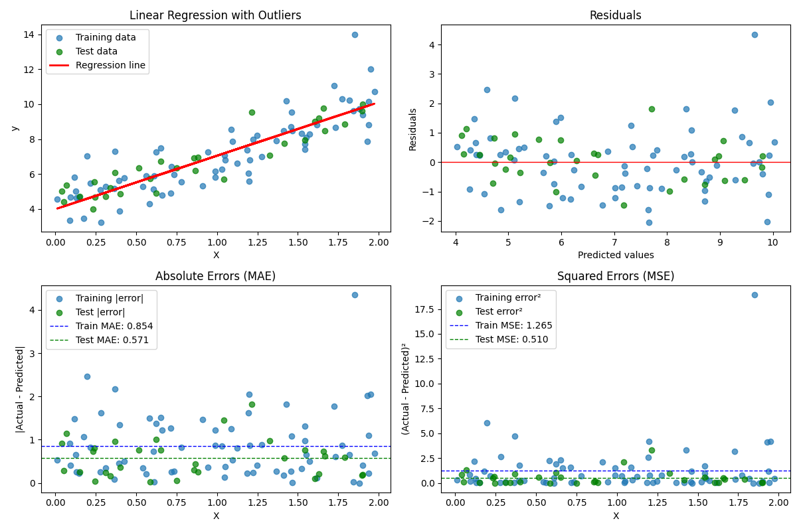

# מדדי שגיאה ברגרסיה: MAE, MSE, RMSE

## הקדמה

כאשר בונים מודל רגרסיה (חיזוי ערכים רציפים), אנו רוצים להעריך את ביצועי המודל. מדדי שגיאה מאפשרים לנו להבין עד כמה הערכים שהמודל מנבא קרובים לערכים האמיתיים. שלושת המדדים הנפוצים ביותר הם MAE, MSE ו-RMSE

## MAE - Mean Absolute Error

### Formula
$$\text{MAE} = \frac{1}{n} \sum_{i=1}^{n} |y_i - \hat{y}_i|$$

Where:
- $n$ is the number of samples
- $y_i$ is the actual value of the $i$-th sample
- $\hat{y}_i$ is the value predicted by the model for the $i$-th sample

### Explanation
MAE computes the average of the absolute error values. That is, we calculate the absolute difference between the actual value and the predicted value for each sample, and then compute the average of all these differences.

### Advantages
- Easy to understand - the result is in the same units as the original variable
- More robust to outliers than MSE (less sensitive)
- Intuitive - represents the average error in absolute terms

### Disadvantages
- Does not penalize large errors proportionally more than small errors
- Not differentiable at the minimum point (due to the absolute value), which can complicate some optimization algorithms
  The function |x| is not differentiable at x = 0 — meaning, at the exact point where the error is zero the function suddenly changes direction

## MSE - Mean Squared Error

### Formula
$$\text{MSE} = \frac{1}{n} \sum_{i=1}^{n} (y_i - \hat{y}_i)^2$$

### Explanation
MSE computes the average of the squared errors. We square the difference between the actual value and the predicted value for each sample, and then calculate the average.

### Advantages
- Penalizes larger errors more through squaring, which is appropriate for many problems
- Always differentiable, making it useful for optimization algorithms
- Very common in statistics and machine learning

### Disadvantages
- The result is in squared units of the original variable (e.g., if predicting prices in dollars, MSE will be in dollars squared)
- Very sensitive to outliers due to the squaring
- Less intuitive to understand compared to MAE

## RMSE - Root Mean Squared Error

### Formula
$$\text{RMSE} = \sqrt{\frac{1}{n} \sum_{i=1}^{n} (y_i - \hat{y}_i)^2} = \sqrt{\text{MSE}}$$

### Explanation
RMSE is the square root of MSE. It's an attempt to preserve the advantages of MSE while returning the result to the original units.

### Advantages
- The result is in the same units as the original variable
- Still penalizes larger errors more in a non-linear way
- More intuitive than MSE, but still maintains its statistical properties

### Disadvantages
- Sensitive to outliers, like MSE
- More complex computation than MAE

## Numerical Examples

Let's say we have a model that predicts housing prices. Here are some actual and predicted examples (in millions of dollars):

| House | Actual Price | Predicted Price | Error | Absolute Error | Squared Error |
|-------|--------------|-----------------|-------|----------------|---------------|
| 1     | 1.5          | 1.7             | -0.2  | 0.2            | 0.04          |
| 2     | 2.3          | 2.1             | 0.2   | 0.2            | 0.04          |
| 3     | 3.0          | 2.8             | 0.2   | 0.2            | 0.04          |
| 4     | 1.8          | 1.9             | -0.1  | 0.1            | 0.01          |
| 5     | 4.2          | 3.5             | 0.7   | 0.7            | 0.49          |

### Calculating MAE
$$\text{MAE} = \frac{1}{5} (0.2 + 0.2 + 0.2 + 0.1 + 0.7) = \frac{1.4}{5} = 0.28$$

Meaning: On average, our model is off by $0.28 million.

### Calculating MSE
$$\text{MSE} = \frac{1}{5} (0.04 + 0.04 + 0.04 + 0.01 + 0.49) = \frac{0.62}{5} = 0.124$$

Meaning: The average of squared errors is $0.124 million squared.

### Calculating RMSE
$$\text{RMSE} = \sqrt{\text{MSE}} = \sqrt{0.124} \approx 0.352$$

Meaning: The square root of the average squared error is about $0.35 million.

## Example with Outliers

Let's add a sixth house with a large prediction error:

| House | Actual Price | Predicted Price | Error | Absolute Error | Squared Error |
|-------|--------------|-----------------|-------|----------------|---------------|
| 1     | 1.5          | 1.7             | -0.2  | 0.2            | 0.04          |
| 2     | 2.3          | 2.1             | 0.2   | 0.2            | 0.04          |
| 3     | 3.0          | 2.8             | 0.2   | 0.2            | 0.04          |
| 4     | 1.8          | 1.9             | -0.1  | 0.1            | 0.01          |
| 5     | 4.2          | 3.5             | 0.7   | 0.7            | 0.49          |
| 6     | 5.0          | 3.0             | 2.0   | 2.0            | 4.00          |

### New MAE Calculation
$$\text{MAE} = \frac{1}{6} (0.2 + 0.2 + 0.2 + 0.1 + 0.7 + 2.0) = \frac{3.4}{6} \approx 0.567$$

### New MSE Calculation
$$\text{MSE} = \frac{1}{6} (0.04 + 0.04 + 0.04 + 0.01 + 0.49 + 4.0) = \frac{4.62}{6} = 0.77$$

### New RMSE Calculation
$$\text{RMSE} = \sqrt{\text{MSE}} = \sqrt{0.77} \approx 0.878$$

Notice how the outlier (House 6) affected each metric differently:
- MAE increased by about 2 times (from 0.28 to 0.567)
- MSE increased by about 6.2 times (from 0.124 to 0.77)
- RMSE increased by about 2.5 times (from 0.352 to 0.878)

This demonstrates the higher sensitivity of MSE and RMSE to outliers.

## Implementation in Python

Here's Python code that calculates all three metrics:

```python
import numpy as np
from sklearn.metrics import mean_absolute_error, mean_squared_error

# True values and predictions
y_true = np.array([1.5, 2.3, 3.0, 1.8, 4.2, 5.0])
y_pred = np.array([1.7, 2.1, 2.8, 1.9, 3.5, 3.0])

# Calculate MAE
mae = mean_absolute_error(y_true, y_pred)
print(f"MAE: {mae:.3f}")

# Calculate MSE
mse = mean_squared_error(y_true, y_pred)
print(f"MSE: {mse:.3f}")

# Calculate RMSE
rmse = np.sqrt(mse)
print(f"RMSE: {rmse:.3f}")

# Calculate manually for verification
manual_mae = np.mean(np.abs(y_true - y_pred))
manual_mse = np.mean((y_true - y_pred)**2)
manual_rmse = np.sqrt(manual_mse)

print("\nManual calculations:")
print(f"MAE: {manual_mae:.3f}")
print(f"MSE: {manual_mse:.3f}")
print(f"RMSE: {manual_rmse:.3f}")
```

Output of the code:
```
MAE: 0.567
MSE: 0.770
RMSE: 0.878

Manual calculations:
MAE: 0.567
MSE: 0.770
RMSE: 0.878
```

## Visualization in Linear Regression

Let's demonstrate the three error metrics on linear regression data:



<a href="ev-reg1-py.py">see code here</a>

## Summary and When to Use Each Metric

### MAE
Use MAE when:
- You want a metric that's easy to explain to people without a technical background
- Larger errors are not necessarily dramatically worse than smaller errors
- There are outliers in the data and you don't want them to overly influence the model evaluation

### MSE
Use MSE when:
- You need a loss function that can be differentiated for optimization
- Large errors are very problematic and you want to "punish" them more  
- The data doesn't contain significant outliers, or the outliers are important and you want to account for them

### RMSE
Use RMSE when:
- You want a metric that penalizes large errors but still produces a result in the original variable's units
- Compatibility with other statistical methods is required
- You want a metric that's easier to understand than MSE but still maintains its statistical properties

It's often a good idea to calculate all three metrics to get a complete picture of the model's performance, especially if there might be outliers in the data.
