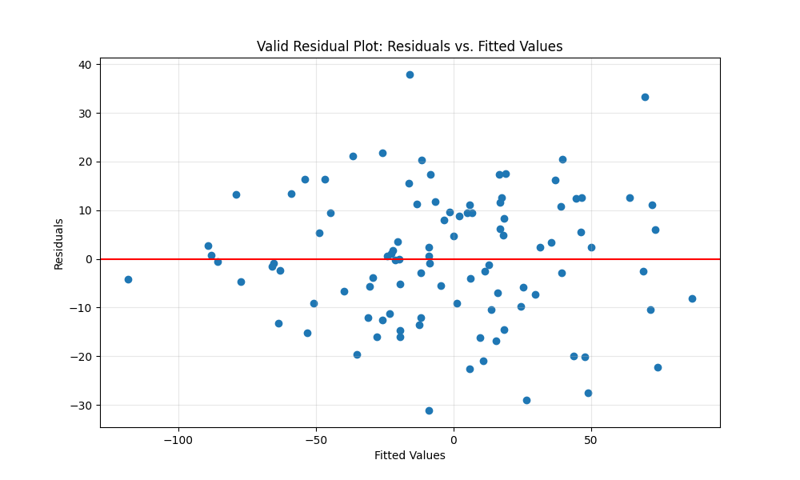
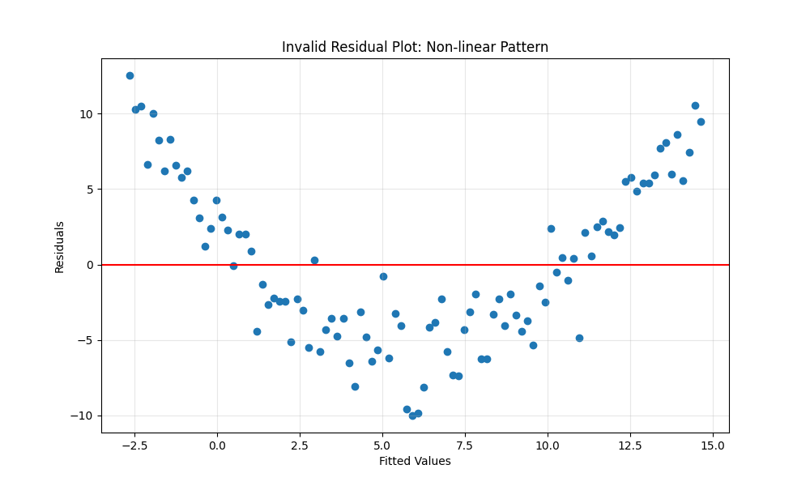
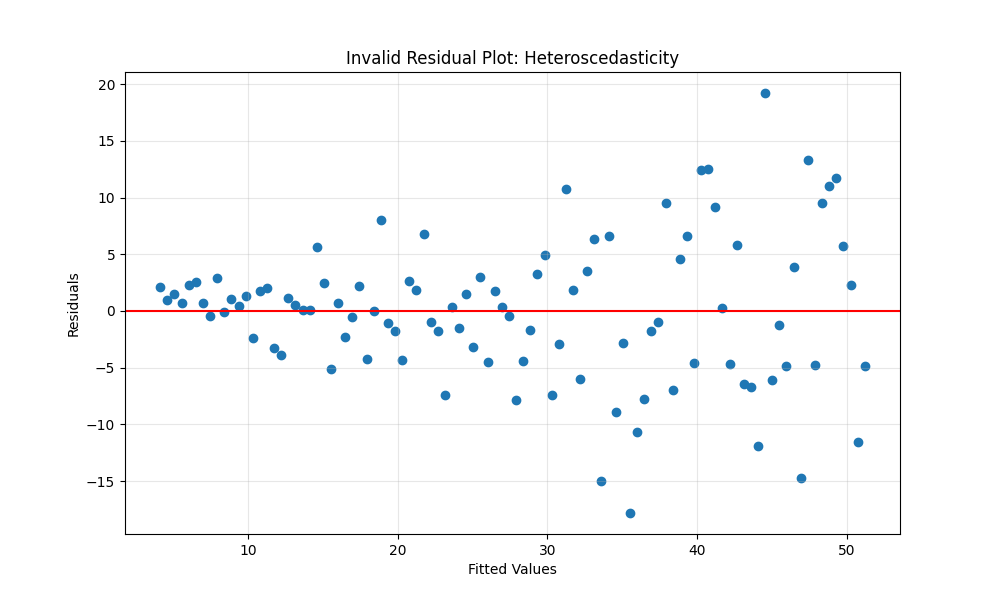
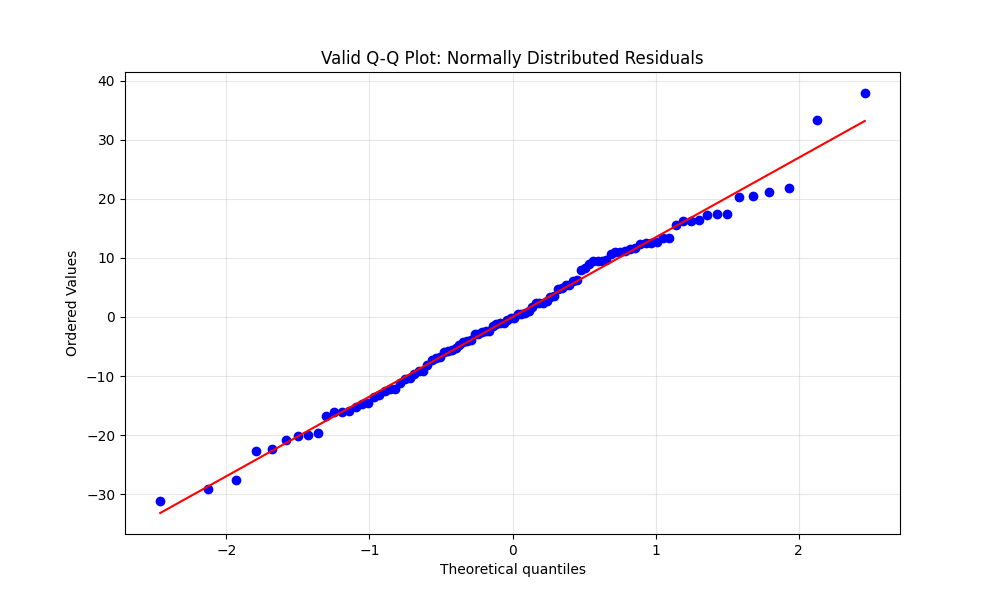
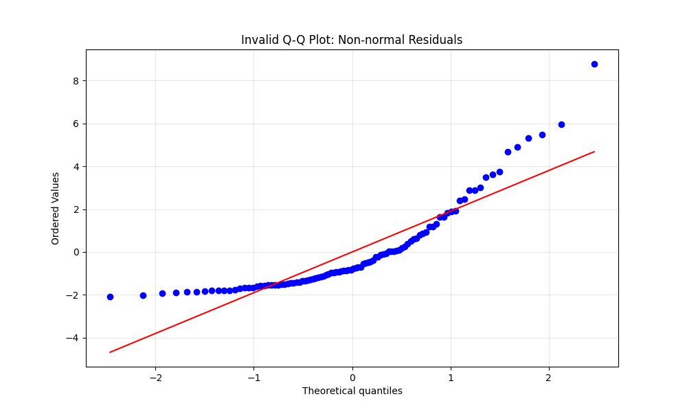
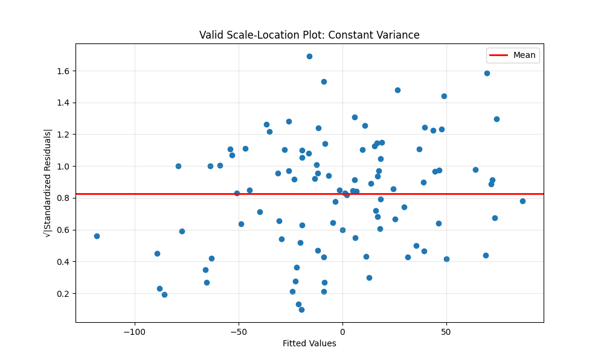
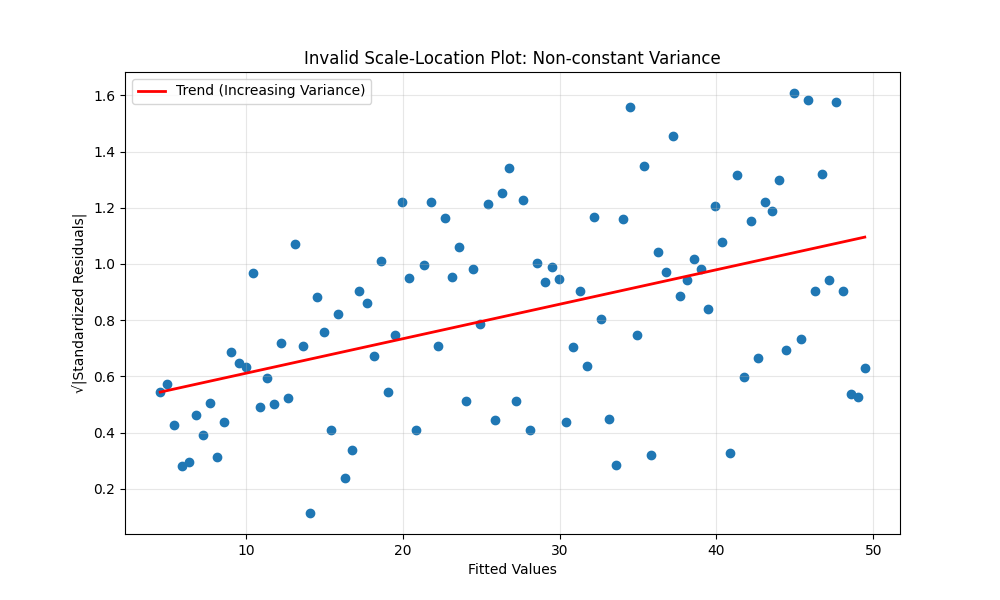
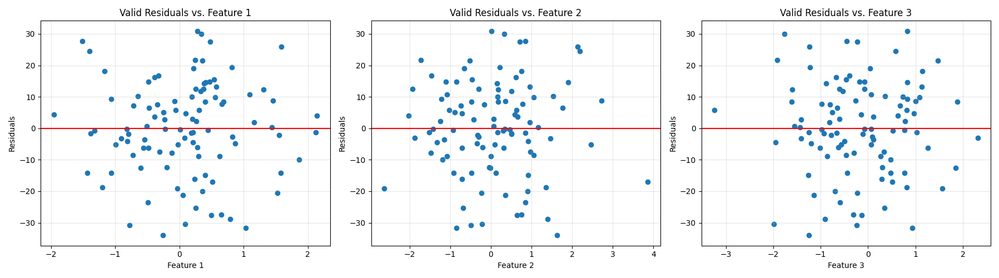
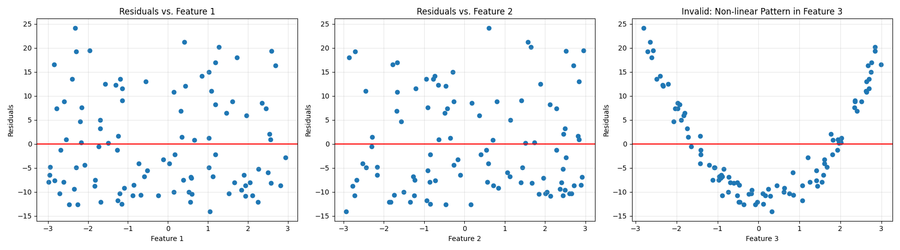

# Understanding Residuals in Linear Regression

## What is a Residual?

A residual is the difference between an observed value and the value predicted by a model:

**Residual = Observed Value - Predicted Value**

In mathematical notation:
- For an observation i: e_i = y_i - ŷ_i
- Where:
  - e_i is the residual
  - y_i is the observed value
  - ŷ_i is the predicted value from the regression model

Residuals represent the portion of the dependent variable that is not explained by the model. They are the "leftover" values after the model has been fit to the data.

## Residual Investigation

Investigating residuals helps us:

1. Assess if the linear regression assumptions have been met
2. Detect patterns that indicate model inadequacy (“The model just isn’t good enough to capture what's really going on”)
3. Identify outliers or influential points
4. Determine if transformations are needed (transformations=any change you apply to your data to make it more suitable for modeling. i.e. MinMaxScaler)
5. Evaluate the overall fit of the model

Residual investigation is a critical step in regression diagnostics to ensure that our model is valid and that our inferences and predictions are reliable

## Determining Suitability for Linear Regression through Residual Analysis

For a dataset to be suitable for linear regression modeling, the residuals should satisfy several assumptions. We can visually inspect residual plots to check these assumptions.

### Key Assumptions to Check via Residuals

1. **Linearity**: The relationship between independent and dependent variables should be linear
2. **Independence**: The residuals should be independent of each other (no autocorrelation)
3. **Homoscedasticity**: The residuals should have constant variance across all levels of predicted values
4. **Normality**: The residuals should be approximately normally distributed

See examples below 

### Graph Examples for Residual Analysis

#### 1. Residuals vs. Fitted Values Plot

This is the most common plot used for residual analysis. It plots the residuals on the y-axis against the fitted (predicted) values on the x-axis.

### Valid Residual Pattern
In a well-fitted model, this plot should show:
- Points randomly scattered around the horizontal line at y=0
- No discernible pattern
- Roughly equal spread of points above and below the zero line
- No obvious trend or curvature

```python
import numpy as np
import matplotlib.pyplot as plt
import statsmodels.api as sm
from sklearn.linear_model import LinearRegression
from sklearn.datasets import make_regression

# Generate sample data for a valid linear model
X, y = make_regression(n_samples=100, n_features=1, noise=15, random_state=42)

# Fit the model
model = LinearRegression()
model.fit(X, y)
predictions = model.predict(X)

# Calculate residuals
residuals = y - predictions

# Plot residuals vs fitted values
plt.figure(figsize=(10, 6))
plt.scatter(predictions, residuals)
plt.axhline(y=0, color='r', linestyle='-')
plt.xlabel('Fitted Values')
plt.ylabel('Residuals')
plt.title('Valid Residual Plot: Residuals vs. Fitted Values')
plt.grid(True, alpha=0.3)
plt.show()
```



### Invalid Residual Patterns

1. **Non-linear Pattern (Curvature)**:
   - Indicates that a linear model is not appropriate
   - Suggests adding polynomial terms or transforming variables



2. **Heteroscedasticity (The spread (or variance) of the errors changes across the data) Funnel Shape**:
   - Funnel Shape = צורה של משפך
   - Variance of residuals increases with the predicted values
   - Suggests using weighted least squares or transforming the response variable



#### 2. Normal Q-Q Plot of Residuals 

## probplot graph

**What is a Q-Q Plot?**

A Quantile-Quantile plot (Q-Q plot), also known as a probability plot, is a graphical technique used to determine if a dataset follows a particular theoretical distribution. The Q-Q plot is called that because it plots Quantiles vs. Quantiles
— one from your data, one from a distribution you want to compare against.
The "Q" in Q-Q stands for quantile, which refers to the fraction or percent of points below a given value.

| **Name**       | **Description**                                      | **Percent**              |
|----------------|------------------------------------------------------|--------------------------|
| **Median**     | The 0.5 quantile — 50% of data is below this value   | 50%                      |
| **Quartiles**  | Divide data into **4 parts**                         | 25%, 50%, 75%            |
| **Deciles**    | Divide data into **10 parts**                        | 10%, 20%, ..., 90%       |
| **Percentiles**| Divide data into **100 parts**                       | 1%, 2%, ..., 99%         |

<a href="4xq-q-plot.md">Q-Q Plot explained</a>

This plot helps assess whether the residuals follow a normal distribution.

##### Valid Q-Q Plot
- Points should approximately fall along the 45-degree line

```python
# Using the earlier valid data
import scipy.stats as stats

# Generate and fit valid data
X, y = make_regression(n_samples=100, n_features=1, noise=15, random_state=42)
model = LinearRegression()
model.fit(X, y)
predictions = model.predict(X)
residuals = y - predictions

# Create Q-Q plot
plt.figure(figsize=(10, 6))
stats.probplot(residuals, dist="norm", plot=plt)
plt.title('Valid Q-Q Plot: Normally Distributed Residuals')
plt.grid(True, alpha=0.3)
plt.show()
```



#### Invalid Q-Q Plot
- Significant deviations from the line indicate non-normality
- S-shaped curves suggest skewness
- Points way off the line indicate outliers

```python
# Generate data with non-normal residuals (skewed)
X = np.linspace(0, 10, 100).reshape(-1, 1)
error = np.random.exponential(scale=2, size=100)  # Skewed error term
y = 3 * X.ravel() + error

# Fit and get residuals
model = LinearRegression()
model.fit(X, y)
predictions = model.predict(X)
residuals = y - predictions

# Q-Q plot
plt.figure(figsize=(10, 6))
stats.probplot(residuals, dist="norm", plot=plt)
plt.title('Invalid Q-Q Plot: Non-normal Residuals')
plt.grid(True, alpha=0.3)
plt.show()
```



#### 3. Scale-Location Plot (Square Root of Residuals Std vs. Fitted Values)

This plot is useful for detecting heteroscedasticity (=The spread (or variance) of the errors changes across the data)

##### Valid Scale-Location Plot
- Horizontal line with points randomly scattered

```python
# Using the valid data from before
X, y = make_regression(n_samples=100, n_features=1, noise=15, random_state=42)
model = LinearRegression()
model.fit(X, y)
predictions = model.predict(X)
residuals = y - predictions

# Standardized residuals
std_residuals = residuals / np.std(residuals)
sqrt_std_residuals = np.sqrt(np.abs(std_residuals))

# Plot
plt.figure(figsize=(10, 6))
plt.scatter(predictions, sqrt_std_residuals)
plt.title('Valid Scale-Location Plot: Constant Variance')
plt.xlabel('Fitted Values')
plt.ylabel('√|Standardized Residuals|')
plt.grid(True, alpha=0.3)
plt.show()
```


#### Invalid Scale-Location Plot
- Trend or funnel shape indicates non-constant variance

```python
# Using the heteroscedastic data from before
X = np.linspace(1, 10, 100).reshape(-1, 1)
y = 5 * X.ravel() + np.random.normal(0, X.ravel(), 100)
model = LinearRegression()
model.fit(X, y)
predictions = model.predict(X)
residuals = y - predictions

# Standardized residuals
std_residuals = residuals / np.std(residuals)
sqrt_std_residuals = np.sqrt(np.abs(std_residuals))

# Plot
plt.figure(figsize=(10, 6))
plt.scatter(predictions, sqrt_std_residuals)
plt.title('Invalid Scale-Location Plot: Non-constant Variance')
plt.xlabel('Fitted Values')
plt.ylabel('√|Standardized Residuals|')
plt.grid(True, alpha=0.3)
plt.show()
```


**why is this valid?**

the blue dots should appear randomly scattered with a flat (horizontal) trend

You can see the red line (the LOESS smoothing line) going upward

hat means as the fitted values increase, the spread (variance) of the residuals increases too

this is a funnel shape, and it's a classic sign of heteroscedasticity — non-constant variance — which violates one of the key linear regression assumptions

What would a valid plot look like? Dots scattered randomly around a horizontal line


#### 4. Residuals vs. Independent Variables Plots

For multiple regression, it's important to check residual plots against each predictor variable.

##### Valid Plot
- No pattern or trend

```python
# Generate multivariate data
X, y = make_regression(n_samples=100, n_features=3, noise=15, random_state=42)
model = LinearRegression()
model.fit(X, y)
predictions = model.predict(X)
residuals = y - predictions

# Plot residuals against each feature
fig, axes = plt.subplots(1, 3, figsize=(18, 5))
for i in range(3):
    axes[i].scatter(X[:, i], residuals)
    axes[i].axhline(y=0, color='r', linestyle='-')
    axes[i].set_xlabel(f'Feature {i+1}')
    axes[i].set_ylabel('Residuals')
    axes[i].set_title(f'Valid Residuals vs. Feature {i+1}')
    axes[i].grid(True, alpha=0.3)
plt.tight_layout()
plt.show()
```


**why is this valid?**

All three scatter plots show residuals randomly scattered above and below the red line

There’s no clear pattern, curve, funnel shape, or clustering

The variance appears consistent across the range of each feature

##### Invalid Plot
- Pattern indicates a missed relationship or incorrect model specification

```python
# Generate data with a non-linear relationship in one feature
X = np.random.uniform(-3, 3, (100, 3))
y = 2 * X[:, 0] + 3 * X[:, 1] + 4 * X[:, 2]**2 + np.random.normal(0, 1, 100)

# Fit a linear model (missing the squared term)
model = LinearRegression()
model.fit(X, y)
predictions = model.predict(X)
residuals = y - predictions

# Plot residuals against each feature
fig, axes = plt.subplots(1, 3, figsize=(18, 5))
for i in range(3):
    axes[i].scatter(X[:, i], residuals)
    axes[i].axhline(y=0, color='r', linestyle='-')
    axes[i].set_xlabel(f'Feature {i+1}')
    axes[i].set_ylabel('Residuals')
    axes[i].set_title(f'Residuals vs. Feature {i+1}')
    axes[i].grid(True, alpha=0.3)
    if i == 2:
        axes[i].set_title('Invalid: Non-linear Pattern in Feature 3')
plt.tight_layout()
plt.show()
```



**is this valid?**

Feature 1 and Feature 2: Residuals look randomly scattered — ✅ These look fine.

Feature 3: The residuals show a clear U-shaped pattern — ❌ This is the problem.

## Summary of Valid vs. Invalid Residual Patterns

### Valid Patterns (Suitable for Linear Regression)
- Residuals randomly scattered around zero
- No discernible patterns or trends
- Constant variance across all fitted values
- Normal distribution of residuals
- No autocorrelation in the residuals

### Invalid Patterns (Problems with Linear Regression Fit)
- Curvature or systematic patterns in residuals
- Funnel-shaped patterns indicating heteroscedasticity (The spread (or variance) of the errors changes across the data)
- Non-normal distribution of residuals
- Clusters of residuals or outliers
- Autocorrelation in the residuals

## Conclusion

Residual analysis is a powerful tool for assessing the appropriateness of a linear regression model. By examining residual plots, we can identify potential issues with our model and make necessary adjustments such as:

1. Adding polynomial terms or transforming variables if non-linearity is detected
2. Applying transformations (like log, square root) to the response variable if heteroscedasticity is present
3. Using robust regression methods if outliers are influencing the model
4. Using time series methods if autocorrelation is detected

Always inspect residuals before drawing conclusions from a linear regression model. They tell the story of what your model missed and guide you toward improvements.
