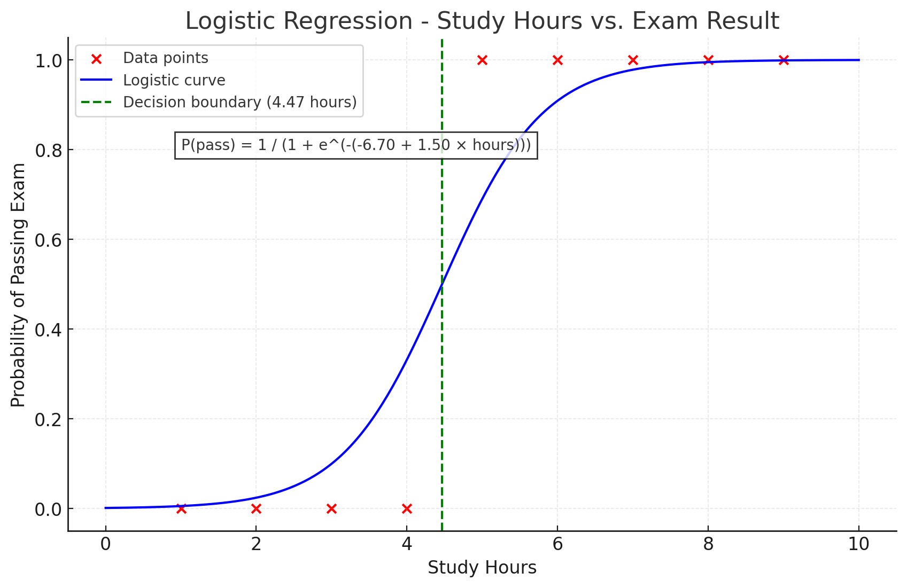
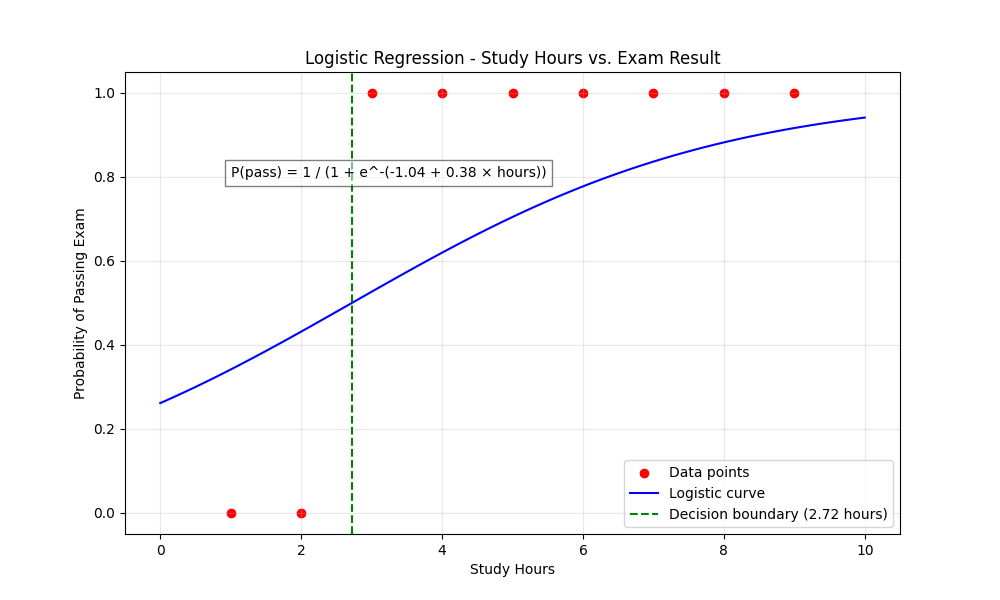

# רגרסיה לוגיסטית

## הבעיה שרוצים לפתור

רגרסיה לוגיסטית היא שיטה סטטיסטית המשמשת לניבוי תוצאות בינאריות (0 או 1, כן או לא) על בסיס משתנים מסבירים. בניגוד לרגרסיה לינארית שמנבאת ערכים רציפים, רגרסיה לוגיסטית מחשבת את ההסתברות שדוגמה מסוימת תשתייך לקטגוריה מסוימת.

**דוגמה**: נניח שאנו רוצים לחזות האם תלמיד יעבור מבחן (יצליח=1, ייכשל=0) על סמך מספר שעות הלימוד שלו. להלן נתונים היסטוריים של תלמידים:

| שעות לימוד | תוצאה (1=עבר, 0=נכשל) |
|------------|----------------------|
| 1          | 0                    |
| 2          | 0                    |
| 3          | 0                    |
| 4          | 0                    |
| 5          | 1                    |
| 6          | 1                    |
| 7          | 1                    |
| 8          | 1                    |
| 9          | 1                    |

אנו רוצים למצוא מודל שיחזה את ההסתברות שתלמיד יעבור את המבחן בהתבסס על שעות הלימוד שלו.

## Mathematical Formula and Complete Calculation

Logistic regression models the probability that a dependent variable Y equals 1 (in our case, passing the exam) as a function of independent variables X (in our case, study hours). The logistic function (also called the sigmoid function) is used to model this probability:

$$P(Y=1|X) = \frac{1}{1 + e^{-(\beta_0 + \beta_1 X)}}$$

Where:
- $P(Y=1|X)$ is the probability that Y=1 given X
- $\beta_0$ is the intercept
- $\beta_1$ is the coefficient for the independent variable X
- $e$ is the base of the natural logarithm (approximately 2.71828)

The logistic function always outputs a value between 0 and 1, which can be interpreted as a probability.

### 📊 הסבר פשוט על הנוסחה

Logistic Regression מחשבת הסתברות שמשהו יקרה, לפי ערך של משתנה X (למשל: כמה שעות למידה)

### הנוסחה:

$$
P(Y = 1 \mid X) = \frac{1}{1 + e^{-(\beta_0 + \beta_1 X)}}
$$

זו נקראת **פונקציית סיגמואיד (sigmoid function)** – היא מחזירה ערכים בין 0 ל־1, ולכן מתאימה לחיזוי הסתברויות

### 🧠 הסברים:

- $$P(Y = 1 \mid X)$$ –

   ההסתברות ש-Y יהיה 1 בהינתן X
  
- $$\beta_0$$ – הקבוע (intercept)  
- $$\beta_1$$ – מקדם של X  
- $$e$$ – הבסיס של הלוגריתם הטבעי (בערך 2.718)

### 🧮 דוגמה חישובית:

אם:
- $$X = 5$$ (שעות למידה)
- $$\beta_0 = -4$$
- $$\beta_1 = 1$$

אז:

$$
P = \frac{1}{1 + e^{-(-4 + 1 \cdot 5)}} = \frac{1}{1 + e^{-1}} \approx 0.73
$$

כלומר: ההסתברות לעבור את המבחן אחרי 5 שעות למידה היא בערך **73%** ✅

### ✨ למה Logistic Regression שימושית?

- מחזירה ערכים בין 0 ל־1 → מושלם להסתברויות
- מאפשרת להבין את הקשר בין משתנה רציף (כמו שעות לימוד) לתוצאה בינארית (כמו הצלחה/כישלון)

## דוגמא ראשונה: ניחוש β₀ ו־β₁

### שלב 1: נגדיר את הבעיה
יש לנו נתונים (X, Y), כאשר:
- X הוא משתנה רציף (למשל: שעות למידה)
- Y הוא בינארי: 0 או 1 (למשל: כישלון או הצלחה)

המטרה שלנו:
> לחשב את ההסתברות ש־Y יהיה 1 בהינתן X

### שלב 2: נגדיר את הפונקציה הלוגיסטית

זו הפונקציה שאיתה נבנה את המודל:

$$
P(Y = 1 \mid X) = \frac{1}{1 + e^{-(\beta_0 + \beta_1 X)}}
$$

היא תמיד מחזירה ערכים בין 0 ל־1 – מושלם להסתברויות.

### שלב 3: נבנה את פונקציית ההסתברות הכוללת (Likelihood)

כדי לבדוק עד כמה המודל שלנו "מדויק", נחשב את ההסתברות שהוא חוזה נכון את כל הנתונים:

$$
L(\beta_0, \beta_1) = \prod_{i=1}^{n} \left( \hat{p}_i \right)^{y_i} \cdot \left(1 - \hat{p}_i \right)^{1 - y_i}
$$

כאשר:

$$
\hat{p}_i = \frac{1}{1 + e^{-(\beta_0 + \beta_1 x_i)}}
$$

#### ✅ משמעות:
-  היא ההסתברות של המודל לכך שהתצפית ה- תהיה 1
-  הוא הערך בפועל — או 0 או 1
- כאשר , מקבלים: 
- כאשר , מקבלים: 
  
הנוסחה חכמה בכך שהיא משתמשת ב- ו- כדי לכסות את שני המקרים באותה נוסחה — בלי תנאים מיוחדים

**🎯 דוגמה לחישוב פונקציית Likelihood**

נניח שיש לנו שתי דוגמאות בלבד:

- דוגמה ראשונה: x = 1, y = 1. לדוגמא - אחרי שעה של הליכה היה היה עודף סוכר בדם
- דוגמה שנייה: x = 2, y = 0. לדוגמא - אחרי שעתיים של הליכה לא היה עודף סוכר בדם

נבחר מקדמים למודל:
- β₀ = 0  
- β₁ = 1

**שלב א: נחשב את ההסתברות (p-hat) שהמודל חוזה**

הנוסחה היא:

$$
\hat{p}_i = \frac{1}{1 + e^{-(\beta_0 + \beta_1 x_i)}}
$$

##### עבור הדוגמה הראשונה (x = 1):

$$
\hat{p}_1 = \frac{1}{1 + e^{-(0 + 1 \cdot 1)}} = \frac{1}{1 + e^{-1}} \approx 0.731
$$

##### עבור הדוגמה השנייה (x = 2):

$$
\hat{p}_2 = \frac{1}{1 + e^{-(0 + 1 \cdot 2)}} = \frac{1}{1 + e^{-2}} \approx 0.881
$$

אבל – בגלל ש־y = 0 במקרה הזה, נשתמש ב־(1 − p̂):

$$
1 - \hat{p}_2 \approx 1 - 0.881 = 0.119
$$


**שלב ב: נחשב את פונקציית ה־Likelihood הכוללת**

נשתמש בנוסחה:

$$
L = (\hat{p}_1)^{y_1} \cdot (1 - \hat{p}_2)^{1 - y_2}
$$

נציב את הערכים:

$$
L = 0.731 \cdot 0.119 \approx 0.087
$$


#### 🧠 מה זה אומר?

- המודל חזה טוב יחסית בדוגמה הראשונה (73% עבור y=1)
- אבל טעה בדוגמה השנייה — חזה הסתברות גבוהה ל־y=1, למרות שהתשובה הייתה y=0
- לכן, פונקציית ה־Likelihood הסופית היא בערך 8.7%

המסקנה: נרצה למצוא β₀ ו־β₁ אחרים שייתנו ערך גבוה יותר ל־L.

 
## כיצד לחשב את β₀ ו־β₁

ראה בהמשך ... נספח א'

## כיצד למצוא את המקדמים בפייטון

```python
from sklearn.linear_model import LogisticRegression
import numpy as np

# Data: Annual income and loan repayment (1=yes, 0=no)
X = np.array([30, 35, 40, 45, 50, 55, 60, 65, 70, 75]).reshape(-1, 1)
y = np.array([0, 0, 0, 0, 0, 1, 0, 1, 1, 1])

# Fit logistic regression model
model = LogisticRegression(solver='liblinear')
model.fit(X, y)

# Get coefficients
b0 = model.intercept_[0]
b1 = model.coef_[0][0]

# Print the logistic regression equation
print(f"Logistic regression equation:")
print(f"P(return) = 1 / (1 + e^-({b0:.2f} + {b1:.2f} * income))")
```
output:
```
Logistic regression equation:
P(return) = 1 / (1 + e^-(-0.89 + 0.02 * income))
```


## מושג --  Decision Boundary

In logistic regression, we often need to make a binary decision based on the predicted probability. The most common threshold is 0.5, meaning:
- If $P(Y=1|X) \geq 0.5$, we predict Y=1 (pass)
- If $P(Y=1|X) < 0.5$, we predict Y=0 (fail)

Let's find the decision boundary where $P(\text{pass}|\text{hours}) = 0.5$:

$$0.5 = \frac{1}{1 + e^{-(-6.7 + 1.5 \times \text{hours})}}$$

$$1 + e^{-(-6.7 + 1.5 \times \text{hours})} = 2$$

$$e^{-(-6.7 + 1.5 \times \text{hours})} = 1$$

$$-(-6.7 + 1.5 \times \text{hours}) = 0$$

$$-6.7 + 1.5 \times \text{hours} = 0$$

$$1.5 \times \text{hours} = 6.7$$

$$\text{hours} = \frac{6.7}{1.5} \approx 4.47$$

So according to our model, students need to study approximately 4.47 hours to have a 50% chance of passing the exam.

## גרף



הגרף מציג את עקומת הרגרסיה הלוגיסטית (הקו הכחול) שמתאר את ההסתברות לעבור את המבחן כפונקציה של שעות הלימוד. שימו לב לצורה האופיינית של עקומת ה-S (סיגמואיד) של
הרגרסיה הלוגיסטית. הנקודות האדומות הן הנתונים המקוריים, והקו המקווקו האנכי מציין את הגבול שבו ההסתברות לעבור את המבחן היא 0.5.

## קוד פייטון

הנה קוד פייטון ליישום רגרסיה לוגיסטית:

```python
import numpy as np
import matplotlib.pyplot as plt
from sklearn.linear_model import LogisticRegression
import pandas as pd
from math import log

# Our data
hours_studied = np.array([1, 2, 3, 4, 5, 6, 7, 8, 9]).reshape(-1, 1)  # Study hours
exam_results = np.array([0, 0, 0, 0, 1, 1, 1, 1, 1])  # Exam results (0=fail, 1=pass)

# Create logistic regression model
model = LogisticRegression(solver='liblinear')
model.fit(hours_studied, exam_results)

# Print results
print(f"Intercept (β₀): {model.intercept_[0]:.2f}")
print(f"Coefficient (β₁): {model.coef_[0][0]:.2f}")

# Calculate equation
equation = f"P(pass) = 1 / (1 + e^-({model.intercept_[0]:.2f} + {model.coef_[0][0]:.2f} × hours))"
print(f"Logistic equation: {equation}")

# Helper: get boundary for any probability
def get_threshold(probability):
    logit = log(probability / (1 - probability))
    return (logit - b0) / b1

# Coefficients
b0 = model.intercept_[0]
b1 = model.coef_[0][0]

# Find decision boundary (probability = 0.5)
decision_boundary = -model.intercept_[0] / model.coef_[0][0]
# or
decision_boundary = get_threshold(0.5)

print(f"Decision boundary: {decision_boundary:.2f} hours")

# Generate points for the logistic curve
x_test = np.linspace(0, 10, 100).reshape(-1, 1)
y_proba = model.predict_proba(x_test)[:, 1]

# Create the graph
plt.figure(figsize=(10, 6))
plt.scatter(hours_studied, exam_results, color='red', marker='o', label='Data points')
plt.plot(x_test, y_proba, color='blue', label='Logistic curve')
plt.axvline(x=decision_boundary, color='green', linestyle='--', label=f'Decision boundary ({decision_boundary:.2f} hours)')

# Add labels and formatting
plt.title('Logistic Regression - Study Hours vs. Exam Result')
plt.xlabel('Study Hours')
plt.ylabel('Probability of Passing Exam')
plt.grid(True, alpha=0.3)
plt.legend()
plt.text(1, 0.8, equation, fontsize=10, bbox=dict(facecolor='white', alpha=0.5))
plt.ylim(-0.05, 1.05)
plt.show()

# Make predictions for specific study hours
print("\nPredictions:")
for hours in [1, 2, 3, 4, 5, 6]:
    probability = 1 / (1 + np.exp(-(model.intercept_[0] + model.coef_[0][0] * hours)))
    outcome = "Pass" if probability >= 0.5 else "Fail"
    print(f"{hours} hours: {probability:.2f} probability of passing ({outcome})")
```

## דוגמת הרצה

כאשר נריץ את הקוד, נקבל:



```
Intercept (β₀): -1.04
Coefficient (β₁): 0.38
Logistic equation: P(pass) = 1 / (1 + e^-(-1.04 + 0.38 × hours))
Decision boundary: 2.72 hours

Predictions:
1 hours: 0.34 probability of passing (Fail)
2 hours: 0.43 probability of passing (Fail)
3 hours: 0.53 probability of passing (Pass)
4 hours: 0.62 probability of passing (Pass)
5 hours: 0.70 probability of passing (Pass)
6 hours: 0.78 probability of passing (Pass)
```

התוצאות מראות שתלמיד צריך ללמוד לפחות 4.43 שעות כדי שהסיכוי שלו לעבור את המבחן יהיה מעל 50%. כמו כן, תלמיד שלומד 6 שעות יש לו סיכוי של כ-78% לעבור את המבחן.

## השוואה בין רגרסיה לינארית לרגרסיה לוגיסטית

| היבט | רגרסיה לינארית | רגרסיה לוגיסטית |
|------|-----------------|------------------|
| **סוג משתנה תלוי** | רציף (מספרי) | בינארי (0/1, כן/לא) |
| **טווח התחזית** | כל ערך ממשי $(-\infty, \infty)$ | ערך בין 0 ל-1 (הסתברות) |
| **פונקציית הקישור** | זהות $(y = \beta_0 + \beta_1 x)$ | לוגיט $(\ln\frac{p}{1-p} = \beta_0 + \beta_1 x)$ |
| **שיטת אמידה** | שיטת הריבועים הפחותים | שיטת הנראות המקסימלית |
| **פרשנות המקדמים** | שינוי ב-Y ליחידה של X | שינוי בלוג של יחס הסיכויים |
| **צורת הקשר** | קווי | עקומת S (סיגמואיד) |
| **הנחות** | ליניאריות, נורמליות של שאריות | לא מניחה התפלגות נורמלית |

## יישומים של רגרסיה לוגיסטית

רגרסיה לוגיסטית משמשת במגוון תחומים:

1. **רפואה**: חיזוי הסיכוי להתפתחות מחלה בהתבסס על גורמי סיכון
2. **פיננסים**: הערכת סיכון אשראי וחיזוי האם לקוח יחזיר הלוואה
3. **שיווק**: חיזוי האם לקוח ירכוש מוצר מסוים
4. **חינוך**: חיזוי הצלחה או כישלון של תלמידים
5. **מדעי החברה**: ניתוח של החלטות בינאריות

## תרגיל נוסף

**תרגיל**: 
חברת אשראי רוצה לחזות האם לקוח יחזיר את ההלוואה שלו (1=החזיר, 0=לא החזיר) על סמך ההכנסה השנתית שלו (באלפי שקלים). להלן נתונים היסטוריים:

| הכנסה שנתית (אלפי ש"ח) | החזיר הלוואה (1=כן, 0=לא) |
|------------------------|---------------------------|
| 30                     | 0                         |
| 35                     | 0                         |
| 40                     | 0                         |
| 45                     | 0                         |
| 50                     | 0                         |
| 55                     | 1                         |
| 60                     | 0                         |
| 65                     | 1                         |
| 70                     | 1                         |
| 75                     | 1                         |
| 80                     | 1                         |
| 85                     | 1                         |
| 90                     | 1                         |

1. בנה מודל רגרסיה לוגיסטית שמתאר את הקשר בין ההכנסה השנתית לבין החזר ההלוואה.
2. מה ההסתברות שלקוח עם הכנסה שנתית של 58 אלף ש"ח יחזיר את ההלוואה?
3. מהי ההכנסה השנתית המינימלית שלקוח צריך כדי שההסתברות שיחזיר את ההלוואה תהיה לפחות 75%?

## נספח א'- כיצד למצוא את β₀ ו־β₁

- מחשבים נגזרות של הפונקציה לפי β₀ ו־β₁
- משווים ל־0 כדי למצוא נקודת קיצון
- אבל... אי אפשר לפתור את זה ידנית כמו ברגרסיה רגילה

#### מה המטרה?
אנחנו רוצים למצוא את הערכים של לפי β₀ ו־β₁ שמביאים את פונקציית הלוג־לייקלי למקסימום

לפי מתמטיקה:
- נקודת מקסימום נמצאת כאשר **הנגזרת = 0**
- כלומר: הפונקציה לא עולה ולא יורדת – זו פסגה (או תחתית, אבל כאן מדובר על מקסימום)

#### מהי הפונקציה שלנו?

זוהי פונקציית **הלוג־לייקלי** (log-likelihood):

$$
\log L(\beta_0, \beta_1) = \sum_{i=1}^{n} \left[ y_i \cdot \log(\hat{p}_i) + (1 - y_i) \cdot \log(1 - \hat{p}_i) \right]
$$

כאשר:

$$
\hat{p}_i = \frac{1}{1 + e^{-(\beta_0 + \beta_1 x_i)}}
$$

#### נגזרות:

הנגזרות של הפונקציה לפי β₀ ו־β₁ הן:

- לפי $$\beta_1$$:

$$
\frac{\partial}{\partial \beta_1} \log L = \sum_{i=1}^{n} (y_i - \hat{p}_i) \cdot x_i
$$

- לפי $$\beta_0$$:

$$
\frac{\partial}{\partial \beta_0} \log L = \sum_{i=1}^{n} (y_i - \hat{p}_i)
$$


#### למה משווים ל־0?

כדי למצוא מקסימום, משווים את הנגזרות ל־0:

$$
\frac{\partial}{\partial \beta} \log L = 0
$$

אבל... לא ניתן לפתור ישירות, לכן נעבור לפתרון נומרי (כמו Gradient Descent)

## 🧸 דוגמה לתהליך 

נניח שיש לנו 2 תצפיות:

| x  | y |
|----|---|
| 1  | 1 |
| 2  | 0 |

ונניח שכרגע:
- $$\beta_0 = 0$$
- $$\beta_1 = 0$$

#### שלב 1: חישוב ההסתברויות (p-hat)

$$
\hat{p}_1 = \frac{1}{1 + e^{-(0 + 0 \cdot 1)}} = 0.5
$$

$$
\hat{p}_2 = \frac{1}{1 + e^{-(0 + 0 \cdot 2)}} = 0.5
$$

#### שלב 2: 

**חישוב נגזרת לפי $$\beta_1$$**

$$
\frac{\partial}{\partial \beta_0} \log L = \sum_{i=1}^{n} (y_i - \hat{p}_i)
$$

$$
\sum (y_i - \hat{p}_i) \cdot x_i =
(1 - 0.5) \cdot 1 + (0 - 0.5) \cdot 2 =
0.5 - 1 = -0.5
$$

מאחר והנגזרת שלילית, המסקנה היא:
> **צריך להגדיל את** $$\beta_1$$ כדי לשפר את המודל.
> 

**חישוב נגזרת לפי $$\beta_0$$**

$$
\frac{\partial}{\partial \beta_0} \log L = \sum_{i=1}^{n} (y_i - \hat{p}_i)
$$

$$
\sum (y_i - \hat{p}_i) =
(1 - 0.5) + (0 - 0.5)  =
0.5 - 0.5 = 0
$$

- הנגזרת לפי β₀ שווה ל־0 בסיבוב הזה
- לכן **לא נעדכן את β₀** כרגע, כי אין טעם לזוז אם אנחנו בדיוק באמצע

### 🎯 סיכום:
- אם הנגזרת חיובית → מעלים/מורידים את המקדם תלוי בפונקציית העלות (חיובית/שלילית)
- אם הנגזרת שלילית → מורידים/מעלים את המקדם תלוי בפונקציית העלות (חיובית/שלילית)
- נמשיך כך עד שהנגזרת תהיה ≈ 0 – ונמצא את מקסימום הפונקציה 💛

### משתמשים בפתרון נומרי

בגלל שהפונקציה מסובכת, המחשב פותר אותה על ידי ניסוי וטעייה חכמה:

- Gradient Descent
- Newton-Raphson
- שיטות אחרות שנמצאות במודלים כמו `LogisticRegression` בסקיקיט־לרן

כל פעם המחשב משנה קצת את β₀ ו־β₁, בודק אם ההסתברויות נהיו יותר טובות,  
וממשיך עד שהוא מוצא את הערכים הכי טובים.

### ✅ סיכום:
- אין נוסחה סגורה למציאת β₀ ו־β₁
- הפתרון מתקבל בעזרת אופטימיזציה מתמטית (נומרית)
- הפונקציה שאנחנו ממקסמים נקראת log-likelihood
