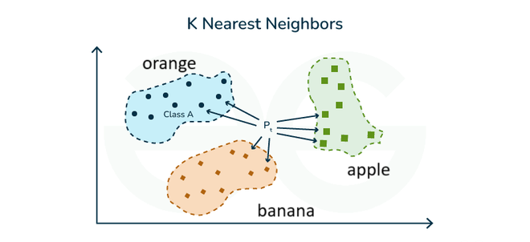
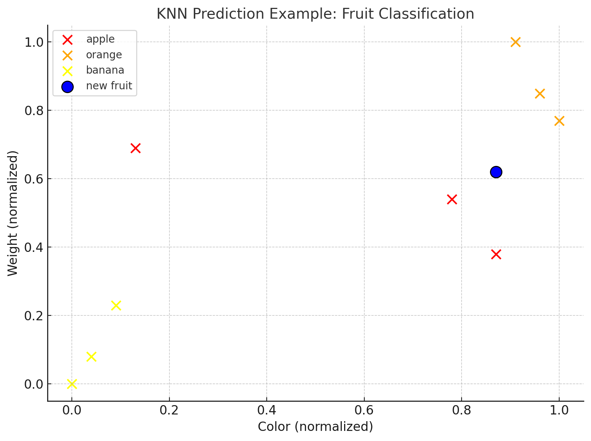

# K-Nearest Neighbors (KNN)

## הבעיה שרוצים לפתור

אלגוריתם K-Nearest Neighbors (או בקיצור KNN) הוא שיטת סיווג וחיזוי פשוטה אך יעילה. האלגוריתם מאפשר לנו לסווג נקודות נתונים חדשות על בסיס הדמיון שלהן לנקודות נתונים מוכרות.

**דוגמה**: נניח שיש לנו נתונים על סוגים שונים של פירות (תפוחים, תפוזים ובננות) עם מאפיינים כמו צבע, גודל ומשקל. עכשיו קיבלנו פרי חדש ואנחנו רוצים לדעת מאיזה סוג הוא.

נניח שיש לנו מדגם של פירות עם הנתונים הבאים:

| צבע (0-255, R) | גודל (ס"מ) | משקל (גרם) | סוג הפרי |
|----------------|------------|------------|----------|
| 200            | 7          | 150        | תפוח     |
| 50             | 7          | 160        | תפוח     |
| 220            | 6          | 140        | תפוח     |
| 240            | 9          | 170        | תפוז     |
| 250            | 8          | 165        | תפוז     |
| 230            | 9          | 180        | תפוז     |
| 30             | 12         | 120        | בננה     |
| 40             | 13         | 130        | בננה     |
| 20             | 11         | 115        | בננה     |

עכשיו הגיע פרי חדש עם צבע 220, גודל 8 ס"מ ומשקל 155 גרם. מאיזה סוג הפרי?

## Mathematical Formula and Complete Calculation



K-Nearest Neighbors doesn't have a "formula" in the traditional sense, but rather works by:
1. Calculating the distance between a new data point and all existing points
2. Finding the K points with the smallest distances
3. Assigning the majority class among those K points to the new point

### Distance Calculation

The most common distance measure used in KNN is the Euclidean distance:

$$d(p, q) = \sqrt{\sum_{i=1}^{n} (p_i - q_i)^2}$$

Where:
- $p$ and $q$ are two data points
- $n$ is the number of features
- $p_i$ and $q_i$ are the values of the $i$-th feature for points $p$ and $q$

For our fruit example, we have three features (color, size, weight). However, these features have different scales, which can bias the distance calculation. To address this, we should normalize the data:

1. **Normalization formula:**
2. 
$$x_{norm} = \frac{x - x_{min}}{x_{max} - x_{min}}$$

Normalized data:

| צבע (נרמול) | גודל (נרמול) | משקל (נרמול) | סוג הפרי |
|-------------|--------------|--------------|----------|
| 0.78        | 0.14         | 0.54         | תפוח     |
| 0.13        | 0.14         | 0.69         | תפוח     |
| 0.87        | 0.00         | 0.38         | תפוח     |
| 0.96        | 0.43         | 0.85         | תפוז     |
| 1.00        | 0.29         | 0.77         | תפוז     |
| 0.91        | 0.43         | 1.00         | תפוז     |
| 0.04        | 0.86         | 0.08         | בננה     |
| 0.09        | 1.00         | 0.23         | בננה     |
| 0.00        | 0.71         | 0.00         | בננה     |

Now for our new fruit with values: color=220, size=8, weight=155, we normalize:
- Normalized color: (220-20)/(250-20) = 0.87
- Normalized size: (8-6)/(13-6) = 0.29
- Normalized weight: (155-115)/(180-115) = 0.62

### Complete Calculation

Now, we calculate the Euclidean distance between our normalized new fruit and each fruit in the dataset:

**Distance to Fruit 1 (תפוח):**
$$d = \sqrt{(0.87-0.78)^2 + (0.29-0.14)^2 + (0.62-0.54)^2} = \sqrt{0.0081 + 0.0225 + 0.0064} = \sqrt{0.037} \approx 0.192$$

**Distance to Fruit 2 (תפוח):**
$$d = \sqrt{(0.87-0.13)^2 + (0.29-0.14)^2 + (0.62-0.69)^2} = \sqrt{0.5476 + 0.0225 + 0.0049} = \sqrt{0.575} \approx 0.758$$

**Distance to Fruit 3 (תפוח):**
$$d = \sqrt{(0.87-0.87)^2 + (0.29-0.00)^2 + (0.62-0.38)^2} = \sqrt{0 + 0.0841 + 0.0576} = \sqrt{0.1417} \approx 0.376$$

**Distance to Fruit 4 (תפוז):**
$$d = \sqrt{(0.87-0.96)^2 + (0.29-0.43)^2 + (0.62-0.85)^2} = \sqrt{0.0081 + 0.0196 + 0.0529} = \sqrt{0.0806} \approx 0.284$$

**Distance to Fruit 5 (תפוז):**
$$d = \sqrt{(0.87-1.00)^2 + (0.29-0.29)^2 + (0.62-0.77)^2} = \sqrt{0.0169 + 0 + 0.0225} = \sqrt{0.0394} \approx 0.198$$

**Distance to Fruit 6 (תפוז):**
$$d = \sqrt{(0.87-0.91)^2 + (0.29-0.43)^2 + (0.62-1.00)^2} = \sqrt{0.0016 + 0.0196 + 0.1444} = \sqrt{0.1656} \approx 0.407$$

**Distance to Fruit 7 (בננה):**
$$d = \sqrt{(0.87-0.04)^2 + (0.29-0.86)^2 + (0.62-0.08)^2} = \sqrt{0.6889 + 0.3249 + 0.2916} = \sqrt{1.3054} \approx 1.142$$

**Distance to Fruit 8 (בננה):**
$$d = \sqrt{(0.87-0.09)^2 + (0.29-1.00)^2 + (0.62-0.23)^2} = \sqrt{0.6084 + 0.5041 + 0.1521} = \sqrt{1.2646} \approx 1.125$$

**Distance to Fruit 9 (בננה):**
$$d = \sqrt{(0.87-0.00)^2 + (0.29-0.71)^2 + (0.62-0.00)^2} = \sqrt{0.7569 + 0.1764 + 0.3844} = \sqrt{1.3177} \approx 1.148$$

Now, if we choose K=3 (the three nearest neighbors):
1. Fruit 1 (תפוח): distance 0.192
2. Fruit 5 (תפוז): distance 0.198
3. Fruit 4 (תפוז): distance 0.284

Since 2 out of 3 nearest neighbors are oranges (תפוז), we classify our new fruit as an orange.

If we had chosen K=5, the 5 nearest neighbors would be:
1. Fruit 1 (תפוח): distance 0.192
2. Fruit 5 (תפוז): distance 0.198
3. Fruit 4 (תפוז): distance 0.284
4. Fruit 3 (תפוח): distance 0.376
5. Fruit 6 (תפוז): distance 0.407

In this case, 3 out of 5 are oranges, so our classification would still be orange (תפוז).

## גרף



בגרף זה אנו רואים ויזואליזציה דו-ממדית של נתוני הפירות, כאשר הנקודה הכחולה מסמנת את הפרי החדש, והמעגל מסמן את K=3 השכנים הקרובים ביותר. רוב השכנים מסווגים כתפוזים, ולכן הפרי החדש מסווג כתפוז.

## קוד פייטון

הנה קוד פייטון ליישום אלגוריתם KNN:

```python
import numpy as np
import matplotlib.pyplot as plt
from sklearn.neighbors import KNeighborsClassifier
from sklearn.preprocessing import MinMaxScaler
from sklearn.model_selection import train_test_split
from sklearn.metrics import accuracy_score, classification_report

# Fruit data
colors = np.array([200, 50, 220, 240, 250, 230, 30, 40, 20])
sizes = np.array([7, 7, 6, 9, 8, 9, 12, 13, 11])
weights = np.array([150, 160, 140, 170, 165, 180, 120, 130, 115])
fruit_types = np.array(['apple', 'apple', 'apple', 'orange', 'orange', 'orange', 'banana', 'banana', 'banana'])

# Create feature matrix
X = np.column_stack((colors, sizes, weights))
y = fruit_types

# Normalize data
scaler = MinMaxScaler()
X_scaled = scaler.fit_transform(X)

# Train the KNN model
k = 3  # number of neighbors
model = KNeighborsClassifier(n_neighbors=k)
model.fit(X_scaled, y)

# New fruit to classify
new_fruit = np.array([[220, 8, 155]])
new_fruit_scaled = scaler.transform(new_fruit)
prediction = model.predict(new_fruit_scaled)
probabilities = model.predict_proba(new_fruit_scaled)

# Output result
print(f"Prediction: The new fruit is a {prediction[0]}")

# Print class probabilities
class_names = model.classes_
print("\nClass probabilities:")
for cls, prob in zip(class_names, probabilities[0]):
    print(f"{cls}: {prob:.2f}")

```

## דוגמת הרצה

כאשר נריץ את הקוד, נקבל:

```
Prediction: The new fruit is a orange

Class probabilities:
apple: 0.33
banana: 0.00
orange: 0.67
```

על פי המודל שלנו, הפרי החדש מסווג כתפוז (orange) עם הסתברות של 67%, מכיוון שמתוך שלושת השכנים הקרובים ביותר, שניים מהם הם תפוזים

### יתרונות KNN:
1. פשוט ליישום וקל להבנה
2. אין צורך בהנחות על צורת הנתונים
3. יעיל לנתונים עם גבולות החלטה מורכבים
4. ניתן להשתמש גם למשימות רגרסיה וגם למשימות סיווג

### חסרונות KNN:
1. איטי בזמן חיזוי על מאגרי נתונים גדולים
2. דורש תקנון נתונים זהיר
3. רגיש לנתונים חריגים ורעש
4. דורש בחירה מושכלת של ערך K
5. צורך זיכרון גבוה שכן צריך לשמור את כל נתוני האימון

### נקודות חשובות בבחירת K:
1. אם K קטן: רגיש יותר לרעש אבל יכול לזהות דפוסים מקומיים
2. אם K גדול: יותר יציב אבל עלול להחמיץ דפוסים מקומיים
3. מומלץ לבחור K אי-זוגי כדי למנוע תיקו בהצבעת הרוב
4. בדרך כלל K = √n (שורש מספר הדוגמאות) היא נקודת התחלה טובה

## תרגיל

**תרגיל**: חברת אשראי רוצה לנבא האם לקוח יחזיר הלוואה בהתבסס על נתונים היסטוריים. הנה הנתונים:

| גיל   | הכנסה שנתית (אלפי ₪) | ותק אשראי (שנים) | החזיר הלוואה? |
|-------|---------------------|-----------------|--------------|
| 22    | 60                  | 1               | לא           |
| 25    | 75                  | 2               | לא           |
| 30    | 80                  | 3               | כן           |
| 35    | 120                 | 5               | כן           |
| 42    | 150                 | 8               | כן           |
| 50    | 110                 | 10              | כן           |
| 23    | 95                  | 1               | לא           |
| 28    | 90                  | 2               | לא           |
| 33    | 105                 | 4               | כן           |
| 48    | 135                 | 9               | כן           |

1. תקנן את הנתונים באמצעות נרמול Min-Max
2. השתמש באלגוריתם KNN עם K=3 לניבוי האם לקוח חדש בגיל 27, עם הכנסה שנתית של 95 אלפי ₪ וותק אשראי של 3 שנים, יחזיר את ההלוואה שלו.
3. חשב את המרחק האוקלידי מהלקוח החדש לכל אחד מהלקוחות במאגר הנתונים ומצא את 3 השכנים הקרובים ביותר.
4. מהי תחזית המודל שלך? הסבר את הסיבה.
