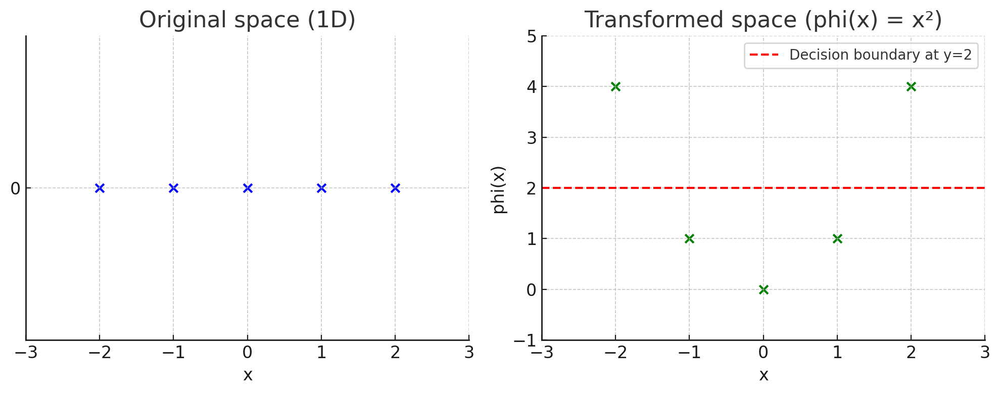

# 📚 מושגים בסיסיים בלמידת מכונה – טרנספורמציות ו-SVM

---

## 🧠 מה זה טרנספורמציה?

**טרנספורמציה** (Transformation) היא פעולה מתמטית שמעבירה נקודה ממקום אחד למקום אחר – לרוב ממימד מסוים **למימד גבוה יותר**

במילים פשוטות:  
זה כמו לקחת נקודה במרחב פשוט (למשל קו ישר – חד־מימדי), ולהעביר אותה למרחב עשיר יותר (למשל מישור או מרחב תלת־מימדי), כדי שיהיה לנו **יותר קל לעשות דברים כמו הפרדה בין קבוצות**



---

## ✨ למה צריך טרנספורמציה?

לפעמים, הקבוצות שאנחנו רוצים להפריד **לא ניתנות להפרדה ליניארית** במרחב המקורי.  
אבל אם נעלה למימד גבוה יותר – אולי כן נצליח להפריד ביניהן עם קו ישר (או מישור)

## 📌 דוגמה פשוטה:

### בעיה:
יש לנו נקודות על ציר \( x \), במימד אחד (1D):

- נקודות שליליות: \( x = -2, -1, 0, 1, 2 \)
- נקודה חיובית אחת: \( x = 0 \)

אין דרך לשים **קו אחד בציר** שיפריד בין הקבוצות בצורה טובה

### טרנספורמציה:

נעשה טרנספורמציה פשוטה:

$$
\phi(x) = x^2
$$

כלומר – ממפים את כל הנקודות מ־1D ל־2D, כך שהמימד החדש הוא \( x^2 \)

### מה קורה עכשיו?

x = -2  →  phi(x) = 4  
x = -1  →  phi(x) = 1  
x =  0  →  phi(x) = 0  
x =  1  →  phi(x) = 1  
x =  2  →  phi(x) = 4  

פתאום, כל הנקודות שליליות הן רחוקות מהאפס, והנקודה החיובית \( x = 0 \) נשלחת ל־0.

✅ עכשיו אפשר להפריד בין הקבוצות בעזרת קו פשוט ב־2D (או אפילו ב־1D של \( x^2 \)).

## 💬 סיכום:

- טרנספורמציה היא שינוי ייצוג של הנתונים
- אנחנו משתמשים בה כדי להפוך בעיה שקשה לפתור (לא ליניארית) – לבעיה שקל לפתור (ליניארית)
- לא תמיד צריך לממש את הטרנספורמציה – לפעמים נשתמש בקרנל שיחשב את מה שצריך בלי לעבור למרחב בפועל

---


## Kernel (גרעין)
קרנל הוא פונקציה מתמטית המאפשרת ל-SVM לטפל בנתונים לא-לינאריים. הוא מאפשר חישוב של מכפלת הנקודות במרחב תכונות גבוה-ממדי מבלי לחשב במפורש את הטרנספורמציה של וקטורי הקלט למרחב זה

## Kernel Function (פונקציית גרעין)
פונקצית הקרנל, המסומנת לרוב כ-

$K(x, y)$

מחשבת את מכפלת הנקודות (dot product) של שני וקטורים x ו-y לאחר שעברו טרנספורמציה למרחב תכונות גבוה יותר, מבלי לחשב במפורש את הטרנספורמציה עצמה:

$K(x, y) = \phi(x) \cdot \phi(y)$

כאשר $\phi$ היא פונקציית הטרנספורמציה למרחב הגבוה יותר

### דוגמה פשוטה:
בואו נתאר מקרה של נתונים שלא ניתנים להפרדה לינארית, כמו בעיית XOR (או בעיית המעגל - נקודות בתוך מעגל מול נקודות מחוץ למעגל):

1. במרחב המקורי (הדו-ממדי) אין אפשרות למצוא קו ישר שיפריד בין שתי הקבוצות
2. אם נשתמש בטרנספורמציה כמו $\phi(x,y) = (x, y, x^2 + y^2)$, אנחנו ממפים את הנתונים למרחב תלת-ממדי
3. במרחב התלת-ממדי הזה, ניתן להפריד את הנתונים באמצעות מישור (היפרפלן)

4. במקום לחשב במפורש את הטרנספורמציה הזו, אנחנו יכולים להשתמש ב-Kernel (לדוגמה Gaussian Kernel) שמשיג את אותה תוצאה

### 🧠 איך קרנל משיג את אותה תוצאה מבלי לחשב את הטרנספורמציה?

**✨ מה עושה הקרנל?**

הקרנל עוקף את הצורך לחשב את הטרנספורמציה עצמה. במקום זה, הוא עושה משהו חכם:

**שלבים פשוטים:**

1. **לא מחושב את המיקום החדש של כל נקודה** (לא מחשב את phi(x))
2. **בודק רק את הדמיון** בין נקודות:
   שואל: "כמה דומה x לנקודה אחרת x_i אם היינו מעבירים את שתיהן למרחב הגבוה?"
3. הקרנל נותן את התשובה לשאלה הזו – הוא מחשב את הדמיון **כאילו בוצעה טרנספורמציה**, בלי לעשות אותה בפועל.
4. האלגוריתם של SVM משתמש רק בדמיון הזה כדי להחליט אם נקודה חדשה שייכת לקבוצה החיובית או השלילית.

 **📦 דימוי פשוט:**

זה כאילו אתה רוצה לדעת כמה דומות שתי תמונות —  
במקום לעבור על כל הפיקסלים ולחשב אחד אחד, אתה שואל מישהו שמבין חזותית והוא פשוט אומר לך "מאוד דומות" או "לא דומות בכלל".

**✅ ואז באה הנוסחה:**

המודל של SVM משתמש בדמיון שהקרנל נותן (בין נקודות) כדי לחזות לאיזו קבוצה שייכת נקודה חדשה.

---

### Common types of Kernel Functions:


1. **Linear Kernel**:
   $K(x, y) = x \cdot y$

2. **Polynomial Kernel**:
   $K(x, y) = (\gamma x \cdot y + c)^d$
   where $\gamma > 0$, $c \geq 0$, and $d$ is an integer representing the degree of the polynomial.

3. **Radial Basis Function (RBF) or Gaussian Kernel**:
   $K(x, y) = \exp(-\gamma \|x - y\|^2)$
   where $\gamma > 0$, typically $\gamma = \frac{1}{2\sigma^2}$.

4. **Sigmoid Kernel**:
   $K(x, y) = \tanh(\gamma x \cdot y + c)$
   where $\gamma > 0$ and $c \geq 0$.

# Kernel Functions with Examples

**What is γ (Gamma)?**

The **gamma parameter** is a crucial hyperparameter in SVM that determines the influence of individual training examples. It's primarily used in non-linear kernels like 

RBF (Radial Basis Function), polynomial, and sigmoid

High gamma values (e.g., 10, 100):

Creates a decision boundary with "tight" curves around individual data points

Low gamma values (e.g., 0.001, 0.01):

Creates a decision boundary with smoother, wider curves


**The "exp"** in the RBF/Gaussian kernel formula refers to the exponential function, which is commonly written as "exp" in mathematics and programming

The exponential function exp(x) is equivalent to e^x, where "e" is Euler's number (approximately 2.71828...), a mathematical constant that forms the base of natural logarithms

## 1. Linear Kernel
**Formula**: $K(x, y) = x \cdot y$

**Example**:
For two 2D vectors $x = [1, 2]$ and $y = [3, 4]$:

$K(x, y) = x \cdot y = 1 \times 3 + 2 \times 4 = 3 + 8 = 11$

**Use case**: Linear kernels work well when the data is already linearly separable. They're computationally efficient but cannot handle non-linear relationships in data.

## 2. Polynomial Kernel
**Formula**: $K(x, y) = (\gamma x \cdot y + c)^d$

where $\gamma > 0$, $c \geq 0$, and $d$ is the polynomial degree.

**Example**:
For vectors $x = [1, 2]$ and $y = [3, 4]$, with $\gamma = 1$, $c = 1$, and $d = 2$:

$K(x, y) = (1 \times (1 \times 3 + 2 \times 4) + 1)^2 = (11 + 1)^2 = 12^2 = 144$

**Use case**: Polynomial kernels are useful for problems where training data is not linearly separable. The degree $d$ determines the flexibility of the decision boundary. Common choices are $d = 2$ (quadratic) or $d = 3$ (cubic).

## 3. Radial Basis Function (RBF) / Gaussian Kernel
**Formula**: $K(x, y) = \exp(-\gamma \|x - y\|^2)$

where $\gamma > 0$, typically $\gamma = \frac{1}{2\sigma^2}$.

**Example**:
For vectors $x = [1, 2]$ and $y = [3, 4]$ with $\gamma = 0.5$:

1. Calculate the squared Euclidean distance: 
   $\|x - y\|^2 = (1-3)^2 + (2-4)^2 = 4 + 4 = 8$

2. Apply the RBF formula:
   $K(x, y) = \exp(-0.5 \times 8) = \exp(-4) \approx 0.018$

**Use case**: RBF kernels are versatile and work well for most types of data. They're especially effective when the relationship between classes is non-linear. The parameter $\gamma$ controls the "reach" of a single training example's influence.

## 4. Sigmoid Kernel
**Formula**: $K(x, y) = \tanh(\gamma x \cdot y + c)$

tanh = Hyperbolic Tangent 

where $\gamma > 0$ and $c \geq 0$.

**Example**:
For vectors $x = [1, 2]$ and $y = [3, 4]$, with $\gamma = 0.1$ and $c = 0$:

$K(x, y) = \tanh(0.1 \times (1 \times 3 + 2 \times 4)) = \tanh(0.1 \times 11) = \tanh(1.1) \approx 0.8$

**Use case**: The sigmoid kernel comes from neural networks (it's similar to using a neural network with one hidden layer). It's less commonly used in SVMs than RBF kernels but can be effective for specific problems.

## Choosing the Right Kernel

The choice of kernel depends on the specific problem:

- **Linear kernel**: When data is linearly separable
- **Polynomial kernel**: When you need a more flexible decision boundary with clear degree of separation
- **RBF kernel**: Most versatile, works well for most datasets when properly tuned
- **Sigmoid kernel**: Works for specific types of problems, often related to neural networks

In practice, it's common to try different kernels and use cross-validation to determine which one performs best for your specific dataset.

## Visual Intuition

To understand how kernels transform data:

1. **Linear**: Data remains in the same space, separated by a straight line
2. **Polynomial**: Data is mapped to a higher-dimensional space where curved boundaries in original space become linear boundaries
3. **RBF**: Essentially creates a "bump" around each data point, with the width controlled by $\gamma$
4. **Sigmoid**: Creates a decision boundary similar to that of a neural network

The kernel trick allows us to compute these separations without explicitly transforming the data to higher dimensions, making SVMs computationally efficient even for complex decision boundaries.

## Kernel Trick (טריק הגרעין)
ה-Kernel Trick הוא הטכניקה שמאפשרת ל-SVM להתמודד עם בעיות סיווג לא-לינאריות מבלי לחשב במפורש את הטרנספורמציה למרחב גבוה-ממדי. הרעיון הבסיסי הוא:

1. במקום להפעיל טרנספורמציה $\phi$ על כל וקטור קלט x ו-y בנפרד
2. ואז לחשב את מכפלת הנקודות שלהם $\phi(x) \cdot \phi(y)$
3. אנחנו מחשבים ישירות את $K(x, y)$ שנותן את אותה תוצאה

זה חוסך זמן חישוב משמעותי, במיוחד כאשר מרחב התכונות הגבוה-ממדי יכול להיות אינסופי (כמו ב-RBF Kernel).

### היתרונות של Kernel Trick:
- מאפשר ל-SVM להתמודד עם נתונים לא לינאריים
- חוסך בזמן חישוב ובשימוש בזיכרון
- מאפשר עבודה במרחבי תכונות אינסופיים
- משפר את הדיוק בבעיות סיווג מורכבות


ה-Kernel Trick מאפשר לנו לעבוד עם מרחבים בעלי ממדים גבוהים, לעתים אפילו אינסופיים, מבלי לשלם את המחיר החישובי של עבודה במרחבים אלו

---

# 📘 איך SVM בוחר את נקודות התמיכה (Support Vectors)

**1. המטרה של SVM**

בשלב האימון, המודל מנסה למצוא **את המישור שמפריד הכי טוב** בין שתי הקבוצות, כך שהמרחק מהנקודות הקרובות ביותר (ה־margin) יהיה הכי גדול שאפשר.

**2. הנוסחה המתמטית**

האלגוריתם פותר בעיית אופטימיזציה:

- ממזער את:
  
  (1/2) * ||w||²

- תחת תנאים של הפרדה:

  לכל נקודה מהאימון:  
  yᵢ * (wᵀ * xᵢ + b) ≥ 1
- **x_i** — נקודה מהסט של האימון
- **y_i** — הסיווג של x_i (או +1 או -1)

**3. שימוש ב־Lagrange Multipliers**

כדי לפתור את זה, SVM משתמש בשיטה שנקראת *שיטת לגראנז'* (Lagrange multipliers).  
היא מוסיפה משתנים חדשים: αᵢ (alpha_i) — אחד לכל נקודה.

הפתרון של הבעיה מוביל לנוסחה עבור וקטור w:

w = Σ (αᵢ * yᵢ * xᵢ)

אבל — ברוב הנקודות יוצא:

αᵢ = 0

- **x_i** — נקודה מהסט של האימון
- **y_i** — הסיווג של x_i (או +1 או -1)
- **alpha_i** — כמה חשובה הנקודה הזו במודל, נקבע באימון
  
רק נקודות ש־**alpha_i > 0** משתתפות בפועל — אלו הן נקודות התמיכה (Support Vectors).

**4. מי נקודת תמיכה?**

נקודה הופכת להיות Support Vector אם:

- יש לה αᵢ > 0
- כלומר — היא **יושבת בדיוק על גבול הרווח (margin)**

רק הנקודות שנמצאות בדיוק "על הקצה" — הכי קרובות למישור — הן אלו שבאמת משפיעות על צורת ההפרדה.

**5. כל השאר? נזרקות הצידה**

אם נקודה רחוקה מהמישור, SVM מזהה שהיא לא באמת משנה את ההחלטה –  
אז הוא נותן לה αᵢ = 0, והיא לא תשתתף בחישובים של המודל.

**💡 לכן:**

- **נקודות הוקטור התומך הן שקובעות את המיקום של המישור**
- הן היחידות ש"מושכות" או "דוחפות" את הקו בעת החיזוי


*🧠 איפה עובר הקו המפריד ב-SVM?**

**✨ המטרה של SVM**

SVM מחפש מישור (קו) שמפריד בין שתי קבוצות — אבל לא סתם כל קו.  
אלא כזה שנמצא **בדיוק באמצע** בין שתי הקבוצות, עם **מרחק מקסימלי** לשתי הקבוצות.

**✅ שלושת הקווים ש-SVM משתמש בהם:**

1. **המישור המרכזי (הקלאסי):**

    זה הקו שמפריד בפועל:
    ```
    wᵀ x + b = 0
    ```

2. **קווי ה-margin (הקווים שנוגעים בנקודות התמיכה):**

    - עבור הקבוצה החיובית:  
      ```
      wᵀ x + b = +1
      ```

    - עבור הקבוצה השלילית:  
      ```
      wᵀ x + b = -1
      ```

**📏 איפה עובר הקו המפריד?**

הקו המפריד עובר בדיוק באמצע בין שני קווי ה-margin,  
כלומר בין הקווים