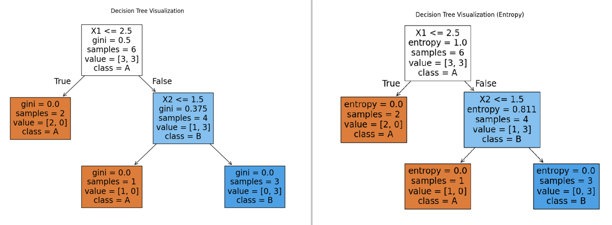

# השוואה בין Gini Impurity ל-Entropy
  
## מטרת המדדים:
- **Gini Impurity** ו-**Entropy** הם מדדים שמודדים **"חוסר טוהר"** או **מידת ערבוב** בקבוצה.
- משתמשים בהם בעצי החלטה (**Classification Trees**) כדי לבחור את הפיצול הכי טוב.
  
## נוסחאות:
  
### 1. Gini Impurity:
  

  
  
  
-  זה ההסתברות של כל מחלקה (class).
- הערך המקסימלי מתקבל כשהמחלקות מעורבבות שווה בשווה.
  
### 2. Entropy:
  

  
  
  
- גם פה  זה ההסתברות של כל מחלקה.
- ערך גבוה יותר אומר יותר ערבוב (חוסר טוהר).
  
## דוגמה:
  
נניח שיש לך קבוצה עם 4 דוגמאות:
  
- 2 דוגמאות בקטגוריה A.
- 2 דוגמאות בקטגוריה B.
  
### חישוב Gini Impurity:
  

  
  
  
### חישוב Entropy:
  

  
  
  
## השוואה כללית:
  

  
| מאפיין              | Gini Impurity            | Entropy                |
|----------------------|---------------------------|------------------------|
| נוסחה               |        |  |
| ערך מקסימלי (2 מחלקות) | 0.5                      | 1                      |
| חישוב               | פשוט ומהיר יותר          | איטי יותר (יש לוגים)   |
| פרשנות              | מדד חוסר טוהר             | מדד חוסר טוהר (מידע)  |
  
  
## מתי להשתמש?
  
| מאפיין            | Gini Impurity           | Entropy                  |
|-------------------|-------------------------|--------------------------|
| חישוביות          | מהיר יותר (ללא לוגריתם) | איטי יותר (יש לוגריתם)   |
| רגישות            | פחות רגיש להבדלים קטנים | יותר רגיש להבדלים קטנים  |
| מתי לבחור         | כשחשובה מהירות          | כשחשובה דיוק/מידע         |
| שימוש נפוץ        | Decision Tree (CART)    | Decision Tree (ID3, C4.5)|
  
**המלצה כללית:**
- אם יש לך הרבה נתונים או אתה צריך חישוב מהיר → **Gini**  
- אם אתה רוצה להיות רגיש יותר לאי-ודאות → **Entropy**
  
- **Gini** is more commonly used in decision trees like **CART** (Classification And Regression Tree) because of its simpler computation
- **Entropy** is often used when information gain is meaningful, such as in the ID3 tree

# דוגמא
  
**ראה סוגי עצי החלטה בשקף הבא**

נניח שיש לנו מערכת נתונים פשוטה עם שני מאפיינים (X1, X2) וקטגוריה יעד (Y) כפי שמוצג בטבלה:
  
| X1 | X2 | Y |
|----|----|----|
| 1  | 3  | A  |
| 2  | 1  | A  |
| 3  | 2  | B  |
| 4  | 3  | B  |
| 5  | 1  | A  |
| 6  | 2  | B  |

##  Gini index Vs Entropy

