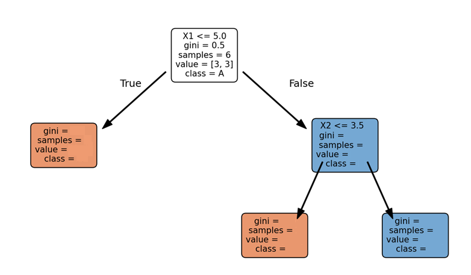

# תרגיל

נניח שיש לנו מערכת נתונים פשוטה עם שני מאפיינים (X1, X2) וקטגוריה יעד (Y) כפי שמוצג בטבלה:
  
| X1  | X2  | Y   |
|-----|-----|-----|
| 2   | 5   | A   |
| 4   | 3   | A   |
| 6   | 4   | B   |
| 8   | 5   | B   |
| 10  | 3   | A   |
| 12  | 4   | B   |

השלם בעץ שלמטה לכל שלב את:
- כמה ג'יני אימפיוריטי
- מס' הדגימות
- כמה יש בכל קבוצה
- באיזה CLASS נבחר

ראה דוגמא:
<a href="A11b-dec-process.md#example" >הקלק כאן</a>
