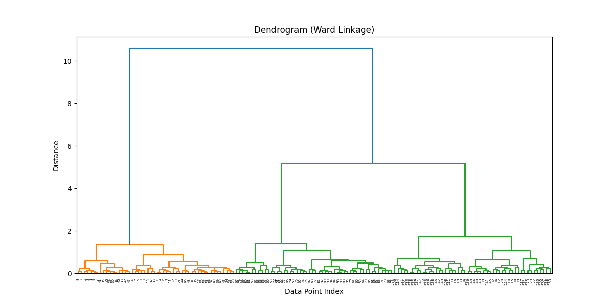
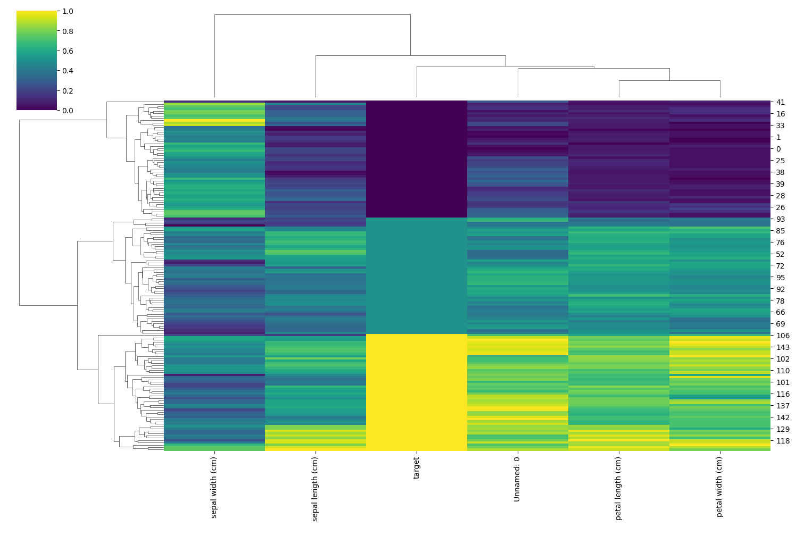
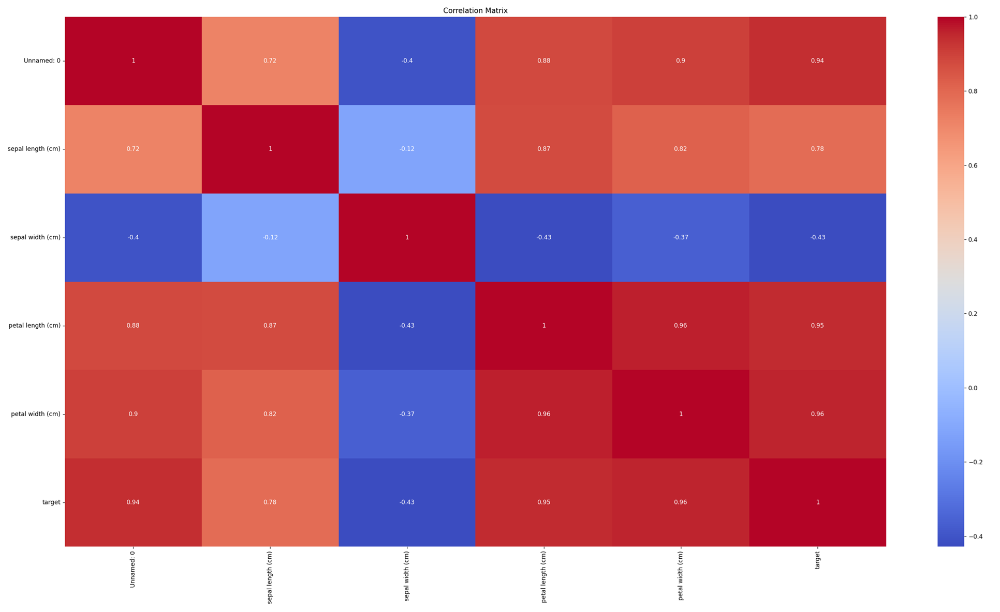
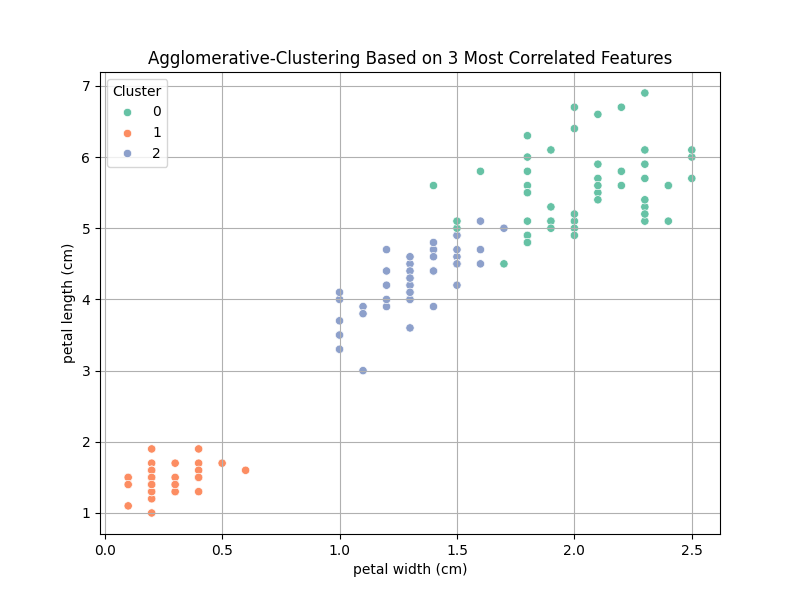

# Hierarchical Clustering 

# דוגמא בפייתון

```python
import pandas as pd
import seaborn as sns
import matplotlib.pyplot as plt
from sklearn.preprocessing import MinMaxScaler
from sklearn.cluster import AgglomerativeClustering
from scipy.cluster.hierarchy import linkage, dendrogram

# 1. טוענים את הדאטה
df = pd.read_csv("iris_unlabaled.csv")

# 2. מנקים רק עמודות מספריות
df_numeric = df.select_dtypes(include=['float64', 'int64'])

# 3. סקיילינג (נרמול) עם MinMaxScaler
scaler = MinMaxScaler()
df_scaled = pd.DataFrame(scaler.fit_transform(df_numeric), columns=df_numeric.columns)

# 4. clustermap עם דנדרוגרמות
sns.clustermap(df_scaled, cmap="viridis", figsize=(10, 8))
plt.title("Clustermap with Dendrograms")
plt.show()

# 5. מטריצת קורלציה ו-heatmap
corr_matrix = df_scaled.corr()
sns.heatmap(corr_matrix, annot=True, cmap="coolwarm")
plt.title("Correlation Matrix")
plt.show()

# 6. מוצאים את שתי התכונות עם הקורלציה הכי גבוהה
top_corr = corr_matrix.where(~(corr_matrix == 1)).unstack().sort_values(ascending=False).dropna().reset_index()
top_corr.columns = ['Feature1', 'Feature2', 'Correlation']
top_pair = top_corr.iloc[0]

# 7. בונים לינקג' עם שיטת ward
linkage_matrix = linkage(df_scaled, method='ward')

# 8. מציירים דנדרוגרמה
plt.figure(figsize=(12, 6))
dendrogram(linkage_matrix)
plt.title("Dendrogram (Ward Linkage)")
plt.xlabel("Data Point Index")
plt.ylabel("Distance")
plt.show()

# 9. מבצעים clustering היררכי עם 3 קבוצות
model = AgglomerativeClustering(n_clusters=3)
df['Cluster'] = model.fit_predict(df_scaled)

# 10. מציירים פיזור של הקלאסטרים לפי שתי התכונות הכי מתואמות
plt.figure(figsize=(8, 6))
sns.scatterplot(data=df, x=top_pair['Feature1'], y=top_pair['Feature2'], hue='Cluster', palette='Set2')
plt.title("Agglomerative-Clustering Based on 3 Most Correlated Features")
plt.xlabel(top_pair['Feature1'])
plt.ylabel(top_pair['Feature2'])
plt.grid(True)
plt.show()
```



## דנדרוגרמה (Ward Linkage) – הסבר

מה שאנחנו רואים כאן הוא גרף היררכי שנקרא **דנדרוגרמה**  
זה חלק מהשיטה של **למידה לא מונחית** שנקראת **אשכול היררכי (Hierarchical Clustering)**  
במקרה הזה השתמשנו בשיטת החיבור **Ward**, שהיא שיטה שממזגת קבוצות לפי הקטנת השונות הכללית (variance)

### 🧱 ציר X – תצפיות (Data Point Index)

- כל נקודה בציר X מייצגת **פרח בודד (שורה מהדאטה)**  
- אין משמעות לערכים על הציר עצמו – זה פשוט אינדקסים של הדאטה (מספרי שורות)

### 📏 ציר Y – מרחק (Distance)

- הציר האנכי מייצג **כמה רחוקות או שונות היו הקבוצות לפני שחיברו אותן**  
- ככל שקו המחבר גבוה יותר – כך הקבוצות היו **פחות דומות**

### 🌿 מה רואים בעץ?

- כל "ענף" מתחיל בשתי נקודות (תצפיות או קבוצות) שמתמזגות  
- ענפים קטנים (למטה) = חיבורים בין נקודות מאוד דומות  
- ענפים גבוהים (למעלה) = חיבורים בין קבוצות גדולות שכבר שונות יותר

### ✂️ איפה חותכים כדי לבחור קבוצות?

- אם תמשוך קו אופקי בגובה מסוים (למשל בגובה 6), תוכל לספור כמה פעמים הוא חותך את הקווים האנכיים  
- מספר החיתוכים = מספר הקבוצות שתקבל

🔸 בדוגמה כאן, אם נחתוך בגובה 6 – נקבל **3 קבוצות עיקריות**  
- צד שמאל (כתום)  
- צד ימין (שתי תתי־קבוצות ירוקות שהתאחדו)

### 📌 למה זה חשוב?

- מאפשר להבין **מבנה פנימי של הדאטה** גם בלי לדעת תגיות  
- נותן **שליטה על כמות הקבוצות** – אפשר לחתוך בגובה אחר ולקבל יותר או פחות קלאסטרים

---



## מפת חום עם דנדרוגרמות – הסבר מלא

### 🟦 מה זה בכלל?

זאת **מפת חום (heatmap)** עם **דנדרוגרמות** משני הצדדים – גם לשורות וגם לעמודות  
כל שורה מייצגת **דוגמה (פרח)**  
כל עמודה מייצגת **מאפיין** – למשל:
- `sepal length (cm)`
- `sepal width (cm)`
- `petal length (cm)`
- `petal width (cm)`
- `target`
- `Unnamed: 0` (כנראה אינדקס שנשמר בקובץ בטעות)

והצבעים מייצגים ערכים בין 0 ל־1 (אחרי נרמול עם MinMaxScaler)

### 🌈 מה הצבעים אומרים?

- **צהוב = ערך גבוה** (קרוב ל־1)  
- **סגול כהה = ערך נמוך** (קרוב ל־0)  
- **ירוק-כחול באמצע = ערכים בינוניים**

ככה אפשר בקלות לראות דפוסים חוזרים  
למשל:  
👀 שים לב שבצד ימין למטה יש הרבה **צהוב בעמודת petal length** – סימן שהקבוצה הזו כוללת פרחים עם עלי כותרת ארוכים

### 🌿 ומה עם הדנדרוגרמות?

הקווים הלבנים בצדדים למעלה ושמאל מראים **איך הפרחים קובצו** על פי הדמיון ביניהם  
זה קלאסטרינג היררכי – והוא מראה אילו פרחים דומים באותם המאפיינים

🧠 ככל ששני פריטים מתחברים **מוקדם (למטה)** – הם מאוד דומים  
אם הם מתחברים רק **מאוחר (למעלה)** – הם שונים יותר


#### ✅ מה זה הקווים בצד שמאל?

הם מייצגים **תצפיות (שורות בדאטה)** – כל שורה במפה היא פרח מסוים, כלומר תצפית  
הקווים הלבנים בצד שמאל בונים **דנדרוגרמה** – מין "עץ" של חיבורים בין פרחים לפי כמה שהם דומים  
הם מראים **איך תצפיות מקובצות** על בסיס כל העמודות (המאפיינים)

🔹 כל ענף מייצג תהליך של חיבור בין תצפיות  
🔹 ככל שהחיבור בין תצפיות מתבצע **נמוך יותר בעץ** – הן **מאוד דומות**  
🔹 ככל שהחיבור מתבצע **גבוה יותר** – הן **פחות דומות**

לדוגמה:
- אם שתי שורות קרובות מאוד ונפגשות בעץ ממש למטה → הן כמעט זהות  
- אם הן מתחברות רק אחרי שהרבה דברים כבר התמזגו → הן שונות

#### ✅ ומה זה הקווים למעלה?

זה בדיוק אותו עיקרון – רק שפה מדובר על **עמודות (features)**  
כל עמודה מייצגת מאפיין כמו:
- אורך עלי כותרת  
- רוחב עלי גביע  
- target  
- וכו'

הקווים למעלה מראים **אילו מאפיינים דומים בהתנהגות שלהם** לאורך הדאטה

לדוגמה:
- אם `petal length` ו־`petal width` מתנהגות דומה אצל כל הפרחים – הן יהיו קרובות בעץ  
- אם `sepal width` שונה לגמרי – היא תתחבר אליהן רק מאוחר

#### 🧠 סיכום בטבלה:

| חלק | מתייחס ל־ | מראה את הדמיון בין |
|------|-------------|----------------------|
| הקווים בצד שמאל | שורות (תצפיות / פרחים) | פרחים שונים |
| הקווים למעלה | עמודות (מאפיינים) | משתנים בדאטה |

### 📌 איך זה עוזר לי?

- אתה יכול לראות **קבוצות ברורות של פרחים** – גם אם לא כתוב לך מי מהן זה סטוסה, ורסיקולור וכו  

💡 איך?

הקבוצות מופיעות כשורות **צמודות** שיש להן **דפוס צבעים דומה** לאורך כל העמודות  
לדוגמה: 6–8 שורות שיש להן גוונים דומים מאוד – כנראה משתייכות לאותו קלאסטר

**הדנדרוגרמה בצד שמאל** מחזקת את זה – אם הענפים של שורות מסוימות מתחברים **נמוך בעץ**, זה אומר שהן מאוד דומות זו לזו

💬 דמיין שזה כמו לצפות בלוויין – אם אתה רואה אזור בצבע דומה שמרוכז יחד, ברור שזה אזור אחד

וזה כל היופי של למידה לא מונחית –  
גם בלי לדעת מראש את שמות הקבוצות (כמו סטוסה), המודל עדיין מצליח **לזהות תבניות** ולחלק את הדאטה לקבוצות טבעיות

אתה רואה **איזה מאפיינים מבדילים בין הקבוצות**  
לדוגמה: אם קבוצת שורות מסוימת צבועה צהוב ב־ פאטל-לאנגס ואחרת כהה – זה אומר שזה מאפיין שמפריד ביניהן

---




### 📌 דוגמה למה שרואים פה:

- `petal length` ו־`petal width` = **קורלציה 0.96** → קשר חזק מאוד  
- `sepal width` ו־`petal length` = **קורלציה -0.43** → קשר שלילי בינוני  
- `target` (הסוג של הפרח) מקושר חזק עם `petal width` (0.96) → כנראה משתנה מבדיל מעולה

---



### פיזור הקלאסטרים לפי התכונות הכי מתואמות – הסבר מלא

### 🧠 מה רואים כאן?

זה גרף פיזור (Scatter Plot) שמציג את הפלט של **clustering היררכי** מסוג AgglomerativeClustering  
כאן חילקנו את הדאטה ל־**3 קבוצות** בלבד, על בסיס **התכונות הכי מתואמות** (petal length ו־petal width)

- כל נקודה מייצגת פרח (תצפית מהדאטה)
- הצבע של כל נקודה מראה לאיזה קלאסטר היא שייכת (0, 1 או 2)
- ציר X: רוחב עלי כותרת (petal width)
- ציר Y: אורך עלי כותרת (petal length)

### 💡 למה בחרנו את התכונות האלו?

כי לפי מטריצת הקורלציה – התכונות עם הקשר הכי חזק הן:
- `petal length`
- `petal width`

הן גם מתואמות חזק ביניהן וגם עוזרות להפריד בין הפרחים

### 🌈 מה אפשר ללמוד מהגרף?

- רואים **שלוש קבוצות ברורות** שמופרדות לפי הצבעים  
- הקבוצה בצד שמאל (כתום) נבדלת בברור – הפרחים בה קטנים יותר גם באורך וגם ברוחב  
- שתי הקבוצות הימניות שונות זו מזו לפי פיזור קל, אבל גם די מובחנות

🔍 זה מראה שה־**clustering הצליח להבחין בין סוגי פרחים שונים** – גם בלי לדעת את שמם


### אם שתי תכונות מאוד מתואמות – למה להשתמש בשתיהן לקלאסטרינג?

לכאורה, אם שתי תכונות (features) כמו `petal length` ו־`petal width` מאוד דומות – אולי אפשר לבחור רק אחת מהן?  
אבל האמת קצת יותר עדינה:

### 🧠 קורלציה גבוהה = תכונות "נעות ביחד", אבל לא בהכרח זהות

- כשאומרים ש־`petal length` ו־`petal width` מקושרות ב־0.96 – זה אומר ש**ככל שאחת עולה, גם השנייה נוטה לעלות**
- אבל הן עדיין נותנות **שתי זוויות שונות** על אותו אובייקט
- למשל, ייתכן שיש פרחים עם רוחב דומה אבל אורך משתנה – או להיפך

### 📊 למה זה בכל זאת עוזר לקלאסטרינג?

- **תכונות שמבוססות על אותו "ממד של הבדל"** (למשל גודל עלי כותרת) עוזרות **לחדד את ההבדל בין קבוצות**
- הקלאסטרינג לא מחפש תכונות בלתי תלויות – הוא מחפש תכונות שמפרידות בין קבוצות של תצפיות

🔍 אם הקבוצות (הפרחים) נבדלים בגודל עלי הכותרת –  
אז גם אורך וגם רוחב יכולים **לחזק את החלוקה** – אפילו אם הם מתואמים

### ⚠️ אז מתי באמת אפשר לוותר על אחד מהם?

- אם אתה רואה ששילוב של שתי התכונות לא מוסיף מידע נוסף –  
  כלומר הגרף נראה אותו דבר גם עם אחת מהן בלבד –  
  אז כן, אפשר לשקול להשמיט אחת

אבל קודם כל **בודקים ויזואלית**, ורק אז מחליטים

### 💡 סיכום:

- קורלציה גבוהה ≠ מיותרת
- לפעמים תכונות מתואמות דווקא **מחדדות את ההבדלים בין קבוצות**
- קלאסטרינג מחפש תבניות – לא בהכרח תכונות בלתי תלויות סטטיסטית

### 📌 למה זה עוזר?

- מאפשר לבדוק **כמה הקלאסטרים הגיוניים מבחינה ויזואלית**
- עוזר להבין **האם הפיצ'רים שבחרנו באמת מפרידים בין הקבוצות**
- מאפשר לזהות קבוצות טבעיות בנתונים – גם כשאין לנו תגיות מראש (Unsupervised Learning)