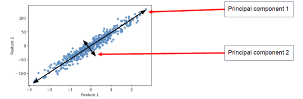

## PCA - Principal Component Analysis

שיטת **PCA** (ניתוח רכיבים עיקריים) היא שיטה נפוצה בלמידת מכונה וסטטיסטיקה שנועדה לבצע **צמצום ממדים** – כלומר, להפוך דאטה עם הרבה תכונות (Features) לדאטה עם פחות תכונות, מבלי לאבד יותר מדי מידע חשוב.

פי.סי.איי יוצרת **ציר חדש** שמורכב משילוב של התכונות המקוריות – הציר הזה נקרא **רכיב עיקרי** (Principal Component) – והוא משמר את מירב השונות בדאטה.

### למה להשתמש ב־PCA?

- דאטה עם הרבה תכונות גורם לבעיות: **עומס חישובי**, **קושי בויזואליזציה**, ו־**הסתברות לאוברפיטינג**
- PCA מצמצם את מספר התכונות, אבל שומר על כמה שיותר **שונות** מהדאטה המקורי

שונות (Variance) היא מדד שמראה **עד כמה ערכים מתרחקים מהממוצע שלהם**
כלומר – כמה הנתונים "מתפזרים" סביב הממוצע

## PCA and Unsupervised Learning

ב־Unsupervised Learning אין לנו תוויות (labels), ולכן אין דרך לדעת איזו תכונה הכי חשובה
PCA מאפשרת לצמצם תכונות **באופן חכם ולא מפוקח** – בלי לדעת מה חשוב למה

המטרה היא להקרין את הדאטה למרחב חדש עם פחות ממדים, תוך כדי שמירה על כמה שיותר מהמידע (variance)

### שים לב:
פי.סי.איי לא בוחר תכונות קיימות – הוא מייצר **חדשות** שהן שילובים ליניאריים של הישנות

## Principal Components

הרכיבים העיקריים הם צירים חדשים שנוצרים משילוב של התכונות המקוריות
כל רכיב הוא **ציר אורתוגונלי** לרכיבים האחרים, ומכיל כמה שיותר שונות (variance)



## האם PC1 ו־PC2 הם וקטורים?

כן  
כל רכיב עיקרי (PC) הוא וקטור  

### תכונות של הרכיבים

- PC1 is a vector pointing in the direction of the greatest variance in the data  
- PC2 is a vector orthogonal to PC1 that explains the remaining variance  
- All principal components are orthogonal to each other  
- All components are normalized – meaning their length is 1

### מה קורה כש־PC1 הוא הווקטור [0.7, 0.7]

אם הווקטור של PC1 הוא [0.7, 0.7] זה אומר שהכיוון החדש עובר בזווית של 45 מעלות  
זה הכיוון שבו הנתונים מתפזרים הכי הרבה  

### הקרנת נקודה על הכיוון הזה

נניח שהנקודה היא [90, 70]  
נחשב את ההקרנה שלה על הציר החדש:

$$
projection = [90, 70] \cdot [0.7, 0.7] = 90×0.7 + 70×0.7 = 63 + 49 = 112
$$

הנקודה נשמרת כ־112 על הציר החדש PC1  

### הקרנת כל הדאטה

- מקרינים את כל הנקודות על הווקטור [0.7, 0.7]  
- כל נקודה נופלת על ערך אחד בציר החדש  
- מתקבלת רשימה של ערכים כמו: 112, 120, 95, 134, 108 ...

### חישוב שונות

עכשיו מחשבים את השונות של הערכים האלה  
אם הכיוון שנבחר הוא באמת PC1  
נקבל את השונות הכי גבוהה שאפשר לקבל מכל כיוון אחר

### מסקנה

פי.סי.איי בוחר את הכיוון שבו ההקרנות של כל הנקודות הכי שונות אחת מהשנייה  
כלומר יש שם הכי הרבה מידע

## Explained Variance

כשאנחנו עושים PCA, אנחנו רוצים לדעת כמה מידע (שונות) נשאר אחרי שהפכנו את הדאטה למשהו פשוט יותר

שונות (Variance) היא מדד שמראה **עד כמה ערכים מתרחקים מהממוצע שלהם**
כלומר – כמה הנתונים "מתפזרים" סביב הממוצע

### הנוסחא של שונות:

$$
\text{Variance} = \frac{1}{n} \sum_{i=1}^{n} (x_i - \bar{x})^2
$$

זו בעצם **הממוצע של ריבועי המרחקים מהממוצע**

אקספיריאנס ואריאנס זה כמה מתוך כל השונות בדאטה נשמרה בכל רכיב חדש שיצרנו
אם רכיב עיקרי מסביר הרבה שונות – זה אומר שהוא שומר הרבה מידע מהדאטה המקורי

### דוגמה:
נניח שיש לנו ציונים של 100 תלמידים במתמטיקה, אנגלית ומדעים  
PCA יוצר רכיבים חדשים במקום שלושת המקצועות – כדי לייצג את התלמידים עם פחות מידע

### האם יוצרים רכיב אחד במקום שלושה ציונים?

כן! PCA יכול לקחת שלושה ציונים (למשל: מתמטיקה, אנגלית, מדעים) ולהמיר אותם לרכיב אחד חדש בלבד  
המטרה היא לייצג את ההבדלים בין התלמידים בצורה פשוטה, בלי לאבד הרבה מידע

### איך זה עובד?

במקום לרשום לכל תלמיד את שלושת הציונים שלו:
- מתמטיקה: 85  
- אנגלית: 90  
- מדעים: 80  

פי.סי.איי יוצר רכיב חדש שהוא שילוב מתמטי של שלושת הציונים האלו, למשל:  
**0.5 × מתמטיקה + 0.3 × אנגלית + 0.2 × מדעים = 85.2**

### למה זה טוב?

- כי הרכיב החדש שומר את עיקר ההבדלים בין התלמידים  
- זה עוזר לצמצם ממדים ולעבוד עם פחות נתונים  
- קל יותר לנתח ולהציג גרפים  
- מאפשר קלאסטרינג או חיזוי מדויק יותר

### מציאת היחסים

איך PCA יודע לבחור את המשקלים (למשל 0.5, 0.3, 0.2) בכל רכיב? התשובה: הוא לא מנחש – הוא מחשב אותם מתמטית לפי הכיוון שבו השונות של הדאטה הכי גדולה

💡 הרעיון המרכזי
PCA מחפש כיוונים חדשים (וקטורים) שבהם הנתונים מתפזרים הכי הרבה
הכיוון שבו הנתונים משתנים הכי הרבה – הוא הרכיב הראשון (PC1)
והכיוון הבא אחריו, שהוא מאונך לו, הוא PC2 וכן הלאה

### האם כל הרכיבים מאונכים זה לזה? 

כן  
ב־PCA כל רכיב חדש שנוצר הוא תמיד מאונך לרכיבים הקודמים  

### מה זה אומר בפועל

אם יש שלושה משתנים כמו מתמטיקה אנגלית ומדעים  
לצורך הדוגמא נאמר שהחלטנו להשתמש בשלושה רכיבים

- PC1 is chosen as the direction with the **maximum variance** in the data  
- PC2 is chosen to be **orthogonal to PC1** and explains as much of the **remaining variance** as possible  
- PC3 is chosen to be **orthogonal to both PC1 and PC2** and explains the **variance that still remains**

כל ציר חדש בזווית של 90 מעלות לצירים הקודמים  
זה אומר שהוא לא חופף להם בשום צורה

### חשוב לדעת:

- לפעמים מספיק לשמור **רכיב אחד** שמכיל למשל 90% מהשונות  
- לפעמים שומרים 2 או 3 רכיבים – תלוי כמה מידע רוצים לשמר

### 🎓 דוגמה מספרית לשונות מוסברת (Explained Variance) ב־PCA

נניח שיש לך דאטה עם שני משתנים:
- גובה (בס"מ)
- משקל (בק"ג)

מדדת 10 אנשים וקיבלת שונות (Variance) מסוימת בכל אחד מהמשתנים בנפרד:

- שונות של **גובה**: 100 (למשל, סטיית תקן בערך 10 ס"מ)
- שונות של **משקל**: 25 (למשל, סטיית תקן בערך 5 ק"ג)

אם נחבר את השונות של שני המשתנים ביחד, נקבל את **השונות הכוללת**:

$$
100 + 25 = 125
$$


כעת, ביצעת PCA ויצרת שני רכיבים חדשים (**Principal Components**):

- הרכיב הראשון (PC1) הוא ציר חדש בדאטה, שמנסה "לתפוס" כמה שיותר מתוך השונות הכוללת
- הרכיב השני (PC2) הוא ציר חדש שמנסה לתפוס את השונות שנשארה אחרי שהראשון תפס

### 📈 שונות מוסברת לפי רכיב:

| רכיב | שונות מוסברת |
|------|---------------|
| PC1  | 100           |
| PC2  | 25            |

### חישוב:

- הרכיב הראשון (PC1) הצליח להסביר:

$$
\frac{100}{125} = 0.8 = 80\%
$$

כלומר, הרכיב הראשון שומר **80% מהמידע המקורי**, כי הוא "הצליח" לתפוס את רוב השונות שהייתה בדאטה.

- הרכיב השני (PC2) הסביר את השונות שנותרה:

$$
\frac{25}{125} = 0.2 = 20\%
$$

### ❗ למה זה חשוב?

אם נבחר רק את PC1, נפסיד רק **20% מהמידע**, ונוכל לעבוד עם משתנה יחיד במקום שני משתנים

לעומת זאת, אם PC1 היה תופס רק **40%** מהשונות, היינו מאבדים **60%** מהמידע אם היינו משתמשים רק ברכיב אחד


### האם שני הרכיבים ביחד מסבירים את כל השונות

כאשר יש שני משתנים בדאטה אפשר ליצור לכל היותר שני רכיבים עיקריים ב־PCA  
כל השונות בדאטה יכולה להתחלק רק בין שני הרכיבים האלה  

לכן:

$$
\text{Explained Variance of PC1} + \text{Explained Variance of PC2} = 100\%
$$

### בדוגמה שלנו

- PC1 מסביר 80%  
- PC2 מסביר 20%  

יחד:

\[
80\% + 20\% = 100\%
\]

אם משתמשים בשני הרכיבים יחד לא מאבדים שום מידע  
אם משתמשים רק ברכיב אחד שומרים רק את האחוז מהשונות שהוא מסביר

### האם באמת חסכנו משהו כשיצרנו 2 רכיבים מ־2 משתנים

אם הדאטה התחיל עם שני משתנים וביצענו PCA ויצרנו שני רכיבים  
אז לא באמת צמצמנו את המימדיות  
רק סובבנו את הצירים – לא דחסנו את הדאטה  

### אז למה בכל זאת עושים את זה

- מאפשר להבין טוב יותר את המבנה של הדאטה  
  לדוגמה PC1 מראה את הכיוון שבו הנתונים מתפזרים הכי הרבה  
  זה יכול ללמד משהו על הקשרים בין המשתנים  

- מאפשר להסתפק רק ברכיב אחד  
  אם PC1 מסביר נגיד 95% מהשונות אפשר להתעלם מ־PC2  
  וזה כן חיסכון אמיתי – הופכים את הדאטה לחד־ממדי  

- שימוש בהדמיה  
  אם מתחילים עם הרבה משתנים (למשל 10)  
  אפשר לצמצם ל־2 רכיבים ולהציג את הדאטה על גרף דו־ממדי מובן

## Covariance Matrix (מטריצת קווריאציה)

זאת טבלה (מטריצה) שמראה את הקשר בין כל שני פיצ'רים – האם הם משתנים ביחד או לא

- אם שני פיצ'רים משתנים יחד (כמו גובה ומשקל) → הקשר חיובי
- אם אחד עולה והשני יורד → הקשר שלילי
- אם אין קשר → הקשר אפסי

PCA משתמש במטריצה הזו כדי לגלות **על איזה כיוון יש הכי הרבה שונות** – ולבנות את הצירים החדשים

### דוגמה מספרית:
אם נבנה מטריצה ל־3 פיצ'רים: גיל, גובה, משקל – יתקבל:
```
        Age   Height   Weight
Age       1      0.6      0.5       
Height  0.6        1      0.8
Weight  0.5      0.8        1
```
ה־1ים על האלכסון מראים את הקשר של כל פיצ'ר עם עצמו (תמיד 1)
שאר הערכים מראים את הקשרים בין הפיצ'רים – ואלו משפיעים על איך ייראו הרכיבים החדשים של PCA

### מסקנה:
ה־Covariance Matrix היא הבסיס שממנו מחשבים את ה־Eigenvalues וה־Eigenvectors – **ראה חישוב למטה**, מה שמאפשר לפצל את הדאטה לצירים עם הכי הרבה מידע

### דוגמה:
אם בקובץ יש גובה ומשקל, והם תמיד עולים יחד (למשל בילדים) – אז הקווריאציה ביניהם תהיה גבוהה  
PCA יקח את זה בחשבון וייצר רכיב חדש שמבוסס על שניהם

---

# חישוב מלא - נספח

## כיצד PCA פועל בפועל?

1. מנרמלים את הדאטה (סקיילינג)
2. מחשבים מטריצת קווריאציה
3. מחשבים את ה־Eigenvalues וה־Eigenvectors
4. בוחרים את הרכיבים עם הערכים הגבוהים ביותר (שמכילים את מירב השונות)
5. מקרינים את הדאטה למרחב החדש

### 📊 Step 1: Original Data (3 Features, 3 Samples)

| Sample | Feature 1 | Feature 2 | Feature 3 |
|--------|-----------|-----------|-----------|
|   A    |     2     |     4     |     6     |
|   B    |     4     |     5     |     6     |
|   C    |     6     |     6     |     6     |


### 🔧 Step 2: Mean Centering (Normalization)

**We subtract the mean of each column from each value**

#### Column Means:
- Feature 1 mean = (2 + 4 + 6) / 3 = **4**
- Feature 2 mean = (4 + 5 + 6) / 3 = **5**
- Feature 3 mean = (6 + 6 + 6) / 3 = **6**

#### Normalized Data:

value-avg , i.e. Feature 1 = 2-4=-2, 4-4=0, 6-4=2 etc

| Sample | Feature 1 | Feature 2 | Feature 3 |
|--------|-----------|-----------|-----------|
|   A    |    -2     |    -1     |     0     |
|   B    |     0     |     0     |     0     |
|   C    |     2     |     1     |     0     |

### 🧮 Step 3: Covariance Matrix

We calculate the covariance matrix using the normalized data

The formula is:

$$
Cov = XᵀX⋅\frac{1}{n - 1}
$$

Where **X** is the normalized data matrix and **n = 3** (number of samples)

#### Covariance Matrix result:

```
X (Centered) =
[[-2, -1, 0],
 [ 0, 0, 0],
 [ 2, 1, 0]]
```

```
Cov = 
[[4.0, 2.0, 0.0],
 [2.0, 1.0, 0.0],
 [0.0, 0.0, 0.0]]
```

### 🧠 Step 4: Eigenvalues & Eigenvectors

We compute the **eigenvalues** and **eigenvectors** of the covariance matrix

Given the covariance matrix:

```
Cov = A =
[[4.0, 2.0, 0.0],
 [2.0, 1.0, 0.0],
 [0.0, 0.0, 0.0]]
```

We find:

To find the **eigenvalues lambda**, solve the **characteristic equation**:

$$
\det(A - \lambda I) = 0
$$

Where:
- A is the covariance matrix
- I is the identity matrix (same size as A))
- lambda is the eigenvalue

Once you find an eigenvalue **lambda** , you can find its **eigenvector (v)** by solving:

$$
(A - \lambda I) \cdot v = 0
$$

Where:
- A is the original matrix
- lambda is a specific eigenvalue
- I is the identity matrix
- v is a **non-zero vector** that satisfies the equation

This equation gives you the **direction** vector v that doesn't change its orientation when multiplied by matrix A — only its **length** might change

We won't solve the characteristic equation by hand here, but if you plug it into a calculator or use `numpy`, you'll get the three roots of the polynomial, which are exactly:

```python
X = np.array([
    [4.0, 2.0, 0.0],
    [2.0, 1.0, 0.0],
    [0.0, 0.0, 0.0]
])

eigenvalues, eigenvectors = np.linalg.eig(X)

print("Eigenvalues:", eigenvalues)
print("Eigenvectors:", eigenvectors)

Eigenvalues:
[5.0, 0.0, 0.0]

Eigenvectors:
[[ 0.894,  0.0,     -0.447],
 [ 0.447,  0.0,      0.894],
 [ 0.0,    1.0,      0.0  ]]

```

### 🚀 Step 5: Use Eigenvalues and Eigenvectors for PCA

1. **Sort the eigenvalues in descending order**  
   and sort the corresponding eigenvectors accordingly 

2. **Choose the top `k` eigenvectors** based on how much variance you want to preserve  
   For example: if λ₁ = 5.0 and others = 0, then 100% of the variance is in PC1  
   So we only need the first eigenvector: `[0.894, 0.447, 0.0]`

3. **Build the Projection Matrix (W)** 

The **Projection Matrix (W)** is built by:
- **Selecting the top k eigenvectors** (each is a column vector)
- **Stacking them as columns** in a matrix

in our case, since we select only PCA1 we get:
```
W = 
 [[0.894],
  [0.447],
  [0.0]]
```

### 🎯 Step 6: Project the Data into Lower Dimensions

Now that we have the projection matrix \( W \), we can project the original normalized data onto the new space

The formula is:

$$
X_{\text{projected}} = X_{\text{centered}} \cdot W
$$

Where:
- X_centered is the normalized data (mean-centered), see step 2
- W is the matrix of top `k` eigenvectors
- The result is the transformed data in `k` dimensions

#### ✅ Example

Let’s say:

```python
X_centered = [  # see step 2
  [-2, -1, 0],
  [ 0,  0, 0],
  [ 2,  1, 0]
]

W = [
  [0.894],
  [0.447],
  [0.0]
]

X_projected = X_centered @ W  # matirx multipication

result:
[
  [-2.236],
  [ 0.000],
  [ 2.236]
]
```

**Now your 3D data is reduced to just 1 dimension, while preserving 100% of the variance**

### 📈 Explained Variance

We calculate the proportion of variance each principal component explains

#### Formula:

$$
\text{Explained Variance Ratio} = \frac{\lambda_i}{\sum \lambda}
$$

Where:
- lambda_i is the eigenvalue of PC₁, PC₂, etc.
- sum(lambda_ is the total variance in the data (sum of all eigenvalues)

#### In our case:

Total variance = \( 5.0 + 0.0 + 0.0 = 5.0 \)

$$
PC1: \( \frac{5.0}{5.0} = 1.0 \) → **100%**
$$

$$
PC2: \( \frac{0.0}{5.0} = 0.0 \) → **0%**
$$

$$
PC3: \( \frac{0.0}{5.0} = 0.0 \) → **0%**
$$
