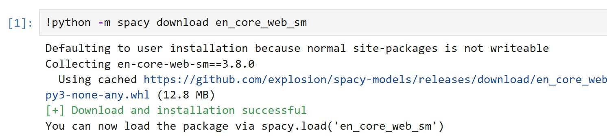

## עיבוד שפה טבעית (NLP - Natural Language Processing)


עיבוד שפה טבעית הוא תחום בתוך אינטיליגנציה מלאכותית שמטרתו לגרום למחשב להבין שפה אנושית.  
המחשב לא רק קורא מילים אלא לומד את המשמעות וההקשר שלהן.  
עיבוד שפה טבעית מאפשר למחשב לזהות מבנה תחבירי, להבין משמעויות כפולות ולהגיב בהתאם להקשר.  
המטרה היא לגרום למחשב לנהל שיחה, לנתח טקסט או לתרגם שפה בצורה שדומה ליכולת אנושית.  
במקום שנכתוב קוד עם חוקים נוקשים, המחשב לומד מתוך טקסטים אמיתיים איך אנשים מדברים וכותבים.  
המערכת מסוגלת להבין האם משפט מסוים מביע רגש, כוונה או בקשה.  
היא גם יודעת להבחין בין שמות, פעלים, מקומות, מספרים ותאריכים.  
עיבוד שפה טבעית משמש כמעט בכל מערכת חכמה שצריכה להבין טקסט או דיבור

### רכיבי עיבוד שפה

**מורפולוגיה** – מבנה פנימי של מילים  

דוגמה: המילה "הולכים" בנויה מהשורש ה.ל.ך, עם תחילית "ה" וסיומת רבים "ים"

**תחביר (סינטקס)** – איך מילים מתחברות למשפט תקני  

דוגמה: במשפט "החתול רדף אחרי הכלב", התחביר מציין שהחתול הוא הנושא והכלב הוא המושא

**סמנטיקה** – משמעות המילים במשפט  

דוגמה: המילה "טיסה" יכולה להתכוון לפעולה של לטוס או למספר הטיסה – תלוי בהקשר

**פרגמטיקה** – משמעות לפי הקשר  

דוגמה: אם מישהו שואל "יש לך אש?" ברחוב – הוא כנראה מתכוון למצית ולא לאש פיזית


## שימושים נפוצים ב־NLP

* 🗣️ עוזרות קוליות כמו Siri ו־Alexa משתמשות ב־NLP להבנת פקודות  
* 💬 צ'אטבוטים עונים אוטומטית לשאלות  
* 🚫 סינון תוכן פוגעני ברשתות  
* 🏥 ניתוח רשומות רפואיות  
* 💰 תחום הפיננסים – ניתוח רגשות בטקסטים כמו חדשות או פוסטים ברשת לזיהוי מגמות שוק

## משימות עיקריות

✂️ טוקניזציה (Tokenization)  
פירוק משפטים למילים  
דוגמה: "אני אוהב NLP" → ["אני", "אוהב", "NLP"]

🏷️ תיוג תחבירי (POS Tagging)  
מציין מה סוג כל מילה – פועל, שם עצם, תואר וכו’  
דוגמה: במשפט "הילדה שרה שיר יפה"  
תקבל: הילדה = NOUN, שרה = VERB, שיר = NOUN, יפה = ADJ

🧠 זיהוי ישויות (NER)  
זיהוי שמות של אנשים, מקומות, ארגונים וסכומים  
דוגמה: "מיקרוסופט רכשה סטארטאפ בתל אביב ב־100 מיליון דולר"  
תקבל: מיקרוסופט = ORG, תל אביב = GPE, 100 מיליון דולר = MONEY

😊 ניתוח סנטימנט  
בדיקת הרגש בטקסט – שלילי, חיובי או נייטרלי  
דוגמה: "השירות היה מהיר ומעולה" → סנטימנט חיובי  
"דפקו אותי ממש היום" → סנטימנט שלילי

📝 סיכום טקסט  
יצירת תקציר ממסמך ארוך  
דוגמה: מתוך מאמר של 3 פסקאות על איכות סביבה, התקציר יהיה  
"המאמר מדגיש את החשיבות בצמצום פליטת גזי חממה ושמירה על משאבי טבע"


## אתגרים בעיבוד שפה

* 🌀 דו־משמעות – מילים עם פירושים שונים לפי הקשר  
* 😵 מורכבות השפה – שגיאות, סלנג, אירוניה  
* 🌍 חוסר דאטה לשפות נדירות

## ספריית spaCy


ספריית קוד פתוח לעיבוד שפה טבעית שפותחה על ידי חברת Explosion   
הגרסה הראשונה שוחררה בשנת 2015 והיא הפכה מהר מאוד לאחת מהספריות הפופולריות ביותר בתחום ה־NLP
מה שמייחד את spaCy זה השילוב בין דיוק גבוה, מהירות ביצוע ותמיכה עמוקה בשפות רבות  
היא נבנתה מראש לשימושים תעשייתיים ולא רק לניסויים אקדמיים – וזה מורגש בכל שורה של קוד

### 🚀 מה יש בה

**טוקניזציה חכמה שמתחשבת בסימני פיסוק, קיצורים ושפות שונות**

  דוגמה: המשפט 
  "I can't believe it's already 5 p.m.!" 

  יתפצל לטוקנים כמו:  
  ["I", "ca", "n't", "believe", "it", "'s", "already", "5", "p.m.", "!"]

**תיוג תחבירי (POS Tagging) מדויק לפי מודלים מוכנים מראש**

  דוגמה: במילה run  
  במשפט I run daily → run = VERB  
  במשפט I went for a run → run = NOUN

**ניתוח תלות תחבירית (Dependency Parsing) – להבין את מבנה המשפט**

  דוגמה: במשפט "The cat sat on the mat"  
  spaCy מזהה ש־"cat" הוא נושא ו־"sat" הוא הפועל הראשי

**זיהוי ישויות (NER) כמו שמות, מקומות, סכומים, תאריכים ועוד**

  דוגמה: "Google bought Waze in 2013 for $1 billion"  
  Google = ORG, Waze = ORG, 2013 = DATE, $1 billion = MONEY

**למיטיזציה – המרת מילים לצורתן הבסיסית (goes → go)**

  דוגמה: "running", "ran", "runs" → כולם יוחזרו כ־"run"

**🔍 ההבדל בין Stemming ל־Lemmatization**

ה- Stemming

* מקצר מילה לשורש **באופן גס**  
* פשוט ומהיר – רק חותך סיומות או התחלה  
* לא מתחשב בהקשר או במשמעות  
* עלול להחזיר תוצאה לא נכונה מבחינה דקדוקית

דוגמה:

* "running", "ran", "runner" → `run` או אפילו `ru`

💡 מתאים כשצריך עיבוד מהיר מאוד, גם במחיר של חוסר דיוק

ה- Lemmatization

* מחזיר את **צורת היסוד התקנית** של מילה (lemma)  
* מתחשב **בהקשר התחבירי והמשמעותי** של המילה  
* מדויק יותר אך דורש יותר זמן חישוב

דוגמה:

* "better" → `good`  
* "running", "ran" → `run`  
* "was" → `be`

💡 מתאים כשחשוב לשמור על משמעות נכונה ומדויקת

**סיכום ההבדל**

| תכונה              | סטמינג            | למיטיזציה         |
|--------------------|---------------------|------------------------|
| מהירות             | מהיר מאוד           | איטי יותר             |
| דיוק               | נמוך                | גבוה                  |
| מבוסס הקשר         | ❌ לא                | ✅ כן                  |
| תוצאה דקדוקית תקינה | לא תמיד             | כן                     |
| דוגמה: "was"       | `wa` או `was`       | `be`                  |


**תמיכה ב־מודלים מוכנים מראש בשפות שונות**

  דוגמה: אפשר לטעון מודל כמו `fr_core_news_sm` לצרפתית ולעשות ניתוח של טקסט בצרפתית

**נושא Phrase Matching**

יכולות התאמה חכמות כמו  דוגמה: לזהות את הביטוי "solar power" גם אם הוא מופיע כ־"solar-power" או "SolarPower"

**כלים לוויזואליזציה דרך displaCy להצגת מבנה תחבירי וישויות**

דוגמה: הצגה גרפית של הקשרים תחביריים בין מילים במשפט בתוך

"Jennifer drove to Seattle to see the Mariners."

  

  **המשפט המלא:**  
Jennifer drove to Seattle to see the Mariners.

**Jennifer** → `PROPN` – Proper Noun  
  שם עצם פרטי. מייצג שם של אדם מסוים ולא סתם תיאור כללי

**drove** → `VERB` – Verb  
  פועל. מתאר פעולה – במקרה הזה: נהיגה

**to** → `ADP` – Adposition  
  מילות יחס. מקשרות בין הפועל לבין יעד או מקום

**Seattle** → `PROPN` – Proper Noun  
  שם עצם פרטי. שם של עיר מסוימת

**to** → `PART` – Particle  
  חלקיק שמציין תחילית של פועל – כמו "to see"

**see** → `VERB` – Verb  
  פועל שמתאר את מטרת הפעולה – לראות משהו

**the** → `DET` – Determiner  
  מילה שמקדימה שם עצם ומגדירה אותו (כמו "the" באנגלית)

**Mariners** → `PROPN` – Proper Noun  
  שם של קבוצת בייסבול אמריקאית – שם עצם פרטי


**עבודה חלקה עם TensorFlow, PyTorch ו־Keras**

  דוגמה: שימוש בפלט של spaCy להזנת נתוני טקסט למודל למידה עמוקה מותאם אישית


### 🤓 מה אין בה

* אין Stemming מובנה – בשביל זה צריך להשתמש ב־NLTK  
* פחות מתאימה ללמידת שפה מאפס – מיועדת בעיקר לשימוש מודלים קיימים

**מה זה Stemming**

שיטה בעיבוד שפה טבעית שמטרתה לקצר מילים לשורש הבסיסי שלהן  
המטרה היא להתעלם מהטיות שונות של אותה מילה ולזהות את המשמעות הבסיסית שלה

דוגמה:

* running  
* runner  
* ran  
* runs  

אחרי Stemming → כולן יהפכו ל־`run`  ל־

למה זה שימושי

* מאפשר לחפש טקסטים לפי משמעות ולא רק לפי מילה מדויקת  
* מפשט את הווקטור של המילים – חשוב כשעובדים עם דאטה גדול  
* עוזר להשוות בין מילים עם אותה משמעות אך בצורה שונה

**מה זה NLTK  Natural Language Toolkit**

 ספריית פייתון עוצמתית לעיבוד שפה טבעית  
היא קיימת משנת 2001 ומשמשת בעיקר באקדמיה, מחקר ולימוד

מה יש בה?

* טוקניזציה (Tokenization)  
* תיוג תחבירי (POS Tagging) 
* Stemming  
* למיטיזציה  
* ניתוח תחבירי: ניתוח תחבירי בודק את **המבנה הדקדוקי של משפט** – כלומר, איך המילים מתחברות זו לזו  
המחשב מזהה מי הנושא, מי הפועל, מה המושא, אילו תיאורים יש ועוד
* קורפוסים מוכנים מראש

**קורפוס (Corpus)** הוא אוסף גדול של טקסטים – כמו ספרים, כתבות, ציוצים, דיאלוגים ועוד  
קורפוסים כאלה משמשים לאימון מודלים, בדיקות, תרגול או ניתוח

כוללת קורפוסים מוכנים מראש – לדוגמה:

* `gutenberg` – ספרים קלאסיים באנגלית  
* `movie_reviews` – ביקורות קולנוע  
* `inaugural` – נאומי השבעה של נשיאי ארה״ב

💡 אפשר להשתמש בקורפוסים כדי לאמן מודלים, לבדוק רעיונות, או ללמוד איך טקסטים בנויים

למה להשתמש בה?

בעוד ש־**spaCy** מתאימה למערכות תעשייתיות עם ביצועים גבוהים  
**NLTK** מתאימה לניסויים, חקירה ולימוד של טקסטים באופן גמיש ומעמיק

💡 ב־spaCy אין Stemming מובנה – בשביל זה צריך להשתמש ב־NLTK או בספריות אחרות כמו Snowball או Porter


### 🧠 למה לבחור דווקא spaCy

* מאוד מהירה – גם על טקסטים ארוכים  
* נוחה לשימוש – כתיבה פשוטה ואינטואיטיבית  
* מדויקת – המודלים שלה נחשבים לאיכותיים מאוד  
* פתוחה לקסטומיזציה – אפשר להוסיף ישויות, כללים, מודלים משלך

💡 בקיצור – אם אתה רוצה לעבוד עם טקסט אמיתי בפייתון, מהר ובלי כאב ראש – spaCy זו הבחירה שלך


### יתרונות

* תומכת במודלים מוכנים מראש  
* פועלת עם PyTorch, TensorFlow ו־Keras  
* כוללת ויזואליזציה דרך displaCy

## התקנת spaCy

### שלבים

### פתח את ה- Jupyter


### יצירת סביבה חדשה של פייתון

```python
!conda create -n spacy_env python=3.11 -y
```

Output:


 
### התקנת חבילת ipykernel חדש
```python
!conda install -n spacy_env ipykernel -y
```

Output:


```python
!python -m ipykernel install --user --name spacy_env --display-name "Python (spacy_env)"
```

Output:


🔹 זה יוצר סביבת עבודה חדשה בשם spacy_env – אבל עדיין לא פועלת

🔹 זה אומר ליופיטר: "היי, יש לי סביבת קוד חדשה, תוכל להוסיף אותה לרשימת הקרנלים שלך"

🔹 עדיין לא צריך לעבור אליה – אנחנו רק רושמים אותה כמוכנה


### מעבר לקרנל החדש


#### Install spaCy  

```python
!pip install spacy
```

Output:


###  הורדת מודל שפה באנגלית

🔹 עכשיו אתה מוריד את מודל השפה לתוך הסביבה שבה תעבוד

```python
!python -m spacy download en_core_web_sm
```

Output:



```python
!python -m spacy validate
```

Output:


💡 לעבור לסביבה החדשה דרך Kernel → Change kernel

## מודל שפה `en_core_web_sm`

* `en` – אנגלית  
* `core` – שימוש כללי  
* `web` – דאטה מהאינטרנט  
* `sm` – גרסה קלה ומהירה

## למה להשתמש במודל מוכן מראש של NLP?

שימוש במודל NLP מוכן מראש מציע יתרונות ברורים ומשמעותיים לעומת אימון מודל מאפס. הנה ארבע סיבות עיקריות:

#### 🧠 מבצע משימות NLP מורכבות מראש
מודלים מוכנים מראש, כמו `en_core_web_sm`, מגיעים עם יכולות מובנות כמו זיהוי ישויות, ניתוח תחבירי, למטיזציה ועוד – מה שחוסך מאיתנו את הצורך לפתח ולכוונן כל רכיב בנפרד. מדובר במודלים שעברו אימון על מאגרי מידע גדולים ומגוונים, ולכן יודעים להתמודד עם מגוון רחב של טקסטים בשפה הטבעית

#### 💸 חוסך משאבים וזמן
אימון מודל NLP מאפס דורש עוצמת מחשוב גבוהה, מאגרי מידע ענקיים ומומחיות מתקדמת. שימוש במודל מוכן חוסך את כל המשאבים האלה – גם זמן, גם כסף וגם מאמץ

#### 🚀 מאפשר התחלה מהירה לפרויקט
במקום להשקיע שבועות או חודשים בבניית המודל, ניתן תוך דקות להתחיל להשתמש בו לטובת פרויקט אבטיפוס, אנליזה, או פתרון בעיה ספציפית. המודלים זמינים להורדה ושימוש מיידי

#### 🔁 מספק עקביות בביצועים
שימוש במודל מוכן מבטיח רמת ביצועים יציבה ועקבית בין מערכות שונות – מה שעוזר לשמור על איכות התוצאות גם כאשר הטקסטים מגוונים או מגיעים ממקורות שונים

מודלים מוכנים מראש של NLP כמו en_core_web_sm של spaCy הם חינמיים לשימוש – גם ללימוד, גם לפרויקטים אישיים וגם לפרויקטים מסחריים (בהתאם לרישיון הקוד הפתוח שלהם, בדרך כלל MIT או דומה)

**מה זה רישיון MIT?**

רישיון MIT הוא אחד הרישיונות הפשוטים והחופשיים ביותר בקוד פתוח  
הוא מאפשר שימוש רחב בקוד עם מינימום מגבלות

מה מותר לעשות עם קוד ברישיון MIT?

- להשתמש בקוד לכל מטרה כולל שימוש מסחרי  
- לשנות, להתאים ולעצב מחדש את הקוד לפי הצורך  
- להפיץ את הקוד מחדש, כולל כחלק ממוצר בתשלום  
- לשלב את הקוד במערכות סגורות או קוד סגור  

מה כן חובה ?

- להשאיר את ההודעה על הרישיון ואת שם המחבר המקורי  
- לכלול את קובץ הרישיון (LICENSE) או את תוכן הרישיון בקוד שלך  

## דוגמת קוד ראשונית

```python
import spacy
nlp = spacy.load("en_core_web_sm")

# The model response is a SpaCy Doc object
doc = nlp("Apple is looking at buying U.K. startup for $1 billion")

for token in doc:
    print(token.text, token.pos_, token.dep_)
```

Output:


הסבר בעמוד הבא...